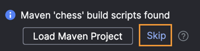
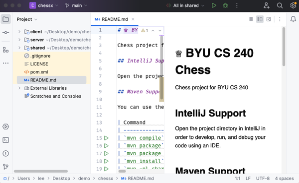
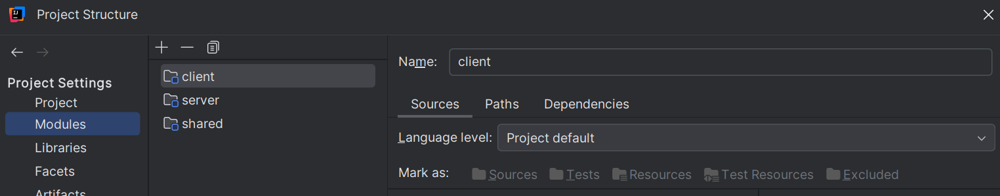
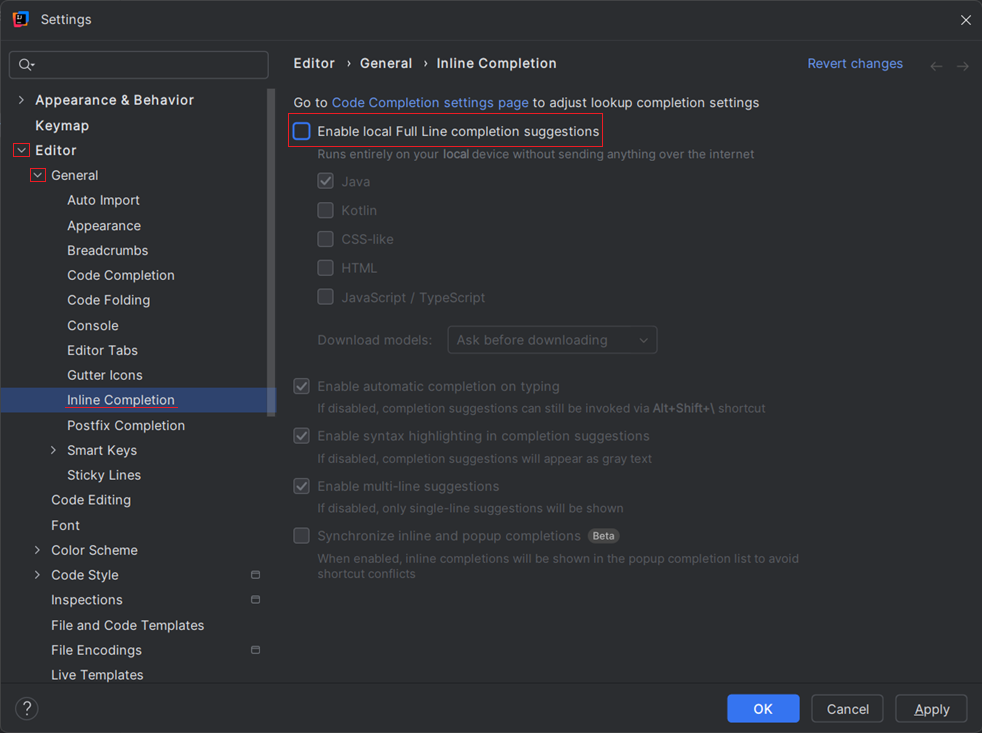

# Getting Started

At this point, you should have already made your own copy of the [Chess GitHub Repository](../chess-github-repository/chess-github-repository.md) and made changes from the command line. Now, we will open the project in an Integrated Development Environment (IDE). IDEs assist developers when working on large software projects by providing tools for writing, debugging, and testing code.

Follow these steps to set up your Chess project.

## Open With IntelliJ

Open the project directory in IntelliJ to start developing, running, and debugging your code. Make sure you **OPEN** the project rather than creating a new project.

1. Open IntelliJ. (We assume you have already installed the IDE for previous coursework.)
2. Choose **File > Open** and select the `chess` folder in the location where you cloned it.

The repository already contains IntelliJ configuration files. Creating a new project instead of opening the existing one will cause configuration errors.

> [!NOTE]
>
> If you receive a prompt asking you to build the project with Maven, make sure you **skip** that action.



When the project opens, it should look like the image below. The `client`, `server`, and `shared` folders should be at the root level and marked with a blue square icon (indicating they are modules).



You should not see a folder named `chess` inside your IntelliJ project view; only the items *inside* the `chess` folder should be visible. If you do see a `chess` folder, check that you haven't opened a parent directory by mistake. You can confirm that the modules are set up correctly by going to **File > Project Structure > Modules** and verifying that only `client`, `server`, and `shared` are listed. Feel free to ask a TA for help if your structure looks different.



## Turn off AI

> [!WARNING]
>
> **Using AI-generated code in this course is not permitted.** Failing to follow the instructions in this section will be considered **cheating**.

All AI coding tools must be turned off for this project. We want you to understand the code you write; having AI author code for you can be a hindrance to your learning. If you have an AI coding assistant (such as GitHub Copilot) installed in your IDE, you must disable it. Using AI to write your code may flag our plagiarism detection system. If you are unsure about your use of AI, check the syllabus in Canvas or ask an instructor.

Specifically, IntelliJ Ultimate Edition includes a local deep learning model and potentially a cloud-based LLM that suggests code completions. (These features are not included in the Community Edition). To turn off **Full Line** code completion, follow these steps:

1. Open IntelliJ Settings by pressing `Ctrl` + `,` (Windows/Linux) or `⌘` + `,` (macOS), or by navigating to **File > Settings**.
2. In the *Settings* window, select **Editor > General > Inline Completion** from the left-hand sidebar.
3. Uncheck **Enable local Full Line completion suggestions**. If there is a checkbox for cloud-based completion, disable that as well.
4. Click **OK** to save your changes.




```masteryls
{"id":"d6399d4e-74c3-4eb3-bdf4-799a1e18f01e", "title":"Disabled AI", "type":"multiple-choice" }
I confirm that I have:

- [x] Disaabled AI in my development environment for this class
- [ ] Not disabled AI and have chosen not to take this class
```
