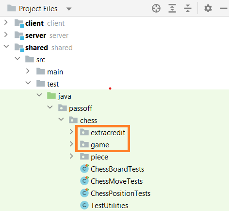

# Getting Started

Complete the following steps to move the starter code into your project for this phase.

1. Open your chess project directory.
1. Copy the the `starter-code/1-chess-game/passoff/chess/game` directory to the `shared/src/test/java/passoff/chess` directory.
1. **Optional**: If you want to implement castling and en passant for extra credit, then you also need to copy the `starter-code/1-chess-game/passoff/chess/extracredit/ `directory to your project's `shared/src/test/java/passoff/chess` directory. Do not copy this directory if you do not successfully implement the tests.


```masteryls
{"id":"d3918a97-5dfd-45e0-99de-2eb8c7636785", "title":"Phase 1: Getting started", "type":"multiple-choice" }
Simple **multiple choice** question

- [x] I have completed the above instructions and my project structure in IntelliJ looks like the following: 
- [ ] I don't see those folders and files when I open IntelliJ.
```
