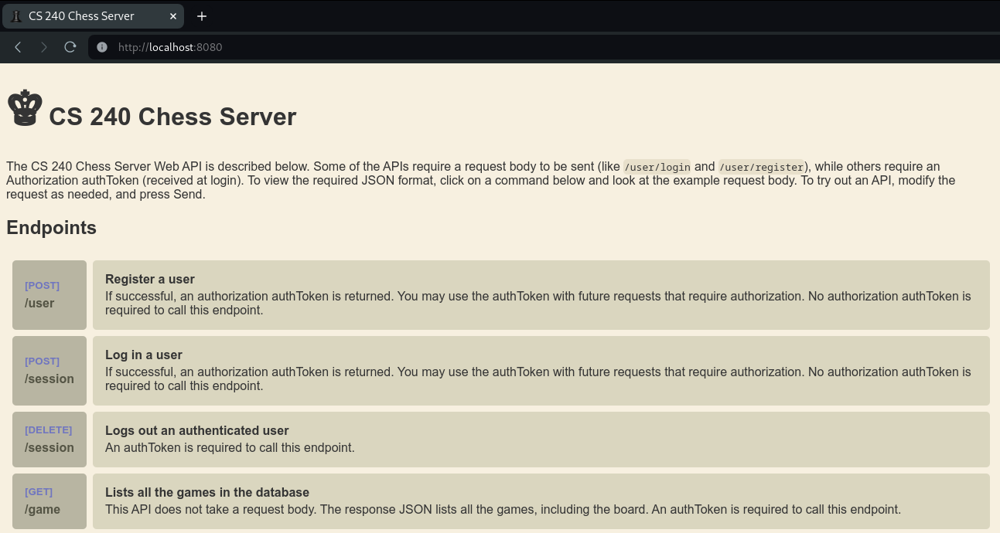

# Phase 3: Getting Started

The starter code includes four folders: `dataAccess`, `passoff`, `resources`, and `server`. Complete the following steps to move the starter code into your project for this phase.

1. Open your chess project directory.
1. Copy the `starter-code/3-web-api/server/Server.java` file into your project's `server/src/main/java/server` folder. This file contains a basic implementation of an HTTP server that allows the pass-off tests to programmatically start and stop your server. It also includes the code to host a web-based interface for experimenting with your endpoints.
1. Copy the `starter-code/3-web-api/dataaccess` folder into the `server/src/main/java` folder. This contains an exception class you will throw whenever a data access error occurs.
1. Create the folder `server/src/test/java`. Right-click on the folder in IntelliJ and select **Mark Directory as > Test Sources Root**. This tells IntelliJ where to look for test code.

   

1. Copy the `starter-code/3-web-api/passoff` folder into the `server/src/test/java` folder. The `passoff/server` folder contains the server test cases.
1. Create the folder `server/src/main/resources`. Right-click on the folder and select **Mark Directory as > Resources Root**. This ensures IntelliJ includes these files when compiling your project.
1. Copy the `starter-code/3-web-api/resources/web` folder into the `server/src/main/resources` folder. The `web` folder contains the files for the web-based interface used to experiment with your endpoints.

After these steps, your project structure should look like this:

```txt
└── server
    └── src
        ├── main
        │   ├── java
        │   │   ├── server
        │   │   │   ├── Server.java
        │   │   │   └── ServerMain.java
        │   │   └── dataaccess
        │   │       └── DataAccessException.java
        │   └── resources
        │       └── web
        │           ├── favicon.ico
        │           ├── index.css
        │           ├── index.html
        │           └── index.js
        └── test
            └── java
                └── passoff
                    └── server
                        └── StandardAPITests.java
```

## Testing the Setup via Webpage

Once you have completed all the previous steps, you should be able to launch your server and access a testing HTML page. This simple frontend helps you perform basic manual testing of your server endpoints.

Open `server/src/main/java/server/ServerMain.java`. In the `main` method, replace the existing code with logic to instantiate the `Server` object and call its `run` method. The `run` method requires a port number; 8080 is the standard choice for local testing.

```java
package server;

public class ServerMain {
    public static void main(String[] args) {
        var port = 8080;
        Server server = new Server();
        server.run(port);

        System.out.println("♕ 240 Chess Server running on port " + port);
    }
}
```

When you run the `main` method, the server will start. IntelliJ may display several informational lines of red text in the **Run** window; as long as no stack traces or explicit "Error" messages appear, the server is likely running correctly.


```masteryls
{"id":"c8f7653a-760f-4c62-8817-376b7e381ab5","title":"Phase 1: Getting started","type":"multiple-choice"}
Open a web browser and navigate to `http://localhost:8080` (if you chose a different port, use that instead).

- [x] I see the following page: 
- [ ] I don't see server output. I will review the getting started instrucitons.
```

You can use this interface to test your endpoints as you develop the project.

