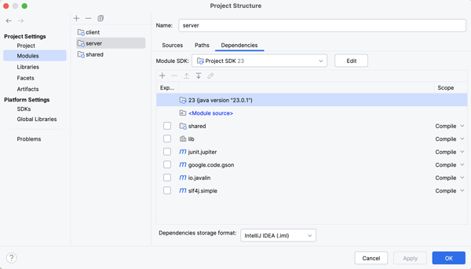
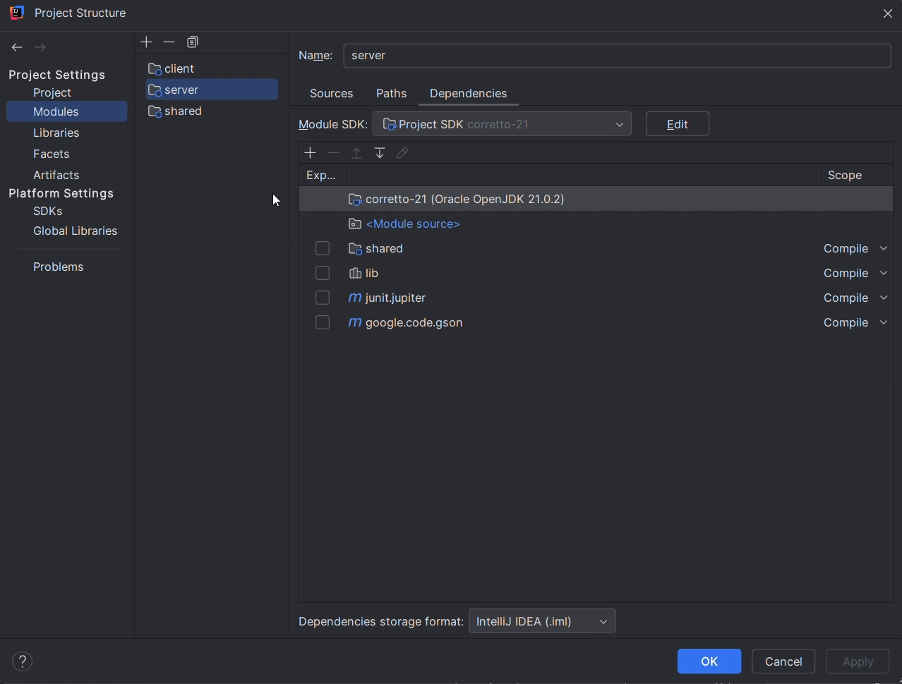

# Phase 4: Getting Started

The starter code includes three folders: `resources`, `dataaccess`, and `passoff/server`. Complete the following steps to integrate the starter code into your project for this phase.

1.  Open your chess project directory.
2.  Copy the `starter-code/4-database/resources/db.properties` file into your project’s `server/src/main/resources` folder. This file contains your database configuration settings. You must replace the placeholder values with your actual database username and password.
3.  Copy the `starter-code/4-database/dataaccess/DatabaseManager.java` file into your project's `server/src/main/java/dataaccess` folder. This class reads your configuration settings and establishes connections to your database server.
4.  Copy the `starter-code/4-database/passoff/server/DatabaseTests.java` file into your project’s `server/src/test/java/passoff/server` folder. These tests verify that your application is correctly persisting information to the database.

After following these steps, your project structure should include the following additions:

```txt
└── server
    └── src
        ├── main
        │   ├── java
        │   │   └── dataaccess
        │   │       └── DatabaseManager.java
        │   └── resources
        │       └── db.properties
        └── test
            └── java
                └── passoff
                    └── server
                        └── DatabaseTests.java
```

## Using Maven to Add Package Dependencies

There is a vast amount of third-party code available for download and use in Java applications. As part of the Phase 0 starter project, we already included packages to run tests (JUnit), serialize JSON (Gson), handle logging (Slf4j), and manage HTTP network requests (Javalin).

We use a cloud-based package repository called **Maven** to manage these dependencies. All existing starter code dependencies were pulled from Maven and included in the project. You can view these dependencies in IntelliJ by opening the **Project Structure** dialog, navigating to the **Modules** tab, and selecting the **server** module.



Now, you need to include additional dependencies to connect to your MySQL database server and hash user passwords. 

1. From the **Project Structure** dialog, select the module to which you wish to add a dependency (the `server` module). 
2. Press the **+** button and select **Library > From Maven...**. 
3. Enter the name of the library you want to download. 
4. Once added, specify the **Scope** for the dependency. 
   - Most dependencies for this course use the **Compile** scope, meaning the dependency is available to all code in the module during compilation and execution. 
   - Others, such as **Test**, are only available to code within the test directory.

     


```masteryls
{"id":"dc4c1925-1449-4c42-a6cf-eda1740d1051","title":"Phase 4: Getting started","type":"multiple-select"}
Add the following dependencies for the MySQL driver and BCrypt, associating them with your `server` module:

*   **com.mysql:mysql-connector-j:9.4.0** with   **Scope:** Compile
*   **org.mindrot:jbcrypt:0.4** with   **Scope:** Compile

- [x] I have added the required dependencies to my project.
```
