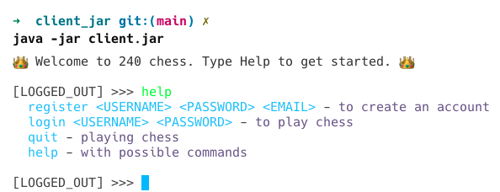
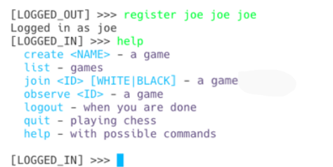
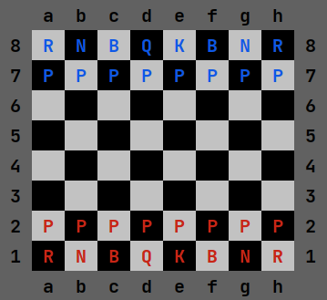
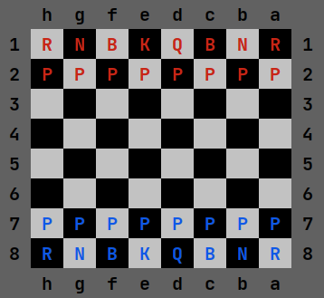

# ♕ Phase 5: Chess Pregame

- [Chess Application Overview](../chess.md)
- 🖥️ [Videos](#videos)
- [TA Tips](../../instruction/chess-tips/chess-tips.md#phase-5---pregame): A collection of common problems for this phase

#### 🥅 Outcomes of this Deliverable

1. **Frame** software engineering problems by clarifying system purpose, constraints, and responsibilities, demonstrating both sound technical judgment and a sense of ownership for the long-term impact of software others depend on.
1. **Explore** object-oriented frameworks, network protocols, distributed services, and databases with curiosity and discipline, developing accurate mental models while valuing learning as essential to responsible engineering practice.
1. **Design** software systems using object-oriented principles and clear interfaces that support reliability and maintainability, motivated by care for future users, collaborators, and the evolution of the system over time.
1. **Build** distributed applications that faithfully translate design intent into readable, testable implementations, showing diligence and integrity in the quality of code produced.
1. **Test** software systems systematically to validate behavior and uncover failure modes, valuing evidence, honesty, and accountability as foundations of trustworthy software.

---

In this phase of the Chess Project, you will create the initial version of your Chess client. Your client will be a terminal-based (console) program providing a simple interface for interacting with the Chess server.

You will implement all user interactions that occur outside of active gameplay. Gameplay interactions will be implemented in the next phase. This includes functionality for displaying help text, registering, logging in, listing existing games, creating new games, joining a game, observing a game, logging out, and exiting. You will also write the client code responsible for drawing the chessboard.

To implement this, you will create a `ServerFacade` class to handle sending HTTP requests to your server and receiving responses. Your client code will use these `ServerFacade` methods to interact with the server API.

## Getting Started
Complete the [Getting Started](getting-started.md) instructions before working on this phase.

## Required Functionality

### Prelogin UI

When the user first opens the Chess client, they can execute any of the Prelogin commands.

| Command      | Description                                                                                                                                                                                                      |
| ------------ | ---------------------------------------------------------------------------------------------------------------------------------------------------------------------------------------------------------------- |
| **Help**     | Displays text informing the user of available actions.                                                                                                                                                     |
| **Quit**     | Exits the program.                                                                                                                                                                                               |
| **Login**    | Prompts the user for login credentials and calls the server login API. Upon success, the client transitions to the Postlogin UI.                                        |
| **Register** | Prompts the user for registration information and calls the server register API. Upon success, the user is logged in and the client transitions to the Postlogin UI. |

#### Example Prelogin UI



### Postlogin UI

After a user has registered or logged in, they can execute any of the Postlogin commands.

| Command          | Description                                                                                                                                                                                                                                                                                                                          |
| ---------------- | ------------------------------------------------------------------------------------------------------------------------------------------------------------------------------------------------------------------------------------------------------------------------------------------------------------------------------------ |
| **Help**         | Displays text informing the user of available actions.                                                                                                                                                                                                                                                                         |
| **Logout**       | Logs out the user via the server API and transitions the client back to the Prelogin UI.                                                                                                                                                                               |
| **Create Game**  | Prompts the user for a game name and calls the server create API. This creates the game on the server but does not automatically join the user to it.                                                                                                                                     |
| **List Games**   | Lists all existing games on the server. Calls the server list API and displays the games in a numbered list, including the game name and current players (excluding observers). The list numbering must start at 1 and be independent of the internal game IDs.                      |
| **Play Game**    | Allows the user to join a game by specifying the list number and their desired color. The client must map this list number back to the correct internal game ID. Calls the server join API. |
| **Observe Game** | Allows the user to specify a game to observe using the list number. The client must map this list number back to the correct internal game ID. (Full observer functionality will be added in Phase 6).                                    |

#### Example Postlogin UI



### Gameplay UI

While full gameplay will be implemented later, the client must currently be able to draw the initial state of a Chess board when a user joins or observes a game.

*   **White Perspective:** If a user joins as the white player or as an observer, the board must be drawn from the white player's perspective. The "a1" square must be in the **bottom left** corner.



*   **Black Perspective:** If a user joins as the black player, the board must be drawn from the black player's perspective. The "a1" square must be in the **upper right** corner.



#### Board Aesthetics
You may customize the look of your board as long as the information is **easily readable** and it **looks like a chessboard**.
- Use different colors for alternating squares (e.g., light/dark, white/brown).
- Per official rules, the bottom-right square (h1) and top-left square (a8) must be the "light" color. This ensures each queen begins "on her color" (white queen on a light square, black queen on a dark square).
- The border must display correct row numbers (1-8) and column letters (a-h).
- Note: In the example images above, blue letters represent black pieces and red letters represent white pieces.

### UI Requirements

Focus on user experience (UX). Present information in a way that is meaningful to a user and avoid displaying technical jargon or debugging data. Specifically, avoid:

- **JSON:** Parse JSON responses and print only the relevant information.
- **AuthTokens and Game IDs:** Keep track of these internally, but do not display them to the user. Use the numbered list for selecting games.
- **HTTP Status Codes:** Users should not see internal details like "404" or "200".
- **Stack Traces:** Never display stack traces to the user. Provide a simple, user-friendly error message explaining what went wrong without exposing internal code structures.

#### Robustness
Your client must not freeze or crash. Use try-catch blocks to handle exceptions. The program should gracefully handle bad input, including:
- Incorrect number of arguments.
- Invalid argument types (e.g., a string where a number is expected).
- Server-side errors (e.g., registering an existing username or logging in with the wrong password).

Test these scenarios thoroughly. If the program crashes or provides unhelpful output during pass-off, you may be asked to fix it and return later. Additionally, ensure that every menu state has a clear exit path so the user never gets stuck.

### Relevant Instruction Topics

- [Console UI](../../instruction/console-ui/console-ui.md): Reading keyboard input and formatting terminal output.
- [Web API](../../instruction/web-api/web-api.md#web-client): Making HTTP client requests.
- [Single Responsibility Principle](../../instruction/design-principles/design-principles.md#single-responsibility-principle): Organizing client logic into manageable units.
- [Pet Shop](../../petshop/petshop.md): An example REPL implementation.

### Tips for Using Unicode Chess Characters

If you use Unicode Chess characters, they may not render by default in some Windows consoles (especially when running from a `.jar`).
*   **Windows Fix:** Go to Settings > Time & Language > Language & Region > Administrative Language Settings. On the Administrative tab, click "Change System Locale" and check the box for "Beta: Use Unicode UTF-8 for worldwide language support." This requires a reboot.
*   **Alignment:** Unicode chess characters are often wider than standard characters. To align them, you can use an "em-space" (`\u2003`). The provided `EMPTY` escape sequence uses an em-space; if you use standard characters instead of Unicode pieces, you may need to replace the em-space with a regular space to maintain vertical alignment.

## ☑ Deliverable

> [!IMPORTANT]
> You are required to commit to GitHub at every minor milestone (e.g., after passing a specific test). Your commit history must clearly document your progress throughout the phase. Submissions with insufficient Git history may be rejected.

### Pass Off Tests
There are no new automated pass-off test cases for this phase.

### Unit Tests
You must write positive and negative unit tests for every method in your `ServerFacade` class. 

Place your tests in `client/src/test/java/client/ServerFacadeTests.java`.

> [!TIP]
> The starter code in `ServerFacadeTests.java` includes logic to start and stop your server on a random port for testing. You will still need to run `ServerMain.main` manually when testing your client UI.

```java
public class ServerFacadeTests {

    private static Server server;
    static ServerFacade facade;

    @BeforeAll
    public static void init() {
        server = new Server();
        var port = server.run(0);
        System.out.println("Started test HTTP server on " + port);
        facade = new ServerFacade(port);
    }

    @AfterAll
    static void stopServer() {
        server.stop();
    }

    @Test
    public void sampleTest() {
        Assertions.assertTrue(true);
    }
}
```

#### Testing Requirements:
1.  **Port Initialization:** Ensure your `ServerFacade` constructor accepts the port so it can connect to the dynamic port used by the test server.
2.  **Database Cleanup:** Use a `@BeforeEach` method to clear the database before every test to ensure a clean state.
3.  **Coverage:** Write at least one positive test (successful operation) and one negative test (expected failure, such as unauthorized access or invalid input) for each public `ServerFacade` method.

Example test:
```java
@Test
void register() throws Exception {
    var authData = facade.register("player1", "password", "p1@email.com");
    assertTrue(authData.authToken().length() > 10);
}
```

### Code Quality
The autograder and TAs will evaluate the quality of your source code based on this [Rubric](../code-quality-rubric.md).

### Pass Off, Submission, and Grading

All project tests must pass to complete this phase. 

1.  Submit your code to the [auto-grading tool](https://cs240.click/).
2.  Once you pass the autograder, schedule a meeting with a TA to demonstrate your client and server functionality for final grading.

#### Common Problems
Review the [Phase 5 Passoff Common Problems](../../instruction/chess-tips/chess-tips.md#passoff-frequently-encountered-problems) before your meeting to ensure your code meets all expectations.


```masteryls
{"id":"e21028f3-f5e5-413c-be2f-ee53b77d3f6b","title":"Submission Precheck","type":"multiple-choice"}
- [x] All the required functionality is complete, all of the test cases I wrote are passing, I have verified my code quality, and my GitHub commit history complies with the course requirements.
- [ ] I need to back and do some more work before submitting.
```

### Grading Rubric

> [!NOTE]
> You can receive 4 points of extra credit by achieving 100% on the autograder and completing your in-person pass-off before the final due date.

| Category       | Criteria                                                                                                                                                                                        |       Points |
| :------------- | :---------------------------------------------------------------------------------------------------------------------------------------------------------------------------------------------- | -----------: |
| GitHub History | At least 12 GitHub commits spread evenly over the assignment period demonstrating proof of work.                                                                                              | Prerequisite |
| Functionality  | Program supports all required UI and server interaction functionality.                                                                                                                                                     |          100 |
| Code Quality   | Adherence to the [Code Quality Rubric](../code-quality-rubric.md).                                                                                                                                                             |           30 |
| Unit Tests     | All test cases pass. Each public `ServerFacade` method has a positive and negative test. Every test includes appropriate assertions. |           25 |
|                | **Total**                                                                                                                                                                                       |      **155** |

## Videos

- 🎥 [Phase 5 Introduction (8:11)](https://byu.hosted.panopto.com/Panopto/Pages/Viewer.aspx?id=6e2c9d2f-5a74-4b60-989e-b19a0150a134) - [[transcript]](https://github.com/user-attachments/files/17805362/CS_240_Phase_5_Chess_UI_Demo_Transcript.pdf)
- 🎥 [Read-Eval-Print-Loop (REPL) (8:11)](https://byu.hosted.panopto.com/Panopto/Pages/Viewer.aspx?id=29364420-9c98-4778-ba7a-b19a015380c7) - [[transcript]](https://github.com/user-attachments/files/17805365/CS_240_Read_Eval_Print_Loop_.REPL._Transcript.pdf)

*Note: The "Drawing the Board" video is partially outdated. You should only print the board perspective relevant to the player's color (or White for observers), not both.*
- 🎥 [Drawing the Board (1:26)](https://byu.hosted.panopto.com/Panopto/Pages/Viewer.aspx?id=6a77c895-f2b8-49d9-8b11-b19a0156aef8) - [[transcript]](https://github.com/user-attachments/files/17805392/CS_240_Drawing_the_Board_Transcript.pdf)
- 🎥 [Server Facade (8:49)](https://byu.hosted.panopto.com/Panopto/Pages/Viewer.aspx?id=48c546dc-bdd6-491f-88c1-b2c80118cb9f)
- 🎥 [Phase 5 Requirements (3:11)](https://byu.hosted.panopto.com/Panopto/Pages/Viewer.aspx?id=1a171c4d-c7dc-41d0-828f-b19a01594498) - [[transcript]](https://github.com/user-attachments/files/17805398/CS_240_Phase_5_Requirements_Transcript.pdf)
- 🎥 [Client HTTP (12:11)](https://byu.hosted.panopto.com/Panopto/Pages/Viewer.aspx?id=781ae49b-6284-4e1a-836b-b1930162c54b) - [[transcript]](https://github.com/user-attachments/files/17805399/CS_240_Client_HTTP_Transcript.pdf)