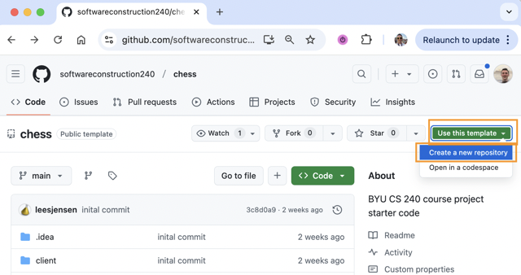
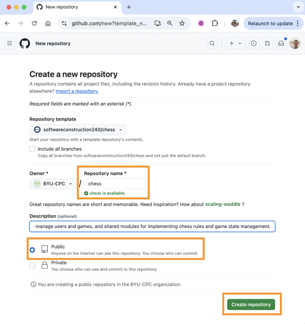

# ♕ Chess GitHub Repository

In the upcoming phases of the chess project, you will build and enhance your application within a GitHub repository. The commit history you establish throughout the course serves several vital purposes:

1.  **Backup** – Every semester, at least one student's computer fails. Having the ability to clone your repository to a new machine can protect your progress and your grade.
2.  **Portfolio** – The code you develop in this course serves as a professional portfolio artifact, allowing you to demonstrate your mastery to future employers.
3.  **Proof of Work** – You can demonstrate the authorship and progression of your code by consistently and frequently committing your work.
4.  **Exploration** – Creating branches allows you to experiment with new ideas without disrupting your main development thread. If an experiment fails, you can simply reset to your last stable commit.
5.  **Experience** – Git is the de facto industry standard for version control. The experience you gain here prepares you for professional software development environments.

To reap these benefits, you must **commit often**. Get into the habit of implementing a small, stable change and then committing immediately.

### The Development Cycle
1.  **Pull:** Verify you have the latest code (`git pull`).
2.  **Develop:** Refactor, test, and implement a small portion of cohesive code (`test` → `code` → `test`).
3.  **Push:** Commit and push your changes (`git commit`, `git push`).
4.  **Repeat.**

You will be most successful if you set aside time every day (or every other day) to work on the project. These consistent work sessions should result in consistent commits. If you are not creating multiple commits during each workday, you are not reflecting the code management practices required in a professional production environment.

For these reasons, using GitHub for your chess project is **required**, and you must use it frequently.

> [!IMPORTANT]
> A prerequisite for all deliverables is that you must have **at least 10 commits** evenly spread across the assignment period.

If you do not have the required number of commits, or if they are clustered in a single burst of activity (e.g., all on the final day), you will be required to justify the discrepancy before the deliverable is accepted.

## Creating Your Chess GitHub Repository

1.  Open your web browser to [GitHub](https://github.com).
2.  Sign in to your personal account, or create one if you do not have one. _Note: The [GitHub Terms of Service](https://docs.github.com/en/site-policy/github-terms/github-terms-of-service#3-account-requirements) allow only one account per individual._
3.  View the [chess template repository](https://github.com/softwareconstruction240/chess).
4.  Use the template to create your own repository:
    1.  Click **Use this template**.
    2.  Select **Create a new repository**.
        
    3.  Name the repository `chess`.
    4.  (Optional) Add a meaningful description, such as:
        > A full-stack chess application built for BYU CS 240. It features a networked client-server architecture, a command-line client, a server to manage users and games, and shared modules for game rules and state management.
    5.  Mark the repository as **Public** so that it can be reviewed by TAs and instructors. (This is the default setting.)
    6.  Leave **Include all branches** unchecked. (This is the default setting.)
    7.  Click **Create repository from template**.
        

5.  Open a command line terminal.
6.  Clone the repository to your local development environment. Ensure you place it in a directory designated for your classwork. The commands will look like this:

    ```sh
    cd ~/byu/cs240
    git clone https://github.com/YOUR_GITHUB_USERNAME/chess.git
    cd chess
    ```

## Making Changes

Once you have cloned the repository locally, make an initial change to verify the connection is working properly.

1.  Create a file in your repository directory named `notes.md`.
2.  Add some initial content to the file.
3.  Stage the `notes.md` file.
4.  Commit the changes.
5.  Push the changes to GitHub.

You can accomplish this using the following commands:

```sh
echo "# My Project Notes" > notes.md
git add notes.md
git commit -m "initial: create notes.md"
git push
```

As you develop your application, use the `notes.md` file to document the techniques and technologies you learn throughout the course.

## ☑ Deliverable

To complete this assignment:
1.  Create your repository from the template.
2.  Clone it locally.
3.  Add, commit, and push the `notes.md` file.
4.  Submit the "GitHub Repository" assignment via the [auto-grading tool](https://cs240.click/) by selecting the assignment from the dropdown and clicking **Submit**.

You will be prompted to provide your GitHub repository URL. It should follow this format:
`https://github.com/<your-account>/chess`

### After Submission
When you have successfully completed the assignment:
1.  The AutoGrader will display "Submission passed!" along with your score.
2.  **Your score will be automatically synchronized with Canvas.**
3.  A new item will appear in your "Submission History" containing grading notes.
    *   Click the submission to view grading details.
    *   In future phases, you will use this interface to view detailed compiler output and test results.

## Videos

- 🎥 [Creating Chess GitHub Repository (4:34)](https://www.loom.com/share/2b2dd64e7b524b3f9b396318cf140159?sid=a6c1b75f-a73f-455e-976c-ba19052117a6) – [[transcript]](../0-chess-moves/creating-chess-github-repo-transcript.txt)