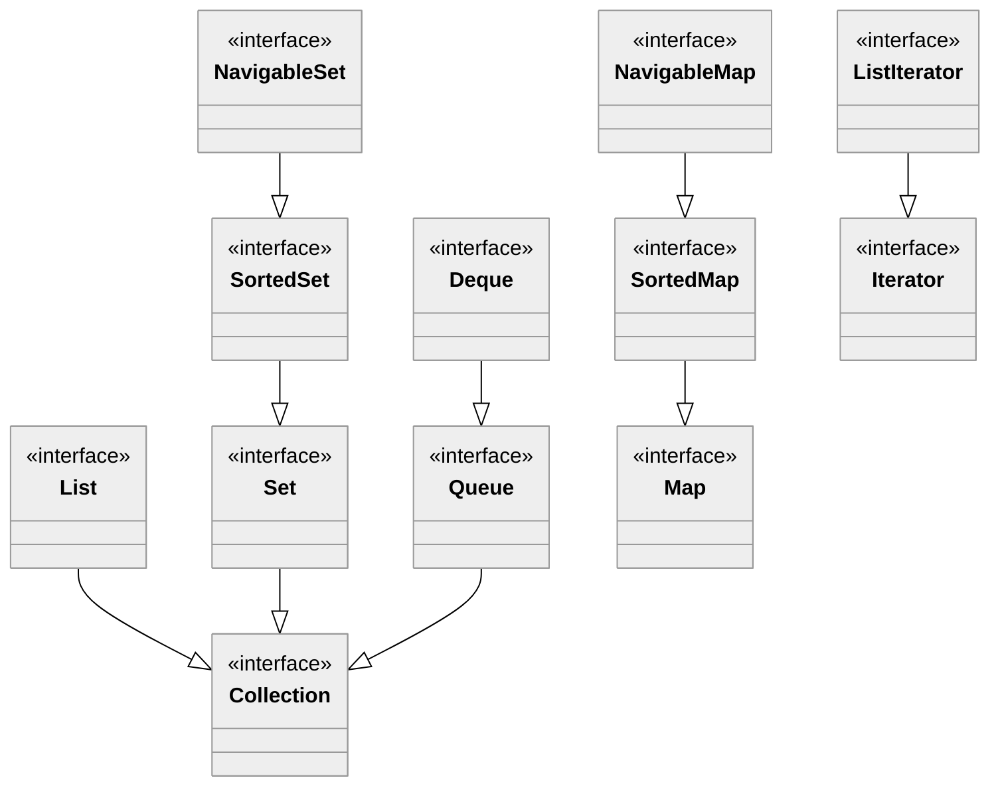

# Java Collections

🖥️ [Slides](https://docs.google.com/presentation/d/1yAxwkW1qClRlFBxAokyBvfDhuTI6LXmA/edit?usp=sharing&ouid=114081115660452804792&rtpof=true&sd=true)

🖥️ [Lecture Videos](#videos)

📖 **Required Reading**: Core Java for the Impatient

- Chapter 7: Collections

### 🔑 Key points

- The interfaces and classes that make up the Java Collections Framework (JCF)
- The specific use cases for different interfaces and classes
- The importance of overriding the `equals()` and `hashCode()` methods for objects stored in collections
- The importance of implementing the `Comparable` interface to enable sorting

---

The Java Collections Framework provides several utility classes for managing data structures, such as lists, sets, and maps. Using the standard collections library ensures you do not have to implement these complex structures from scratch. These classes are thoroughly tested, performant, and thread-safe where specified.




Most JCF objects are contained in the [java.util](https://docs.oracle.com/javase/8/docs/api/java/util/package-summary.html) package. It is worth the time to browse the Javadoc for this package to become familiar with its offerings. Some of the most commonly used interfaces include [List](https://docs.oracle.com/javase/8/docs/api/java/util/List.html), [Map](https://docs.oracle.com/javase/8/docs/api/java/util/Map.html), [Set](https://docs.oracle.com/javase/8/docs/api/java/util/Set.html), and [Iterator](https://docs.oracle.com/javase/8/docs/api/java/util/Iterator.html). The package also provides various implementations of these interfaces, such as [HashMap](https://docs.oracle.com/javase/8/docs/api/java/util/HashMap.html), [ArrayList](https://docs.oracle.com/javase/8/docs/api/java/util/ArrayList.html), and [TreeSet](https://docs.oracle.com/javase/8/docs/api/java/util/TreeSet.html).

## ArrayList Example

The `ArrayList` class is a resizable-array implementation of the `List` interface.

```java
import java.util.ArrayList;

public class MountainList {
    // Using generics <String> to specify the type of elements in the list
    ArrayList<String> mountains = new ArrayList<>();

    public MountainList() {
        mountains.add("Nebo");
        mountains.add("Timpanogos");
        mountains.add("Lone Peak");
        mountains.add("Cascade");
        mountains.add("Provo");
        mountains.add("Spanish Fork");
        mountains.add("Santaquin");
    }

    public void print() {
        for (var m : mountains) {
            System.out.println(m);
        }
    }

    public static void main(String[] args) {
        var list = new MountainList();
        list.print();
    }
}
```

## HashMap Example

The `HashMap` class is a hash table-based implementation of the `Map` interface, used to store key-value pairs.

```java
import java.util.HashMap;

public class MountainMap {
    HashMap<String, Integer> mountains = new HashMap<>();

    public MountainMap() {
        mountains.put("Nebo", 11928);
        mountains.put("Timpanogos", 11750);
        mountains.put("Lone Peak", 11253);
        mountains.put("Cascade", 10908);
        mountains.put("Provo", 11068);
        mountains.put("Spanish Fork", 10192);
        mountains.put("Santaquin", 10687);
    }

    public void print() {
        for (var entry : mountains.entrySet()) {
            System.out.printf("%s, height: %d%n", entry.getKey(), entry.getValue());
        }
    }

    public static void main(String[] args) {
        var map = new MountainMap();
        map.print();
    }
}
```

## Equals and HashCode

When we discussed the [Java Object](../java-object-class/java-object-class.md) class, we noted the importance of overriding the `equals()` and `hashCode()` methods. Many collections, particularly hash-based ones like `HashMap` and `HashSet`, rely on these methods to locate and manage objects correctly. If you use a custom class as a key in a `Map` or as an element in a `Set`, you must implement these methods correctly.

## Comparable

To use your objects with collections that require sorting (like `TreeSet`) or with utility methods like `Collections.sort()`, your class must implement the `Comparable` interface. This allows you to define the "natural ordering" of your objects.

The `compareTo` method returns:
- A **negative integer** if the current object is less than the specified object.
- **Zero** if the current object is equal to the specified object.
- A **positive integer** if the current object is greater than the specified object.

```java
import java.util.Arrays;

public class ComparableExample implements Comparable<ComparableExample> {
    private final char value;

    ComparableExample(char value) {
        this.value = value;
    }

    @Override
    public int compareTo(ComparableExample o) {
        // Simple subtraction for numeric or char comparison
        return this.value - o.value;
    }

    @Override
    public String toString() {
        return String.valueOf(value);
    }

    public static void main(String[] args) {
        var items = new ComparableExample[]{
            new ComparableExample('r'),
            new ComparableExample('a'),
            new ComparableExample('b')
        };

        Arrays.sort(items);
        for (var i : items) {
            System.out.print(i + " ");
        }
        // Outputs: a b r 
    }
}
```

## Videos

- 🎥 [Java Collections (22:57)](https://byu.hosted.panopto.com/Panopto/Pages/Viewer.aspx?id=7f2f800e-d46e-4ce4-8839-ad5f011fa7a1&start=0) - [[transcripts]](https://github.com/user-attachments/files/17780595/CS_240_Java_Collections_Overview.pdf)
- 🎥 [Using Collections Correctly (19:26)](https://byu.hosted.panopto.com/Panopto/Pages/Viewer.aspx?id=bea26db3-5825-4df2-9ba0-ad5f01260f7e&start=0) - [[transcripts]](https://github.com/user-attachments/files/17780597/CS_240_Java_Collections_Using_Collections_Correctly.pdf)