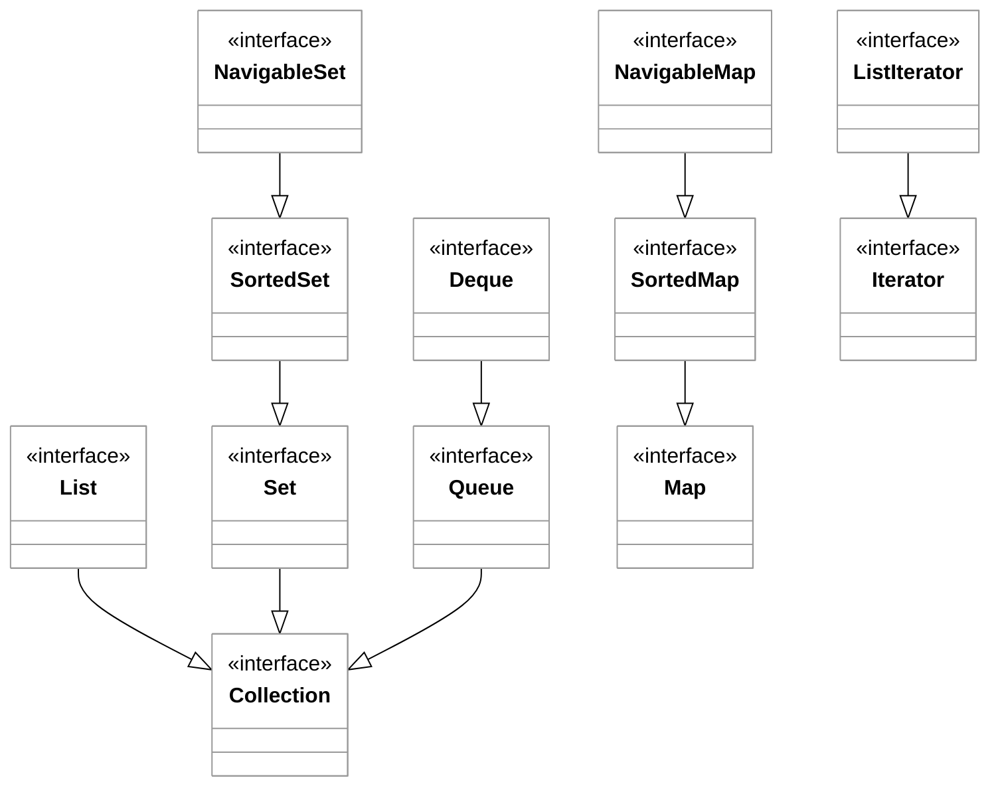
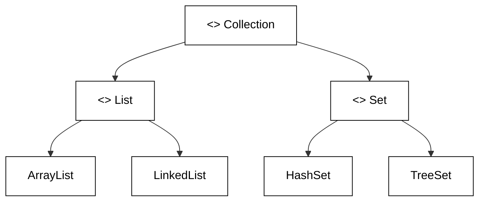

# Java Collections

🖥️ [Slides](https://docs.google.com/presentation/d/1yAxwkW1qClRlFBxAokyBvfDhuTI6LXmA/edit?usp=sharing&ouid=114081115660452804792&rtpof=true&sd=true)

🖥️ [Lecture Videos](#videos)

📖 **Required Reading**: Core Java for the Impatient

- Chapter 7: Collections

### 🔑 Key points

- The interfaces and classes that make up the Java Collections Framework (JCF)
- The specific use cases for different interfaces and classes
- The importance of overriding the `equals()` and `hashCode()` methods for objects stored in collections
- The importance of implementing the `Comparable` interface to enable sorting

---

The Java Collections Framework is a unified architecture for representing and manipulating collections. It provides a set of interfaces, implementations, and algorithms that allow developers to manage groups of objects efficiently.

### Core Interfaces
Interfaces define the abstract data types that represent different types of collections. They establish the contract for how a collection behaves regardless of its internal implementation.

*   **`Collection`**: The root of the collection hierarchy.
*   **`List`**: An ordered collection (also known as a sequence) that can contain duplicate elements. Examples include `ArrayList` and `LinkedList`.
*   **`Set`**: A collection that cannot contain duplicate elements. Examples include `HashSet` and `TreeSet`.
*   **`Queue`**: A collection designed for holding elements prior to processing, typically following First-In-First-Out (FIFO) order.
*   **`Deque`**: A double-ended queue that supports element insertion and removal at both ends.
*   **`Map`**: An object that maps keys to values. A map cannot contain duplicate keys, and each key can map to at most one value. (Note: `Map` does not inherit from `Collection` but is considered part of the framework).





### Concrete Implementations
The framework provides pre-written, reusable data structures that implement the core interfaces. These implementations are optimized for different performance characteristics:

| Interface | Main Implementations | Characteristics |
| :--- | :--- | :--- |
| **List** | `ArrayList`, `LinkedList` | Dynamic arrays vs. doubly-linked lists. |
| **Set** | `HashSet`, `LinkedHashSet`, `TreeSet` | Hashing for speed vs. insertion order vs. natural sorting. |
| **Map** | `HashMap`, `LinkedHashMap`, `TreeMap` | Key-value pairs with various ordering/sorting guarantees. |
| **Queue** | `PriorityQueue`, `ArrayDeque` | Heap-based ordering vs. resizable array implementations. |

### Polymorphic Algorithms
The JCF provides a set of static methods through the `java.util.Collections` class to perform common operations on collection objects. These algorithms are polymorphic because the same method can be used on many different implementations of the same interface.

*   **Sorting**: Reorders a `List` based on natural ordering or a `Comparator`.
*   **Searching**: Finds specific elements in a `List` (e.g., `binarySearch`).
*   **Shuffling**: Randomly permutes the elements in a `List`.
*   **Data Manipulation**: Methods to reverse, fill, copy, or swap elements within a collection.
*   **Extreme Values**: Finding the minimum or maximum element in a collection.

### Infrastructure and Interoperability
The framework provides essential infrastructure that ensures different APIs can communicate seamlessly:

*   **Iterators**: The `Iterator` and `ListIterator` interfaces provide a standard way to traverse through a collection sequentially.
*   **Standardization**: By using a common set of interfaces, the framework reduces the effort required to learn new APIs and encourages code reuse.
*   **Performance**: The provided implementations are highly tuned, reducing the need for developers to write their own high-performance data structures.
*   **Thread-Safety**: The framework includes wrappers for creating synchronized collections and specialized concurrent collections (found in `java.util.concurrent`) for multi-threaded environments.


Most JCF objects are contained in the [java.util](https://docs.oracle.com/javase/8/docs/api/java/util/package-summary.html) package. It is worth the time to browse the Javadoc for this package to become familiar with its offerings. Some of the most commonly used interfaces include [List](https://docs.oracle.com/javase/8/docs/api/java/util/List.html), [Map](https://docs.oracle.com/javase/8/docs/api/java/util/Map.html), [Set](https://docs.oracle.com/javase/8/docs/api/java/util/Set.html), and [Iterator](https://docs.oracle.com/javase/8/docs/api/java/util/Iterator.html). The package also provides various implementations of these interfaces, such as [HashMap](https://docs.oracle.com/javase/8/docs/api/java/util/HashMap.html), [ArrayList](https://docs.oracle.com/javase/8/docs/api/java/util/ArrayList.html), and [TreeSet](https://docs.oracle.com/javase/8/docs/api/java/util/TreeSet.html).

## ArrayList Example

The `ArrayList` class is a resizable-array implementation of the `List` interface.

```java
import java.util.ArrayList;

public class MountainList {
    // Using generics <String> to specify the type of elements in the list
    ArrayList<String> mountains = new ArrayList<>();

    public MountainList() {
        mountains.add("Nebo");
        mountains.add("Timpanogos");
        mountains.add("Lone Peak");
        mountains.add("Cascade");
        mountains.add("Provo");
        mountains.add("Spanish Fork");
        mountains.add("Santaquin");
    }

    public void print() {
        for (var m : mountains) {
            System.out.println(m);
        }
    }

    public static void main(String[] args) {
        var list = new MountainList();
        list.print();
    }
}
```

## HashMap Example

The `HashMap` class is a hash table-based implementation of the `Map` interface, used to store key-value pairs.

```java
import java.util.HashMap;

public class MountainMap {
    HashMap<String, Integer> mountains = new HashMap<>();

    public MountainMap() {
        mountains.put("Nebo", 11928);
        mountains.put("Timpanogos", 11750);
        mountains.put("Lone Peak", 11253);
        mountains.put("Cascade", 10908);
        mountains.put("Provo", 11068);
        mountains.put("Spanish Fork", 10192);
        mountains.put("Santaquin", 10687);
    }

    public void print() {
        for (var entry : mountains.entrySet()) {
            System.out.printf("%s, height: %d%n", entry.getKey(), entry.getValue());
        }
    }

    public static void main(String[] args) {
        var map = new MountainMap();
        map.print();
    }
}
```

## Equals and HashCode

When we discussed the [Java Object](../java-object-class/java-object-class.md) class, we noted the importance of overriding the `equals()` and `hashCode()` methods. Many collections, particularly hash-based ones like `HashMap` and `HashSet`, rely on these methods to locate and manage objects correctly. If you use a custom class as a key in a `Map` or as an element in a `Set`, you must implement these methods correctly.

## Comparable

To use your objects with collections that require sorting (like `TreeSet`) or with utility methods like `Collections.sort()`, your class must implement the `Comparable` interface. This allows you to define the "natural ordering" of your objects.

The `compareTo` method returns:
- A **negative integer** if the current object is less than the specified object.
- **Zero** if the current object is equal to the specified object.
- A **positive integer** if the current object is greater than the specified object.

```java
import java.util.Arrays;

public class ComparableExample implements Comparable<ComparableExample> {
    private final char value;

    ComparableExample(char value) {
        this.value = value;
    }

    @Override
    public int compareTo(ComparableExample o) {
        // Simple subtraction for numeric or char comparison
        return this.value - o.value;
    }

    @Override
    public String toString() {
        return String.valueOf(value);
    }

    public static void main(String[] args) {
        var items = new ComparableExample[]{
            new ComparableExample('r'),
            new ComparableExample('a'),
            new ComparableExample('b')
        };

        Arrays.sort(items);
        for (var i : items) {
            System.out.print(i + " ");
        }
        // Outputs: a b r 
    }
}
```


## Design Principles in the Java Collections Framework

The Java Collections Framework (JCF) is more than just a library of data structures; it is a premier example of high-quality software engineering. By studying its architecture, developers can learn how to apply core Object-Oriented Programming (OOP) principles—such as abstraction, polymorphism, and separation of concerns—to their own systems. The framework allows developers to manipulate data consistently, regardless of the underlying representation.

### Abstraction and Interface-Based Design

The most prominent principle in the JCF is **Abstraction**. The framework is built on a hierarchy of interfaces that define *what* a collection does, while hiding the details of *how* it does it. This separation allows developers to write code that is decoupled from specific implementations.

*   **Interfaces (The "What"):** `List`, `Set`, `Map`, and `Queue` define the contracts. For example, a `List` defines an ordered sequence of elements.
*   **Implementations (The "How"):** `ArrayList`, `LinkedList`, `HashSet`, and `TreeMap` provide the concrete logic.



### Polymorphism and Loose Coupling

By "coding to an interface," developers leverage **Polymorphism**. This practice ensures that a system is flexible and maintainable. If you define a method that accepts a `List`, you can pass it an `ArrayList` today and a `LinkedList` tomorrow without changing the method's internal logic. This reduces technical debt and makes the code easier to refactor.

```java
public class DataProcessor {
    // High-quality engineering: Accept the interface (Abstraction)
    public void processData(List<String> items) {
        for (String item : items) {
            System.out.println("Processing: " + item);
        }
    }

    public static void main(String[] args) {
        DataProcessor processor = new DataProcessor();
        
        // We can swap the implementation easily
        List<String> fastRandomAccess = new ArrayList<>();
        List<String> fastInsertDelete = new LinkedList<>();
        
        processor.processData(fastRandomAccess);
        processor.processData(fastInsertDelete);
    }
}
```

### Separation of Concerns: The Iterator Pattern

The JCF demonstrates the **Separation of Concerns** through the **Iterator Pattern**. Instead of the collection itself being responsible for tracking the state of a traversal (like an index or a pointer), it delegates that responsibility to an `Iterator` object. This allows:
1.  Multiple traversals to happen simultaneously on the same collection.
2.  A uniform way to traverse different structures (a `TreeSet` is traversed differently than an `ArrayList`, but the `Iterator` interface remains the same).

### Summary of Principles Applied

| Principle | Application in JCF | Benefit |
| :--- | :--- | :--- |
| **Encapsulation** | Internal data structures (like the array in `ArrayList`) are private. | Prevents corruption of internal state. |
| **Open/Closed Principle** | Framework is open for extension (you can create your own `List`) but closed for modification. | Promotes stability and scalability. |
| **Dependency Inversion** | Methods depend on high-level abstractions (`Map`) rather than low-level details (`HashMap`). | Increases modularity and testability. |


## ☑ Exercise


```masteryls
{"id":"04083ed9-a34d-4ab3-b8b6-06d7127de560", "title":"Collections", "type":"essay", "gradingCriteria":"- Addresses the prompt directly\n- Why is it interesting.\n- What principles of software engineering does it utilize?" }
Describe one of the JCF objects that interest you. Discuss how it utilizes appropriate design principles.
```

```masteryls
{"id":"93f1825a-52bf-468d-9c05-881cdee91170","title":"The Power of Abstraction","type":"multiple-choice"}
Why is it considered a best practice to declare a variable as

`List<String> list = new ArrayList<>()`

instead of 

`ArrayList<String> list = new ArrayList<>()`

- [ ] It improves the runtime performance of the application by reducing memory overhead.
- [ ] It allows the compiler to automatically choose the most efficient implementation at runtime.
- [x] It decouples the code from a specific implementation, making it easier to switch to a different List type (like LinkedList) later.
- [ ] It is a requirement of the Java Language Specification to prevent compilation errors in modern JDKs.
```


## Videos

- 🎥 [Java Collections (22:57)](https://byu.hosted.panopto.com/Panopto/Pages/Viewer.aspx?id=7f2f800e-d46e-4ce4-8839-ad5f011fa7a1&start=0) - [[transcripts]](https://github.com/user-attachments/files/17780595/CS_240_Java_Collections_Overview.pdf)
- 🎥 [Using Collections Correctly (19:26)](https://byu.hosted.panopto.com/Panopto/Pages/Viewer.aspx?id=bea26db3-5825-4df2-9ba0-ad5f01260f7e&start=0) - [[transcripts]](https://github.com/user-attachments/files/17780597/CS_240_Java_Collections_Using_Collections_Correctly.pdf)