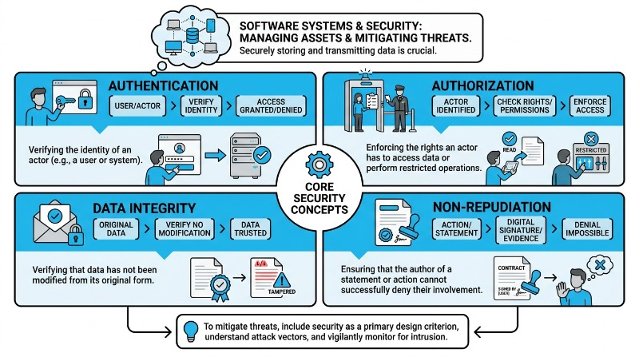
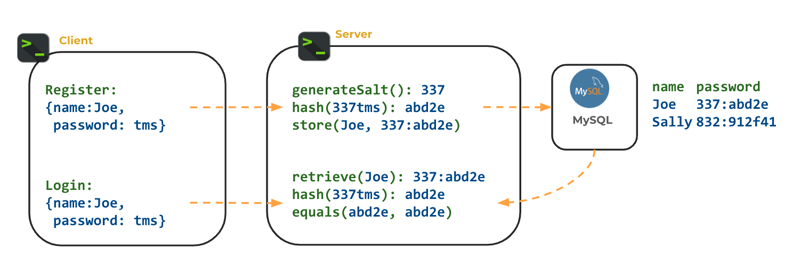
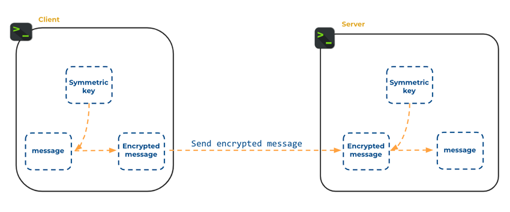
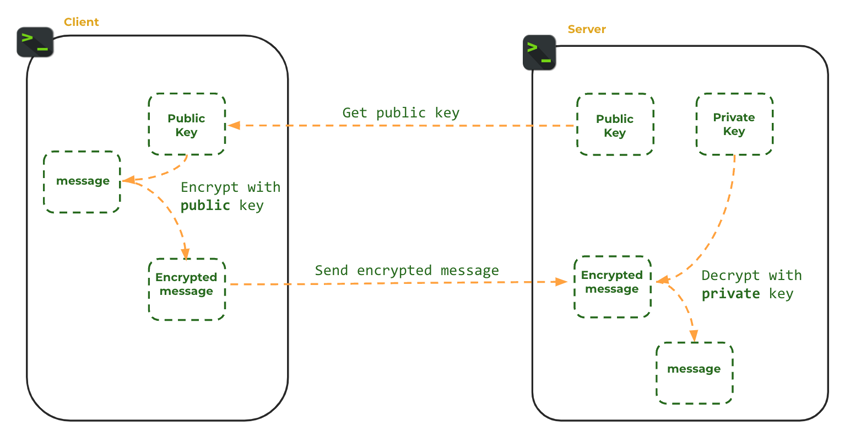
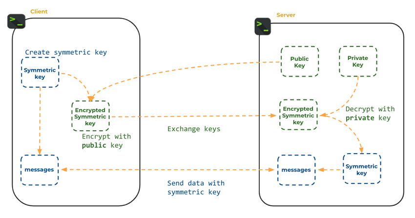
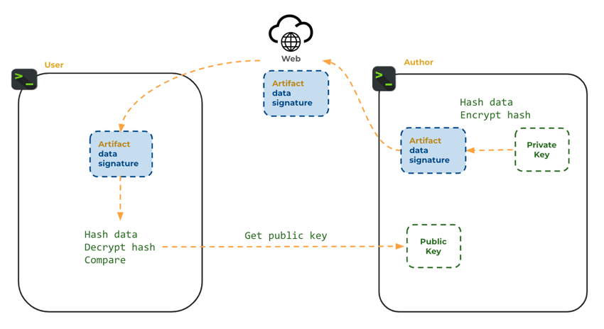
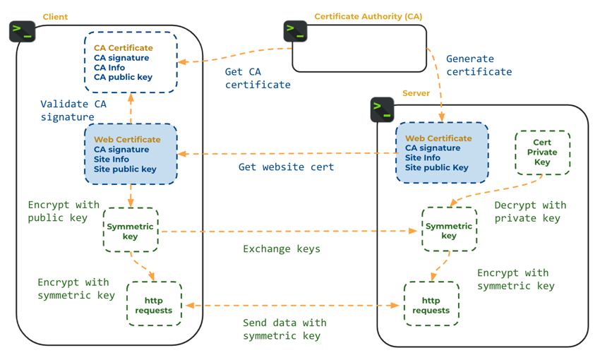

# Computer Security

🖥️ [Slides](https://docs.google.com/presentation/d/1pUU4DDACUndgj_ij7bbKOUY8cxmGinZq/edit#slide=id.p1)

🖥️ [Lecture Videos](#videos)

📖 **Required Reading**: None

### 🔑 Key points

- High-level goals of computer security
  - Data confidentiality
  - Authentication
  - Data integrity
  - Non-repudiation
- Fundamental security concepts and technologies
  - Cryptographic hash functions
  - Symmetric encryption
  - Asymmetric encryption with public and private keys
  - Secure key exchange
  - Digital signatures
  - Public key certificates
- Secure password storage and verification
- Secure network communication using HTTPS

---

Software systems conduct trillions of dollars in daily transactions and manage access to billions of personal records. This makes these systems valuable targets for attack. Malicious actors attempt to compromise systems in a variety of ways, such as gaining unauthorized access to data and computers for the purposes of stealing, monitoring, damaging, or otherwise misusing assets. To mitigate these threats, you must include security as a primary design criterion, understand historical and current attack vectors, vigilantly monitor for intrusion, and continually enhance your systems as new threats evolve.



This topic focuses on the core concepts and technologies necessary to securely store and transmit data. The core concepts of computer security include the following:

- **Authentication**: Verifying the identity of an actor (e.g., a user or system).
- **Authorization**: Enforcing the rights an actor has to access data or perform restricted operations.
- **Data Integrity**: Verifying that data has not been modified from its original form.
- **Non-Repudiation**: Ensuring that the author of a statement or action cannot successfully deny their involvement.

Cryptography plays a key technological role in supporting these security concepts. It is used to authenticate users, represent their rights and identity, encrypt their data, and digitally sign messages. Without cryptography, it would be nearly impossible to securely exchange money or information in digital form.

## Cryptographic Hash Functions

A hash function is a mathematical function that converts data of arbitrary size into a fixed-size value. The value returned by a hash function is often called a hash value, hash code, digest, or simply a hash.

Desirable features of a cryptographic hash function include:

- **Fixed-Size**: The digest (output) is always the same size (e.g., 256 bits), regardless of the input size.
- **Deterministic**: Given the same input, it always produces the same digest.
- **One-Way**: Given a digest, it is computationally infeasible to recover the original input.
- **Collision Resistance**: It should be extremely difficult to find two different input values that produce the same digest.
- **Preimage Resistance**: Given a digest, it should be difficult to find any input value that produces that specific digest.

There are many algorithms for computing digests. The following table lists common ones along with their limitations and benefits.

| Hash function | Benefits | Limitations |
| ------------- | -------- | ----------- |
| **MD5** | Simple, fast, widely available | Vulnerable to collision attacks; considered insecure for cryptographic use |
| **SHA-1** | Historically significant, widely available | Vulnerable to collision attacks; considered insecure for cryptographic use |
| **SHA-256** | Secure against known attacks, industry standard | Slower than MD5 and SHA-1 |
| **Bcrypt** | Specifically designed for password hashing; secure against brute force | Intentionally slow; not suitable for general data integrity checks |

If you are using macOS or Linux, you can use the `shasum` command-line utility to generate a hash using the **SHA-256** algorithm.

```sh
➜ echo -n "Fox" | shasum -a 256
f55bd2cdfae7972827638f3691a5bc189199d7cff7188d5ead489afdea0e5403
```

The following Java code demonstrates how to achieve the same result.

```java
package demo;

import java.security.MessageDigest;
import java.security.NoSuchAlgorithmException;
import java.nio.charset.StandardCharsets;

public class CryptoHashFunctionDemo {

    private static final char[] HEX_ARRAY = "0123456789abcdef".toCharArray();

    public static void main(String[] args) throws NoSuchAlgorithmException {

        String[] allInputs = new String[]{
                "Fox",
                "Fox",
                "The red fox jumps over the blue dog",
                "The red fox jumps oѵer the blue dog",
        };

        for (String input : allInputs) {
            // Convert character string to array of bytes
            byte[] inputBytes = input.getBytes(StandardCharsets.UTF_8);

            // Calculate message digest
            MessageDigest md = MessageDigest.getInstance("SHA-256");
            byte[] digestBytes = md.digest(inputBytes);

            System.out.println("Input: " + input);
            System.out.println("Hash:  " + bytesToHex(digestBytes));
            System.out.println();
        }
    }

    public static String bytesToHex(byte[] bytes) {
        char[] hexChars = new char[bytes.length * 2];
        for (int j = 0; j < bytes.length; j++) {
            int v = bytes[j] & 0xFF;
            hexChars[j * 2] = HEX_ARRAY[v >>> 4];
            hexChars[j * 2 + 1] = HEX_ARRAY[v & 0x0F];
        }
        return new String(hexChars);
    }
}
```

Both methods generate the same output for the word `Fox`. Notice that changing the case of the text or including whitespace will produce entirely different results.

### Creating Signatures

One primary use for a hash function is to create a unique, short, fixed-size signature that represents data blocks of arbitrary length. A signature acts as a compact representation of the data, allowing you to quickly determine if two blocks of data are identical.

Key properties for generating signatures include speed, fixed size, determinism, and collision resistance. While MD5 and SHA-1 are insecure for sensitive data, they are sometimes still used for non-security tasks like file identification. For example, Git uses SHA-1 to generate a unique signature for all data in a given commit.

### Securing Passwords

Because hash functions are one-way and preimage resistant, they are ideal for storing passwords. Under this model, you hash the user's password when they register and store only the hash in your database. To authenticate a user later, you hash the password they provide at login and compare it to the stored hash.

Storing hashes instead of plain text is vital. Consider a database storing passwords in plain text:

| User  | Password       |
| ----- | -------------- |
| sally | toomanysecrets |
| juan  | p@33w0r6       |
| pat   | qwerty1        |

If this database is compromised, the attacker gains every user's credentials. Because users often reuse passwords across different sites, a breach in your application could expose their bank accounts or email.

Hashing prevents attackers from simply reading passwords:

| User  | HashedPassword (SHA-1)                   |
| ----- | ---------------------------------------- |
| sally | fc80b22ff203a1a88470b19ab19228044d066d66 |
| juan  | adb4c36db0466b9750a7a298ef39f98159eb219d |
| pat   | ad70ab97ae1376e656002641cfb067c9c94906a2 |

However, an attacker can still use a **rainbow table attack**. A rainbow table is a large database of precomputed hash codes for millions of common passwords. If an attacker finds your stored hash in their table, they immediately know the original password.

To combat rainbow table attacks, we use a **salt**—a random sequence of characters added to the password before hashing. A unique salt for every user ensures that even if two users have the same password, their hashes will be different.

| User  | SaltedHashedPassword                           |
| ----- | ---------------------------------------------- |
| sally | 37581:a67d83d2f75f240fe223ea899757a6980dee7d50 |
| juan  | 92734:79241300a93bdda742159f1902db461b55be3982 |
| pat   | 84723:fdfa32ac48e82803daa5b2a0849fb3c080b09cec |

The following diagram demonstrates the flow for using salted passwords:



The salt does not need to be encrypted; it is stored in the database alongside the hash. It simply ensures that an attacker cannot use a generic rainbow table. They would have to compute a new table for every individual salt, which is computationally impractical.

| Representation    | Benefit                                                                           |
| ----------------- | --------------------------------------------------------------------------------- |
| Plain text        | None (dangerous)                                                                  |
| Hashed            | Passwords are not immediately readable if the database is compromised             |
| Hashed and salted | Protects against precomputed rainbow table attacks                                |

### Bcrypt

To further protect passwords, we use hashing algorithms that are "expensive" to calculate. Modern hardware with Graphics Processing Units (GPUs) can compute millions of SHA-256 hashes per second. **Bcrypt** was created to be intentionally slow. While SHA-256 might check millions of passwords per second, Bcrypt might only check a few thousand on the same hardware. This "work factor" makes brute-force attacks much more difficult.

You can use the following library for Bcrypt in Java:

```
org.mindrot:jbcrypt:0.4
```

Bcrypt handles salting automatically. The following example hashes a password and then verifies it against candidates.

```java
import org.mindrot.jbcrypt.BCrypt;

public class PasswordExample {

    public static void main(String[] args) {
        String secret = "toomanysecrets";
        // gensalt() generates a random salt and includes the work factor
        String hash = BCrypt.hashpw(secret, BCrypt.gensalt());

        String[] passwords = {"cow", "toomanysecrets", "password"};
        for (var pw : passwords) {
            var match = BCrypt.checkpw(pw, hash) ? "==" : "!=";
            System.out.printf("%s %s %s%n", pw, match, secret);
        }
    }
}
```

## Encryption and Decryption

**Encryption** is the process of encoding data so that it is unreadable to unauthorized parties. **Decryption** is the process of reverting encoded data back to its original form.

Unlike one-way hashing, many applications need to recover the original data. For example, medical or financial records must be encrypted for storage but decrypted when a user requests to view them.

| Term        | Purpose                                | Example             |
| ----------- | -------------------------------------- | ------------------- |
| Plaintext   | Unencrypted data                       | toomanysecrets      |
| Key         | Value used to encrypt and decrypt data | 9012434289054653828 |
| Key size    | The length of the key (in bits)        | 256 bits            |
| Ciphertext  | Encrypted data                         | 88338012387532      |

### Simple Example

Consider a simple "Caesar cipher" variation that adds a numeric key to each character.

| Value       | Example        |
| ----------- | -------------- |
| Plaintext   | toomanysecrets |
| Key         | 1              |
| Ciphertext  | uppoboztfdsfut |

```java
public class SimpleExample {
  public static void main(String[] args) {
      var key = 1;
      var plainText = "toomanysecrets".toCharArray();

      // encrypt
      var cipherText = new char[plainText.length];
      for (var i = 0; i < plainText.length; i++) {
          cipherText[i] = (char) (plainText[i] + key);
      }

      // decrypt
      var decryptedText = new char[cipherText.length];
      for (var i = 0; i < cipherText.length; i++) {
          decryptedText[i] = (char) (cipherText[i] - key);
      }

      System.out.println(decryptedText);
      System.out.println(cipherText);
  }
}
```

This is easily defeated because there are only a few possible keys. Secure algorithms use large keys and complex mathematics. A key size of 1024 bits provides $2^{1024}$ possible combinations—a number larger than the estimated number of atoms in the observable universe ($10^{80}$).

## Symmetric Key Encryption

Symmetric encryption uses the same key for both encryption and decryption. These algorithms are very fast and provide strong security if the key is kept secret.

A common symmetric algorithm is the Advanced Encryption Standard (**AES**). AES uses an **initialization vector (IV)** to ensure that encrypting the same plaintext twice results in different ciphertext, preventing attackers from identifying patterns in the encrypted data.



The following code demonstrates AES encryption and decryption in Java:

```java
import javax.crypto.*;
import javax.crypto.spec.IvParameterSpec;
import java.security.SecureRandom;
import java.io.*;

public class SymmetricKeyExample {
    public static void main(String[] args) throws Exception {
        SecretKey key = createAesKey();
        IvParameterSpec initVector = createAesInitVector();

        var secretMessage = "toomanysecrets";

        var plainTextIn = new ByteArrayInputStream(secretMessage.getBytes());
        var cipherBytes = runAes(Cipher.ENCRYPT_MODE, plainTextIn, key, initVector);

        var cipherTextIn = new ByteArrayInputStream(cipherBytes);
        var plainTextBytes = runAes(Cipher.DECRYPT_MODE, cipherTextIn, key, initVector);

        System.out.printf("%s == %s%n", secretMessage, new String(plainTextBytes));
    }

    static SecretKey createAesKey() throws Exception {
        KeyGenerator keyGen = KeyGenerator.getInstance("AES");
        keyGen.init(256);
        return keyGen.generateKey();
    }

    static IvParameterSpec createAesInitVector() {
        var ivBytes = new byte[16];
        new SecureRandom().nextBytes(ivBytes);
        return new IvParameterSpec(ivBytes);
    }

    static byte[] runAes(int cipherMode, InputStream in, SecretKey key, IvParameterSpec initVector) throws Exception {
        Cipher cipher = Cipher.getInstance("AES/CBC/PKCS5Padding");
        cipher.init(cipherMode, key, initVector);

        ByteArrayOutputStream out = new ByteArrayOutputStream();
        byte[] inputBytes = new byte[64];
        int bytesRead;
        while ((bytesRead = in.read(inputBytes)) != -1) {
            out.write(cipher.update(inputBytes, 0, bytesRead));
        }

        out.write(cipher.doFinal());
        return out.toByteArray();
    }
}
```

### Asymmetric Key Encryption

Asymmetric encryption uses a **key pair**: a **public key** and a **private key**. Data encrypted with the public key can only be decrypted with the corresponding private key.

1. Generate a key pair.
2. Keep the **private key** secret.
3. Distribute the **public key** to anyone who wants to send you data.
4. The sender encrypts data using your public key.
5. You decrypt the data using your private key.



Popular implementations include:

- **RSA (Rivest–Shamir–Adleman)**: A mature, widely used algorithm for secure communication and digital signatures.
- **ECC (Elliptic Curve Cryptography)**: A newer algorithm that is more efficient than RSA, offering similar security with smaller key sizes—ideal for mobile devices.

```java
import javax.crypto.Cipher;
import java.io.*;
import java.security.*;

public class AsymmetricKeyExample {
    public static void main(String[] args) throws Exception {
        KeyPair keyPair = createRsaKeyPair();

        final String secretMessage = "toomanysecrets";

        var plainTextIn = new ByteArrayInputStream(secretMessage.getBytes());
        var cipherTextOut = new ByteArrayOutputStream();
        runRsa(Cipher.ENCRYPT_MODE, plainTextIn, cipherTextOut, keyPair.getPublic());

        var cipherTextIn = new ByteArrayInputStream(cipherTextOut.toByteArray());
        var plainTextOut = new ByteArrayOutputStream();
        runRsa(Cipher.DECRYPT_MODE, cipherTextIn, plainTextOut, keyPair.getPrivate());

        System.out.printf("%s == %s%n", secretMessage, plainTextOut);
    }

    private static KeyPair createRsaKeyPair() throws Exception {
        var keyPairGen = KeyPairGenerator.getInstance("RSA");
        keyPairGen.initialize(2048);
        return keyPairGen.generateKeyPair();
    }

    private static void runRsa(int cipherMode, InputStream inputStream, OutputStream outputStream, Key key) throws Exception {
        Cipher cipher = Cipher.getInstance("RSA");
        cipher.init(cipherMode, key);

        byte[] inputBytes = new byte[64];
        int bytesRead;
        while ((bytesRead = inputStream.read(inputBytes)) != -1) {
            outputStream.write(cipher.update(inputBytes, 0, bytesRead));
        }

        outputStream.write(cipher.doFinal());
    }
}
```

You can also generate an RSA key pair using the terminal:
```sh
ssh-keygen -t rsa -b 4096
```

### Disadvantages of Asymmetric Key Encryption

Asymmetric encryption is critical for modern security, but it has two main drawbacks:
1. **Size Restriction**: It can only encrypt small amounts of data (typically smaller than the key size).
2. **Performance**: It is significantly slower than symmetric encryption.

## Secure Key Exchange

Symmetric encryption requires both parties to share the same key. Securely getting that key to a remote party is a classic problem. We solve this using a hybrid approach: **asymmetric encryption** is used to securely exchange a **symmetric key**.

1. The Client generates an asymmetric key pair and shares the public key.
2. The Server generates a symmetric key and encrypts it using the Client's public key.
3. The Server sends the encrypted symmetric key to the Client.
4. The Client decrypts it using their private key.
5. Both parties now have the same symmetric key and use it for fast, secure communication.



## Digital Signatures

Digital signatures provide **non-repudiation** and **data integrity**. They prove that a message was sent by a specific author and has not been tampered with.

1. Sally generates an asymmetric key pair and shares her public key.
2. Sally hashes her message (e.g., using SHA-256).
3. Sally encrypts the hash using her **private key**. This encrypted hash is the **digital signature**.
4. Sally sends the message and the signature.
5. Juan receives the message and hashes it himself.
6. Juan decrypts the signature using Sally's **public key**.
7. If Juan's hash matches the decrypted signature, he knows the message is authentic and unchanged.



## Web Certificates and HTTPS

HTTPS (Hypertext Transfer Protocol Secure) combines these concepts to secure the web.

Browsers trust **Certificate Authorities (CAs)**. A website owner proves their identity to a CA, which then issues a **web certificate**. This certificate contains the website's identity, its public key, and a digital signature from the CA.

1. A browser connects to a website.
2. The website sends its certificate.
3. The browser verifies the CA's signature to ensure the certificate is valid.
4. The browser generates a random symmetric key, encrypts it with the website's public key, and sends it to the website.
5. The website decrypts the key using its private key.
6. All further communication is encrypted using that symmetric key.



If the website cannot decrypt the symmetric key, it proves they do not own the private key associated with the certificate, and the browser terminates the connection.

## Videos

- 🎥 [Computer Security Overview (7:49)](https://byu.hosted.panopto.com/Panopto/Pages/Viewer.aspx?id=f60bd2e6-9aec-44ba-8e48-b1a8014a2efe) - [[transcript]](https://github.com/user-attachments/files/17736619/CS_240_Computer_Security_Overview_Transcript.pdf)
- 🎥 [Cryptographic Hash Functions (10:05)](https://byu.hosted.panopto.com/Panopto/Pages/Viewer.aspx?id=e54b188b-89a4-4f51-be13-b1a8014d0a7b) - [[transcript]](https://github.com/user-attachments/files/17736652/CS_240_Cryptographic_Hash_Functions_Transcript.pdf)
- 🎥 [Cryptographic Hashing Applications (5:29)](https://byu.hosted.panopto.com/Panopto/Pages/Viewer.aspx?id=44f59163-ab0a-410b-a8bb-b1a8015012bf) - [[transcript]](https://github.com/user-attachments/files/17736656/CS_240_Cryptographic_Hashing_Applications_Transcript.pdf)
- 🎥 [Secure Password Storage (15:06)](https://byu.hosted.panopto.com/Panopto/Pages/Viewer.aspx?id=f977577d-6fec-45a9-8e80-b1a80151efc1) - [[transcript]](https://github.com/user-attachments/files/17736661/CS_240_Secure_Password_Storage_Transcript.pdf)
- 🎥 [Data Encryption (4:27)](https://byu.hosted.panopto.com/Panopto/Pages/Viewer.aspx?id=bd28a2d9-adec-4c2b-b78f-b1a8015667b9) - [[transcript]](https://github.com/user-attachments/files/17736672/CS_240_Data_Encryption_Transcript.pdf)
- 🎥 [Symmetric Key Encryption (11:37)](https://byu.hosted.panopto.com/Panopto/Pages/Viewer.aspx?id=0537f4f0-5ef2-4534-9564-b1a80157e780) - [[transcript]](https://github.com/user-attachments/files/17736680/CS_240_Symmetric_Key_Encryption_Transcript.pdf)
- 🎥 [Asymmetric Key Encryption (15:01)](https://byu.hosted.panopto.com/Panopto/Pages/Viewer.aspx?id=aad832e9-0621-4a6d-b389-b1a8015b6ffc) - [[transcript]](https://github.com/user-attachments/files/17736687/CS_240_Asymmetric_Key_Encryption_Transcript.pdf)
- 🎥 [Encryption Applications (6:28)](https://byu.hosted.panopto.com/Panopto/Pages/Viewer.aspx?id=cb8ef70e-52fd-4390-9ae9-b1a8015fcac1) - [[transcript]](https://github.com/user-attachments/files/17736710/CS_240_Encryption_Applications_Transcript.pdf)
- 🎥 [Secure Key Exchange (4:51)](https://byu.hosted.panopto.com/Panopto/Pages/Viewer.aspx?id=a466805a-7a15-4859-b84e-b1af0148e79d) - [[transcript]](https://github.com/user-attachments/files/17736726/CS_240_Secure_Key_Exchange_Transcript.pdf)
- 🎥 [Secure Communication with HTTPS (14:17)](https://byu.hosted.panopto.com/Panopto/Pages/Viewer.aspx?id=f02e79ed-fcca-4549-a8b7-b1af014aa782) - [[transcript]](https://github.com/user-attachments/files/17736732/CS_240_Secure_Communication_using_HTTPS_Transcript.pdf)
- 🎥 [Digital Signatures (8:10)](https://byu.hosted.panopto.com/Panopto/Pages/Viewer.aspx?id=93205b28-04ef-4e11-b939-b1af014ef686) - [[transcript]](https://github.com/user-attachments/files/17736735/CS_240_Digital_Signatures_Transcript.pdf)

## Demonstration code

📁 [Cryptographic Hash Function Example](example-code/src/demo/CryptoHashFunctionDemo.java)

📁 [Password Hashing and Verification Example](example-code/src/demo/PBKDF2WithHmacSHA1Hashing.java)

📁 [Symmetric Key Encryption Example](example-code/src/demo/SymmetricKeyEncryptionDemo.java)

📁 [Public Key Encryption Example](example-code/src/demo/PublicKeyEncryptionDemo.java)

📁 [Security Utilities](example-code/src/demo/Utils.java)