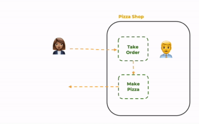
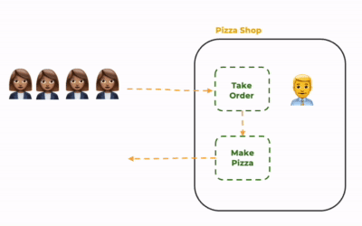
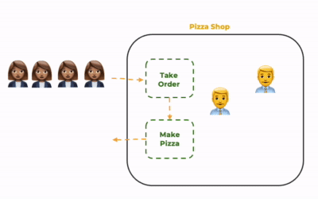
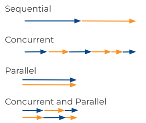
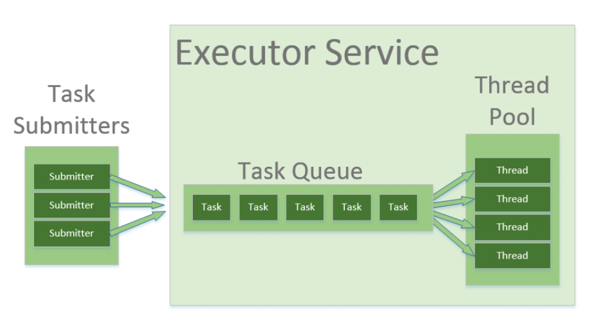

# Concurrency and Multi-threaded Programming

🖥️ [Slides](https://docs.google.com/presentation/d/1ibtqBjYEzx45Nh9eLP5xq6jWKfVjVMpv/edit#slide=id.p1)

📖 **Optional Reading**: Core Java for the Impatient, Chapter 10: Concurrent Programming

🖥️ [Lecture Videos](#videos)

### 🔑 Key points

- What is a thread?
- Creating and executing a simple thread in Java
- Using a thread pool (`ExecutorService` in Java) to run multiple threads
- What is a race condition (or race hazard)?
- How to use database transactions to avoid race conditions
- How to use `synchronized` methods and code blocks in Java to avoid race conditions
- How to avoid race conditions in the Chess server and client programs

---

To understand the value of concurrent programming, it is helpful to examine how a process executes tasks. Imagine a pizza shop that takes orders and prepares pizzas. A shop with only one worker can only take one order at a time and make one pizza at a time.



> _1_ - One worker, one customer

This works well if you only have one customer at a time, but you run into trouble if multiple customers want pizzas simultaneously—such as during a lunch hour rush. With only one employee, customers must wait for every previous customer to be served. This leads to unhappy customers and, eventually, a decrease in profit.



> _2_ - One worker, multiple customers

We can solve this problem by hiring more workers so we can serve multiple customers at the same time, or **concurrently**. With two workers, we can make pizzas twice as fast. If we add a third worker, we can make pizzas three times as fast.



> _3_ - Multiple workers, multiple customers

The pattern of concurrently executing tasks is a foundational principle in computer science that enables increased throughput and performance.

## Parallel vs. Concurrent vs. Sequential

When you have multiple tasks and a single CPU, the operating system will swap which task is executing so that each task gets a chance to run. This is known as **context switching**, and it allows tasks to run concurrently. If you have multiple CPUs (or multiple cores), the operating system can actually run the tasks at the **same time**, or in **parallel**. 

If each task must run to completion before another task can start, you are running **sequentially**. When running sequentially, you do not need to worry about data corruption, starvation, or deadlock because no other process can interrupt or interfere with the execution of a task.

The following diagram shows two tasks, one yellow and one blue, that need to execute. Depending on how you write your code and the device it runs on, it may run under any of the following models:



## Concurrency at the System Level

When your computer runs, it handles hundreds of tasks simultaneously. This includes every program you start, network communications, keyboard input, graphics rendering, and data storage. A computer usually has multiple processing units (CPUs). Each CPU can process one task at a time. When a CPU periodically switches tasks, they are running concurrently, giving the appearance that everything is running at the same time. If you have multiple CPUs, the tasks can run in parallel. However, no computer has enough CPUs for every task to run in parallel, so the operating system spends much of its time scheduling and swapping tasks so that they run concurrently and in parallel.

## Concurrency Complexities

Implementing concurrency is not free. An operating system that executes only a single task at a time is much simpler than one that manages multiple processors. In our pizza shop example, it is more complex to hire and manage multiple workers than to have a single worker. Additionally, if the workers cannot coordinate effectively, you may lose the benefits of concurrency and end up with a shop that is less efficient than one with a single worker. These complexities introduce operational overhead, resource synchronization issues, starvation, and deadlock.

### Overhead

In the pizza example, we can keep hiring workers to increase **throughput**, but at some point, the shop will be too small to allow the workers to move efficiently. When that happens, adding more workers just increases the time each worker spends navigating around others. The cost of hiring workers and managing their movement is **overhead**. This decreases the productivity of each worker and causes pizzas to be created at a slower rate. If we continue adding workers, eventually none of them will be able to move and no pizzas will be created.

In computer systems, overhead is determined by how expensive it is to create and manage tasks. If the CPU spends all its time creating, deleting, and switching between tasks, it will get little or no actual work done.

### Resource Synchronization

Problems also arise when workers need to **synchronize** their work on resources that cannot be shared concurrently. In our pizza shop, there is only one cash register. Imagine if two workers tried to take an order at the same time using the single register. This might result in one customer paying for another's pizza, or both customers getting their pizzas for free.

In a computer system, memory is a resource shared by many tasks. If multiple tasks try to write to the same memory location at the same time, they may overwrite each other's data or create corrupt entries.

### Starvation

Starvation occurs when one worker monopolizes a resource. For example, if a worker starts taking an order on the cash register but then goes on break before completing it, no other worker can take orders. The result is a halt in production. When workers cannot operate because a necessary resource is unavailable, it is called **resource starvation**.

Most computers only have one network card. If one task monopolizes the network, no other task can send or receive data.

### Deadlock

In the pizza shop, you need a paddle to pull a pizza out of the oven and a box maker to create a pizza box. If one worker holds the box maker while a different worker holds the oven paddle, and each needs the other's tool to finish, neither can complete their task. When two workers each hold a resource that the other needs to finish a job, you have **deadlock**. Progress is impossible unless one worker releases a resource or an external force intervenes.

In a computer, imagine two resources: the network and a specific memory block. If one process locks the network and the other locks access to the memory block, and each needs the other's resource to finish, neither will complete. The operating system must step in and require one of them to release a resource.

## Concurrent Programming in Java

Java provides two primary mechanisms for concurrent programming: `Processes` and `Threads`. A process is created when the Java Virtual Machine (JVM) starts and executes a class with a `main` method. Once the main process starts, it can spawn other processes using the [ProcessBuilder](https://docs.oracle.com/javase/8/docs/api/java/lang/ProcessBuilder.html) object. Each process runs as a separate application.

Each process has a main thread of execution and can create additional threads to process concurrent tasks. A **thread** is a lightweight process that runs within the context of a parent process. Threads in the same process share memory, allowing them to communicate through shared variables.

You create a Java thread by extending the [Thread](https://docs.oracle.com/javase/8/docs/api/java/lang/Thread.html) abstract class and providing a `run` method. You then instantiate your class and call the `start` method. This creates a branch in execution: one branch executes your `run` method, while the other continues executing the code following the `start` call.

Each process and thread is assigned a unique identifier by the operating system, used to control execution and resource ownership.

### Thread Example

The following program demonstrates creating two threads that print their IDs 10 times. The `CountingThread` class extends `Thread` and implements a loop in the `run` method.

From the `main` method, we allocate two instances of `CountingThread` and call `start()` to begin execution.

```java
public class ThreadExample {
    public static void main(String[] args) {

        new CountingThread().start();
        new CountingThread().start();

        System.out.println("\nExit Main Thread");
    }

    static class CountingThread extends Thread {
        public void run() {
            var id = this.threadId();
            for (int i = 0; i != 10; i++) {
                System.out.printf("%s:%d ", id, i);
            }
            System.out.printf("%nExit thread %s%n", id);
        }
    }
}
```

Note that as this program runs, there are actually three threads: the main process thread and the two counting threads.

The output will vary each time you run it because it relies on the operating system's scheduler. One possible output is shown below. Notice that the output for the two threads is intermingled and the main thread may exit before the counting threads finish.

```txt
Exit Main Thread
22:0 22:1 22:2 22:3 22:4 23:0 23:1 23:2 23:3 22:5 22:6 22:7 22:8 22:9
Exit thread 22
23:4 23:5 23:6 23:7 23:8 23:9
Exit thread 23
```

### Runnable

As an alternative to extending `Thread`, you can implement the `Runnable` functional interface. This allows you to represent your thread implementation compactly with a lambda function.

```java
public class RunnableExample {
    public static void main(String[] args) {

        new Thread(() -> {
            var id = Thread.currentThread().threadId();
            for (int i = 0; i != 10; i++) {
                System.out.printf("%s:%d ", id, i);
            }
        }).start();

        System.out.println("\nLeaving Main Thread");
    }
}
```

### Join

Sometimes you need to wait for one or more threads to complete before continuing the main process. You can do this by calling the `join` method on the `Thread` object.

```java
public class JoinExample {
    public static void main(String[] args) throws Exception {
        var t = new Thread(() -> System.out.println("Thread done"));

        t.start();
        t.join();

        System.out.println("Exiting Main Thread");
    }
}
```

In this example, "Thread done" will always be output before "Exiting Main Thread" because `join` blocks the main thread until the spawned thread exits.

### Callable and Executors

To return a result from a thread, use an [ExecutorService](https://docs.oracle.com/javase/8/docs/api/java/util/concurrent/ExecutorService.html). You start a thread by calling `submit` with an implementation of the `Callable` functional interface. `Callable` is similar to `Runnable`, but it returns a result. `submit` returns a `Future` object that will eventually contain the result.

You can wait for the result by calling `get` on the `Future` object. This blocks execution until the result is available.

```java
public class CallableExample {
    public static void main(String[] args) throws Exception {
        try (ExecutorService executorService = Executors.newSingleThreadExecutor()) {
            Future<String> future = executorService.submit(() -> {
                return "Callable result";
            });
            System.out.println(future.get());
        }
    }
}
```

### Thread Pools

An `ExecutorService` can manage multiple threads in a **pool**. Creating new threads is expensive; thread pools allow threads to be reused, which reduces overhead.

In the example above, we used `newSingleThreadExecutor`. Other types include:



| Pool Type               | Description                                                                                                       |
| ----------------------- | ----------------------------------------------------------------------------------------------------------------- |
| `newSingleThreadExecutor` | Uses a single thread for all tasks. Eliminates context switching overhead between tasks.                          |
| `newFixedThreadPool`      | Reuses a fixed number of threads. Good for limiting resource usage.                                               |
| `newCachedThreadPool`     | Reuses threads, but creates new ones as needed. Good for many short-lived tasks.                                  |
| `newScheduledThreadPool`  | Runs threads periodically or after a delay.                                                                       |

## Synchronizing Threads

Multithreaded programs are a common source of bugs that can corrupt data or cause application failure.

### Race Conditions

A common bug results from multiple threads "racing" to use a shared resource. Consider multiple threads making pizzas using a shared list of orders:

```java
public class PizzaRaceExample {
    final static ArrayList<String> orders = new ArrayList<>();

    public static void main(String[] args) throws Exception {
        new Thread(() -> takeOrders()).start();

        for (var i = 0; i < 10; i++) {
            new Thread(() -> makePizzas()).start();
        }
    }

    static void takeOrders() {
        for (var i = 1; i < 1000; i++) {
            var order = "Pizza-" + i;
            System.out.printf("Ordering %s%n", order);
            orders.add(order);
        }
    }

    static void makePizzas() {
        while (true) {
            if (!orders.isEmpty()) {
                var order = orders.remove(0);
                System.out.printf("%s served%n", order);
            }
        }
    }
}
```

Running this code often results in an `IndexOutOfBoundsException`. This happens because one thread checks `isEmpty()`, finds it false, but before it can call `remove(0)`, another thread removes the last item. 

Any code that accesses a resource manipulated by multiple threads is a **critical section**. This usually involves code that **reads** and **modifies** a resource over multiple non-atomic statements.

### Synchronization

To solve race conditions, we must protect critical sections so only one thread can access the shared resource at a time. This is done using a `synchronized` block.

A `synchronized` block requires a synchronization object (a "lock"). Only one thread can hold the lock for a given object at a time.

```java
synchronized (lockObject) {
    // critical section
}
```

We can make the pizza shop thread-safe by synchronizing on the `orders` list:

```java
public class PizzaSyncExample {
    final static ArrayList<String> orders = new ArrayList<>();

    public static void main(String[] args) throws Exception {
        new Thread(() -> takeOrders()).start();

        for (var i = 0; i < 10; i++) {
            new Thread(() -> makePizzas()).start();
        }
    }

    static void takeOrders() {
        for (var i = 1; i < 1000; i++) {
            var order = "Pizza-" + i;
            System.out.printf("Ordering %s%n", order);
            synchronized (orders) {
                orders.add(order);
            }
        }
    }

    static void makePizzas() {
        while (true) {
            synchronized (orders) {
                if (!orders.isEmpty()) {
                    var order = orders.remove(0);
                    System.out.printf("%s served%n", order);
                }
            }
        }
    }
}
```

If an entire method is a critical section, you can use the `synchronized` keyword in the method signature, which synchronizes on `this` (the current instance).

## Multithreaded HTTP Requests

Every HTTP server is a multithreaded application. Multiple browsers may connect concurrently, and the server creates a thread for each request.

```java
public class MultithreadedServerExample {
    static int sum = 0;

    public static void main(String[] args) {
        var javalin = Javalin.create()
            .get("/add/{value}", (ctx) -> {
                int value = Integer.parseInt(ctx.pathParam("value"));
                sum += value; // Race condition here!
                ctx.result(" " + sum);
            })
            .start(8080);
    }
}
```

Because `sum += value` is not atomic (it involves a read, an addition, and a write), concurrent requests will overwrite each other. If you send 100 requests to add 1 and 100 requests to subtract 1, the total should be 0, but a race condition will likely result in a non-zero number.

You can fix this by synchronizing on a lock object:

```java
synchronized (lock) {
    sum += value;
}
```

## Atomic Concurrency

Java's `java.util.concurrent.atomic` package provides classes that perform operations atomically without explicit synchronization. For example, `AtomicInteger` allows you to add values in a single, thread-safe step.

```java
public class AtomicServerExample {
    static AtomicInteger sum = new AtomicInteger(0);

    public static void main(String[] args) {
        var javalin = Javalin.create()
            .get("/add/{value}", (ctx) -> {
                int value = Integer.parseInt(ctx.pathParam("value"));
                int newValue = sum.addAndGet(value);
                ctx.result(" " + newValue);
            })
            .start(8080);
    }
}
```

Useful atomic and thread-safe classes include:

| Class                | Description                                                                                                                                                                          |
| -------------------- | ------------------------------------------------------------------------------------------------------------------------------------------------------------------------------------ |
| `AtomicInteger`        | Atomically increments, decrements, or adds to an integer.                                                                                                                                 |
| `AtomicBoolean`        | Atomically updates a boolean value.                                                                                                                                                  |
| `BlockingQueue`        | A thread-safe queue for producer-consumer patterns.                                                                                                                                  |
| `ConcurrentHashMap`    | A high-performance thread-safe map.                                                                                                                                                  |
| `CopyOnWriteArrayList` | A thread-safe list optimized for scenarios where reads greatly outnumber writes.                                                                                                     |

## Database Transactions

Databases also face concurrency issues. If you read a value, modify it in Java, and write it back, another thread might have changed the database in the meantime.

To solve this, use **Transactions**. A transaction ensures that a series of database operations are executed atomically. If one fails, they all fail (**rollback**).

```java
try (var conn = getConnection()) {
    conn.setAutoCommit(false); // Start transaction
    try {
        if (!userExists(conn, username)) {
            insertUser(conn, username, email);
            conn.commit(); // Save changes
        }
    } catch (SQLException e) {
        conn.rollback(); // Undo changes on error
    }
}
```

### Database Transaction Alternatives

Transactions can be heavy. Alternatives include:
- **Unique Constraints**: Make a column (like `username`) unique so the database rejects duplicates automatically.
- **Atomic SQL**: Use `INSERT IGNORE` or `INSERT ... ON DUPLICATE KEY UPDATE` to handle logic within a single SQL statement.

## Concurrency in the Chess Application

In your chess application, recognize that the server is multithreaded. Even the client can receive asynchronous WebSocket messages on a background thread while the UI thread is active.

Potential issues:
1. **Race for Colors**: Two users might try to join as "White" at the exact same time. Without synchronization, the server might tell both they succeeded.
2. **Serialized State**: If you store the entire game as a serialized object in the database, you cannot rely on the database for fine-grained locking. You must synchronize access in your Java code to prevent one move from overwriting another.

Always identify your shared data and protect the critical sections where that data is read and modified.

## ☑ Exercise


```masteryls
{"id":"4226f08f-09a1-49a3-a5cc-cd30f4760fbd", "title":"Concurrency", "type":"essay", "gradingCriteria":"- Addresses the prompt directly\n- Uses at least one concrete example\n- Demonstrates accurate understanding of key concepts" }
What is the difference between parallel and concurrent execution?
```


```masteryls
{"id":"33d58c6f-e8af-4c3b-990f-7f7b05f860a6", "title":"Critical Sections", "type":"essay", "gradingCriteria":"- Addresses the prompt directly\n- Uses at least one concrete example\n- Demonstrates accurate understanding of key concepts" }
What is a critical section and what are some Java constructs that you can use to protect it?
```

```masteryls
{"id":"d7ae2be0-5609-4b7c-8563-346ab36b286f","title":"Purpose of Atomic Objects","type":"multiple-choice"}
In Java's `java.util.concurrent.atomic` package, what is the primary advantage of using classes such as `AtomicInteger` or `AtomicReference` instead of standard primitive types with `synchronized` blocks?

- [ ] They prevent other threads from reading a value while an update is in progress by applying a pessimistic lock on the underlying memory address.
- [x] They provide a way to perform thread-safe, non-blocking operations on single variables using low-level hardware primitives like Compare-And-Swap (CAS).
- [ ] They ensure that variables are stored exclusively in the CPU cache to improve the performance of single-threaded applications.
- [ ] They automatically detect and resolve deadlocks that occur when multiple threads attempt to update the same object simultaneously.
```


## Videos

- 🎥 [Concurrency Overview (12:12)](https://byu.hosted.panopto.com/Panopto/Pages/Viewer.aspx?id=4a305382-e8a4-4c69-a7d6-b1aa010e1c9b&start=0) - [[transcript]](https://github.com/user-attachments/files/17736816/CS_240_Concurrency_Overview_Transcript.pdf)
- 🎥 [Thread Synchronization (3:13)](https://byu.hosted.panopto.com/Panopto/Pages/Viewer.aspx?id=c095f9f7-b0d9-42ea-9e9c-b1aa0111ddfb&start=0) - [[transcript]](https://github.com/user-attachments/files/17736824/CS_240_Thread_Synchronization_Transcript.pdf)
- 🎥 [Thread Pools (12:48)](https://byu.hosted.panopto.com/Panopto/Pages/Viewer.aspx?id=fb5eda11-a69c-4b37-b1ec-b1aa011313f5&start=0) - [[transcript]](https://github.com/user-attachments/files/17736836/CS_240_Thread_Pools_Transcript.pdf)
- 🎥 [Race Conditions (14:14)](https://byu.hosted.panopto.com/Panopto/Pages/Viewer.aspx?id=701222ac-dfd5-4117-bed0-b1aa0116d8e9&start=0) - [[transcript]](https://github.com/user-attachments/files/17736864/CS_240_Race_Conditions_Transcript.pdf)
- 🎥 [Writing Threadsafe Code Part 1: Database Transactions (5:52)](https://byu.hosted.panopto.com/Panopto/Pages/Viewer.aspx?id=49333b55-7fb3-4a6c-b109-b1aa011b00b3&start=0) - [[transcript]](https://github.com/user-attachments/files/17736871/CS_240_Writing_Thread_Safe_Code_Part_1_Database_Transactions_Transcript.pdf)
- 🎥 [Writing Threadsafe Code Part 2: Synchronized Methods (4:13)](https://byu.hosted.panopto.com/Panopto/Pages/Viewer.aspx?id=76b856ae-054c-43d9-9ca6-b1aa011d0b9a&start=0) - [[transcript]](https://github.com/user-attachments/files/17736877/CS_240_Writing_Thread_Safe_Code_Part_2_Synchronized_Methods_Transcript.pdf)
- 🎥 [Writing Threadsafe Code Part 3: Synchronized Code Blocks (5:44)](https://byu.hosted.panopto.com/Panopto/Pages/Viewer.aspx?id=bae2b472-34bb-4da6-87a4-b1aa011e7b2e&start=0) - [[transcript]](https://github.com/user-attachments/files/17736903/CS_240_Writing_Thread_Safe_Code_Part_3_Synchronized_Code_Blocks_Transcript.pdf)
- 🎥 [Writing Threadsafe Code Part 4: Atomic Variables (13:21)](https://byu.hosted.panopto.com/Panopto/Pages/Viewer.aspx?id=24d88711-3841-4494-b0b4-b1aa01207780&start=0) - [[transcript]](https://github.com/user-attachments/files/17736907/CS_240_Writing_Thread_Safe_Code_Part_4_Atomic_Variables_Transcript.pdf)
- 🎥 [Race Conditions in Chess (5:38)](https://byu.hosted.panopto.com/Panopto/Pages/Viewer.aspx?id=40f625da-e37e-4b91-8dbd-b1aa0124d6ff&start=0) - [[transcript]](https://github.com/user-attachments/files/17736920/CS_240_Race_Conditions_in_Chess_Transcript.pdf)
