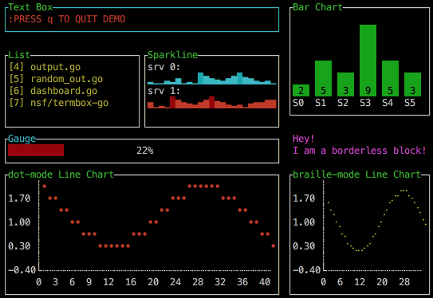
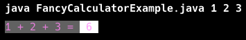
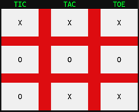

# Console User Interface (UI)

🖥️ [Slides](https://docs.google.com/presentation/d/1zHBDEdB6xhvnA12m3VliBaOQj7yZOxjT/edit#slide=id.p1)

🖥️ [Lecture Videos](#videos)

### 🔑 Key points

- How to use command line arguments
- How to write to Standard Out and Standard Error
- How to read from Standard In
- How to use terminal control codes to clear the terminal, set background and text colors, and apply text attributes (bold, faint, italic, underline, and blinking)
- How to use Unicode characters to draw the chessboard and pieces for the Chess project

---

Typically, when a program prints output to the console (or terminal), the text is plain and lacks formatting. However, it is possible to create sophisticated console user interfaces that include formatted, colored text and character-based graphics.


> _Source: [Lucas F Costa](https://www.lucasfcosta.com/blog/ux-patterns-cli-tools)_

This lecture explains how to create a text-based console user interface, with an emphasis on implementing the Chess client user interface.

## Processing Application Arguments

When the Java runtime executes your application, it passes any arguments specified on the command line into the `args` parameter of your `main` function.

```java
public class ArgsExample {
    public static void main(String[] args) {
        for (var i = 0; i < args.length; i++) {
            System.out.printf("%d. %s%n", i + 1, args[i]);
        }
    }
}
```

If you run this code with the following command, you will see how the arguments are processed:

```sh
➜  java ArgsExample.java a b c
1. a
2. b
3. c
```

Using application arguments is a convenient way to customize how your application operates. For example, in your Chess client application, you could allow the user to provide the URL of the Chess server. The code below specifies a default URL but allows the user to override it.

```java
public class ClientMain {
    public static void main(String[] args) {
        var serverUrl = "http://localhost:8080";
        if (args.length == 1) {
            serverUrl = args[0];
        }

        new Repl(serverUrl).run();
    }
}
```

## Writing to Standard Out and Standard Error

Java provides two primary output streams for the console:

1.  **`System.out`**: Used for standard output (normal program results).
2.  **`System.err`**: Used for error messages. By default, both usually print to the same console, but `System.err` is often used so that errors can be redirected or logged separately from standard output.

We can combine application arguments and `System.out` to create a rudimentary calculator.

```java
public class CalculatorExample {
    public static void main(String[] args) {
        if (args.length == 0) {
            System.err.println("Usage: java CalculatorExample.java <num1> <num2> ...");
            return;
        }

        int result = 0;
        for (var arg : args) {
            result += Integer.parseInt(arg);
        }
        var equation = String.join(" + ", args);
        System.out.printf("%s = %d%n", equation, result);
    }
}
```

## Outputting in Color

Most command line consoles support **ANSI escape codes** that allow you to change the background and foreground colors of the output text. You control these changes by outputting a sequence of special escape characters. For example, if you run the following command in your terminal, the text "red on blue" will appear with red text and a blue background:

```sh
echo -e "\u001b[31;44;1m red on blue \u001b[0m"
```

The escape sequence begins with `\u001b[`. (In Java strings, `\u001b` is the Unicode escape character; you may also see `\033[` used in other languages). Following the bracket, you provide command codes separated by semicolons (`;`):
- `31` sets the foreground color to red.
- `44` sets the background color to blue.
- `1` enables bold text.
- The sequence is terminated with the letter `m`.
- **Note:** It is important to use the reset code (`\u001b[0m`) at the end of your string, or the terminal will continue using those colors for all subsequent output.

### Color Options

| Color            | Foreground | Background |
| ---------------- | ---------- | ---------- |
| Black            | 30         | 40         |
| Red              | 31         | 41         |
| Green            | 32         | 42         |
| Orange           | 33         | 43         |
| Blue             | 34         | 44         |
| Magenta          | 35         | 45         |
| Cyan             | 36         | 46         |
| Light gray       | 37         | 47         |
| Fallback default | 39         | 49         |
| Dark gray        |            | 100        |
| Light red        |            | 101        |
| Light green      |            | 102        |
| Yellow           |            | 103        |
| Light blue       |            | 104        |
| Light purple     |            | 105        |
| Teal             |            | 106        |
| White            |            | 107        |

### Modifiers

| Modification | Code |
| ------------ | ---- |
| Reset/None   | 0    |
| Bold         | 1    |
| Underscore   | 4    |
| Blink        | 5    |
| Reverse      | 7    |
| Concealed    | 8    |

## Coloring With Java

We can enhance our calculator to use colors by printing the escape sequences before the text.

```java
public class FancyCalculatorExample {
    public static void main(String[] args) {
        int result = 0;
        for (var arg : args) {
            result += Integer.parseInt(arg);
        }

        // Set foreground magenta (35) and background dark gray (100)
        System.out.print("\u001b[35;100m");
        System.out.printf(" %s = ", String.join(" + ", args));
        
        // Change background to white (107)
        System.out.print("\u001b[107m");
        System.out.printf(" %d ", result);
        
        // Reset colors
        System.out.print("\u001b[0m");
        System.out.println();
    }
}
```

Now, when we run the calculator, the output is stylized:



## Clearing the Terminal

To create a clean UI, you may want to clear the terminal screen. You can do this using the escape sequence `\u001b[H\u001b[2J`. 
- `\u001b[H` moves the cursor to the "home" position (top-left).
- `\u001b[2J` clears the entire screen.

```java
public class ClearScreenExample {
    public static void main(String[] args) {
        System.out.print("\u001b[H\u001b[2J");
        System.out.flush();
        System.out.println("The screen has been cleared!");
    }
}
```

## Unicode and Special Characters

For the Chess project, you will use Unicode characters to represent the pieces. Java supports Unicode natively in strings. You can use the Unicode escape sequence `\uXXXX` where `XXXX` is the hex code for the character.

```java
public class UnicodeExample {
    public static void main(String[] args) {
        // Chess piece Unicode characters
        String whiteKing = "\u2654";
        String blackQueen = "\u265B";
        
        System.out.println("White King: " + whiteKing);
        System.out.println("Black Queen: " + blackQueen);
    }
}
```

## Reading from Standard In

To create an interactive application, you must receive input from the user. When a Java program executes, the operating system streams keyboard input to the `System.in` object.

To read this input effectively, we wrap `System.in` in a `Scanner` object. This allows us to read the input line by line.

```java
import java.util.Scanner;

public class InteractiveCalculatorExample {
    public static void main(String[] args) {
        Scanner scanner = new Scanner(System.in);
        while (true) {
            System.out.printf("Type your numbers (or 'exit' to quit)%n>>> ");
            
            if (!scanner.hasNextLine()) break;
            String line = scanner.nextLine();
            
            if (line.equalsIgnoreCase("exit")) {
                break;
            }

            var numbers = line.split(" ");
            int result = 0;
            try {
                for (var number : numbers) {
                    result += Integer.parseInt(number);
                }
                var equation = String.join(" + ", numbers);
                System.out.printf("%s = %d%n", equation, result);
            } catch (NumberFormatException e) {
                System.err.println("Error: Please provide only integers.");
            }
        }
    }
}
```

```sh
➜  java InteractiveCalculatorExample.java

Input your numbers
>>> 1 2 3
1 + 2 + 3 = 6
```

## ☑ Exercise


````masteryls
{"id":"c5b88226-5c50-4e90-86fa-342b4b8fb05d","title":"","type":"multiple-choice"}
Change the following Java code so that it prints out the text with a red foreground and a green background.

```java
System.out.print("\u001b[35;100m");
System.out.printf("Merry Christmas");
```
````


## Videos

- 🎥 [Console User Interfaces (3:02)](https://byu.hosted.panopto.com/Panopto/Pages/Viewer.aspx?id=363561fc-a6f6-49ad-8d10-b19a0149fe26) - [[transcript]](https://github.com/user-attachments/files/17736991/CS_240_Console_User_Interfaces_Transcript.pdf)
- 🎥 [Terminal Control Codes (10:53)](https://byu.hosted.panopto.com/Panopto/Pages/Viewer.aspx?id=46e4a217-ef9c-4950-8b35-b19a014b2881) - [[transcript]](https://github.com/user-attachments/files/17737000/CS_240_Terminal_Control_Codes_Transcript.pdf)
- 🎥 [Drawing the Chess Board (3:54)](https://byu.hosted.panopto.com/Panopto/Pages/Viewer.aspx?id=35f1e7b0-1ff0-4e59-932b-b19a014e9192) - [[transcript]](https://github.com/user-attachments/files/17737013/CS_240_Drawing_The_Chess_Board_Transcript.pdf)

## Demonstration Code

The following demonstration code uses escape sequences to draw a Tic-Tac-Toe board. The logic is very similar to what you will use to render the chessboard. The `EscapeSequences.java` file contains constants for many standard codes that you will find useful.



📁 [Tic-Tac-Toe Example](example-code/src/ui/TicTacToe.java)

📁 [Escape Sequences Utility](example-code/src/ui/EscapeSequences.java)