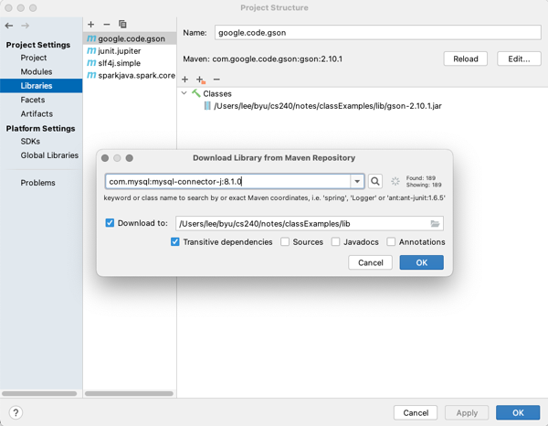

# Relational Databases - JDBC

🖥️ [Slides - JDBC](https://docs.google.com/presentation/d/12XS7en64-oQYivKayGyNGueWphiL6mm5)

🖥️ [Lecture Videos](#videos)

### 🔑 Key points

- How to execute SQL statements from Java using JDBC
- How to manage JDBC connections
- How to generate Java objects from the results of a database query
- How to retrieve auto-increment primary keys generated by the database during an insert
- How to obtain a JDBC driver for MySQL and include it in your Java project

---

Now that we have covered what relational databases are and how to use SQL to interact with them, it is time to discuss how to use SQL from a Java program. Java uses a standard interface library called **Java Database Connectivity (JDBC)**. This library provides the classes necessary to connect to a database, execute SQL queries, and process the results.

This guide also covers using the popular open-source relational database software, MySQL. You will install a MySQL server in your development environment and use it as the persistent data store for your chess program.

To create a connection to your database, you must first download the MySQL JDBC driver JAR file. You can then use the standard JDK JDBC classes as shown in the following example:

```java
import java.sql.DriverManager;

public class DatabaseExample {
    public static void main(String[] args) throws Exception {
        // Use try-with-resources to ensure the connection is closed automatically
        try (var conn = DriverManager.getConnection("jdbc:mysql://localhost:3306", "root", "monkeypie")) {
            conn.setCatalog("pet_store");

            try (var preparedStatement = conn.prepareStatement("SELECT id, name, type FROM pet")) {
                try (var rs = preparedStatement.executeQuery()) {
                    while (rs.next()) {
                        var id = rs.getInt("id");
                        var name = rs.getString("name");
                        var type = rs.getString("type");

                        System.out.printf("id: %d, name: %s, type: %s%n", id, name, type);
                    }
                }
            }
        }
    }
}
```

## Database Connectors

The JDK `java.sql` package contains interfaces and abstract classes for connecting to a Relational Database Management System (RDBMS). However, you must download a specific database connector that implements these interfaces for the RDBMS you are using. For this course, we use the **MySQL Connector/J**. Below is an example of using IntelliJ to import the MySQL connector into a project.



Most modern connector packages do not require you to manually initialize the driver. Including the JAR in your classpath allows the driver to register itself automatically. Once the package is installed in your project, you are ready to create connections.

## Obtaining a Connection

With the database-specific connector installed, you can use the JDK `DriverManager` class to obtain a connection to the database specified by a given URL. The `DriverManager` inspects the URL and passes the connection request to the appropriate database connector. In the example below, the `DriverManager` passes the request to the MySQL connector that registered itself when the package was loaded.

If the connector exists and the RDBMS specified by the URL is available, you will receive a `Connection` object.

Note that we use the Java **try-with-resources** syntax so that the connection is released as soon as the `try` block exits. This is critical because the number of available connections is limited by the database server. If you do not release connections, subsequent requests for new connections will fail, rendering the database inaccessible to your application.

```java
Connection getConnection() throws SQLException {
    return DriverManager.getConnection("jdbc:mysql://localhost:3306", "root", "monkeypie");
}

void makeSQLCalls() throws SQLException {
    try (var conn = getConnection()) {
        // Execute SQL statements on the connection here
    }
}
```

## Creating Databases and Tables

Once you have a connection, you can use it to create databases and tables. It is best practice to write Java code that initializes your database schema (creating databases and tables if they do not already exist) when your application starts. By defining the required infrastructure within your code, you ensure the environment is always correctly configured without relying on external manual processes.

We can configure a theoretical pet store application by following these steps:

1. Obtain a connection to the RDBMS.
2. Create the `pet_store` database if it does not exist.
3. Create the `pet` table if it does not exist.

```java
void configureDatabase() throws SQLException {
    try (var conn = getConnection()) {
        var createDbStatement = conn.prepareStatement("CREATE DATABASE IF NOT EXISTS pet_store");
        createDbStatement.executeUpdate();

        conn.setCatalog("pet_store");

        var createPetTable = """
            CREATE TABLE IF NOT EXISTS pet (
                id INT NOT NULL AUTO_INCREMENT,
                name VARCHAR(255) NOT NULL,
                type VARCHAR(255) NOT NULL,
                PRIMARY KEY (id)
            )""";

        try (var createTableStatement = conn.prepareStatement(createPetTable)) {
            createTableStatement.executeUpdate();
        }
    }
}
```

We execute SQL statements by first creating a `PreparedStatement`. You can think of a prepared statement as a SQL statement template. In the code above, we create two prepared statements using hard-coded strings. 

Just as you use try-with-resources to close a connection, you must also ensure that the `PreparedStatement` is closed when you are finished with it.

Note the use of the `setCatalog` call. We call this after ensuring the database exists. Setting the catalog tells the connection that all subsequent calls should be executed within the context of that specific database.

## Inserting Data

Once your database and tables are created, you can begin inserting data. The following example demonstrates how to insert a new row into the `pet` table.

```java
int insertPet(Connection conn, String name, String type) throws SQLException {
    try (var preparedStatement = conn.prepareStatement("INSERT INTO pet (name, type) VALUES(?, ?)", Statement.RETURN_GENERATED_KEYS)) {
        preparedStatement.setString(1, name);
        preparedStatement.setString(2, type);

        preparedStatement.executeUpdate();

        var resultSet = preparedStatement.getGeneratedKeys();
        var id = 0;
        if (resultSet.next()) {
            id = resultSet.getInt(1);
        }

        return id;
    }
}
```

This code creates a `PreparedStatement` containing an `INSERT` command. Rather than concatenating strings directly into the SQL (which is dangerous and prone to SQL injection), we parameterize the statement using question marks (`?`). We then provide the values using the `setString` method.

The first argument to `setString` is the 1-based index of the parameter, and the second argument is the value. This corresponds to the position of the question marks in the statement.

```java
preparedStatement.setString(1, name);
```

There are `set` methods for all standard SQL types (e.g., `setInt`, `setDate`, `setBoolean`). Ensure you use the method that matches your table schema. After populating the parameters, execute the statement by calling `executeUpdate`.

### Generating Primary Keys

In our `pet` table schema, the `id` column is set to `AUTO_INCREMENT`.

```sql
CREATE TABLE IF NOT EXISTS pet (
    id INT NOT NULL AUTO_INCREMENT,
    name VARCHAR(255) NOT NULL,
    type VARCHAR(255) NOT NULL,
    PRIMARY KEY (id)
)
```

The database handles the assignment of the primary key automatically. To retrieve the ID generated by the database, we pass the `RETURN_GENERATED_KEYS` flag when creating the `PreparedStatement`. After calling `executeUpdate`, we call `getGeneratedKeys`, which returns a `ResultSet`. We advance the iterator with `next()` and call `getInt(1)` to retrieve the new ID.

```java
var resultSet = preparedStatement.getGeneratedKeys();
var ID = 0;
if (resultSet.next()) {
    ID = resultSet.getInt(1);
}
```


### Protecting Against SQL Injections


> Source: _Randall Munroe. Exploits of a Mom. xkcd. (CC BY-NC 2.5)_

Using the `set` functions on a prepared statement helps prevent against what is know as a SQL injection. A SQL injection allows an attacker to inject unexpected SQL syntax into a statement. Consider the case where we simplify the `insertPet` function to the following.

```java
void insertPet(String name) throws SQLException {
        var conn = DriverManager.getConnection("jdbc:mysql://localhost:3306/pet_store?allowMultiQueries=true", "root", "monkeypie");

        var statement = "INSERT INTO pet (name) VALUES('" + name + "')";
        System.out.println(statement);
        try (var preparedStatement = conn.prepareStatement(statement)) {
            preparedStatement.executeUpdate();
        }
}
```

This makes the code smaller and would actually work fine in the normal case. The problem occurs when someone supplies the following name:

```java
name = "joe','cat'); DROP TABLE pet; -- ";
```

This will result in execution the following SQL. This first inserts a bogus pet record, and then deletes the entire pet table.

```sql
INSERT INTO pet (name, type) VALUES('joe','cat'); DROP TABLE pet; -- 'rat')
```

In addition to using the database connection prepared statements properly you also want to sanitize any input that comes from a user to make sure it only contains patterns that you expect. A more secure insert pet method would look like the following.

```java
void insertPet(String name) throws SQLException {
    var conn = DriverManager.getConnection("jdbc:mysql://localhost:3306/pet_store", "root", "monkeypie");

    if (name.matches("[a-zA-Z]+")) {
        var statement = "INSERT INTO pet (name) VALUES(?)";
        try (var preparedStatement = conn.prepareStatement(statement)) {
            preparedStatement.setString(1, name);
            preparedStatement.executeUpdate();
        }
    }
}
```

This does the following to help prevent a SQL injection.

1. Validates the input is of the expected format.
1. Uses the prepared statement `set` functions which also validates the format.
1. Does not allow multiple statements to execute in a single `executeUpdate` request by removing the `allowMultiQueries` from the connection string.


## Updates

Updating data follows a similar pattern to inserting data; you simply change the SQL statement.

```java
void updatePet(Connection conn, int petID, String name) throws SQLException {
    try (var preparedStatement = conn.prepareStatement("UPDATE pet SET name=? WHERE id=?")) {
        preparedStatement.setString(1, name);
        preparedStatement.setInt(2, petID);

        preparedStatement.executeUpdate();
    }
}
```

**Warning:** Always include a `WHERE` clause in your update statement. Without it, every row in the table will be updated.

## Deleting Data

To delete data, use a `DELETE` statement with a `WHERE` clause to target specific rows.

```java
void deletePet(Connection conn, int petID) throws SQLException {
    try (var preparedStatement = conn.prepareStatement("DELETE FROM pet WHERE id=?")) {
        preparedStatement.setInt(1, petID);
        preparedStatement.executeUpdate();
    }
}
```

If no `WHERE` clause is specified, all data in the table will be deleted. To clear an entire table efficiently, it is usually better to use a `TRUNCATE TABLE` statement.

## Queries

To retrieve data, use the `executeQuery` method on a `PreparedStatement`. This returns a `java.sql.ResultSet` object containing the rows that match your query.

```java
void queryPets(Connection conn, String findType) throws SQLException {
    try (var preparedStatement = conn.prepareStatement("SELECT id, name, type FROM pet WHERE type=?")) {
        preparedStatement.setString(1, findType);
        try (var rs = preparedStatement.executeQuery()) {
            while (rs.next()) {
                var id = rs.getInt("id");
                var name = rs.getString("name");
                var type = rs.getString("type");

                System.out.printf("id: %d, name: %s, type: %s%n", id, name, type);
            }
        }
    }
}
```

The `next()` method advances the result set to the next row. If it returns `false`, you have reached the end of the results. You can retrieve field values using `get` methods (like `getInt` or `getString`) corresponding to the columns in your `SELECT` statement. Always wrap the `ResultSet` in a try-with-resources block to release resources promptly.

## Text and Blob Types

For large text or binary data, MySQL provides the `TEXT` and `BLOB` types. These can store up to 4 gigabytes of data. While these fields are generally not searchable via indexes, they are useful for storing complex data. A common pattern is the **key-value store**, where a unique ID is associated with a `BLOB` or `TEXT` field, effectively using the database as a persistent map.

In your chess application, you might store the game board by serializing it to JSON and saving it in a `TEXT` field, then retrieving it using the game ID.

We can demonstrate this with a `Pet` record that includes a list of friends.

```java
record Pet(String name, String type, String[] friends) {}
```

The corresponding SQL table uses `LONGTEXT` for the friends list:

```sql
CREATE TABLE IF NOT EXISTS pet (
    name VARCHAR(255) DEFAULT NULL,
    type VARCHAR(255) DEFAULT NULL,
    friends LONGTEXT NOT NULL
);
```

To insert the pet, we serialize the array to JSON using the Gson library:

```java
void insertPet(Connection conn, Pet pet) throws SQLException {
    try (var preparedStatement = conn.prepareStatement("INSERT INTO pet (name, type, friends) VALUES(?, ?, ?)")) {
        preparedStatement.setString(1, pet.name);
        preparedStatement.setString(2, pet.type);

        // Serialize and store the friends array as JSON
        var json = new Gson().toJson(pet.friends);
        preparedStatement.setString(3, json);

        preparedStatement.executeUpdate();
    }
}
```

To read it back, we reverse the process:

```java
Collection<Pet> listPets(Connection conn) throws SQLException {
    var pets = new ArrayList<Pet>();
    try (var preparedStatement = conn.prepareStatement("SELECT name, type, friends FROM pet")) {
        try (var rs = preparedStatement.executeQuery()) {
            while (rs.next()) {
                var name = rs.getString("name");
                var type = rs.getString("type");

                // Read and deserialize the JSON string back into a String array
                var json = rs.getString("friends");
                var friends = new Gson().fromJson(json, String[].class);

                pets.add(new Pet(name, type, friends));
            }
        }
    }
    return pets;
}
```

## Videos

- 🎥 [JDBC Overview (3:20)](https://byu.hosted.panopto.com/Panopto/Pages/Viewer.aspx?id=cabe9971-3ff7-4579-be2e-ad660156090a&start=0) - [[transcript]](https://github.com/user-attachments/files/17737257/CS_240_Java_Database_Access_with_JDBC_Transcript.pdf)
- 🎥 [JDBC Drivers and Connections (7:44)](https://byu.hosted.panopto.com/Panopto/Pages/Viewer.aspx?id=1e05e1c6-727a-49b4-81cf-b1a00121b187&start=0) - [[transcript]](https://github.com/user-attachments/files/17737267/CS_240_JDBC_Drivers_and_Connections_Transcript.pdf)
- 🎥 [Executing Queries with JDBC (5:09)](https://byu.hosted.panopto.com/Panopto/Pages/Viewer.aspx?id=79ca902c-b6f2-457a-b1ba-b1a0012499a4&start=0) - [[transcript]](https://github.com/user-attachments/files/17737275/CS_240_Executing_Queries_with_JDBC_Transcript.pdf)
- 🎥 [Executing Insert, Update, and Delete Statements (8:37)](https://byu.hosted.panopto.com/Panopto/Pages/Viewer.aspx?id=9033fa48-8260-4701-84ee-b1a001262b8c&start=0) - [[transcript]](https://github.com/user-attachments/files/17737292/CS_240_Executing_Insert_Update_and_Delete_Statements_Transcript.pdf)
- 🎥 [Retrieving Auto-Increment Primary Keys and Ending Transactions (4:33)](https://byu.hosted.panopto.com/Panopto/Pages/Viewer.aspx?id=78e3086c-c6de-43d0-bba5-b1a0012a17fa&start=0) - [[transcript]](https://github.com/user-attachments/files/17737303/CS_240_Retrieving_Auto_Increment_Primary_Keys_and_Ending_Transactions_Transcript.pdf)
- 🎥 [Usernames, Passwords, and User Permissions (3:25)](https://byu.hosted.panopto.com/Panopto/Pages/Viewer.aspx?id=636f5721-1e35-413e-a1fe-b1a0012d43d7&start=0) - [[transcript]](https://github.com/user-attachments/files/17737306/CS_240_Usernames_Passwords_and_User_Permissions_Transcript.pdf)
- 🎥 [JDBC - Putting It All Together (9:48)](https://byu.hosted.panopto.com/Panopto/Pages/Viewer.aspx?id=a882dded-56a9-43ff-b4fe-b1a0012e6341&start=0) - [[transcript]](https://github.com/user-attachments/files/17737311/CS_240_JDBC_Putting_It_All_Together_Transcript.pdf)
- 🎥 [Unit Testing Database Code (5:12)](https://byu.hosted.panopto.com/Panopto/Pages/Viewer.aspx?id=6d8bf3b3-3ddd-4f3d-b90d-ad6b014f2bb7&start=0) - [[transcript]](https://github.com/user-attachments/files/17780620/CS_240_Unit_Testing_Database_Code.pdf)
- 🎥 [Correction - Unit Testing Database Code (3:52)](https://byu.hosted.panopto.com/Panopto/Pages/Viewer.aspx?id=9178d92a-e41b-48f4-8e68-adf8015d7a91&start=0) - [[transcript]](https://github.com/user-attachments/files/17780623/CS_240_Unit_Testing_Database_Code_Correction.pdf)