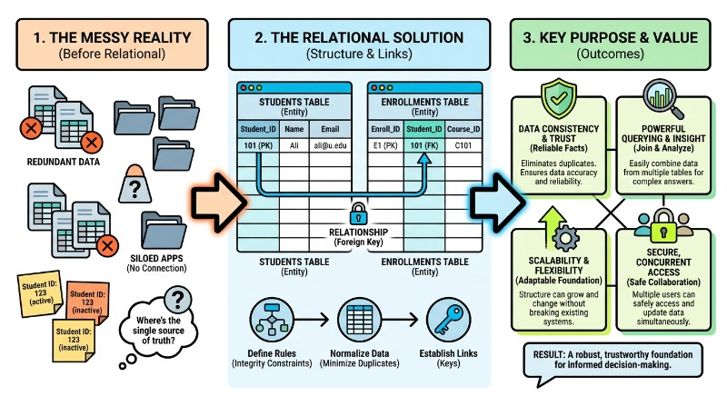
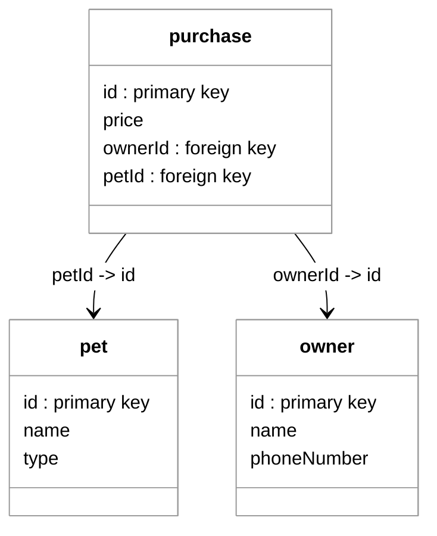
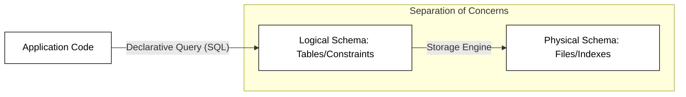

# Relational Databases - The Relational Model

🖥️ [Slides](https://docs.google.com/presentation/d/19nC7v6SDqoEeK75Mb-f6L3QhnbuP6Xfo/edit?usp=sharing&ouid=114081115660452804792&rtpof=true&sd=true)

🖥️ [Lecture Videos](#videos)

### 🔑 Key points

- How data is represented in the relational model
- How primary and foreign keys work
- How to represent one-to-one, one-to-many, and many-to-many relationships using primary and foreign keys
- What makes a good primary key
- How to model inheritance relationships in the relational model
- How to represent a data model in an Entity Relationship Diagram (ERD)


> _source: [Wikipedia](https://en.wikipedia.org/wiki/Edgar_F._Codd)_

> “At the time, Nixon was normalizing relations with China. I figured that if he could normalize relations, then so could I.”
>
> — Edgar F. Codd

---


## Foundations of the Relational Model

The Relational Model is the predominant method for managing data in modern computing, first proposed by E.F. Codd in 1970. At its core, the model represents data as a collection of **relations** (commonly known as tables). Each relation consists of **tuples** (rows) and **attributes** (columns). Unlike earlier hierarchical or network models, the relational model is based on mathematical set theory and first-order predicate logic, which allows for a high degree of data independence.

In a relational database, data is organized into structured formats where each row represents a unique instance of an entity, and each column represents a specific property. The power of this model lies in its ability to establish connections between different tables using shared values, known as keys.

### Key Components of the Model

*   **Relation (Table):** A structure of columns and rows.
*   **Attribute (Column):** A named field representing a specific type of data (e.g., `EmailAddress`).
*   **Tuple (Row):** A single record containing data for all attributes in the relation.
*   **Primary Key:** A unique identifier for every tuple within a table.
*   **Foreign Key:** An attribute in one table that provides a link to the primary key of another table.


### Why the Relational Model is Popular



The enduring popularity of the relational model stems from its balance of simplicity and rigorous data integrity. Before its adoption, developers had to understand the physical storage of data on a disk to retrieve it. The relational model introduced **Logical Data Independence**, meaning the way data is stored physically does not affect how it is accessed logically.

1.  **Data Integrity and Constraints:** Relational databases enforce rules (constraints) that prevent orphaned records or duplicate data, ensuring that the information remains accurate and reliable over time.
2.  **SQL Standardization:** The Structured Query Language (SQL) provides a universal, declarative way to interact with data. Instead of writing complex loops to find a record, a user simply tells the database *what* they want, and the engine determines *how* to get it.
3.  **ACID Compliance:** Most relational systems support ACID (Atomicity, Consistency, Isolation, Durability) properties, which guarantee that database transactions are processed reliably, even in the event of a system crash.
4.  **Normalization:** The model encourages "normalization," a process of organizing data to minimize redundancy, which saves storage space and prevents update anomalies.


By separating entities into distinct tables and linking them through keys, the relational model allows for complex data structures that are easy to navigate, scale, and maintain.

## Relational Databases in Practice

Relational databases are commonly used to persistently store and retrieve data. You can read and write data to a relational database from your program using Structured Query Language (SQL). Your code executes SQL statements against a database using standard library classes known as the Java Database Connectivity (JDBC) API. Before diving into how to write an application that uses a database, we must first discuss how the relational model works.

At a basic level, relational data is stored in a **database**. A database contains **tables**, and a table has a number of **columns** (or attributes) that define the fields of the table. These can include things like `name`, `phone_number`, or `id`. When you insert data into a database table, it becomes a **row** (or tuple) in the table. The inserted data must have fields that match each of the table's columns.

| column1 | column2 | column3 |
| ------- | ------- | ------- |
| row1    | row1    | row1    |
| row2    | row2    | row2    |
| row3    | row3    | row3    |

Usually, each table in a relational database has a column that represents a unique ID for that record. You use this ID to identify, update, or request specific data from the table.

## Mapping Objects to Tables

It is often helpful to think about relational databases in the context of objects in your code. If you have a Java record that represents a pet and you create three objects from that definition, it might look like the following:

```java
record Pet(int id, String name, String type){}

Pet[] pets = new Pet[]{
    new Pet(93, "Fido", "dog"),
    new Pet(14, "Puddles", "cat"),
    new Pet(77, "Chip", "bird")
};
```

Using this example, you can map the Java record declaration directly to a relational database table definition. The fields in the record map to the columns of the table, and both share strong typing. Each Java `Pet` object in the array maps to a row in the database table.

**Pet table**

| id  | name    | type |
| --- | ------- | ---- |
| 93  | Fido    | dog  |
| 14  | Puddles | cat  |
| 77  | Chip    | bird |

## Table Relationships

In the relational model, a "relation" is simply a table. However, the power of the model comes from the **relationships** between these tables. Relational databases seek to promote cohesion by representing only one type of data in every table. Once you have organized cohesive data into different tables, you create relationships between them by referencing keys.

The following example shows a database named `pet-store` containing tables for `pet`, `owner`, and `purchase`. The `pet` and `owner` tables are related to each other through the `purchase` table, which tracks which owner purchased which pet.

**pet**

| id  | name    | type |
| --- | ------- | ---- |
| 93  | Fido    | dog  |
| 14  | Puddles | cat  |
| 77  | Chip    | bird |

**owner**

| id  | name | phoneNumber |
| --- | ---- | ----------- |
| 81  | Juan | 6196663333  |
| 82  | Bud  | 8018889999  |

**purchase**

| id  | ownerId | petId |
| --- | ------- | ----- |
| 51  | 81      | 93    |
| 52  | 82      | 77    |

With data stored in relational tables, you can use the ID fields to cross-reference, or **join**, the data together. 

- **Primary Key**: A table column that represents the unique identifier for a row.
- **Foreign Key**: A column in one table that contains the primary key of a different table, creating a link between them.




A good primary key has the following characteristics:

- **Unique**: The key must be unique within the table.
- **Stable**: The key should not change over time. For example, a person's name is considered unstable because it could change.
- **Simple**: While multiple fields can be combined to create a "composite key," you should attempt to keep the key as simple as possible (often a single integer) because it is referenced frequently.

## Decomposition and Normalization

The principles of good software design also apply to the relational model. You should avoid creating a single "god table" that contains all the properties for your entire application. This would lack cohesion and lead to data redundancy.

**Example of a poorly designed table:**

| ownerId | ownerName | petId | petName | petStore  | storeCity | vaccinated | purchaseDate |
| ------- | --------- | ----- | ------- | --------- | --------- | ---------- | ------------ |
| 81      | Juan      | 93    | Fido    | Pets4You  | Provo     | true       | 2026         |
| 82      | Bud       | 77    | Chip    | DoggyTown | Orem      | false      | 2027         |
| 83      | Bud       | 56    | Puddles | DoggyTown | Orem      | false      | 2027         |

Notice that the store information is repeated in multiple rows, violating the DRY (Don't Repeat Yourself) principle. Instead, you should **normalize** the data by decomposing it into multiple tables that each represent a single cohesive entity. You then use relationships to aggregate the data as needed.

## Views and Joins

You can create new **views** of relational data by specifying queries that **join** data from different tables based on matching keys.

From the pet store tables above, we could create a view that joins the owner's name with the pet's name using the IDs found in the `purchase` table. This would result in a view like this:

| ownerId | ownerName | petId | petName |
| ------- | --------- | ----- | ------- |
| 81      | Juan      | 93    | Fido    |
| 82      | Bud       | 77    | Chip    |

Data views are often created temporarily so an application can use the aggregated data. These are typically generated in memory by the database engine and discarded once the application is finished with the results.

## Modeling Inheritance

In object-oriented programming, we use inheritance (e.g., a `Dog` *is a* `Pet`). In the relational model, inheritance is usually modeled in one of two ways:
1.  **Table-per-Hierarchy**: All classes in the hierarchy are stored in a single table with a "discriminator" column to identify the type.
2.  **Table-per-Type**: Each class has its own table, and the child table's primary key also serves as a foreign key to the parent table's primary key.

These relationships, along with one-to-one, one-to-many, and many-to-many relationships, are visually represented using **Entity Relationship Diagrams (ERDs)**.

## Engineering Principles in the Relational Model

The relational model is more than just a method for storing data; it is a masterclass in software engineering design principles. At its core, the model leverages **abstraction**, **separation of concerns**, and **declarative programming** to manage complexity. By decoupling how data is logically organized from how it is physically stored, the relational model allows systems to evolve without breaking the applications that depend on them.

### Data Independence and Abstraction
One of the most significant contributions of the relational model is the concept of **Data Independence**. In early database systems, the application code had to know exactly how data was laid out on the disk (e.g., specific byte offsets). If the file format changed, the code broke. The relational model introduces a logical layer—the table—which acts as an abstraction.

*   **Physical Data Independence:** You can change storage structures (like moving from a B-Tree index to a Hash index) without modifying the SQL queries.
*   **Logical Data Independence:** You can change the schema (like splitting a table) and use "Views" to ensure the original interface remains available to the application.



### Normalization and the DRY Principle
Software engineers often follow the **DRY (Don't Repeat Yourself)** principle to reduce redundancy and maintain consistency. In the relational model, this is achieved through **Normalization**. By decomposing large, redundant tables into smaller, related tables, we ensure that a single piece of information is stored in exactly one place.

For example, instead of storing a customer's address every time they place an order, we store a `customer_id`. This prevents "update anomalies"—where you update an address in one record but forget to update it in another.

### Declarative vs. Imperative Design
Relational databases promote a **declarative approach**. In imperative programming, you tell the computer *how* to do something (loop through a list, check a condition, move a pointer). In the relational model, you use SQL to describe *what* you want, and the database's query optimizer determines the most efficient execution plan.

| Feature | Imperative Approach (Code) | Declarative Approach (Relational) |
| :--- | :--- | :--- |
| **Focus** | Process and Flow | Result and Logic |
| **Optimization** | Manual (Developer writes loops) | Automatic (Query Optimizer) |
| **Maintenance** | High (Changes require code refactor) | Low (Schema and Logic are decoupled) |

## Working with Relational Data

In practical terms, relational data is stored in a Relational Database Management System (RDBMS). For this course, we will use **MySQL**. The language used to read, write, and query this data is **Structured Query Language (SQL)**, a declarative language we will explore in future topics.

## ☑ Exercise


```masteryls
{"id":"919d8714-ed1e-46f4-bff4-a325ad6faa82","title":"Representation of Relations","type":"multiple-choice"}
In the relational data model, how is a **relation** logically represented and organized?

- [ ] As a *graph* of interconnected nodes and edges representing physical pointers
- [x] As a *two-dimensional table* composed of rows and columns
- [ ] As a *hierarchical tree* structure where data is organized into parent-child segments
- [ ] As a *multidimensional cube* designed specifically for analytical processing
```


```masteryls
{"id":"b71c6678-edec-4df5-91cf-0ea35c052fe9", "title":"Rows and Columns", "type":"teaching" }
I don't understand how rows and columns represent relationships.
```


```masteryls
{"id":"bff5e1a4-9f58-4a88-9b7d-3f8a224a6cf4","title":"The Core of the Relational Model","type":"multiple-choice"}
What is the primary benefit of "Logical Data Independence" in the relational model?

- [ ] It allows the database to store data without using any tables or columns.
- [ ] It ensures that data is stored in a single, massive file for faster access.
- [x] It allows users to query data without needing to know how that data is physically stored on the disk.
- [ ] It forces the user to write manual loops to navigate through physical memory addresses.
```

```masteryls
{"id":"1d3d77ad-0b50-47c5-933c-a3f4b715b436","title":"Understanding Data Independence","type":"multiple-choice"}
Which software engineering principle is most directly supported by the ability to change a database's underlying indexing strategy without modifying the application's source code?

- [ ] Encapsulation through private class members
- [ ] The DRY (Don't Repeat Yourself) principle
- [x] Physical Data Independence
- [ ] Imperative logic flow
```

## Videos

- 🎥 [Relational Databases Overview (5:02)](https://byu.hosted.panopto.com/Panopto/Pages/Viewer.aspx?id=10667c35-dea3-4f1e-8c91-ad66013d553b&start=0) - [[transcript]](https://github.com/user-attachments/files/17737470/CS_240_Relational_Databases_Overview_Transcript.pdf)
- 🎥 [Understanding the Relational Model (13:55)](https://byu.hosted.panopto.com/Panopto/Pages/Viewer.aspx?id=3ec3f6de-a112-4e0a-a0af-ad66013f8bc7&start=0) - [[transcript]](https://github.com/user-attachments/files/17780681/CS_240_Understanding_the_Relational_Model.pdf)
- 🎥 [Modeling a Database Schema (8:42)](https://byu.hosted.panopto.com/Panopto/Pages/Viewer.aspx?id=ee130025-e1ab-4f6b-a72c-ad660143e8aa&start=0) - [[transcript]](https://github.com/user-attachments/files/17780684/CS_240_Modeling_a_Database_Schema.pdf)
- 🎥 [Modeling Inheritance Relationships (7:42)](https://byu.hosted.panopto.com/Panopto/Pages/Viewer.aspx?id=6bb9d1f1-803c-4d8f-a5ea-ad660146883e&start=0) - [[transcript]](https://github.com/user-attachments/files/17780687/CS_240_Modeling_Inheritance_Relationships.pdf)