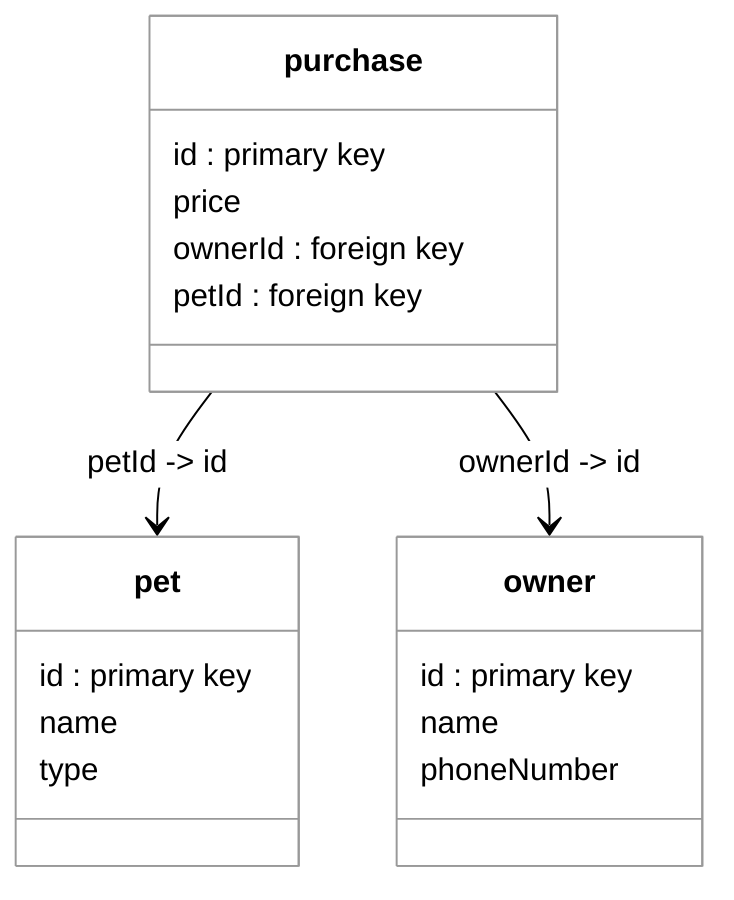

# Relational Databases - The Relational Model

🖥️ [Slides](https://docs.google.com/presentation/d/19nC7v6SDqoEeK75Mb-f6L3QhnbuP6Xfo/edit?usp=sharing&ouid=114081115660452804792&rtpof=true&sd=true)

🖥️ [Lecture Videos](#videos)

### 🔑 Key points

- How data is represented in the relational model
- How primary and foreign keys work
- How to represent one-to-one, one-to-many, and many-to-many relationships using primary and foreign keys
- What makes a good primary key
- How to model inheritance relationships in the relational model
- How to represent a data model in an Entity Relationship Diagram (ERD)


> _source: [Wikipedia](https://en.wikipedia.org/wiki/Edgar_F._Codd)_

> “At the time, Nixon was normalizing relations with China. I figured that if he could normalize relations, then so could I.”
>
> — Edgar F. Codd

---


Relational databases are commonly used to persistently store and retrieve data. You can read and write data to a relational database from your program using Structured Query Language (SQL). Your code executes SQL statements against a database using standard library classes known as the Java Database Connectivity (JDBC) API. Before diving into how to write an application that uses a database, we must first discuss how the relational model works.

At a basic level, relational data is stored in a **database**. A database contains **tables**, and a table has a number of **columns** (or attributes) that define the fields of the table. These can include things like `name`, `phone_number`, or `id`. When you insert data into a database table, it becomes a **row** (or tuple) in the table. The inserted data must have fields that match each of the table's columns.

| column1 | column2 | column3 |
| ------- | ------- | ------- |
| row1    | row1    | row1    |
| row2    | row2    | row2    |
| row3    | row3    | row3    |

Usually, each table in a relational database has a column that represents a unique ID for that record. You use this ID to identify, update, or request specific data from the table.

## Mapping Objects to Tables

It is often helpful to think about relational databases in the context of objects in your code. If you have a Java record that represents a pet and you create three objects from that definition, it might look like the following:

```java
record Pet(int id, String name, String type){}

Pet[] pets = new Pet[]{
    new Pet(93, "Fido", "dog"),
    new Pet(14, "Puddles", "cat"),
    new Pet(77, "Chip", "bird")
};
```

Using this example, you can map the Java record declaration directly to a relational database table definition. The fields in the record map to the columns of the table, and both share strong typing. Each Java `Pet` object in the array maps to a row in the database table.

**Pet table**

| id  | name    | type |
| --- | ------- | ---- |
| 93  | Fido    | dog  |
| 14  | Puddles | cat  |
| 77  | Chip    | bird |

## Table Relationships

In the relational model, a "relation" is simply a table. However, the power of the model comes from the **relationships** between these tables. Relational databases seek to promote cohesion by representing only one type of data in every table. Once you have organized cohesive data into different tables, you create relationships between them by referencing keys.

The following example shows a database named `pet-store` containing tables for `pet`, `owner`, and `purchase`. The `pet` and `owner` tables are related to each other through the `purchase` table, which tracks which owner purchased which pet.

**pet**

| id  | name    | type |
| --- | ------- | ---- |
| 93  | Fido    | dog  |
| 14  | Puddles | cat  |
| 77  | Chip    | bird |

**owner**

| id  | name | phoneNumber |
| --- | ---- | ----------- |
| 81  | Juan | 6196663333  |
| 82  | Bud  | 8018889999  |

**purchase**

| id  | ownerId | petId |
| --- | ------- | ----- |
| 51  | 81      | 93    |
| 52  | 82      | 77    |

With data stored in relational tables, you can use the ID fields to cross-reference, or **join**, the data together. 

- **Primary Key**: A table column that represents the unique identifier for a row.
- **Foreign Key**: A column in one table that contains the primary key of a different table, creating a link between them.




A good primary key has the following characteristics:

- **Unique**: The key must be unique within the table.
- **Stable**: The key should not change over time. For example, a person's name is considered unstable because it could change.
- **Simple**: While multiple fields can be combined to create a "composite key," you should attempt to keep the key as simple as possible (often a single integer) because it is referenced frequently.

## Decomposition and Normalization

The principles of good software design also apply to the relational model. You should avoid creating a single "god table" that contains all the properties for your entire application. This would lack cohesion and lead to data redundancy.

**Example of a poorly designed table:**

| ownerId | ownerName | petId | petName | petStore  | storeCity | vaccinated | purchaseDate |
| ------- | --------- | ----- | ------- | --------- | --------- | ---------- | ------------ |
| 81      | Juan      | 93    | Fido    | Pets4You  | Provo     | true       | 2026         |
| 82      | Bud       | 77    | Chip    | DoggyTown | Orem      | false      | 2027         |
| 83      | Bud       | 56    | Puddles | DoggyTown | Orem      | false      | 2027         |

Notice that the store information is repeated in multiple rows, violating the DRY (Don't Repeat Yourself) principle. Instead, you should **normalize** the data by decomposing it into multiple tables that each represent a single cohesive entity. You then use relationships to aggregate the data as needed.

## Views and Joins

You can create new **views** of relational data by specifying queries that **join** data from different tables based on matching keys.

From the pet store tables above, we could create a view that joins the owner's name with the pet's name using the IDs found in the `purchase` table. This would result in a view like this:

| ownerId | ownerName | petId | petName |
| ------- | --------- | ----- | ------- |
| 81      | Juan      | 93    | Fido    |
| 82      | Bud       | 77    | Chip    |

Data views are often created temporarily so an application can use the aggregated data. These are typically generated in memory by the database engine and discarded once the application is finished with the results.

## Modeling Inheritance

In object-oriented programming, we use inheritance (e.g., a `Dog` *is a* `Pet`). In the relational model, inheritance is usually modeled in one of two ways:
1.  **Table-per-Hierarchy**: All classes in the hierarchy are stored in a single table with a "discriminator" column to identify the type.
2.  **Table-per-Type**: Each class has its own table, and the child table's primary key also serves as a foreign key to the parent table's primary key.

These relationships, along with one-to-one, one-to-many, and many-to-many relationships, are visually represented using **Entity Relationship Diagrams (ERDs)**.

## Working with Relational Data

In practical terms, relational data is stored in a Relational Database Management System (RDBMS). For this course, we will use **MySQL**. The language used to read, write, and query this data is **Structured Query Language (SQL)**, a declarative language we will explore in future topics.

## Videos

- 🎥 [Relational Databases Overview (5:02)](https://byu.hosted.panopto.com/Panopto/Pages/Viewer.aspx?id=10667c35-dea3-4f1e-8c91-ad66013d553b&start=0) - [[transcript]](https://github.com/user-attachments/files/17737470/CS_240_Relational_Databases_Overview_Transcript.pdf)
- 🎥 [Understanding the Relational Model (13:55)](https://byu.hosted.panopto.com/Panopto/Pages/Viewer.aspx?id=3ec3f6de-a112-4e0a-a0af-ad66013f8bc7&start=0) - [[transcript]](https://github.com/user-attachments/files/17780681/CS_240_Understanding_the_Relational_Model.pdf)
- 🎥 [Modeling a Database Schema (8:42)](https://byu.hosted.panopto.com/Panopto/Pages/Viewer.aspx?id=ee130025-e1ab-4f6b-a72c-ad660143e8aa&start=0) - [[transcript]](https://github.com/user-attachments/files/17780684/CS_240_Modeling_a_Database_Schema.pdf)
- 🎥 [Modeling Inheritance Relationships (7:42)](https://byu.hosted.panopto.com/Panopto/Pages/Viewer.aspx?id=6bb9d1f1-803c-4d8f-a5ea-ad660146883e&start=0) - [[transcript]](https://github.com/user-attachments/files/17780687/CS_240_Modeling_Inheritance_Relationships.pdf)