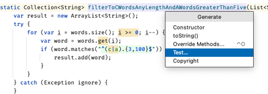
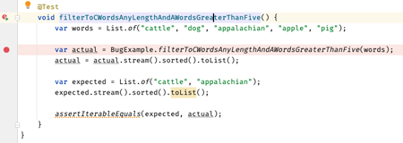
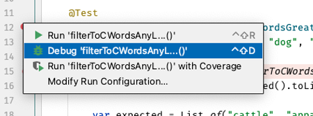
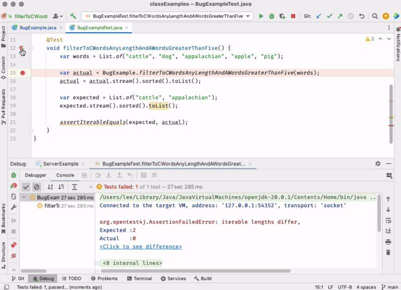
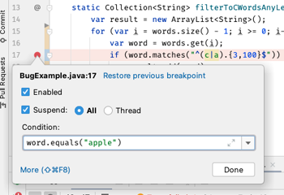
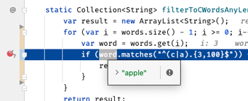
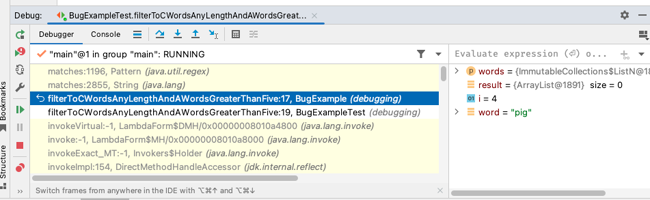
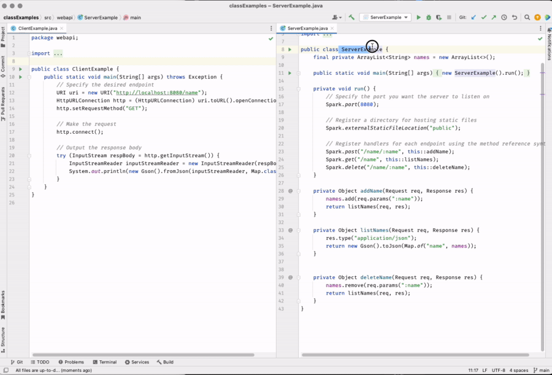
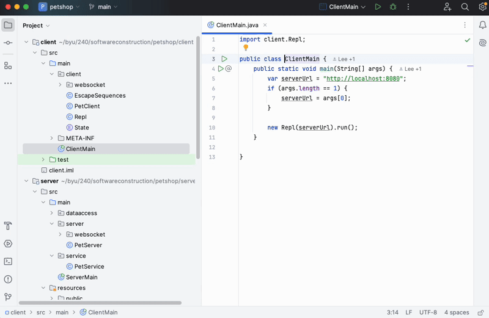

# Debugging

🖥️ [Slides](https://docs.google.com/presentation/d/14CiV7TwmAG-vEWWsQQtaP_-Hx-pqJlGR/edit?usp=sharing&ouid=114081115660452804792&rtpof=true&sd=true)

🖥️ [Lecture Videos](#videos)

### 🔑 Key points

- How to set a breakpoint
- How to step through code and into method calls
- How to set conditional breakpoints
- How to view local and instance variable values while stepping through code
- How to view the current call stack
- How to set watches

---

Debugging is one of the most important development skills you can master. If you can learn how to rapidly reproduce a problem, narrow down its cause, and implement a solution, you will dramatically increase your value as a software engineer.

Knowing what debugging tools are available and how to effectively employ them is key to your success. Common categories of debugging tools include:

1. Visual debuggers
1. Stack traces
1. Logs
1. Metrics
1. Customer reports
1. Development and staging environments
1. Unit, system, and end-to-end tests
1. Code reviews
1. Performance profilers

Treating debugging as an application of the scientific method will help you become more adept at the process:

1. **Observe:** Concisely state the problem.
2. **Hypothesize:** Isolate the problem to its simplest representation.
3. **Experiment:** Reproduce the problem with a unit test.
4. **Analyze:** Step through the tested code.
5. **Fix:** Implement a solution.
6. **Verify:** Confirm that the unit test and all other tests pass.

In this instruction, we focus on **visual debuggers**. You are encouraged to become an expert with the debugger available in your development environment. In our case, this is IntelliJ. Learn how to quickly execute the debugger using keystrokes, maximize the use of breakpoints, inspect variables and execution stacks, and isolate problems with new unit tests.

## Debugging Example

To demonstrate debugging techniques, consider a function with the following specification:

> Given a list of words, return a collection containing only:
> 1. Words of any length that start with a lowercase `c`.
> 2. Words longer than five characters that start with a lowercase `a`.

Based on that description, we write the following code and deploy it:

```java
Collection<String> filterToCWordsAnyLengthAndAWordsGreaterThanFive(List<String> words) {
    var result = new ArrayList<String>();
    try {
        for (var i = words.size(); i >= 0; i--) {
            var word = words.get(i);
            if (word.matches("^(c|a).{3,100}$")) {
                result.add(word);
            }
        }
    } catch (Exception ignore) {
        // Swallowing exceptions is a bad practice!
    }
    return result;
}
```

Sometime later, a user reports that the function doesn't return the expected result. When they pass in:

`"cattle", "dog", "appalachian", "apple", "pig", "cat"`

They expect:

`"cattle", "appalachian", "cat"`

But instead, they receive an empty list.

## Reproducing the Bug with a Test

When you or a customer finds a bug, the first step is to verify it by creating a test that reproduces the problem. IntelliJ provides **Generate Test** functionality to speed this up. Right-click on the function name and choose **Generate** > **Test...**.



This creates a stub test method:

```java
@Test
void filterToCWordsAnyLengthAndAWordsGreaterThanFive() {
}
```

We then fill in the test with the user's reported reproduction steps:

```java
@Test
void filterToCWordsAnyLengthAndAWordsGreaterThanFive() {
  var words = List.of("cattle", "dog", "appalachian", "apple", "pig", "cat");

  var actual = BugExample.filterToCWordsAnyLengthAndAWordsGreaterThanFive(words);
  actual = actual.stream().sorted().toList();

  var expected = List.of("cattle", "appalachian", "cat");
  expected = expected.stream().sorted().toList();

  assertIterableEquals(expected, actual);
}
```

Running the test confirms the bug:

```text
org.opentest4j.AssertionFailedError: iterable lengths differ,
Expected :3
Actual   :0
```

## Stepping Through Code

Sometimes the problem is obvious from the test output. Other times, you need to step through the code. Set a **breakpoint** on the line that calls the filtering function by clicking in the left margin.



With a breakpoint set, click the **Debug** icon in the left margin next to the test function. The test will run and pause at your breakpoint.



At this point, you can view variables and confirm your assumptions. Bugs often arise from incorrect assumptions about variable values.

### Pro Tip: Hotkeys

Learning hotkeys for stepping through code will greatly increase your debugging speed. If you find yourself reaching for the mouse, try to use the keystroke instead.

| Windows  | Mac   | Purpose           |
| -------- | ----- | ----------------- |
| Shift F9 | ⌃ D   | Debug             |
| F7       | F7    | Step into         |
| F8       | F8    | Step over         |
| F9       | ⌘ ⌥ R | Resume program    |
| Alt F9   | ⌥ F9  | Run to cursor     |
| Ctrl F8  | ⌘ F8  | Toggle breakpoint |

### Debugging Example: Stepping Through Code

As we step through the execution, we see that we are referencing a position beyond the length of our list. This throws an `IndexOutOfBoundsException`. However, because we incorrectly catch and ignore the exception, the error is hidden, and the method simply returns an empty list.



Our first correction is to remove the empty `catch` block that is hiding the error:

```java
Collection<String> filterToCWordsAnyLengthAndAWordsGreaterThanFive(List<String> words) {
    var result = new ArrayList<String>();
    for (var i = words.size(); i >= 0; i--) {
        var word = words.get(i);
        if (word.matches("^(c|a).{3,100}$")) {
            result.add(word);
        }
    }
    return result;
}
```

## Error Messages

Error messages and stack traces contain valuable information. Read them carefully; they often point exactly to the source of the failure. You can click links in the stack trace to jump directly to the relevant line of code.

### Debugging Example: Error Messages

Running the test again (without the `catch` block) reveals the exception:

```text
java.lang.ArrayIndexOutOfBoundsException: Index 6 out of bounds for length 6

	at java.base/java.util.ImmutableCollections$ListN.get(ImmutableCollections.java:680)
	at debugging.BugExample.filterToCWordsAnyLengthAndAWordsGreaterThanFive(BugExample.java:16)
	at debugging.BugExampleTest.filterToCWordsAnyLengthAndAWordsGreaterThanFive(BugExampleTest.java:15)
```

The `for` loop incorrectly initializes `i` with the size of the list instead of the last index (`size - 1`). We fix this:

```java
for (var i = words.size() - 1; i >= 0; i--) {
```

Running the test again shows a new failure. The test expected a `cat` but got `apple`. Since `apple` starts with `a` but is not longer than five characters, we have found a logic error in our filtering criteria.

```text
AssertionFailedError: iterable contents differ at index [1],
Expected :cat
Actual   :apple
```

## Conditional Breakpoints

In IntelliJ, you can specify conditions for a breakpoint so it only triggers when a specific state is met. To set a conditional breakpoint, right-click on an existing breakpoint.

### Debugging Example: Conditional Breakpoints

We can use a conditional breakpoint to see why `apple` is being included. Set a breakpoint on the `word.matches` line, right-click it, and set the condition:

```java
word.equals("apple")
```



Now, the debugger will only stop when `word` is "apple".



Stepping over the `matches` call shows that "apple" returns `true`. Our regular expression is wrong. Using a tool like [Regex101.com](https://regex101.com/), we realize the regex needs to allow any length for `c` words and a minimum length of 6 for `a` words (since the requirement was *greater than* five).

```java
^(c.*|a.{5,100})$
```

## Examining the Call Stack

The **call stack** is the chain of function calls that led to the current line of code. You can use the **Debugger Stack Pane** to navigate up the stack and inspect the state of variables in parent functions.

### Debugging Example: Examining the Call Stack

If we stepped into the JDK's `matches` function, we might want to look back at our own code to see the context. By clicking on the previous frame in the stack pane, we can see exactly what our variables looked like before calling `matches`.



## Executing Multiple Processes

Sometimes you need to debug a client and a server simultaneously. In IntelliJ, you can start multiple debug sessions. As a request flows from the client to the server, the server's breakpoint will hit. Once you resume the server, the client will receive the response and continue its own execution.



## Executing the Same Process Multiple Times

If you are building a multiplayer game like Chess, you may need multiple instances of the same client application running. By default, IntelliJ limits you to one instance. To change this:

1. Right-click the **Run** icon next to the `main` function.
1. Choose **Modify Run Configuration**.
1. Click the **Modify options** dropdown.
1. Select **Allow multiple instances**.
1. Save the changes.



## Enhancing Tests

As you fix bugs, you often discover edge cases. It is important to enhance your tests to ensure these cases are covered and to prevent future regressions.

### Debugging Example: Enhancing Tests

Our current regular expression limits `c` words to 100 characters (`{3,100}`). The requirement stated *any* length for `c` words. We should update the test to include a very long word:

```java
@Test
void filterToCWordsAnyLengthAndAWordsGreaterThanFive() {
    var big = "c" + "a".repeat(1005);

    var words = List.of("cattle", "dog", "appalachian", "apple", "pig", big);
    var actual = BugExample.filterToCWordsAnyLengthAndAWordsGreaterThanFive(words);
    actual = actual.stream().sorted().toList();

    var expected = List.of("cattle", "appalachian", big);
    expected = expected.stream().sorted().toList();

    assertIterableEquals(expected, actual);
}
```

The test fails because our regex capped the length. We fix it by removing the upper limit:

```java
"^(c.*|a.{5,})$"
```

Now the test passes, and our confidence in the code is restored.

## ☑ Exercise


```masteryls
{"id":"e98f9beb-df82-41d3-96b9-b0b82c53c670", "title":"Essay", "type":"essay", "gradingCriteria":"- Addresses the prompt directly\n- Uses at least one concrete example\n- Demonstrates accurate understanding of key concepts" }
Describe the common debugging process used by a successful software engineer.
```

## Videos

- 🎥 [Introduction (6:07)](https://byu.hosted.panopto.com/Panopto/Pages/Viewer.aspx?id=f2279dc0-fd71-46af-ab7a-ad6d01516f20&start=0) - [[transcript]](https://github.com/user-attachments/files/17780854/CS_240_Java_Debugging_Introduction.pdf)
- 🎥 [Debugging in IntelliJ (10:17)](https://byu.hosted.panopto.com/Panopto/Pages/Viewer.aspx?id=6ff3df28-71f9-435e-915e-ad6d01535f13&start=0) - [[transcript]](https://github.com/user-attachments/files/17780859/CS_240_Debugging_in_InteliJ.pdf)
- 🎥 [Advanced Breakpoint Settings (11:32)](https://byu.hosted.panopto.com/Panopto/Pages/Viewer.aspx?id=a0c39358-184c-4290-ace7-b1aa010a61f2&start=0) - [[transcript]](https://github.com/user-attachments/files/17737928/CS_240_Advanced_Breakpoint_Settings_Transcript.pdf)