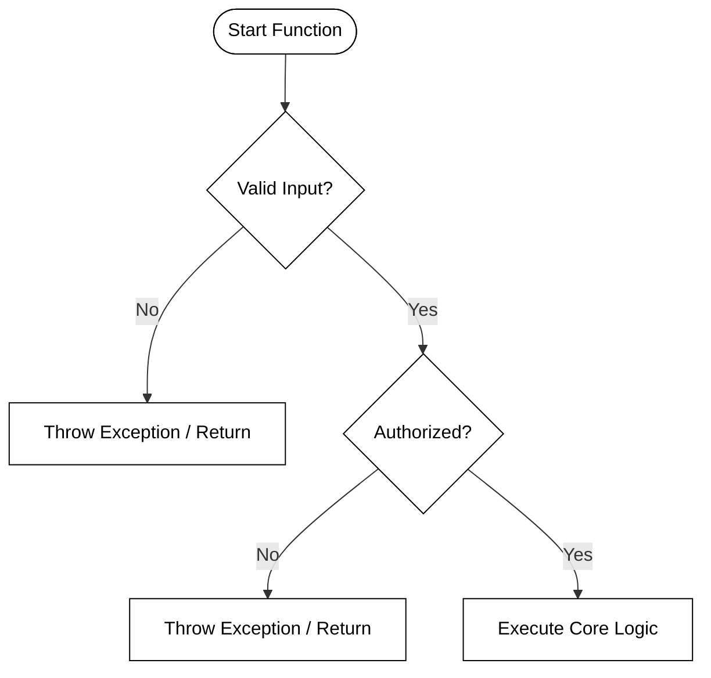

# Defensive Programming

🖥️ [Slides](https://docs.google.com/presentation/d/1VOvCn5605TAaCC4DBZBH-B4YSDZij0UF/edit?usp=sharing&ouid=114081115660452804792&rtpof=true&sd=true)

📖 **Required Reading**: Core Java for the Impatient

- Chapter 5: Exceptions, Assertions, and Logging. _Focus on Section 2: Assertions (2.1 and 2.2)_

🖥️ [Lecture Videos](#videos)

### 🔑 Key Points

- How and when to write assertions.
- How and when to use parameter checking (exceptions) instead of assertions.
- Java introduced the `assert` keyword in version 1.4.

---

## Protecting Public Access

It is critical to defend your application against any input provided by a user or an external system. Failure to do so can allow a user to breach your application's security or cause the application to act erratically or fail completely.

There are two primary actions used to ensure that user inputs are safe:

- **Validation**: Verifying that the input meets the specific requirements of the request. This includes checking for out-of-bounds parameters (such as a negative value where only positive values are allowed) or text that exceeds the expected length.
- **Sanitization**: Modifying user input to make it fit the expected format. Sanitization assumes a request might be benignly malformed and seeks to provide a valid response. Examples include type casting, defaulting to a defined value, or stripping out potentially harmful characters (like HTML tags or SQL fragments).

Be careful not to make your application so flexible that you inadvertently enlarge its attack surface. Overly permissive validation can lead to denial-of-service (DoS) attacks, while weak sanitization can leave you vulnerable to injection attacks.

Protecting public access typically involves "failing fast"—executing tests that immediately reject a user's request by throwing an exception or returning an error code. For example, if you have a public HTTP endpoint that requires an alphabetic input of a specific length, you should validate that requirement and return a `400 Bad Request` error if it is violated.

```java
public class DefensiveExample {
    public static void main(String[] args) {
        var javalin = Javalin.create()
            .get("/name/{name}", DefensiveExample::getName)
            .start(8080);
    }

    private static void getName(Context ctx) {
        ctx.contentType("application/json");
        var name = ctx.pathParam("name");

        // Public Access Validation: Reject bad input from the user
        if (name == null || !name.matches("(\\w|\\d){3,64}")) {
            ctx.status(400);
            ctx.result(new Gson().toJson(Map.of("error", "invalid parameter")));
            return;
        }

        name = normalize(name);
        ctx.result(new Gson().toJson(Map.of("result", name)));
    }

    private static String normalize(String name) {
        // Internal Assumption: This should only be called with validated data
        assert name != null && !name.isEmpty() : "Name should not be null or empty here";
        return name.toUpperCase();
    }
}
```

## Protecting Internal Assumptions

While exceptions are used for public-facing validation, you can protect internal objects and methods from unexpected states by using the Java `assert` keyword. Assertions verify assumptions you make about your own code's logic.

```java
private String normalize(String name) {
    // If the logic elsewhere fails and passes a numeric string, 
    // this assertion will catch the bug during development.
    assert !name.matches("\\d+") : "Numeric name provided to internal method";

    return name.toUpperCase();
}
```

By default, Java assertions are ignored by the runtime. You must explicitly enable them by providing the `-ea` (enable assertions) switch when executing the `java` command.

This design allows you to use assertions extensively during testing and development to catch logic errors, then disable them in production to avoid the performance overhead. Because assertions can be disabled, **never** use them to validate arguments for public methods; use exceptions (like `IllegalArgumentException`) for that purpose instead.

## Full Example

The following example demonstrates the combined use of exceptions (for public input) and assertions (for internal logic).

```java
public class DefensiveExample {
    public static void main(String[] args) {
        var javalin = Javalin.create()
            .get("/name/{name}", DefensiveExample::getName)
            .start(8080);
    }

    private static void getName(Context ctx) {
        ctx.contentType("application/json");
        var name = ctx.pathParam("name");

        // 1. Validation: Protect against external users
        if (!name.matches("(\\w|\\d){3,64}")) {
            ctx.status(400);
            ctx.result(new Gson().toJson(Map.of("error", "invalid parameter")));
            return;
        }

        name = normalize(name);

        ctx.result(new Gson().toJson(Map.of("result", name)));
    }

    private static String normalize(String name) {
        // 2. Assertion: Protect against internal programmer error
        // This confirms our assumption that 'name' is not purely numeric
        assert !name.matches("\\d+") : "Numeric name reached normalize()";

        return name.toUpperCase();
    }
}
```

## The Power of Guard Clauses

A common defensive programming pattern is the **guard clause**. A guard clause is a snippet of code at the beginning of a function that validates preconditions and immediately exits—either by returning a value or throwing an exception—if those conditions are not met.

By handling edge cases and invalid data upfront, you protect the "Happy Path" (the core logic of your function) from being buried inside deeply nested `if-else` statements. This approach adheres to the **Fail-Fast principle**, which suggests that a program should report errors as early as possible to prevent side effects and simplify debugging.

### Simplifying Logic Flow

Without guard clauses, developers often fall into the "Arrow Anti-pattern," where code moves further to the right of the screen due to nested validation logic. Guard clauses flatten this structure, making the code more readable and maintainable.



The use of guard clauses provides several distinct advantages:
1.  **Reduced Cognitive Load:** You don't have to keep track of multiple `else` branches or remember which `if` block you are currently inside.
2.  **Clear Intent:** The preconditions are explicitly stated at the top of the method, acting as a form of executable documentation.
3.  **Linear Execution:** The main logic of the function stays at the lowest level of indentation, making it the focal point of the method.

### Java Implementation: Before and After

Consider a method that processes a bank withdrawal. Without guard clauses, the logic becomes "nested" and harder to follow.

**The Nested Approach (Harder to Read):**
```java
public void processWithdrawal(Account account, double amount) {
    if (account != null) {
        if (amount > 0) {
            if (account.getBalance() >= amount) {
                account.setBalance(account.getBalance() - amount);
                System.out.println("Withdrawal successful.");
            } else {
                throw new IllegalArgumentException("Insufficient funds.");
            }
        } else {
            throw new IllegalArgumentException("Amount must be positive.");
        }
    }
}
```

**The Guard Clause Approach (Clean and Defensive):**
```java
public void processWithdrawal(Account account, double amount) {
    // Guard Clauses: Handle edge cases immediately
    if (account == null) throw new IllegalArgumentException("Account cannot be null.");
    if (amount <= 0) throw new IllegalArgumentException("Negative withdrawal amount.");
    if (account.getBalance() < amount) throw new IllegalStateException("Insufficient funds.");

    // Happy Path: Core logic is now flat and clear
    account.setBalance(account.getBalance() - amount);
    System.out.println("Withdrawal successful.");
}
```

### Best Practices for Guard Clauses
*   **Be Specific:** Throw the most relevant exception (e.g., `NullPointerException`, `IllegalArgumentException`, or `IllegalStateException`).
*   **Order Matters:** Check for nulls first, followed by range validations, and finally business state logic.
*   **Keep them simple:** A guard clause should ideally be a single `if` statement followed by a `return` or `throw`.


## ☑ Exercise


```masteryls
{"id":"75dda285-9329-46b2-8c9e-3cba4efedb23","title":"Perimeter Input Validation","type":"multiple-choice"}
When implementing defensive programming at a system's perimeter, which approach best describes how incoming data should be handled before it reaches the internal business logic?

- [ ] Assume data originating from internal microservices is safe and only apply strict validation to public-facing user inputs.
- [ ] Use a "deny-list" approach to filter out known malicious characters or patterns while allowing all other data to pass through.
- [ ] Rely on global exception handlers to catch errors that occur when the internal logic attempts to process malformed data.
- [x] Enforce a strict "allow-list" policy, verifying that all data conforms exactly to expected types, ranges, and formats.
```

```masteryls
{"id":"068fd0bf-baa3-4d1f-b12e-859d794716e2","title":"Identifying Guard Clause Benefits","type":"multiple-choice"}
What is the primary architectural benefit of using guard clauses at the beginning of a Java method?

- [ ] It improves the execution speed of the happy path by bypassing the compiler's type checking.
- [x] It flattens the code structure by handling edge cases early, reducing nested if-else blocks.
- [ ] It allows the method to return multiple data types depending on the input provided.
- [ ] It automatically logs all input parameters to the system console for debugging purposes.
```

```masteryls
{"id":"fb9280b0-a467-4a9c-be3a-90b4ff2aa50b","title":"Protecting Your Neighbor","type":"essay"}
How does writing defensive code that anticipates misuse and failure demonstrate love and care for your users, reflecting the second great commandment and the BYU aim of character building?
```


## Videos

- 🎥 [Assertions (11:48)](https://byu.hosted.panopto.com/Panopto/Pages/Viewer.aspx?id=934d5be6-15b3-4213-a25b-ad6d01430c86&start=0) - [[transcript]](https://github.com/user-attachments/files/17780884/CS_240_Defensive_Programming_Assertions.pdf)
- 🎥 [Parameter Checking (2:27)](https://byu.hosted.panopto.com/Panopto/Pages/Viewer.aspx?id=4d06fa38-cf64-4dc2-ace5-ad6d0146799a&start=0) - [[transcript]](https://github.com/user-attachments/files/17780887/CS_240_Defensive_Programming_Parameter_Checking.pdf)