# Design Principles

🖥️ [Slides](https://docs.google.com/presentation/d/1f1X706vwJKqBRPhlB-yBF7-059--6DoF/edit#slide=id.p1)

🖥️ [Lecture Videos](#videos)

📖 **Required Reading**: None

### 🔑 Key points

- The goals of software design
- Design is an iterative process
- Abstraction
- Decomposition
- Simplicity
- Good algorithm and data structure selection
- Encapsulation - Information hiding
- DRY - Avoiding code duplication

---

Software design is the process of defining, architecting, and creating an application. The primary goal of any application is to satisfy a customer's requirements. With a firm focus on the customer, you then apply the principles of good software design to identify the important actors, objects, and interactions necessary to represent the application's domain. This naturally leads to a code architecture that is easy to understand, debug, enhance, and maintain as requirements change.

As you seek to design software you should focus on the following high level goals:

1. It does what the customer wants it to do
1. It is easy to understand, debug, and maintain
1. It is extensible to requirement changes

Using these goals we can discuss the methods that commonly lead to successful software designs.

## Domain Driven Design

In order to build an application that a customer wants you need to understand the domain that the customer lives in. This helps you to properly define the application in terms that the customer understands. This approach is often referred to as [Domain Driven Design](https://en.wikipedia.org/wiki/Domain-driven_design).

As software engineers, it is tempting to focus on computer science algorithms and data structures instead of the objects and actors that a user is familiar with. With Domain Driven Design you reverse the thought process and instead think of the following:

1. Who are the **actors** in the system?
1. What **tasks** do the actors want to accomplish?
1. What are the **objects** that the actors use?
1. What are the **interactions** between actors and objects that are necessary to complete the tasks?

Once you have the actors, tasks, objects, and interactions defined you can then think about the data structures, devices, and protocols that will best support the domain. Basically you think about retail stores, employees, SKUs, and credit cards before you worry about hashmaps, protocols, tables, and networks.

Be careful to consider all of your users, not just your target customers. Oftentimes internal corporate, or governmental, customers are just as important. That means you need to consider security, regulatory restrictions, data privacy, administration, reporting, and metrics as primary pieces of the domain design.

## Persona Role Play

Sometimes it is helpful to assign personas to your primary actors and have a role play conversation with them. Creating a persona that gives a name and backstory to an actor allows you to walk through a story with them to validate the assumptions of your design. It changes the conversation from a shallow statement like:

> "A user buys a car"

to something closer to the reality of the user's domain:

> "Perry is a student from rural Utah who is short on cash. He needs to buy a car so that he can get to his part time job. He is willing to spend a lot of time finding and negotiating the best deal possible. However, he finds interacting with sales people intimidating and would prefer an automated process. He is going to need to finance his car with a cosigner on the loan."

Being thoughtful about the background of your customer will make it easier to avoid incorrect assumptions in your design. The more real the persona becomes, the better the result will be. In the end, intentional introspection of this type will save you time because your earlier design iterations will be closer to what the customer wants.

## Top Level Design

Before you dig into the details of your design you want to create a couple of diagrams that capture the vision of what you are building. This is not meant to be an exhausting diagram, but it should make it so your team has a common vision of the most important pieces of the application architecture. It should represent both the high level UI pieces and the major components of the underlying application.

The following is an example of a top level design diagram for the Chess application.

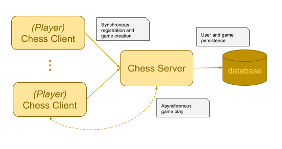

## Iterative Design

It is important to realize that the complexity of software increases exponentially with the size of the application and the team working on it. One method for dealing with increasing complexity is to execute a series of simplified iterations. Each iteration becomes a deliverable by itself in a journey towards a larger goal. With the understanding that you are going to take an iterative approach to your design you then break each iteration into three distinct steps. First consider the design for some foundational piece of the application. For example, start with a nonfunctional client that displays hardcoded placeholders. Next, you build a minimal implementation that satisfies the design. Finally, you verify that your iteration satisfies the design by examining the test coverage, and soliciting user feedback that the implementation of the design is correct. You then repeat the process.

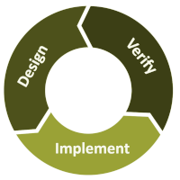

Using an iterative design is important because it will break the application down into manageable pieces, incrementally introduce complexity, and allow you to correct bad design decisions early in the process.

The size of your iteration will depend on the size of your team and the complexity of the project, but work that can be completed in one to two weeks is a common measure. Iterating for more than four weeks will often lead to wasted or inefficient efforts.

## Abstraction

In order to understand the world we use abstraction. When we see a person, we don't see organs and DNA. When we think of a university, we don't think about databases of scholastic records, cleaning crews, pipes, and department budgets. Likewise, when we think of a software application, we don't consider all of the layers of complexity that make the application work. We abstract away many layers of detail and instead focus on the pieces necessary to complete our current task. Without abstracting away things like the hardware, operating system, application interface, threads, user interface, rendering engine, network communication, persistent storage, and memory we would never be able to keep even the simplest of programs in our heads.

When we create abstractions in our applications we begin by defining abstractions that represent real world objects. We call these the objects of our application domain. For example, a bank, customer, account, and loan. We then add an additional level of abstraction to represent the data structures and algorithms necessary to support the domain objects. For example, database schemas, network protocols, hash tables, and events.

### Interfaces and Objects

In object oriented programming `Interfaces` and `Objects` are used to provide the bulk of abstraction.

**Objects** abstract details by differentiating between private and public methods. Public methods can be accessed by other objects. Private methods can only be accessed by the object that defines them.

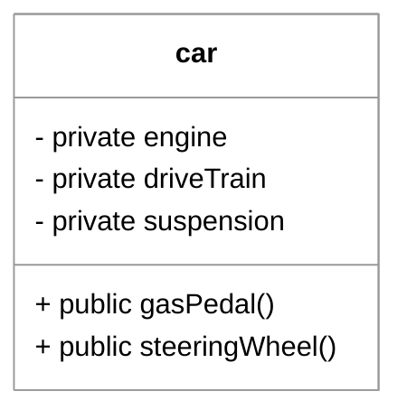

An **interface** is a public description of functionality that provides no implementation. Think of it as a description without the ability to actually do anything. The interface description hides how the actual work is done. To use an interface, an object must first implement the interfaces definition. However, you can refer to the implementing object by any interface that the object implements. This hides not only how the functionality is implement, but who is implementing it.

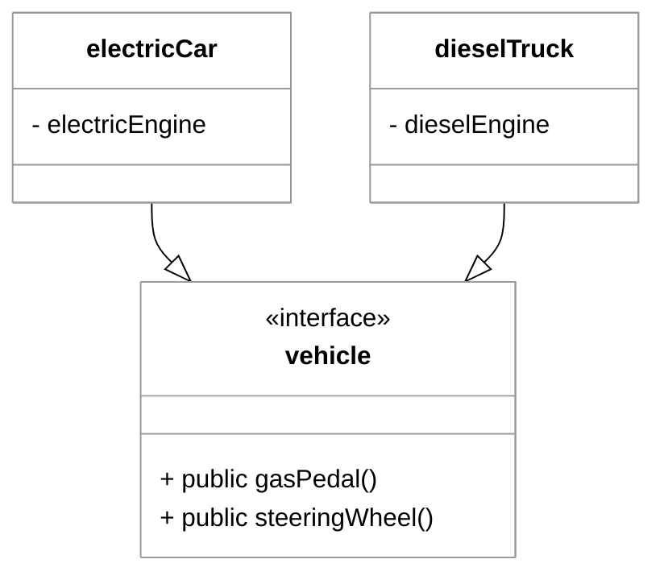

### Things to abstract

Whenever you program you should try and abstract things into the following parts.

1. What are the input interfaces
1. What are the output interfaces
1. What interface does the my abstraction need to provide
1. What class will implement the interface

Note that sometimes it is not necessary to create an interface when a single class representation can simply expose public methods and abstract away the details. Interfaces are useful when there are multiple different algorithms that can be used to satisfy the interface, or when there are classes that implement multiple interfaces.


### Benefits of abstraction

Some of the benefits of abstraction include:

1. **Comprehension** - Less details makes it easier to understand how the objects interact and form a complete mental model.
1. **Extensibility** - When we are not aggressive with exposing details, we can expose those details later, or we can expose new operations that might have conflicted with previously exposed operations that were unnecessary at the time.
1. **Evolution** - Hiding how the object gets things done means that you can change the implementation without changing anything that depends on the object.
1. **Security** - Anything that is hidden by an object is less likely to be subject to attack through the object's interface.

One common mistake with abstraction is to think that it only applies to the public methods that you include in a class. You can also provide data hiding by implementing interfaces that restrict the view of what an object can do to a small set of methods. For example, you might have a class that represents a person. In order to provide abstraction of the class, the person might represent an `Object`, `LivingEntity` and `Animal` interface. By exposing different aspects of the person, the consumer of the object only needs to know about the aspect that is of interest to them. This provides all of the benefits of comprehension, extensibility, evolution, and security.


The important thing to remember about abstraction is that it **exposes** objects only in the way that it needs to be used in a given context. This makes the current system easier to understand and allows for enhancement in the future.

### Program to an Interface, Not an Implementation

By defining variables and parameters using interface types or abstract classes rather than concrete implementations, the code becomes decoupled from specific classes. This allows for easier testing (via mocking) and the ability to swap implementations without modifying the consuming code.

## Encapsulation

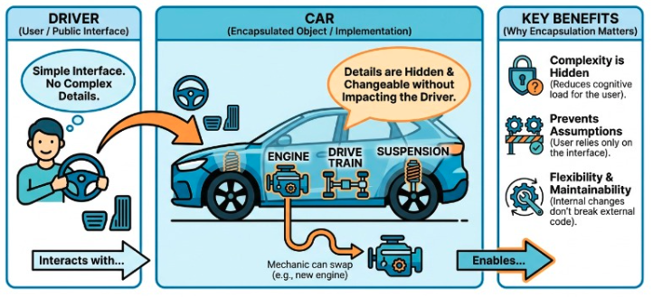

Encapsulation is a form of abstraction that takes an object that provides some functionality and encapsulates, or hides it, in another object. For example, a car encapsulates an engine, drive train, and suspension. The driver of the car does not need to know any of those details because the driver never interfaces with those components. By not allowing the driver to make assumptions about how she will drive based upon what is under the hood, a mechanic can change out the engine without impacting the driver.

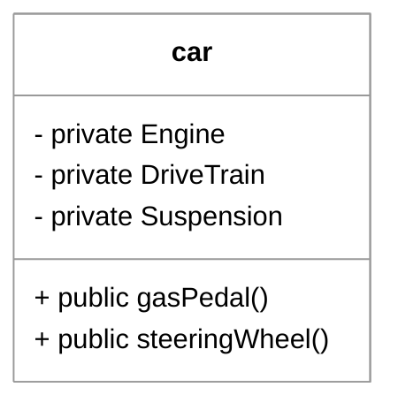

However, the driver does need to be able to accelerate the car by pressing on the gas pedal which interfaces with the engine and drive train, but the car only exposes the gas pedal, not the engine or other encapsulated objects.

You could even consider a higher level of encapsulation that only address how the car is used and not the details of how to drive it.


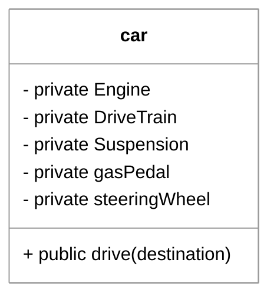

The important thing to remember about encapsulation is that it **hides** all implementation details of domain and system objects until those details are required. Think of everything on a purely "need to know" basis. This makes the current system easier to understand and allows for enhancement in the future.

## Inheritance

Inheritance is a form of abstraction that allows a new class (the subclass) to acquire the properties and behaviors (fields and methods) of an existing class (the superclass). This establishes an **"is-a" relationship**, where the subclass is a specialized version of the parent class.

By using inheritance, developers can achieve:
1.  **Code Reuse**: Common functionality is defined once in a superclass and automatically available to all subclasses, reducing redundancy.
2.  **Polymorphism**: Subclasses can be treated as instances of their superclass. This allows a single method to operate on different types of objects as long as they share a common ancestor.
3.  **Centralized Maintenance**: Changes made to a superclass's logic automatically propagate to all subclasses, making it easier to update shared behavior.

For example, a `Car` could inherit from a `WheeledVehicle` class that handles the logic for wheels and suspension. The `WheeledVehicle` could further inherit from a `Vehicle` class that provides general attributes like a passenger capacity or a serial number.

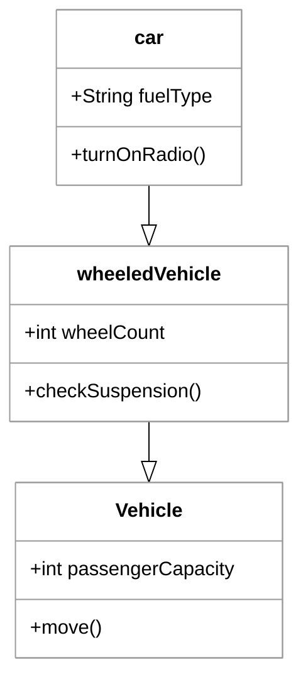

## Prefer Composition Over Inheritance

When you are creating your classes you need to carefully consider the different meanings and implications of using inheritance of a parent class instead of composition that is exposed by the implementation of an interface.

In Java inheritance is accomplished with the `extends` key word. Composition is accomplished with the `implements` key word.

 By favoring composition you can create composable objects that have the benefits of multiple inheritance without all of the complexity that multiple inheritance incurs. Encapsulated objects can demonstrate polymorphic behavior by exposing interfaces that are implemented by the contained objects. As long as interfaces are used to access the composition, the containing class can replace the encapsulated objects without impacting any users of the objects. In short, when combined with interfaces, composition can provide:

1. `has-a` and `is-a` relationships
1. Benefits of multiple inheritance without the complexity
1. Decreased coupling
1. Better hiding of details
1. Increased interface segregation

This suggests that in many cases componsition should be preferred over inheritance.

## Decomposition

The basic idea of decomposition is to create abstractions that represent layers of generalization and specialization. Each layer has a specific task to do and it accomplishes it by using the layers beneath. The idea is that you start at the top with a very general representation. For example, a chess game. You then decompose, or factor out, each layer of the higher level into increasingly specialized pieces. For example, a game is made up of participants, pieces, and a board. This process continues until the smallest necessary level of decomposition is completed. Continuing our example, this could include decomposing participants into players and observers, pieces into piece types, and a board into squares.

The advantage of decomposition is that you only need to think about the details of the layer when you are actually working on it. This includes defining its interfaces, implementing the details, and writing tests for that layer. For example, when defining the `Participant` layer, you only need to think about how a participant interacts with the `Game` and is represented by a `Player` or `Observer`. At the player level, you don't need to worry about what a `Board` is comprised of, or what the rules for moving a `King` are.

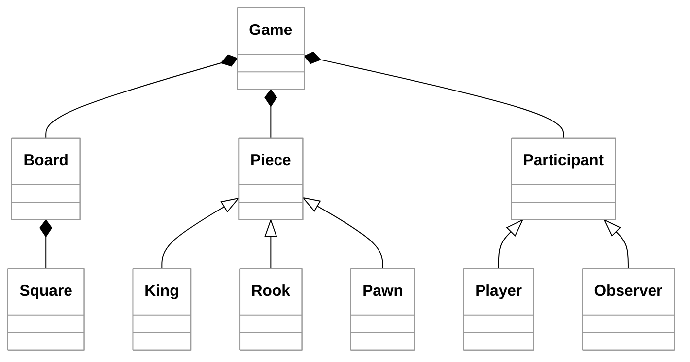

Programming languages themselves utilize decomposition to represent different parts of a program. When using Java we use the following decompositions:

| Decomposition | Purpose                                                          |
| ------------- | ---------------------------------------------------------------- |
| Application   | The top level that we hand to the operating system for execution |
| Jar           | A zip file containing packages of classes                        |
| Package       | A directory of classes                                           |
| Class         | A domain or system object                                        |
| Method        | An action of an object                                           |
| Expression    | Logic of a method                                                |

Using decomposition at the program level helps you so that you don't have to keep the whole code base on your screen at the same time. You just need to open the files that represent the current task.
## High Cohesion and Low Coupling

Effective software design seeks to maximize **cohesion** within a component and minimize **coupling** between components.

High cohesion and low coupling together create **modularity**. When a system is modular, a change or bug in one part of the code has a minimal "ripple effect" on the rest of the application. This makes the system significantly easier to test, debug, and evolve as requirements change.

### Cohesion
High cohesion means that an object only represents highly related data and functionality. You don't include tangentially related methods or fields in an object. Instead, you create a cohesive object that executes in concert with other related objects.

*   **Example of High Cohesion:** A `Student` class that only manages a student's name, ID, and GPA. Every method in the class is dedicated to student-specific data.
*   **Example of Low Cohesion:** A `Student` class that also contains methods for connecting to the university database, formatting PDF transcripts, and sending SMS alerts. This "God Object" is difficult to maintain because it has too many unrelated responsibilities.

### Coupling
Low coupling means that objects do not strongly rely on each other. High coupling occurs when an object cannot be used without understanding the specific implementation details of another object, or when two objects require each other to operate. Generally, low coupling means that you are using interfaces appropriately and that objects do not have bidirectional bindings.

*   **Example of Low Coupling:** A `PaymentService` that interacts with a `PaymentProcessor` interface. It doesn't care if the actual implementation uses Stripe, PayPal, or a mock object for testing.
*   **Example of High Coupling:** A `PaymentService` that directly instantiates a `StripeAPI` class and accesses its internal configuration fields. If you ever want to switch to a different provider, you have to rewrite the `PaymentService` code.

## Simplicity

Simplicity is a vital characteristic of effective good design. One form of simplicity is restricting the system to the smallest necessary number of objects. This applies to the number of interfaces, the depth of inheritance, and the operations an object exposes.

However, you can simplify too far. Avoid creating thousands of classes that each contain only one line of code, or a single "God Object" that tries to represent everything. Aim for a straightforward model that stays as close to the real-world domain as possible.

### Problem: Too many classes (Over-engineered)

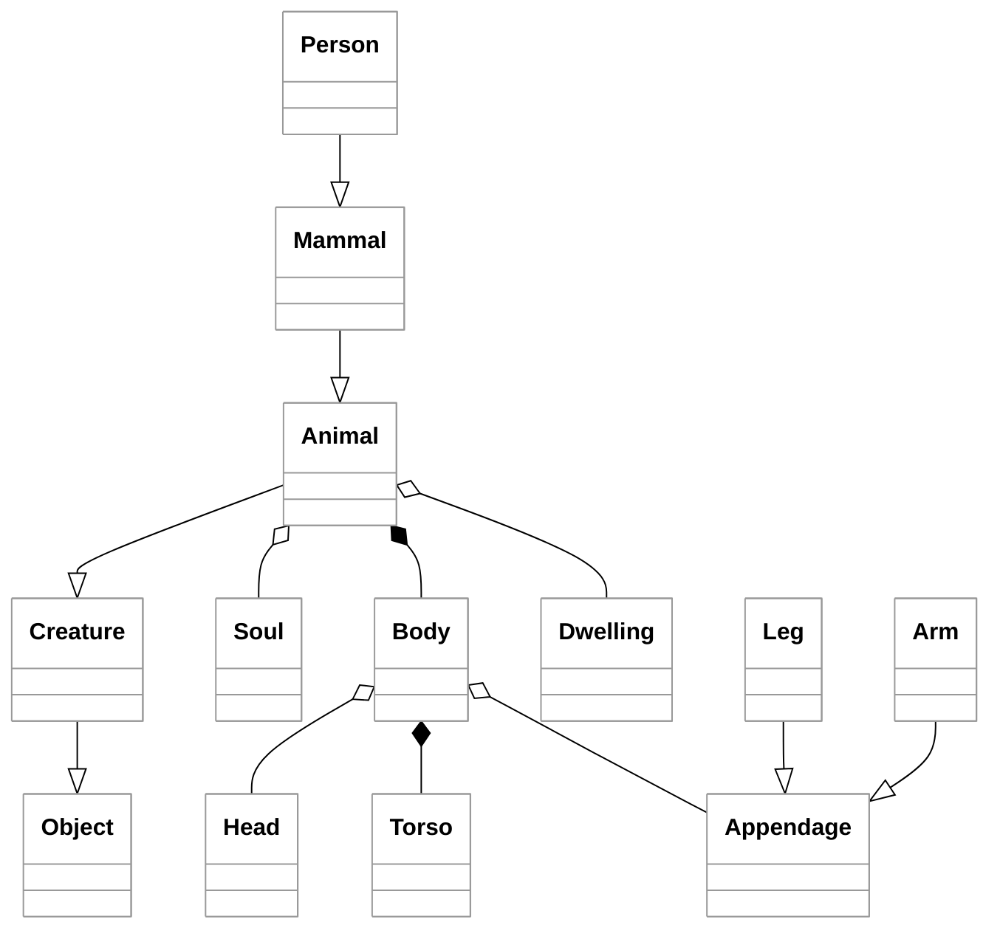

This design suffers from **speculative generality**. By creating deep inheritance hierarchies and over-decomposing objects (like splitting a `Body` into a `Head`, `Torso`, and `Appendage`), the system becomes brittle and difficult to navigate. Each additional layer adds cognitive load and makes the code harder to maintain, as changes to a base class like `Creature` ripple through every subclass. Unless the application specifically requires these fine-grained distinctions, this level of abstraction creates unnecessary complexity that obscures the actual domain logic.

### Problem: Not enough classes (Anemic/Generic)

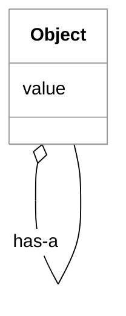

The "Not enough classes" design is problematic because it lacks semantic meaning and specific behavior. By reducing every concept to a generic `Object` with a recursive relationship, you lose the benefits of type safety and domain modeling. Instead of a `Person` who `eats` a `Fruit`, you have an anonymous `Object` interacting with another anonymous `Object`. This forces logic that should be encapsulated within classes out into the rest of the application, making the code significantly harder to maintain and debug.

### Dealing with complexity

When complexity cannot be avoided then make it more manageable by using **decomposition** to break the complexity into simpler parts,**encapulation** to restrict access internal workings, or **abstraction** to simplify the representation in the system. Always remember that your overriding goal should always be to trend to a simpler solution and not to manage unnecessary complexity.

### Simplicity Quotes

Simplicity is such an important principle that it is easy to find quotes from every thought leader on the subject.

> Controlling complexity is the essence of computer programming.
>
> — Brian Kernighan

> Perfection is achieved not when there is nothing more to add, but when there is nothing left to take away.
>
> — Antoine de Saint-Exupéry

> Any fool can write code that a computer can understand. Good programmers write code that humans can understand.
>
> — Martin Fowler

## Immutability

Objects that do not change after they are constructed are referred to as immutable. In order to understand that value of immutability, consider the `String` class. If `String` was not immutable then you would never be sure you still had the same string value after a sub method was called. The following example demonstrates an unintentional side effect of calling an imaginary operation named `String.setText`.

```java

void printList(){
    String prefix = "- "
    var items = list.of("a", "b", "c");
    for (var item : items) {
        printWithPrefix(prefix, item);
    }
}

void printWithPrefix(String prefix, String text) {
    prefix.setText(prefix + text);
    System.out.println(prefix);
}

// Output:
// - a
// - a- b
// - a- b- c
```

In reality, because `String` is immutable, you never have to worry about its value being changed and you can safely pass it to any function.

Immutability also guarantees thread safe code because it eliminates the possibility that one thread can be modifying an object at the same time a different thread is reading it.

## Avoiding Code Duplication

If your code contains multiple copies of the same code then it is violating the `Do not repeat yourself`, or DRY, principle. Code duplication creates maintenance problems when you want to alter the code, increase the impact of errors, and makes it more difficult to correct the problems. It also makes the code unnecessarily complex because the reader has to read the same blocks over and over again to make sure they don't contain subtle variations.

You can reduce duplicated code by:

1. Using inheritance and encapsulation to represent a single version of the functionality.
1. Using utility methods for common operations.
1. Using generics to represent objects that only differ by type.

## The Law of Demeter (Principle of Least Knowledge)

> "Don't talk to strangers; only talk to your immediate friends"

The Law of Demeter (LoD) states that an object should have limited knowledge about the internal structure of other objects. Specifically, a method of an object should only invoke the methods of:

1. The object itself.
2. Its parameters.
3. Any objects it creates or instantiates.
4. Its direct component objects (fields).

**Goal:** Minimize coupling between distant classes. By avoiding "chaining" calls, you prevent a class from becoming dependent on the internal navigation path of another object.

### Why It Matters

LoD promotes **loose coupling** and **encapsulation**. When a class knows too much about the internal "guts" of its neighbors, the system becomes brittle. A change to a low-level object can cause a ripple effect, breaking unrelated classes that were reaching through several layers to access data.

### Example of a Violation

Imagine a `Store` class processing a purchase:

```java
// VIOLATION
// The store reaches through the customer, into their wallet, to find a card.
customer.getWallet().getCreditCard().charge(amount);
```

**Why this is problematic:**

1.  **Tight Coupling:** The `Store` is now dependent on the internal structure of both the `Customer` and the `Wallet`.
2.  **Fragility:** If you update the `Customer` class to use a mobile `PaymentApp` instead of a physical `Wallet`, the `Store` code breaks, even though the store's primary concern (getting paid) hasn't changed.
3.  **Better Design:** The store should simply call `customer.pay(amount)`. The `Customer` object then decides internally whether to use a wallet, a card, or a phone app, keeping those details hidden from the `Store`.


## ☑ Exercise


```masteryls
{"id":"24db3b5d-61c5-4488-a9f8-9116634d7b5a","title":"Coupling vs. Cohesion","type":"multiple-choice"}
In software architecture, the design goal is typically to achieve **high cohesion** and **low coupling**. Which of the following scenarios best describes a system that successfully applies these principles?

- [ ] A system where a single "God Object" manages all application logic to ensure that no external dependencies are required between different files.
- [ ] A system where modules are highly interdependent to ensure rapid data transfer, but each module contains logic for several unrelated business features.
- [x] A system where each module is responsible for a single, well-defined task and interacts with other modules through stable, minimal interfaces.
- [ ] A system where code is split into many small modules to reduce complexity, even if those modules must frequently access and modify each other's internal private state.
```

```masteryls
{"id":"08e88ca6-e6d9-467f-ae53-5502a601329d","title":"The Role of Decomposition","type":"multiple-choice"}
In the context of software design principles, which statement best characterizes the primary objective of **decomposition**?

- [ ] The process of hiding the internal implementation details of a module to prevent external dependencies from accessing private data.
- [x] Breaking a complex system into smaller, more manageable parts that can be developed, tested, and maintained independently.
- [ ] Merging several small, related functions into a single "God object" to reduce the total number of files and classes within a project.
- [ ] The systematic rewriting of existing code to improve its internal structure and performance without changing its external behavior.
```

```masteryls
{"id":"32035b75-8e43-4ac3-9c02-d63e7517b65c","title":"Distinguishing Abstraction from Encapsulation","type":"multiple-choice"}
In object-oriented design, while abstraction and encapsulation are closely related, they serve distinct purposes. Which statement best describes the primary difference between these two principles?

- [ ] Abstraction is a mechanism for hiding the internal state of an object using access modifiers, while encapsulation is the process of defining a contract through interfaces.
- [ ] Abstraction focuses on the "how" an object performs its internal logic, while encapsulation focuses on the "what" the object provides to the rest of the system.
- [x] Abstraction focuses on hiding complexity by providing a simplified interface (the "what"), while encapsulation focuses on hiding implementation details and protecting data from outside interference (the "how").
- [ ] Abstraction is used to achieve code reuse through inheritance, whereas encapsulation is used to achieve polymorphism through method overriding.
```


## Videos

- 🎥 [Design Principles - Introduction (2:27)](https://byu.hosted.panopto.com/Panopto/Pages/Viewer.aspx?id=3e09338f-77ca-4465-bebc-b17e014a8118) - [[transcript]](https://github.com/user-attachments/files/17738057/CS_240_Design_Principles_Introduction_Transcript.pdf)
- 🎥 [Design Principles - Design Is Inherently Iterative (3:12)](https://byu.hosted.panopto.com/Panopto/Pages/Viewer.aspx?id=86a379ac-0a85-4843-9e3e-b17e014ba495) - [[transcript]](https://github.com/user-attachments/files/17738081/CS_240_Design_Principles_Design_is_Inherently_Iterative_Transcript.pdf)
- 🎥 [Design Principles - Abstraction (8:29)](https://byu.hosted.panopto.com/Panopto/Pages/Viewer.aspx?id=0fa47857-e09e-47c7-8af1-b17e014cb378) - [[transcript]](https://github.com/user-attachments/files/17738090/CS_240_Design_Principles_Abstraction_Transcript.pdf)
- 🎥 [Design Principles - Good Naming (4:24)](https://byu.hosted.panopto.com/Panopto/Pages/Viewer.aspx?id=93653a93-9f2a-4550-89d5-b17e01513ccc) - [[transcript]](https://github.com/user-attachments/files/17738108/CS_240_Design_Principles_Good_Naming_Transcript.pdf)
- 🎥 [Design Principles - Single Responsibility Principle (2:44)](https://byu.hosted.panopto.com/Panopto/Pages/Viewer.aspx?id=551b4011-c9c5-44b6-a190-b17e0152b18a) - [[transcript]](https://github.com/user-attachments/files/17738113/CS_240_Design_Principles_Single_Responsibility_Principle_Transcript.pdf)
- 🎥 [Design Principles - Decomposition (5:25)](https://byu.hosted.panopto.com/Panopto/Pages/Viewer.aspx?id=8ebca729-bde2-43a3-a031-b17e015394f6) - [[transcript]](https://github.com/user-attachments/files/17738129/CS_240_Design_Principles_Decomposition_Transcript.pdf)
- 🎥 [Design Principles - Good Algorithm and Data Structure Selection (2:25)](https://byu.hosted.panopto.com/Panopto/Pages/Viewer.aspx?id=2356c7a4-3702-49c4-8c1d-b17e0155485a) - [[transcript]](https://github.com/user-attachments/files/17738176/CS_240_Design_Principles_Good_Algorithm_and_Data_Structure_Selection_Transcript.pdf)
- 🎥 [Design Principles - Low Coupling (9:37)](https://byu.hosted.panopto.com/Panopto/Pages/Viewer.aspx?id=b1c2ca29-d89f-44a5-9e82-b17e01562e89) - [[transcript]](https://github.com/user-attachments/files/17738182/CS_240_Design_Principles_Low_Coupling_Transcript.pdf)
- 🎥 [Design Principles - Avoid Code Duplication (3:34)](https://byu.hosted.panopto.com/Panopto/Pages/Viewer.aspx?id=81229b4c-251d-4aaa-a2c6-b17e0158fe0b) - [[transcript]](https://github.com/user-attachments/files/17738191/CS_240_Design_Principles_Avoid_Code_Duplication_Transcript.pdf)
