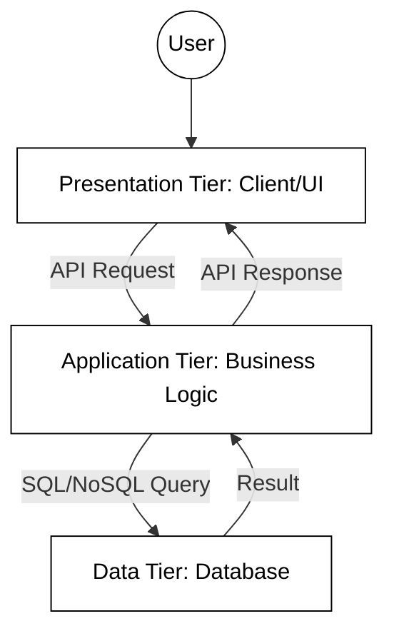
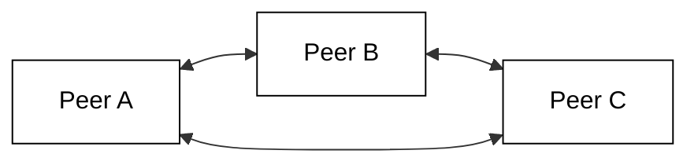
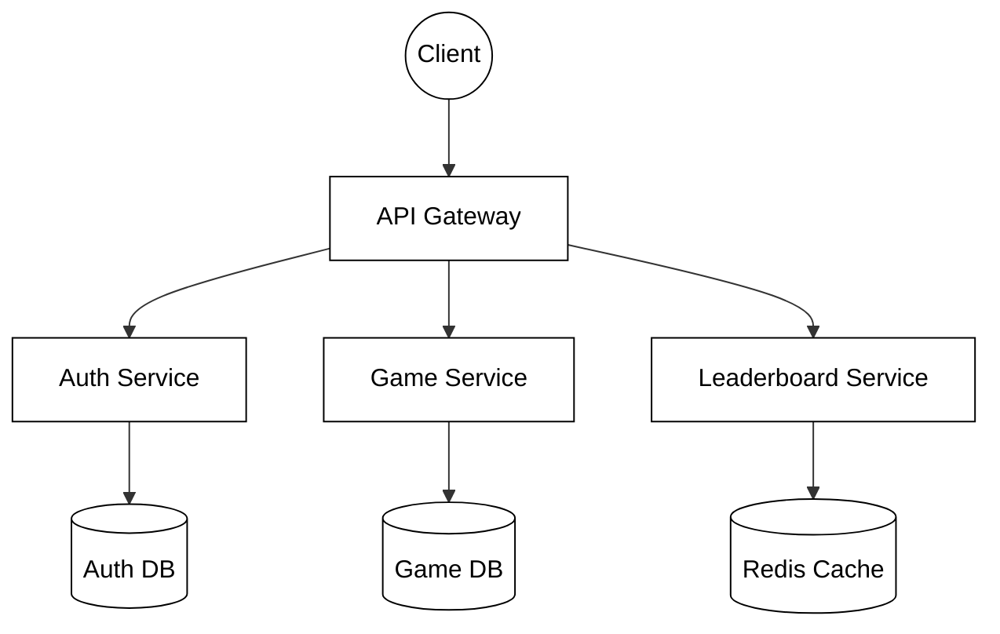
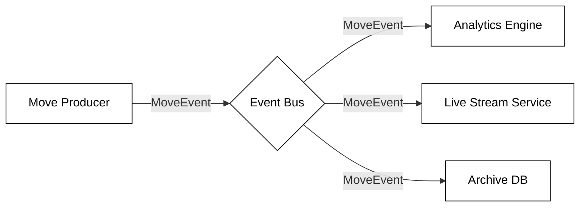

# Distributed Application Architectures

In the modern landscape of software engineering, very few applications run in complete isolation. As you progress through the development of complex systems, such as the Chess server projects in this module, you will find that the way components are organized across a network determines the system's scalability, reliability, and maintainability. A distributed application is one where components located on networked computers communicate and coordinate their actions by passing messages. Choosing the right architecture is not just a technical decision; it is a strategic one that dictates how your application will grow and handle failure.


We will examine five distinct distributed application architectures to evaluate their structural design and operational impact. By analyzing these models side-by-side, we will compare and contrast their specific strengths and weaknesses regarding scalability, maintainability, and fault tolerance. Through the use of practical coding examples and UML dataflow diagrams, you will gain the insights necessary to navigate the trade-offs inherent in each approach, enabling more informed decision-making when designing complex, distributed systems.


| Architecture | Primary Focus | Best For |
| :--- | :--- | :--- |
| **Layered Client-Server (N-Tier)** | Centralization & Separation | Web apps, standard enterprise tools |
| **Peer-to-Peer** | Decentralization | File sharing, blockchain, decentralized chat |
| **Microservices** | Independent Scalability | Large, complex systems like Netflix or Amazon |
| **Event-Driven** | Loose Coupling | IoT, real-time data streaming, UI responsiveness |


## Layered Client-Server (N-Tier) Architecture

The Client-Server model is the foundational pattern for distributed systems, where tasks are partitioned between service providers (servers) and service requesters (clients). In modern web applications, this model almost always evolves into a **Three-Tier** or **N-Tier** architecture. Rather than a single "server" handling everything, the system is organized into logical layers: the **Presentation Tier** (UI), the **Application Tier** (Logic), and the **Data Tier** (Storage).

In a Chess application, this architectural evolution is clear:
1.  **Presentation Tier:** Your JavaScript web interface or Console UI.
2.  **Application Tier:** An AWS-hosted server running Java or Node.js logic to validate moves and enforce rules.
3.  **Data Tier:** A database storing user profiles and match histories.

By separating these concerns, you ensure that the "Server" doesn't become a bloated, unmaintainable monolith.




### Practical Example: The Client-Server Interaction

A modern application involves a client-side request and a server-side service layer.

*Client-side request (JavaScript):*
```javascript
// Presentation Tier: Requesting game data from the Application Tier
async function getGameState(gameId) {
    const response = await fetch(`https://api.chess-server.com/games/${gameId}`);
    const data = await response.json();
    console.log("Current Board State:", data.board);
}
```

*Server-side logic (Java):*
```java
// Application Tier: Logic separated from data access
public class GameService {
    private GameRepository repository; // Access to Data Tier

    public boolean makeMove(String gameId, Move move) {
        Game game = repository.findById(gameId);
        if (game.isValid(move)) {
            game.apply(move);
            repository.save(game);
            return true;
        }
        return false;
    }
}
```

### Advantages and Disadvantages
*   **Advantages:** Centralized control simplifies security and data management. Separation of layers allows you to update the database or logic independently without rewriting the entire UI.
*   **Disadvantages:** The server remains a single point of failure and can become a bottleneck. The multiple network hops between tiers (Client → Logic → Data) can increase latency.

## Peer-to-Peer (P2P) Architecture

Unlike the previous models, Peer-to-Peer (P2P) architecture treats every node as both a client and a server (often called "servents"). There is no central authority. Each node contributes resources, such as processing power, disk storage, or network bandwidth, directly to other participants.

This model is famous for file-sharing networks like BitTorrent and the underlying structure of blockchain technologies. In a P2P Chess game, two players' computers would connect directly to each other to exchange moves without a central server mediating the match.




### Practical Example (Conceptual Python)

```python
# A peer sending a move directly to another peer
def broadcast_move(move, peer_addresses):
    for address in peer_addresses:
        send_data_packet(address, move)

def on_receive_move(move):
    update_local_board(move)
```

### Advantages and Disadvantages
*   **Advantages:** Highly resilient and fault-tolerant; the system stays alive as long as nodes are active.
*   **Disadvantages:** Extremely difficult to secure and coordinate. Data consistency is a major challenge.


## Microservices Architecture

Microservices architecture takes the idea of "separation of concerns" to the extreme. Instead of one large "Application Tier," the system is composed of many small, independent services that communicate over a network (usually via HTTP or message queues). Each service runs its own process and manages its own database.

For a large-scale gaming platform, you might have a "Matchmaking Service," a "Chat Service," a "Billing Service," and a "Game Engine Service."




**Practical Example (Microservice Endpoint)**

A specialized service might only handle the leaderboard:

```python
# Leaderboard Microservice (Flask)
@app.route('/top-players', methods=['GET'])
def get_leaderboard():
    scores = db.query("SELECT username, rating FROM players ORDER BY rating DESC LIMIT 10")
    return jsonify(scores)
```

### Advantages and Disadvantages
*   **Advantages:** Teams can deploy services independently. It is highly scalable, as you can scale only the services that are under heavy load.
*   **Disadvantages:** Significant operational overhead. Managing inter-service communication and distributed transactions is difficult.


## Event-Driven Architecture (EDA)

In an Event-Driven Architecture, the flow of the program is determined by events, such as a user clicking a button, a sensor output, or a message from another program. Components communicate by publishing events to an event bus or broker, and other components subscribe to the events they care about. This creates a "loosely coupled" system where the producer of the information doesn't need to know who is consuming it.




### Practical Example (Node.js EventEmitter)

```javascript
// Using an event-driven approach for game updates
const EventEmitter = require('events');
const gameEvents = new EventEmitter();

// Subscriber: Updates the UI
gameEvents.on('moveMade', (move) => {
    console.log(`Updating UI for move: ${move}`);
});

// Publisher: Triggered when a move is validated
function handleMove(move) {
    // ... logic ...
    gameEvents.emit('moveMade', move);
}
```

### Advantages and Disadvantages
*   **Advantages:** Excellent for real-time systems and high responsiveness. Components are decoupled, making the system easy to extend.
*   **Disadvantages:** It can be hard to follow the "logic flow" of the application, making debugging and tracing a challenge.


## Other Notable Architectures

While the five models above are the most common, several other specialized architectures exist:

*   **Serverless Architecture:** Developers write code as functions (e.g., AWS Lambda) that execute in response to events. The cloud provider manages all infrastructure.
*   **Space-Based Architecture:** Designed to handle huge spikes in traffic by distributing both data and processing across a "shared space" (memory grid), eliminating the database bottleneck.
*   **Actor Model Architecture:** Units called "actors" communicate via asynchronous messages. This is excellent for high-concurrency systems where you want to avoid "locking" data.
*   **CQRS + Event Sourcing:** Separates the "read" and "write" models of an application. The state is not stored as a single row in a DB, but as a sequence of events that can be replayed.
*   **Message-Oriented Architecture:** Similar to EDA, but focuses on the reliable delivery of messages through queues (like RabbitMQ) to ensure no data is lost during transit.
*   **Distributed Object Architecture:** Treats objects as if they exist on a single machine, even if they are spread across a network (e.g., CORBA or Java RMI). This is less common today due to tight coupling.
*   **Data-Centric Architecture:** The database or data lake is the central hub, and all applications or services revolve around that shared data store.


## Challenges in Distributed Systems

Regardless of the architecture you choose, moving from a single-machine "monolith" to a distributed system introduces several "fallacies of distributed computing."

1.  **Partial Failure:** In a single program, if the memory fails, the whole program crashes. In a distributed system, the "Move Validation" service might crash while the "Chat" service keeps running. Your code must handle these "partial failures" gracefully.
2.  **Latency:** Network calls are orders of magnitude slower than local function calls. Architects must minimize the number of "round trips" between services.
3.  **Data Consistency:** If you have multiple databases (as in Microservices), keeping them in sync is difficult. The **CAP Theorem** states that a distributed system can only provide two of the following three guarantees: Consistency, Availability, and Partition Tolerance.

**Solutions:**
*   **Retries and Timeouts:** Never let a network call wait forever.
*   **Idempotency:** Ensure that performing the same operation multiple times (like submitting a chess move) has the same effect as performing it once.
*   **Observability:** Use logging and distributed tracing to see how a request moves through your various tiers or services.


## Summary

Distributed application architecture is the study of trade-offs. The **Client-Server** and **Three-Tier** models offer simplicity and control, making them ideal for the initial phases of software development. As requirements for scale and resilience grow, **Microservices** and **Event-Driven** patterns provide the flexibility needed to handle millions of users. For specialized needs, **P2P** or **Serverless** models offer unique benefits in decentralization and cost management.

As you build your Chess server, consider which of these patterns best fits your needs. Are you building a simple server for a few friends (Client-Server), or are you designing the next global gaming platform (Microservices/EDA)? The architecture you choose today will define the limits of your application tomorrow.

**Further Reading:**
*   *Designing Data-Intensive Applications* by Martin Kleppmann
*   *Pattern of Enterprise Application Architecture* by Martin Fowler
*   The Twelve-Factor App methodology (12factor.net)