# Distributed Application Architectures

### 🔑 Key points

- **Distributed Applications:** Systems where components on networked computers communicate and coordinate actions by passing messages to achieve common goals.
- **Primary Architectures:** Key models include Layered Client-Server (N-Tier), Peer-to-Peer, Microservices, Event-Driven, Serverless, and the Actor Model, each with distinct trade-offs in scalability and complexity.
- **Strategic Selection:** The choice of architecture dictates how a system handles failure, grows under load, and manages data consistency.
- **Distributed Challenges:** Engineers must navigate unique hurdles not found in monolithic systems, such as network latency, partial failures, and the constraints of the CAP theorem.

---

In the modern landscape of software engineering, very few applications run in complete isolation. As you progress through the development of complex systems, such as the Chess server projects in this module, you will find that the way components are organized across a network determines the system's scalability, reliability, and maintainability. A distributed application is one where components located on networked computers communicate and coordinate their actions by passing messages. Choosing the right architecture is not just a technical decision; it is a strategic one that dictates how your application will grow and handle failure.


We will examine six distinct distributed application architectures to evaluate their structural design and operational impact. By analyzing these models side-by-side, we will compare and contrast their specific strengths and weaknesses regarding scalability, maintainability, and fault tolerance. Through the use of practical coding examples and UML dataflow diagrams, you will gain the insights necessary to navigate the trade-offs inherent in each approach, enabling more informed decision-making when designing complex, distributed systems.


| Architecture | Primary Focus | Best For |
| :--- | :--- | :--- |
| **Layered Client-Server (N-Tier)** | Centralization & Separation | Web apps, standard enterprise tools |
| **Peer-to-Peer** | Decentralization | File sharing, blockchain, decentralized chat |
| **Microservices** | Independent Scalability | Large, complex systems like Netflix or Amazon |
| **Event-Driven** | Loose Coupling | IoT, real-time data streaming, UI responsiveness |
| **Serverless** | Operational Efficiency | Event-based tasks, rapid scaling, APIs |
| **Actor Model** | Concurrency & Isolation | High-concurrency systems, chat, real-time gaming |


## Layered Client-Server (N-Tier) Architecture

The Client-Server model is the foundational pattern for distributed systems. At its core, it partitions tasks between **service providers** (servers) and **service requesters** (clients). While a basic two-tier model (Client → Server) is common for simple tools, modern enterprise systems utilize an **N-Tier architecture**, which organizes the application into multiple logical and physical layers to improve maintainability and scalability.


### The Three-Tier Structure

The most common implementation of N-Tier is the **Three-Tier Architecture**, which separates the system into three distinct functional areas:

1.  **Presentation Tier (User Interface):** This is the top-most level. It translates tasks and results to something the user can understand. In your Chess project, this might be a Console UI or a web-based React frontend.
2.  **Application Tier (Business Logic):** This is the "brain" of the application. It coordinates the application, processes commands, makes logical decisions, and performs calculations. It moves and processes data between the two surrounding layers. In Chess, this layer validates if a move is legal according to the rules.
3.  **Data Tier (Persistence):** This consists of database servers where information is stored and retrieved. Keeping this tier independent allows the application to remain **stateless**—meaning the Application Tier doesn't have to remember user data between sessions because the Data Tier handles it.

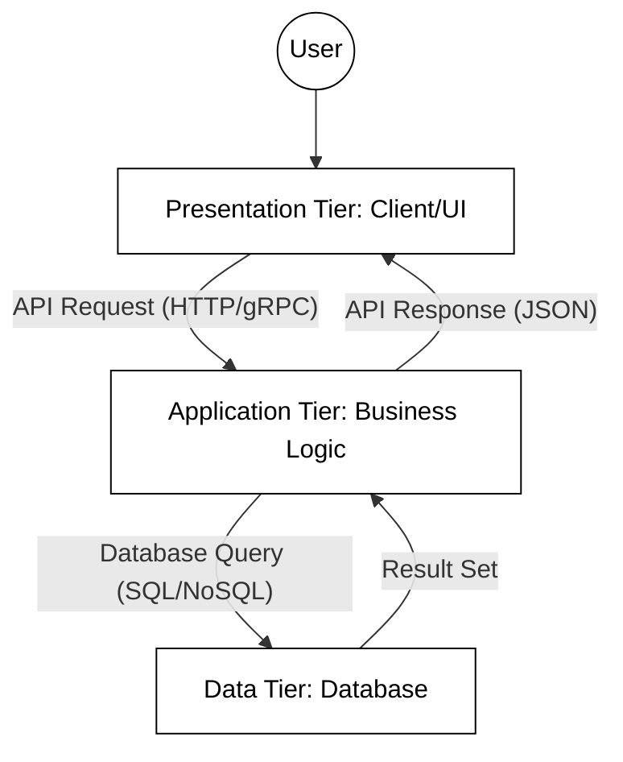


### Understanding Layers vs. Tiers

In computer science, the terms layers and tiers are often used interchangeably, but they represent different concepts:
*   **Layers:** Refer to the **logical** grouping of software components (e.g., the packages or classes in your Java code). This follows the principle of **Separation of Concerns**, where each part of the code has a specific responsibility.
*   **Tiers:** Refer to the **physical** distribution of these layers across different machines or processes. For example, if your database runs on a separate server from your application logic, you have a multi-tier system.

### Scaling the N-Tier Model

As an application grows, a single server often becomes a **bottleneck**—a point where the entire system's performance is limited by a single component's capacity. To resolve this, engineers use two primary strategies:

*   **Vertical Scaling (Scaling Up):** Adding more power (CPU, RAM) to an existing server. This is simple but has a "ceiling" (you can only buy a server so large) and creates a **Single Point of Failure (SPOF)**—if that one powerful server dies, the whole system goes down.
*   **Horizontal Scaling (Scaling Out):** Adding more server instances to the pool. This requires a **Load Balancer**, a specialized component that acts as a "traffic cop," distributing incoming client requests across multiple application servers so no single server is overwhelmed.

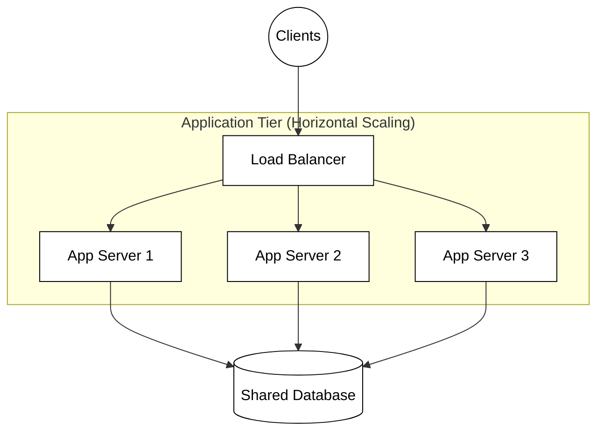

### Practical Example: The Client-Server Interaction

In a layered Chess application, the UI (Presentation) requests a move validation from the logic layer. The Application layer must then fetch the current board state from the Data layer, perform the validation, and save the result.

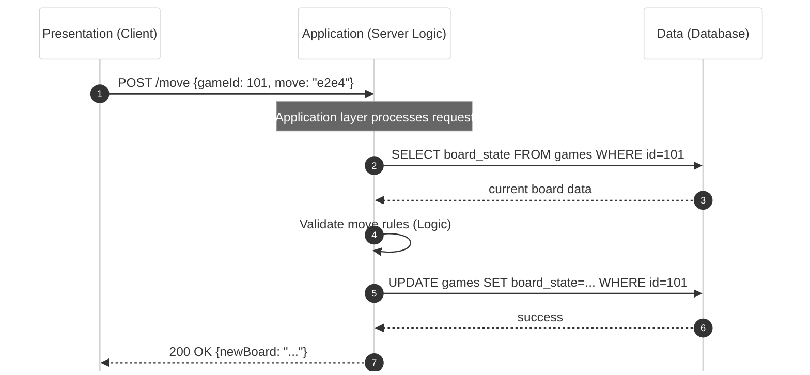

### Advantages and Disadvantages

*   **Advantages:**
    *   **Maintainability:** You can update the database (Data Tier) or the UI (Presentation Tier) independently without needing to rewrite the business logic.
    *   **Security:** The database is not directly accessible to the client; it is "hidden" behind the application logic, which acts as a gatekeeper.
    *   **Scalability:** Each tier can be scaled independently based on its specific resource needs.

*   **Disadvantages:**
    *   **Latency:** Each tier usually lives on a different physical machine. Communication between these machines introduces **network latency** (delay), making the system slower than a monolithic application where everything is in memory.
    *   **Complexity:** Managing multiple servers, load balancers, and network configurations is significantly more difficult than managing a single program.
    *   **Cascading Failures:** If the Data Tier goes offline, the Application and Presentation tiers may become useless, even if they are technically "running."

## Peer-to-Peer (P2P) Architecture

Unlike the previous models, Peer-to-Peer (P2P) architecture treats every node as both a client and a server (often called "servents"). There is no central authority. Each node contributes resources, such as processing power, disk storage, or network bandwidth, directly to other participants.

Nodes in a P2P network often use **Distributed Hash Tables (DHTs)** for decentralized discovery and **NAT traversal** techniques (like STUN or TURN) to establish direct connections through firewalls and private networks.

This model is famous for file-sharing networks like BitTorrent and the underlying structure of blockchain technologies. In a P2P Chess game, two players' computers would connect directly to each other to exchange moves without a central server mediating the match.


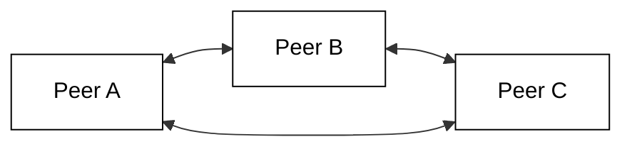

### Practical Example: P2P Move Exchange

In a decentralized Chess match, players establish a direct connection. Each player's client is responsible for maintaining its own copy of the game state and verifying the opponent's moves.

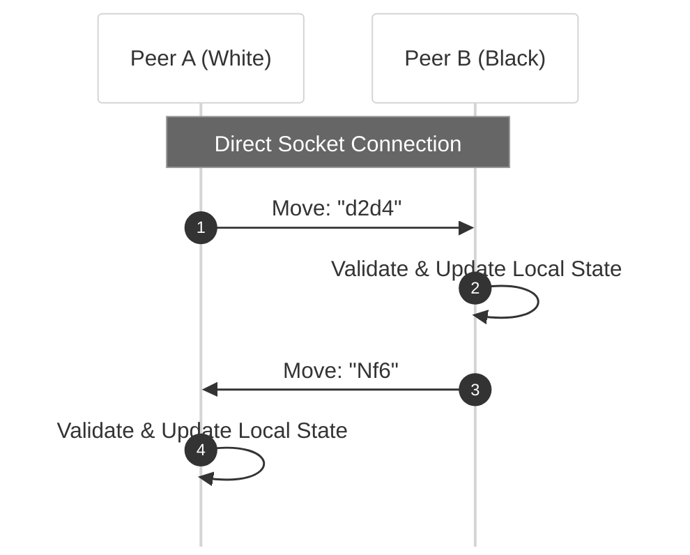

### Advantages and Disadvantages
*   **Advantages:** Highly resilient and fault-tolerant; the system stays alive as long as nodes are active.
*   **Disadvantages:** Extremely difficult to secure and coordinate. Data consistency is a major challenge.


## Microservices Architecture

Microservices architecture takes the idea of "separation of concerns" to the extreme. Instead of one large "Application Tier," the system is composed of many small, independent services that communicate over a network (usually via HTTP or message queues). Each service runs its own process and manages its own database.

Operational stability is maintained through **service discovery** (mapping service locations), **circuit breakers** to prevent cascading failures when one service hangs, and **orchestration platforms** like Kubernetes to manage container lifecycles.

For a large-scale gaming platform, you might have a "Matchmaking Service," a "Chat Service," a "Billing Service," and a "Game Engine Service."


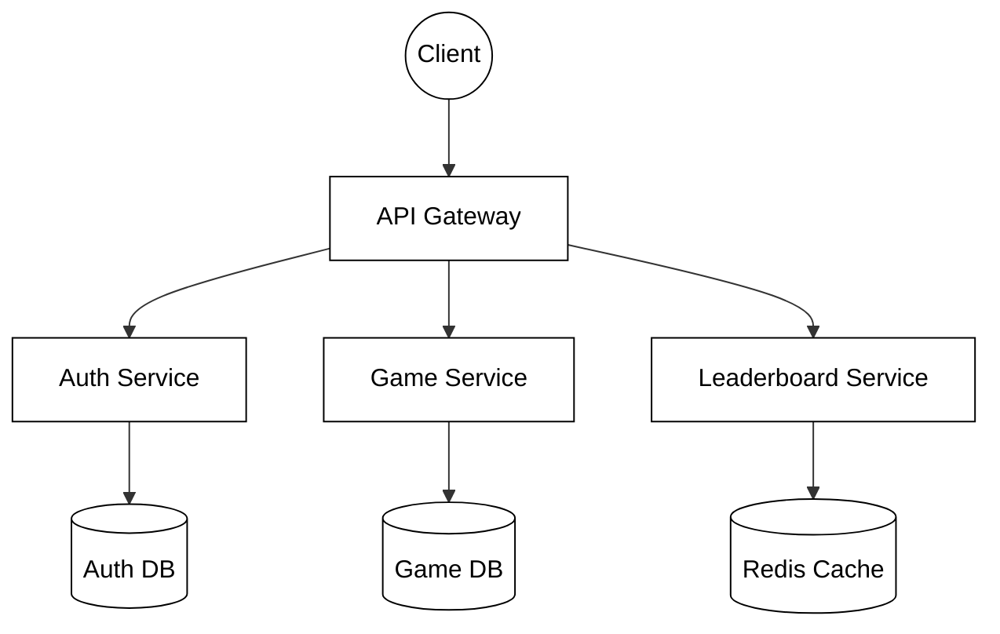

### Practical Example: Fetching a Leaderboard

When a user wants to see the top Chess players, the request passes through a gateway to a specialized service that focuses solely on ranking data.

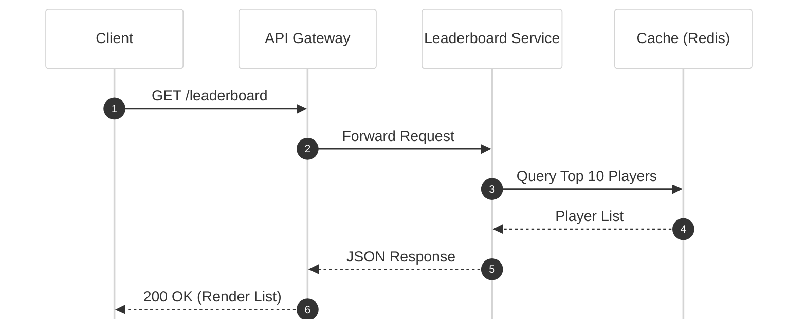

### Advantages and Disadvantages
*   **Advantages:** Teams can deploy services independently. It is highly scalable, as you can scale only the services that are under heavy load.
*   **Disadvantages:** Significant operational overhead. Managing inter-service communication and distributed transactions is difficult.


## Event-Driven Architecture (EDA)

In an Event-Driven Architecture, the flow of the program is determined by events, such as a user clicking a button, a sensor output, or a message from another program. Components communicate by publishing events to an event bus or broker, and other components subscribe to the events they care about. 

Brokers handle high throughput using **backpressure** (throttling producers when consumers are overwhelmed) and ensure reliability through **dead-letter queues** for failed events and message partitioning to maintain strict event ordering.


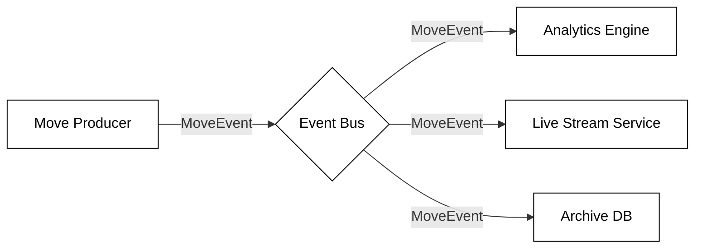

### Practical Example: Reacting to a Game Move

In a Chess platform, once a move is finalized, several independent systems need to know about it. The Game Service doesn't call them directly; it simply announces the event.

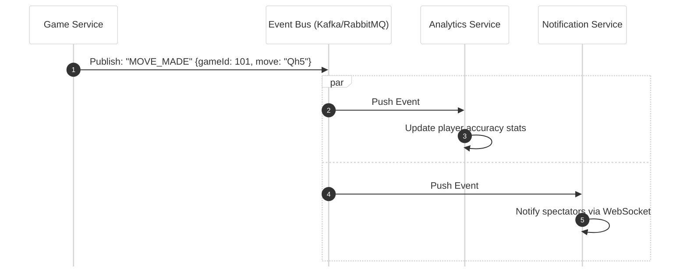

### Advantages and Disadvantages
*   **Advantages:** Excellent for real-time systems and high responsiveness. Components are decoupled, making the system easy to extend.
*   **Disadvantages:** It can be hard to follow the "logic flow" of the application, making debugging and tracing a challenge.


## Serverless Architecture

In a Serverless Architecture, developers write code as functions (e.g., AWS Lambda or Supabase Edge Functions) that execute in response to events. The cloud provider manages all infrastructure, scaling, and resource allocation.

To mitigate **cold starts** (the latency when a function is first invoked after being idle), developers use techniques like **provisioned concurrency** to keep a set number of functions "warm" or optimize deployment packages to minimize initialization time.

In a Chess application, serverless functions are ideal for tasks that are intermittent or event-based, such as calculating a player's new rating after a game is recorded in the database.

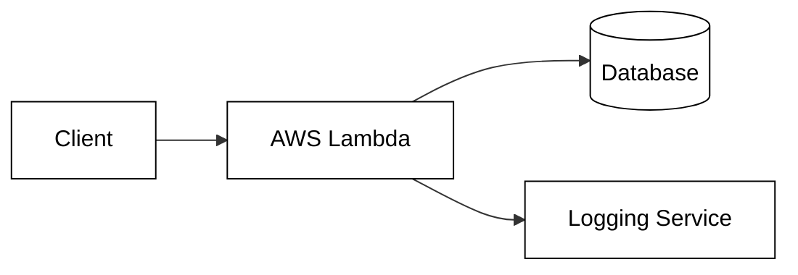

### Practical Example: Automated Rating Updates

When a game ends, the database change triggers a serverless function to recalculate the players' ELO ratings. The function only runs for the few seconds required for the calculation.

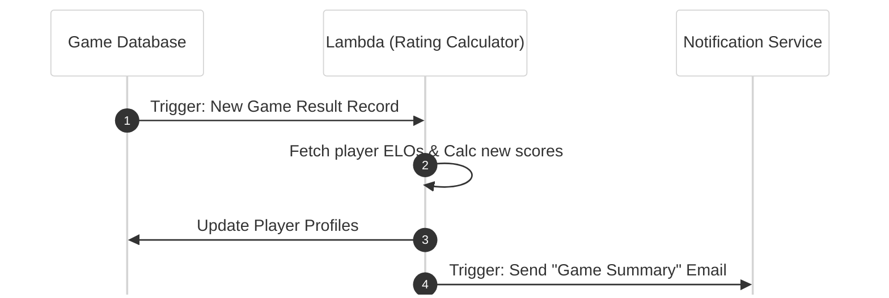

### Advantages and Disadvantages
*   **Advantages:** No server management and high cost-efficiency (pay-per-use). It scales automatically and handles spikes in traffic seamlessly.
*   **Disadvantages:** Cold starts can cause latency when functions are first invoked. High dependence on a specific cloud provider (vendor lock-in).

## Actor Model Architecture

The Actor Model treats "actors" as the universal primitives of concurrent computation. An actor is an independent unit that encapsulates state and behavior. Actors communicate exclusively through asynchronous message passing. 

Actors manage their internal state transitions using **stashing** (temporarily storing messages until the actor is in a state to process them) or **rejections**. Reliability is maintained through **supervision trees**, where parent actors monitor and restart failing child actors to achieve self-healing.

In a Chess server, an actor could represent a single game instance, ensuring all moves for that specific game are processed sequentially while thousands of other games run concurrently in other actors.

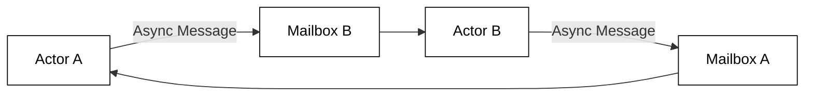

### Practical Example: Concurrent Game Management

In a large Chess server, each game is managed by a dedicated "Game Actor." Players send move messages to the actor's mailbox, where they are processed one at a time.

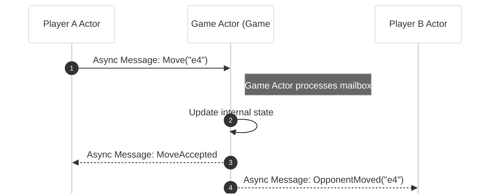

### Advantages and Disadvantages
*   **Advantages:** Excellent for high concurrency and horizontal scalability. Fault isolation is built-in; if one actor crashes, it doesn't necessarily bring down the entire system.
*   **Disadvantages:** Requires a significant shift in programming paradigm. Debugging complex chains of asynchronous messages can be difficult.

## Other Notable Architectures

While the six models above are the most common, several other specialized architectures exist:

*   **Space-Based Architecture:** Designed to handle huge spikes in traffic by distributing both data and processing across a "shared space" (memory grid), eliminating the database bottleneck.
*   **CQRS + Event Sourcing:** Separates the "read" and "write" models of an application. The state is not stored as a single row in a DB, but as a sequence of events that can be replayed.
*   **Message-Oriented Architecture:** Similar to EDA, but focuses on the reliable delivery of messages through queues (like RabbitMQ) to ensure no data is lost during transit.
*   **Distributed Object Architecture:** Treats objects as if they exist on a single machine, even if they are spread across a network (e.g., CORBA or Java RMI). This is less common today due to tight coupling.
*   **Data-Centric Architecture:** The database or data lake is the central hub, and all applications or services revolve around that shared data store.


## Challenges in Distributed Systems

Regardless of the architecture you choose, moving from a single-machine "monolith" to a distributed system introduces several "fallacies of distributed computing."

1.  **Partial Failure:** In a single program, if the memory fails, the whole program crashes. In a distributed system, the "Move Validation" service might crash while the "Chat" service keeps running. Your code must handle these "partial failures" gracefully.
2.  **Latency:** Network calls are orders of magnitude slower than local function calls. Architects must minimize the number of "round trips" between services.
3.  **Data Consistency:** If you have multiple databases (as in Microservices), keeping them in sync is difficult. The **CAP Theorem** states that a distributed system can only provide two of the following three guarantees: Consistency, Availability, and Partition Tolerance.

### Solutions
*   **Retries and Timeouts:** Never let a network call wait forever.
*   **Idempotency:** Ensure that performing the same operation multiple times (like submitting a chess move) has the same effect as performing it once.
*   **Observability:** Use logging and distributed tracing to see how a request moves through your various tiers or services.


## Summary

Distributed application architecture is the study of trade-offs. The **Client-Server** and **Three-Tier** models offer simplicity and control, making them ideal for the initial phases of software development. As requirements for scale and resilience grow, **Microservices**, **Event-Driven**, and **Actor Model** patterns provide the flexibility needed to handle millions of users and high concurrency. For specialized needs, **P2P** or **Serverless** models offer unique benefits in decentralization and cost management.

As you build your Chess server, consider which of these patterns best fits your needs. Are you building a simple server for a few friends (Client-Server), or are you designing the next global gaming platform (Microservices/EDA)? The architecture you choose today will define the limits of your application tomorrow.

**Further Reading:**
*   *Designing Data-Intensive Applications* by Martin Kleppmann
*   *Pattern of Enterprise Application Architecture* by Martin Fowler
*   The Twelve-Factor App methodology (12factor.net)

## ☑ Exercise


```masteryls
{"id":"2c6e844f-d498-44ef-8ac3-2a25b99d7b34", "title":"Distributed Architectures", "type":"essay", "gradingCriteria":"- Addresses the prompt directly\n- Uses at least one concrete example\n- Demonstrates accurate understanding of key concepts" }
Discuss one of the distributed architectures that you find interesting. Give the advantages and disadvantages of the model.
```