# Distributed Application Architectures

### 🔑 Key points

- **Distributed Applications:** Systems where components on networked computers communicate and coordinate actions by passing messages to achieve common goals.
- **Primary Architectures:** Key models include Layered Client-Server (N-Tier), Peer-to-Peer, Microservices, Event-Driven, Serverless, and the Actor Model, each with distinct trade-offs in scalability and complexity.
- **Strategic Selection:** The choice of architecture dictates how a system handles failure, grows under load, and manages data consistency.
- **Distributed Challenges:** Engineers must navigate unique hurdles not found in monolithic systems, such as network latency, partial failures, and the constraints of the CAP theorem.

---

In the modern landscape of software engineering, very few applications run in complete isolation. As you progress through the development of complex systems, such as the Chess server projects in this module, you will find that the way components are organized across a network determines the system's scalability, reliability, and maintainability. A distributed application is one where components located on networked computers communicate and coordinate their actions by passing messages. Choosing the right architecture is not just a technical decision; it is a strategic one that dictates how your application will grow and handle failure.


We will examine six distinct distributed application architectures to evaluate their structural design and operational impact. By analyzing these models side-by-side, we will compare and contrast their specific strengths and weaknesses regarding scalability, maintainability, and fault tolerance. Through the use of practical coding examples and UML dataflow diagrams, you will gain the insights necessary to navigate the trade-offs inherent in each approach, enabling more informed decision-making when designing complex, distributed systems.


| Architecture | Primary Focus | Best For |
| :--- | :--- | :--- |
| **Layered Client-Server (N-Tier)** | Centralization & Separation | Web apps, standard enterprise tools |
| **Peer-to-Peer** | Decentralization | File sharing, blockchain, decentralized chat |
| **Microservices** | Independent Scalability | Large, complex systems like Netflix or Amazon |
| **Event-Driven** | Loose Coupling | IoT, real-time data streaming, UI responsiveness |
| **Serverless** | Operational Efficiency | Event-based tasks, rapid scaling, APIs |
| **Actor Model** | Concurrency & Isolation | High-concurrency systems, chat, real-time gaming |


## Layered Client-Server (N-Tier) Architecture

The Client-Server model is the foundational pattern for distributed systems. At its core, it partitions tasks between **service providers** (servers) and **service requesters** (clients). While a basic two-tier model (Client → Server) is common for simple tools, modern enterprise systems utilize an **N-Tier architecture**, which organizes the application into multiple logical and physical layers to improve maintainability and scalability.


### The Three-Tier Structure

The most common implementation of N-Tier is the **Three-Tier Architecture**, which separates the system into three distinct functional areas:

1.  **Presentation Tier (User Interface):** This is the top-most level. It translates tasks and results to something the user can understand. In your Chess project, this might be a Console UI or a web-based React frontend.
2.  **Application Tier (Business Logic):** This is the "brain" of the application. It coordinates the application, processes commands, makes logical decisions, and performs calculations. It moves and processes data between the two surrounding layers. In Chess, this layer validates if a move is legal according to the rules.
3.  **Data Tier (Persistence):** This consists of database servers where information is stored and retrieved. Keeping this tier independent allows the application to remain **stateless**—meaning the Application Tier doesn't have to remember user data between sessions because the Data Tier handles it.

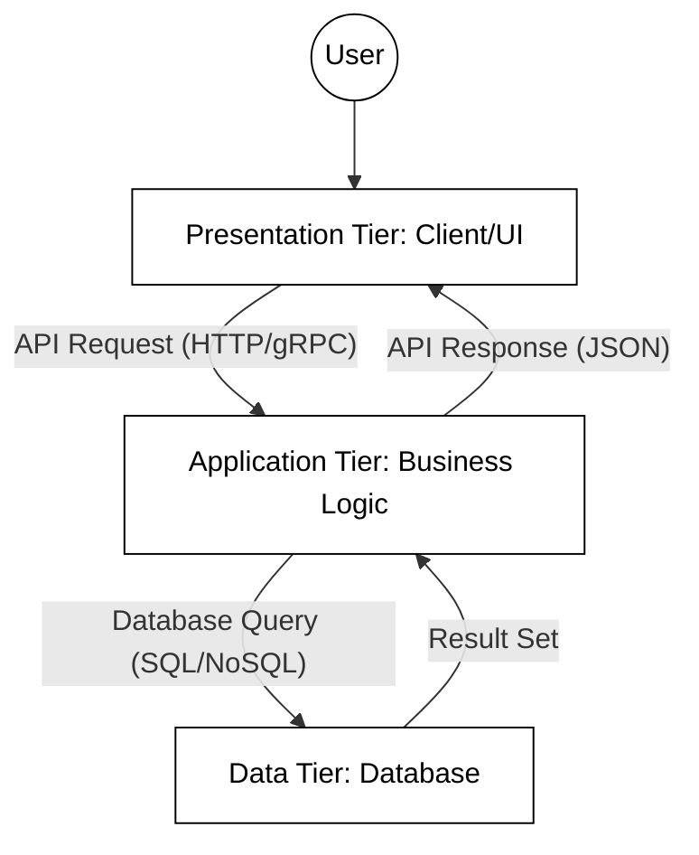


### Understanding Layers vs. Tiers

In computer science, the terms layers and tiers are often used interchangeably, but they represent different concepts:
*   **Layers:** Refer to the **logical** grouping of software components (e.g., the packages or classes in your Java code). This follows the principle of **Separation of Concerns**, where each part of the code has a specific responsibility.
*   **Tiers:** Refer to the **physical** distribution of these layers across different machines or processes. For example, if your database runs on a separate server from your application logic, you have a multi-tier system.

### Scaling the N-Tier Model

As an application grows, a single server often becomes a **bottleneck**—a point where the entire system's performance is limited by a single component's capacity. To resolve this, engineers use two primary strategies:

*   **Vertical Scaling (Scaling Up):** Adding more power (CPU, RAM) to an existing server. This is simple but has a "ceiling" (you can only buy a server so large) and creates a **Single Point of Failure (SPOF)**—if that one powerful server dies, the whole system goes down.
*   **Horizontal Scaling (Scaling Out):** Adding more server instances to the pool. This requires a **Load Balancer**, a specialized component that acts as a "traffic cop," distributing incoming client requests across multiple application servers so no single server is overwhelmed.

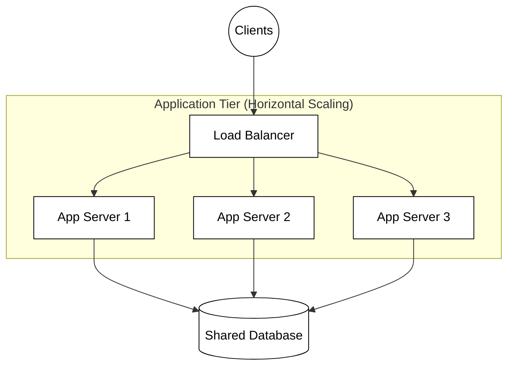

### Practical Example: The Client-Server Interaction

In a layered Chess application, the UI (Presentation) requests a move validation from the logic layer. The Application layer must then fetch the current board state from the Data layer, perform the validation, and save the result.

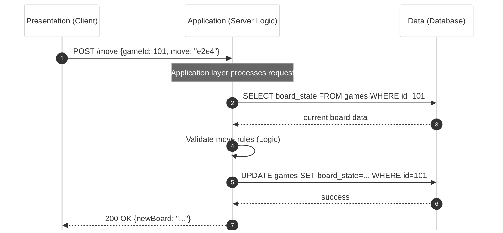

### Advantages and Disadvantages

*   **Advantages:**
    *   **Maintainability:** You can update the database (Data Tier) or the UI (Presentation Tier) independently without needing to rewrite the business logic.
    *   **Security:** The database is not directly accessible to the client; it is "hidden" behind the application logic, which acts as a gatekeeper.
    *   **Scalability:** Each tier can be scaled independently based on its specific resource needs.

*   **Disadvantages:**
    *   **Latency:** Each tier usually lives on a different physical machine. Communication between these machines introduces **network latency** (delay), making the system slower than a monolithic application where everything is in memory.
    *   **Complexity:** Managing multiple servers, load balancers, and network configurations is significantly more difficult than managing a single program.
    *   **Cascading Failures:** If the Data Tier goes offline, the Application and Presentation tiers may become useless, even if they are technically "running."


## Microservices Architecture

Microservices architecture is an evolution of the N-Tier model that pushes the principle of **Separation of Concerns** to its logical limit. Instead of a single, unified "monolith" application, the system is decomposed into a suite of small, modular services. Each service is **independently deployable**, runs in its own process, and communicates with others over a network using lightweight protocols like HTTP/REST, gRPC, or message brokers.

### The Database-per-Service Pattern
A defining characteristic of microservices is that each service manages its own private database. This is often referred to as **Polyglot Persistence**.
*   **Loose Coupling:** Changes to one service's data schema do not break other services because they cannot access the data directly.
*   **Autonomy:** The "Game Service" might use a high-speed NoSQL database like MongoDB for move history, while the "Billing Service" uses a strictly consistent SQL database like PostgreSQL for financial records.
*   **Challenge:** This creates "data silos." If you need a report combining data from both, you cannot perform a standard SQL `JOIN`. You must instead aggregate data via APIs or use event-based synchronization.

### The API Gateway
In a microservices world, a client (like a mobile app) does not talk to dozens of different services individually. Instead, it interacts with an **API Gateway**.
*   **Routing:** The gateway acts as a **reverse proxy**, directing incoming requests to the specific service responsible for that task.
*   **Cross-Cutting Concerns:** It handles shared responsibilities like authentication, SSL termination, and rate limiting in one central place, so individual services don't have to implement them.

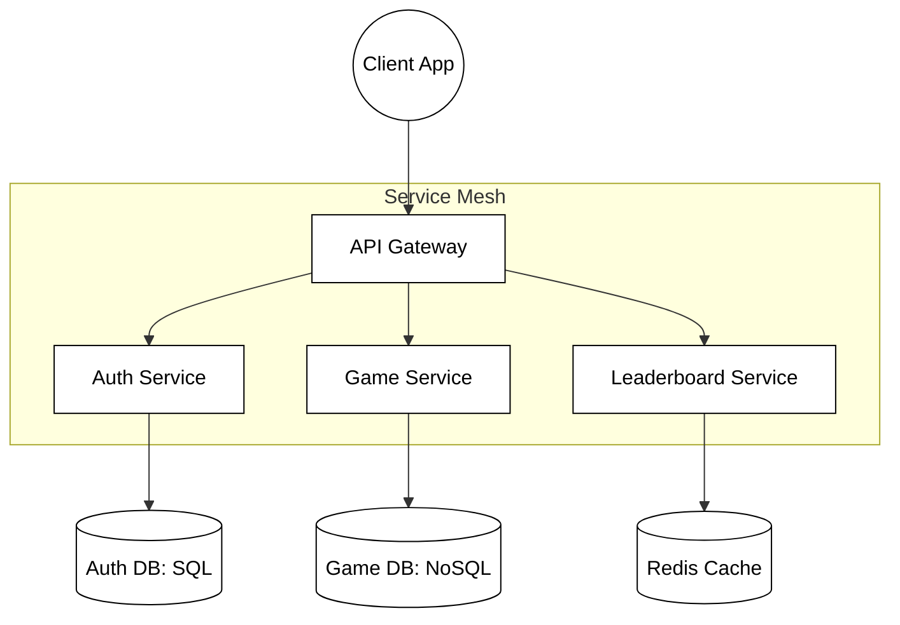

### Resiliency and the Circuit Breaker Pattern
In a distributed system, network calls will eventually fail. If "Service A" waits for a response from a hanging "Service B," Service A's resources (such as threads or memory) will eventually be exhausted, leading to a **cascading failure** that brings down the entire system. 

To prevent this, engineers use a **Circuit Breaker**. Just like an electrical fuse, it monitors for failures. If a service fails repeatedly, the circuit "trips" (opens). Further calls return an immediate error or a cached fallback response without hitting the failing service, giving it time to recover.

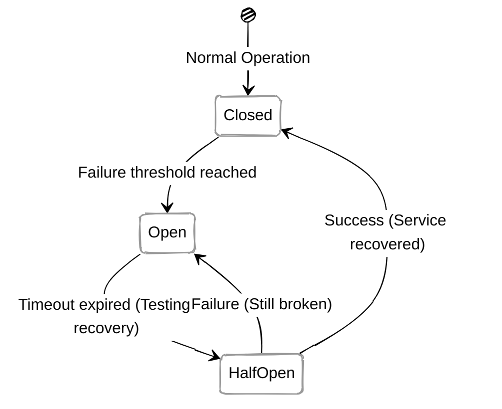

### Service Discovery and Orchestration
Because microservices scale horizontally by adding more instances, their IP addresses change constantly. **Service Discovery** acts like a dynamic "phone book" (e.g., Consul or Netflix Eureka) that tracks where every service instance is currently located.

Managing hundreds of these instances manually is impossible. Developers use **Orchestration** platforms like **Kubernetes** to automate:
*   **Deployment:** Rolling out new versions of code.
*   **Scaling:** Automatically adding more instances during peak chess tournament hours.
*   **Self-healing:** Automatically restarting a service container if it crashes.

### Practical Example: Fetching a Leaderboard

When a user wants to see the top Chess players, the request passes through the gateway to a specialized service that focuses solely on ranking data.

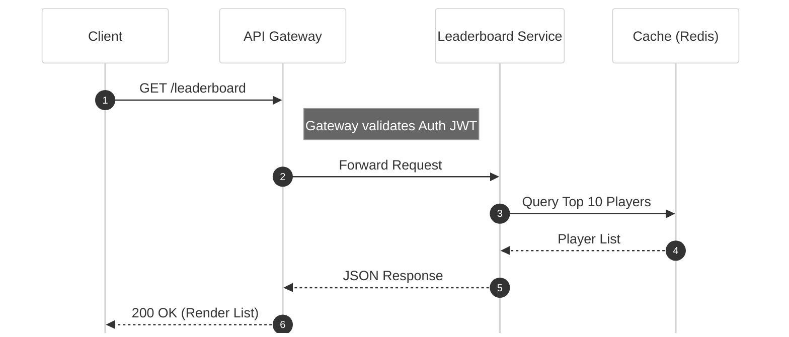

### Advantages and Disadvantages
*   **Advantages:** 
    *   **Independent Scalability:** You can scale just the "Game Engine" service during high load without wasting resources scaling the "Billing" service.
    *   **Fault Isolation:** A bug in the "Chat Service" might disable chat, but it won't stop players from playing games.
    *   **Technology Agility:** Teams can choose the best language for the job (e.g., Python for AI, Go for high-concurrency networking).
*   **Disadvantages:** 
    *   **Operational Overhead:** Managing dozens of deployment pipelines and monitoring tools is significantly more complex than managing one monolith.
    *   **Distributed Transactions:** Ensuring data consistency across multiple databases requires complex patterns like the **Saga Pattern**.
    *   **Network Latency:** Every inter-service call adds network delay compared to an in-memory function call.

## Peer-to-Peer (P2P) Architecture

Unlike the centralized models, Peer-to-Peer (P2P) architecture treats every node in the network as an equal. In this model, there is no dedicated central server. Instead, each node acts as both a client and a server; a hybrid role often referred to as a **servent** (**serv**er-cli**ent**). Each participant contributes a portion of their own resources, such as processing power, disk storage, or network bandwidth, directly to other participants without the need for intermediate orchestration.

### The "Servent" Concept and Decentralization
In a traditional client-server model, the server is a "special" node with high availability. In P2P, the workload is distributed across the "edge" of the network. This removes the **Single Point of Failure (SPOF)**; if one node goes offline, the rest of the network continues to function. However, this introduces the challenge of **churn**, the constant joining and leaving of nodes, which the architecture must be designed to handle gracefully.

### Decentralized Discovery: Distributed Hash Tables (DHTs)
Without a central server to act as a directory (like a phone book), nodes must have a way to find data or other peers. Modern P2P systems use **Distributed Hash Tables (DHTs)**. 
*   **What is a DHT?** Think of it as a decentralized key-value store. Instead of one server holding the entire index, the index is partitioned. Each node is responsible for a specific range of keys.
*   **How it works:** If a player wants to find a specific chess game instance, they hash the Game ID to find which peer in the network is responsible for that ID's metadata.

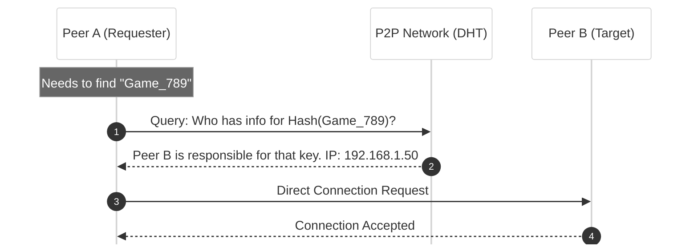

### Connectivity: NAT Traversal (STUN and TURN)
A major hurdle for P2P is that most computers sit behind routers using **Network Address Translation (NAT)**. This means your computer has a "private" IP address that is not reachable from the public internet. To establish a direct connection between two peers, they use **NAT Traversal** techniques:

1.  **STUN (Session Traversal Utilities for NAT):** A protocol that allows a node to discover its own public IP address and the type of NAT it is behind. This allows Peer A to tell Peer B exactly how to "call back" to it.
2.  **TURN (Traversal Using Relays around NAT):** A fallback mechanism. If a direct connection is impossible due to strict firewalls, a TURN server acts as a relay, passing data between the two peers. While this introduces a "server," it is only used for data relay, not for application logic.

### Practical Example: P2P Move Exchange

In a decentralized Chess match, once discovery is complete, players establish a direct socket connection. Each player's client is responsible for maintaining its own copy of the game state and verifying the opponent's moves against the rules of chess (since there is no server to "referee" the match).

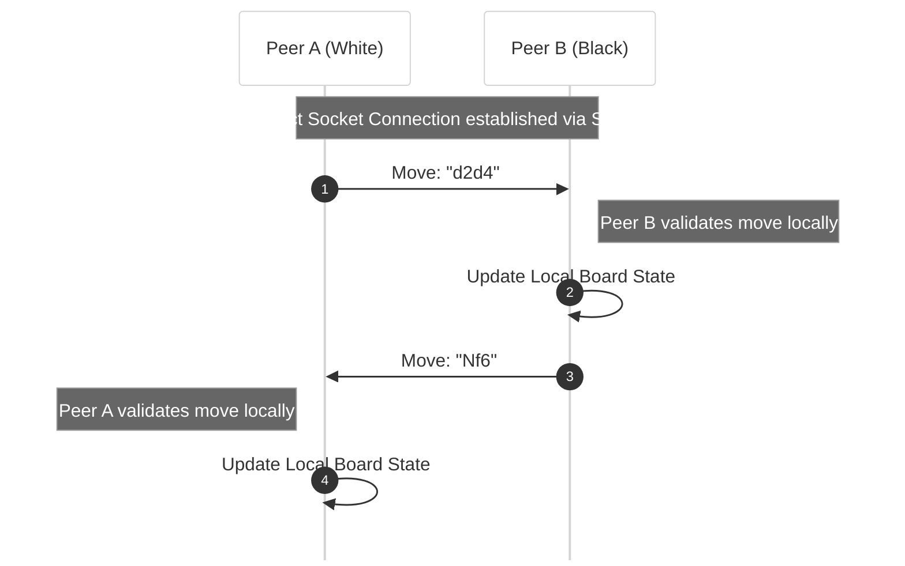

### Advantages and Disadvantages

*   **Advantages:**
    *   **High Resilience:** The system is extremely fault-tolerant. There is no central "brain" to kill.
    *   **Scalability:** As more users join, the total capacity of the network (bandwidth and CPU) increases proportionally.
    *   **Cost Efficiency:** The system owner doesn't need to pay for massive server farms; the users provide the infrastructure.

*   **Disadvantages:**
    *   **Security and Trust:** Since there is no central authority, it is difficult to prevent "poisoning" (nodes sending fake data) or cheating in a game.
    *   **Consistency:** Ensuring every node has the same version of the data at the same time is a complex distributed systems problem.
    *   **Complexity:** Implementing DHTs, NAT traversal, and handling constant peer "churn" is significantly harder than building a standard client-server app.

## Event-Driven Architecture (EDA)

In an Event-Driven Architecture (EDA), the flow of the application is determined by **events**; significant changes in state, such as a user placing a chess piece, a system error occurring, or a sensor detecting motion. Unlike traditional architectures where components call each other directly (Request/Response), EDA components communicate by broadcasting that something has happened.

### Core Concepts: Pub/Sub and Decoupling

EDA typically relies on the **Publish/Subscribe (Pub/Sub)** pattern. In this model, a **Producer** (the component where the event originates) sends a message to a central "Event Bus" or "Message Broker." It does not know who will consume the message, or even if anyone is listening. **Consumers** (the components that need to react) subscribe to specific types of events.

This creates high **decoupling**:
*   **Spatial Decoupling:** The producer and consumer don't need to know each other's IP addresses or identities.
*   **Temporal Decoupling:** The producer and consumer don't need to be running at the same time. The broker can hold the message until the consumer is ready.

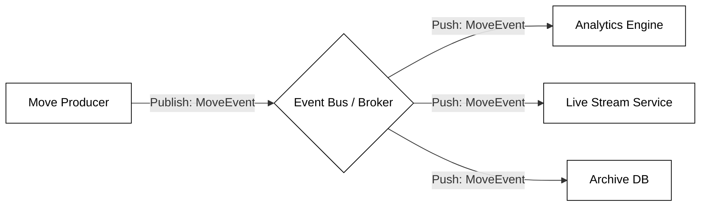

### The Role of the Message Broker

The **Message Broker** (e.g., Apache Kafka, RabbitMQ) is the "intelligent post office" of the system. It handles the complexity of routing messages to the correct subscribers and ensures the system remains stable under heavy load.

#### Handling Throughput and Reliability
*   **Backpressure:** When a producer sends messages faster than a consumer can process them, the broker manages the flow. It can buffer messages or signal the producer to slow down, preventing the consumer from being overwhelmed and crashing.
*   **Dead-Letter Queues (DLQ):** If a message fails to be processed after several attempts (perhaps due to a bug or malformed data), the broker moves it to a DLQ. This is a specialized "lost and found" queue where developers can inspect failed events without stopping the rest of the system.
*   **Message Partitioning:** To maintain performance, brokers often split event streams into "partitions." For example, all moves for "Game A" might go to Partition 1, while "Game B" goes to Partition 2. This ensures that moves within a single game are processed in the correct **chronological order** while allowing multiple games to be processed in parallel.

### Practical Example: Reacting to a Game Move

In a Chess platform, once a move is finalized, several independent systems need to react. The Game Service doesn't call the Analytics or Notification services; it simply announces the event to the broker.

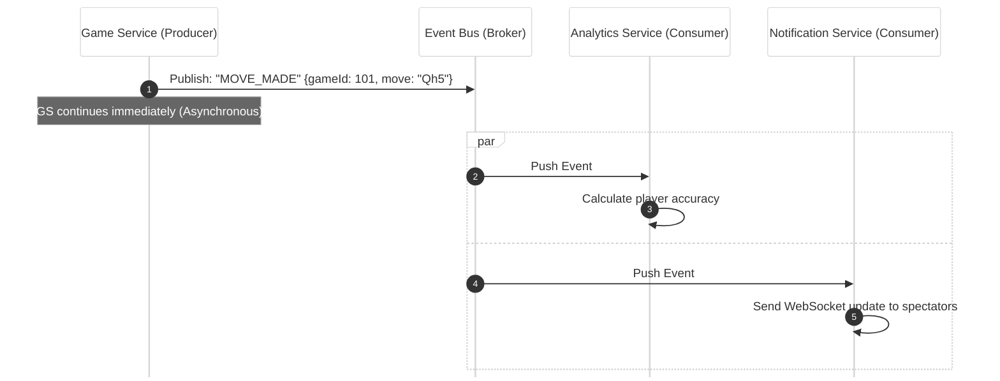

### Advantages and Disadvantages

*   **Advantages:**
    *   **Scalability:** You can add new consumers (e.g., a "Cheat Detection Service") without changing any code in the Game Service.
    *   **Responsiveness:** The producer doesn't wait for consumers to finish. It broadcasts the event and immediately moves on to the next task.
    *   **Resiliency:** If the Analytics Service goes down, the Game Service is unaffected. The events will wait in the broker until the Analytics Service recovers.

*   **Disadvantages:**
    *   **Complexity of Flow:** Because execution is non-linear, it can be difficult to see the "big picture" of how a request moves through the system.
    *   **Debugging and Tracing:** Standard debuggers don't work across asynchronous boundaries. Engineers must use **Distributed Tracing** (assigning a unique ID to an event) to follow its path across different services.
    *   **Eventual Consistency:** There is a delay between the move being made and the analytics being updated, meaning the system state might be slightly "out of sync" for a few milliseconds.

## Serverless Architecture

Serverless architecture is a cloud-computing execution model where the cloud provider dynamically manages the allocation and provisioning of machine resources. Despite the name, "serverless" does not mean servers are absent; rather, it means the **abstraction** is so high that developers do not need to manage, patch, or scale the underlying virtual machines or containers.

### Function as a Service (FaaS)
The core of serverless is **Function as a Service (FaaS)**. In this model, developers break down application logic into small, discrete functions (e.g., AWS Lambda, Google Cloud Functions, or Supabase Edge Functions). These functions are **ephemeral**, meaning they are spun up on demand to execute a specific task and then immediately destroyed.

### Event-Driven Triggers
Serverless functions are inherently reactive. They remain idle and consume no resources until they are "triggered" by an event. Common triggers include:
*   **HTTP Requests:** A user hitting an API endpoint.
*   **Database Changes:** An entry being inserted into a "Games" table.
*   **File Uploads:** A user uploading a profile picture to a storage bucket.
*   **Scheduled Tasks:** A "cron job" that runs every midnight to clean up inactive accounts.

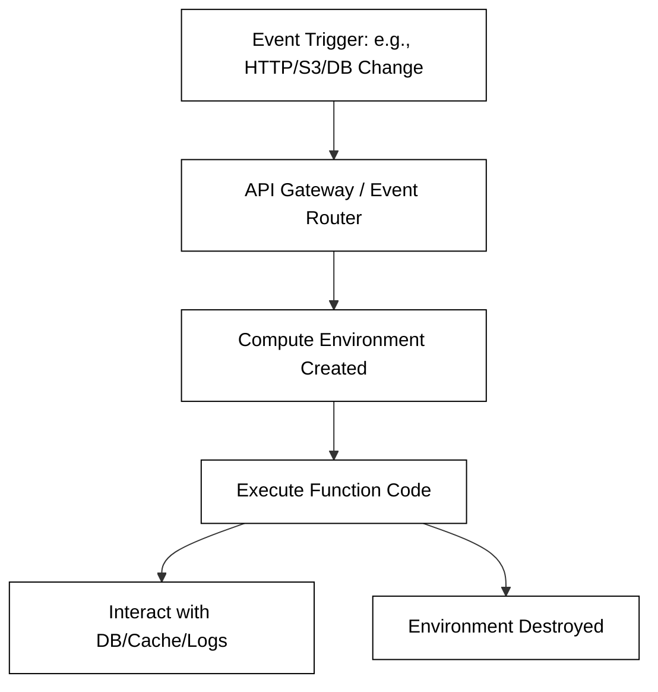

### The "Cold Start" Problem
A significant technical hurdle in serverless computing is the **Cold Start**. When a function is triggered after being idle, the cloud provider must pull the code, initialize a new container environment, and start the runtime (like the JVM or Node.js). This creates a noticeable delay (latency) before the code actually executes.

To mitigate this, developers use two main strategies:
1.  **Provisioned Concurrency:** Paying the provider to keep a specific number of function instances "warm" (pre-initialized and ready to go).
2.  **Package Optimization:** Reducing the size of the deployment package (the `.jar` or `.zip` file) so it loads into memory faster.

### Statelessness and External State
Serverless functions are **stateless**. Because the execution environment is destroyed after the function finishes, you cannot store variables in memory and expect them to be there the next time the function runs. To maintain state, functions must connect to external services like a database (PostgreSQL) or a distributed cache (Redis).

### Practical Example: Automated Rating Updates
In a Chess application, serverless is ideal for intermittent tasks like calculating ELO ratings. The rating logic doesn't need to run 24/7; it only needs to run for a few milliseconds after a game concludes.

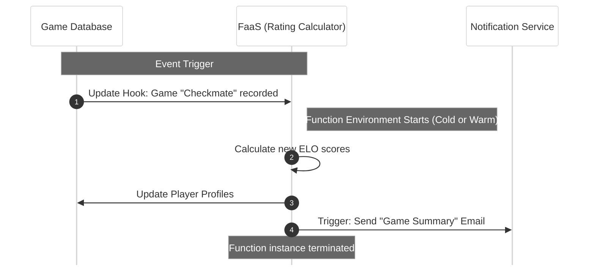

### Advantages and Disadvantages

*   **Advantages:**
    *   **Operational Efficiency:** No server maintenance, OS updates, or security patches for the hardware.
    *   **Granular Billing:** You are billed only for the milliseconds the code is actually running (Pay-per-use).
    *   **Infinite Scalability:** The provider can automatically spin up 1,000 instances of a function simultaneously if there is a sudden spike in traffic.

*   **Disadvantages:**
    *   **Latency:** Cold starts make serverless less suitable for high-performance applications requiring sub-millisecond responses.
    *   **Vendor Lock-in:** Moving code from AWS Lambda to Azure Functions often requires significant rewriting because the trigger APIs and deployment tools are proprietary.
    *   **Debugging Complexity:** It is difficult to replicate the exact cloud environment locally for testing, making integration testing more complex.

## Actor Model Architecture

The Actor Model treats **actors** as the universal primitives—the most basic building blocks—of concurrent computation. In this model, everything is an actor. Each actor is a self-contained, independent unit that encapsulates three specific things:
1.  **State:** Private data that cannot be accessed or modified directly by any other actor.
2.  **Behavior:** The logic that defines how the actor reacts to messages.
3.  **Mailbox:** A message queue that stores incoming communications until the actor is ready to process them.

### Communication and Concurrency

Unlike traditional object-oriented programming where you call a method on an object and wait for a return value (synchronous), actors communicate exclusively through **asynchronous message passing**. When Actor A sends a message to Actor B, it "fires and forgets," continuing its own work immediately without waiting for a response.

By ensuring that actors never share memory, this architecture eliminates the need for complex synchronization tools like **locks** or **mutexes**, which are common sources of bugs (such as deadlocks or race conditions) in standard multi-threaded applications.

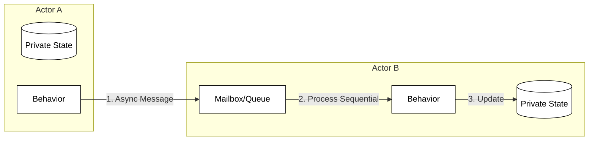

### Resilience through Supervision Trees

Reliability in the Actor Model is maintained through **supervision trees**. This follows a "let it crash" philosophy: instead of writing defensive code to catch every possible error, actors are organized in a hierarchy.

*   **Supervisors:** Parent actors that create and monitor "child" actors.
*   **Self-Healing:** If a child actor crashes due to an error, the supervisor detects the failure and decides on a strategy, such as restarting the child to its initial clean state, stopping it, or escalating the failure further up the tree.

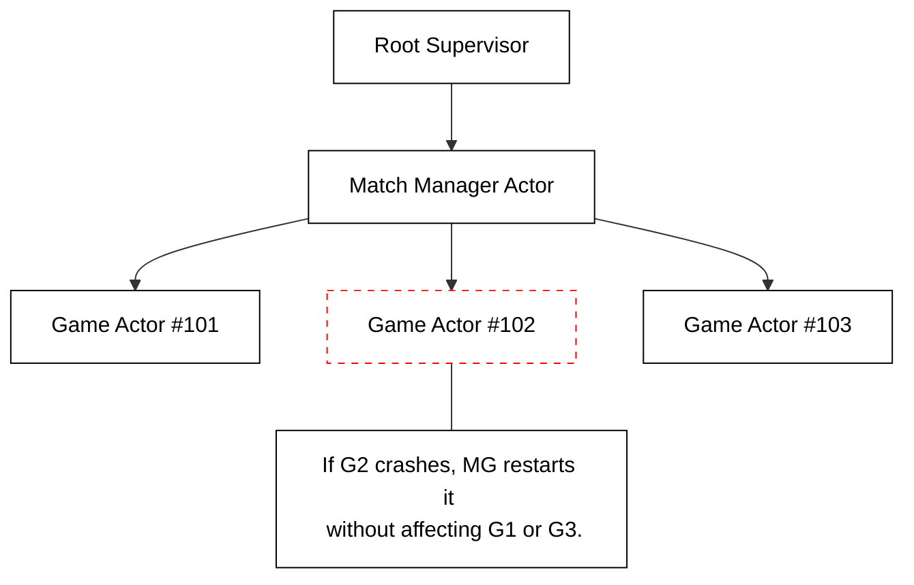

### Advanced Message Handling: Stashing and Rejections

Actors manage their internal state transitions using specific patterns to handle messages that arrive at the "wrong" time:

*   **Stashing:** If an actor receives a message it cannot handle in its current state (e.g., a "Move" message arriving before the game has officially "Started"), it can **stash** the message in a temporary secondary queue. Once the actor transitions to the correct state, it "unstashes" the messages to process them in order.
*   **Rejections:** If a message is invalid or the actor is under too much load, it can explicitly **reject** the message, sending a failure notification back to the sender or simply ignoring it to protect its own resources.

In a Chess server, an actor could represent a single game instance. This ensures all moves for that specific game are processed sequentially (one after another) by that actor's mailbox, while thousands of other games run concurrently in their own isolated actors across the network.

### Practical Example: Concurrent Game Management

In a large Chess server, each game is managed by a dedicated "Game Actor." Players send move messages to the actor's mailbox, where they are processed one at a time.

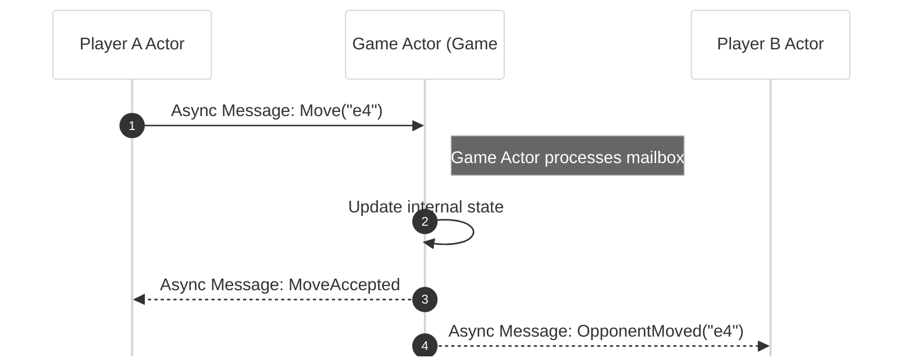

### Advantages and Disadvantages
*   **Advantages:** Excellent for high concurrency and horizontal scalability. Fault isolation is built-in; if one actor crashes, it doesn't necessarily bring down the entire system.
*   **Disadvantages:** Requires a significant shift in programming paradigm. Debugging complex chains of asynchronous messages can be difficult.

## Other Notable Architectures

While the six models above are the most common, several other specialized architectures exist:

*   **Space-Based Architecture:** Designed to handle huge spikes in traffic by distributing both data and processing across a "shared space" (memory grid), eliminating the database bottleneck.
*   **CQRS + Event Sourcing:** Separates the "read" and "write" models of an application. The state is not stored as a single row in a DB, but as a sequence of events that can be replayed.
*   **Message-Oriented Architecture:** Similar to EDA, but focuses on the reliable delivery of messages through queues (like RabbitMQ) to ensure no data is lost during transit.
*   **Distributed Object Architecture:** Treats objects as if they exist on a single machine, even if they are spread across a network (e.g., CORBA or Java RMI). This is less common today due to tight coupling.
*   **Data-Centric Architecture:** The database or data lake is the central hub, and all applications or services revolve around that shared data store.


## Challenges in Distributed Systems

Regardless of the architecture you choose, moving from a single-machine "monolith" to a distributed system introduces several "fallacies of distributed computing."

1.  **Partial Failure:** In a single program, if the memory fails, the whole program crashes. In a distributed system, the "Move Validation" service might crash while the "Chat" service keeps running. Your code must handle these "partial failures" gracefully.
2.  **Latency:** Network calls are orders of magnitude slower than local function calls. Architects must minimize the number of "round trips" between services.
3.  **Data Consistency:** If you have multiple databases (as in Microservices), keeping them in sync is difficult. The **CAP Theorem** states that a distributed system can only provide two of the following three guarantees: Consistency, Availability, and Partition Tolerance.

### Solutions
*   **Retries and Timeouts:** Never let a network call wait forever.
*   **Idempotency:** Ensure that performing the same operation multiple times (like submitting a chess move) has the same effect as performing it once.
*   **Observability:** Use logging and distributed tracing to see how a request moves through your various tiers or services.


## Summary

Distributed application architecture is the study of trade-offs. The **Client-Server** and **Three-Tier** models offer simplicity and control, making them ideal for the initial phases of software development. As requirements for scale and resilience grow, **Microservices**, **Event-Driven**, and **Actor Model** patterns provide the flexibility needed to handle millions of users and high concurrency. For specialized needs, **P2P** or **Serverless** models offer unique benefits in decentralization and cost management.

As you build your Chess server, consider which of these patterns best fits your needs. Are you building a simple server for a few friends (Client-Server), or are you designing the next global gaming platform (Microservices/EDA)? The architecture you choose today will define the limits of your application tomorrow.

**Further Reading:**
*   *Designing Data-Intensive Applications* by Martin Kleppmann
*   *Pattern of Enterprise Application Architecture* by Martin Fowler
*   The Twelve-Factor App methodology (12factor.net)

## ☑ Exercise


```masteryls
{"id":"2c6e844f-d498-44ef-8ac3-2a25b99d7b34", "title":"Distributed Architectures", "type":"essay", "gradingCriteria":"- Addresses the prompt directly\n- Uses at least one concrete example\n- Demonstrates accurate understanding of key concepts" }
Discuss one of the distributed architectures that you find interesting. Give the advantages and disadvantages of the model.
```