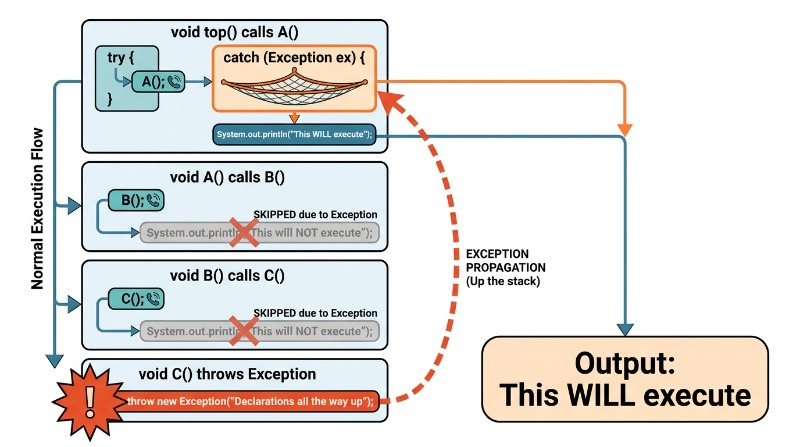

# Java Exceptions

🖥️ [Slides](https://docs.google.com/presentation/d/1CIyKxxGhJXUCQvwsJT64Oaao0p9LcBIZ/edit?usp=sharing&ouid=114081115660452804792&rtpof=true&sd=true)

🖥️ [Lecture Videos](#videos)

📖 **Required Reading**: Core Java for the Impatient

- Chapter 5: Exceptions, Assertions, And Logging. (_Only read sections 5.1-5.1.9: Exception Handling_)

### 🔑 Key points

- The difference between checked and unchecked exceptions in Java
- How and when to handle an exception in Java
- How and when to throw an exception in Java
- How to create custom exception classes
- How to use `try/catch` blocks
- What `finally` blocks are and how to use them

---


In traditional programming, error handling often relies on return codes, which forces developers to intersperse error-checking logic with the main business logic, leading to cluttered code that is difficult to read and maintain. Java Exceptions provide a structured alternative by separating the detection of an error from the code that handles it.

Java exceptions allow you to deviate from the normal execution flow of a program when an "exceptional" event occurs. When an exception is thrown, the Java runtime searches the **call stack** for a matching handler. It starts with the current stack frame and, if no `catch` block is found, it "unwinds" the stack—popping the current frame and passing the exception to the calling method's frame. This process continues until a handler is found or the program terminates, allowing you to pass control from the point of failure to a higher-level frame equipped to handle the error.



Java uses the standard `try`, `catch`, and `throw` syntax found in many modern programming languages. You define a block where exceptions might occur using the `try` statement. This block is followed by one or more `catch` blocks. For each `catch` block, you specify the exception type(s) it handles. That type and any types derived from it will be caught by that block. 

The following demonstrates the basic usage of Java exception handling as defined above.

```java
try {
    // Code that might throw an exception
} catch (FileNotFoundException ex) {
    // Specific file error handling
} catch (IOException ex) {
    // Other IO error handling (excluding FileNotFoundException)
    // FileNotFoundException is a subclass of IOException, but won't trigger this block  because it was caught above. 
} catch (Exception ex) {
    // General error handling for everything else
}
```

> [!NOTE]
>
> The Java runtime matches catch blocks from top to bottom. You should always list the most specific exceptions first and the most general (like `Exception`) last.


## Throw and Throws

To raise an exception, use the `throw` keyword followed by an instance of an exception class.

```java
throw new IllegalArgumentException("Missing required parameter");
```

When you throw an exception, the normal flow of the code is interrupted, and the execution pointer jumps to the nearest matching `catch` block in the call stack.

Java requires that a method's signature declares all **checked** exceptions it might throw using the `throws` keyword. This requirement propagates up the call stack: any method calling a function that throws a checked exception must either catch it or declare it in its own signature.

```java
void top() {
    try {
        A();
    } catch (Exception ex) {
        System.out.println("This WILL execute");
    }
}

void A() throws Exception {
    B();
    System.out.println("This will NOT execute");
}

void B() throws Exception {
    C();
    System.out.println("This will NOT execute");
}

void C() throws Exception {
    throw new Exception("Declarations all the way up");
    // System.out.println("This would be unreachable code");
}
```

### Unchecked Exceptions

The exception to the `throws` declaration rule is the **unchecked exception**. Unchecked exceptions are classes derived from `RuntimeException` (or `Error`). Because these can occur almost anywhere (like `NullPointerException` or `ArrayIndexOutOfBoundsException`), Java does not require them to be explicitly declared or caught. These usually indicate logic errors or bugs in your code rather than recoverable environmental problems (like a missing file).

## Finally

The `finally` block follows `try` or `catch` blocks and contains code that **always** executes, regardless of whether an exception was thrown or caught. This is useful for cleaning up resources, such as closing database connections. If an exception is thrown and not caught in the current method, the `finally` block executes before the exception continues up the call stack.

```java
try {
    // Code that may throw an exception
} finally {
    // Code that always gets called
}
```

## Example

Consider a program that requires a configuration file. If the file is missing, you may want to report the error in the `main` function rather than deep inside the initialization logic.

Note the use of multiple `catch` blocks, the `finally` block, and the `throws` declarations.

```java
import java.io.File;
import java.io.FileNotFoundException;

public class ExceptionExample {
    public static void main(String[] args) {
        // Exceptions are handled centrally for this scope
        try {
            var example = new ExceptionExample();
            example.loadConfig();
        } catch (FileNotFoundException ex) {
            System.out.printf("Required file not found: %s%n", ex.getMessage());
        } catch (Exception ex) {
            System.out.printf("General error: %s%n", ex.getMessage());
        } finally {
            System.out.println("Program completed");
        }
    }

    private void loadConfig() throws Exception {
        loadConfigFile("user");
        loadConfigFile("system");
    }

    // This method declares that it can throw a checked exception
    private void loadConfigFile(String location) throws FileNotFoundException {
        var file = new File(location);
        if (!file.exists()) {
            // Signal the caller that something went wrong
            throw new FileNotFoundException("Could not find " + location);
        }

        // Otherwise, proceed to load the configuration
    }
}
```

## Custom Exception Types

While Java provides many built-in exception types, you may need to create your own to represent specific domain errors. You can create a custom exception by subclassing `Exception` (for checked exceptions) or `RuntimeException` (for unchecked exceptions).

```java
public class AlreadyTakenException extends Exception {
    public AlreadyTakenException(String message) {
        super(message);
    }
}
```

## Try-With-Resources

Failing to close resources like file handles or network connections can lead to memory leaks or system instability. Traditionally, developers used `try/finally` to ensure resources were closed:

```java
public void TryWithFinally() throws IOException {
    FileInputStream input = null;
    try {
        input = new FileInputStream("test.txt");
        System.out.println(input.read());
    } finally {
        if (input != null) {
            input.close(); // Ensures the stream is closed
        }
    }
}
```

This pattern is verbose. To simplify this, Java introduced the **try-with-resources** syntax. This can be used with any class that implements the `AutoCloseable` or `Closeable` interface. The Java compiler automatically generates the `finally` block to close the resource for you.

```java
public void tryWithResources() throws IOException {
    // The resource is declared in parentheses; it is closed automatically
    try (FileInputStream input = new FileInputStream("test.txt")) {
        System.out.println(input.read());
    }
}
```

## Where to Use `catch` and `throws`

A key architectural decision is where to handle an exception. At each level of the call stack, you must decide: can I fix this here, or should I pass it up?

A good rule of thumb is: **Handle the exception at the level where you can take meaningful action to resume normal execution.**

For example, in a multi-layered application (UI -> Service -> Database):
1. The **Database** layer throws a `UserNotFoundException`.
2. The **Service** layer cannot fulfill the login request without a user, so it lets the exception propagate (or wraps it).
3. The **UI** layer catches the exception and displays a user-friendly message: "Invalid username. Please try again." The UI layer is the appropriate place to "resume" the program by waiting for new user input.

## Exceptions Should be Exceptional

Adhere to the **Principle of Least Astonishment** by avoiding the use of exceptions for routine control flow. Using exceptions to exit loops or return standard values violates the **Separation of Concerns**, as it conflates error-handling mechanisms with standard business logic. This practice degrades **maintainability** by obscuring the developer's intent and introduces unnecessary **performance overhead** due to the cost of capturing stack traces. Exceptions should be reserved for truly exceptional, unexpected conditions that the current execution context is not equipped to resolve.


## Engineering Robust Exception Handling

Exception handling in Java is more than just a syntax requirement; it is a critical component of software engineering that impacts the maintainability, reliability, and security of an application. When applying engineering principles to exceptions, the goal is to separate "happy path" logic from error recovery, ensure the system fails gracefully, and provide enough context for debugging without exposing sensitive internal details.

### The Fail-Fast Principle
One of the most important principles in robust software design is **Fail-Fast**. This means that a program should report failure as soon as an unexpected state is detected. In Java, this often involves validating method arguments at the very beginning of a method and throwing an exception immediately if they are invalid. This prevents the application from entering an inconsistent state or performing expensive operations that are doomed to fail.

```java
public void processOrder(String orderId, int quantity) {
    // Fail-Fast: Validate inputs before any business logic
    if (orderId == null || orderId.isBlank()) {
        throw new IllegalArgumentException("Order ID cannot be null or empty.");
    }
    if (quantity <= 0) {
        throw new IllegalArgumentException("Quantity must be greater than zero.");
    }

    // Proceed with business logic only after validation
    Order order = database.findOrder(orderId);
    // ...
}
```

### Separation of Concerns and Clean Code
Well-engineered code avoids "swallowing" exceptions or using them for flow control. Swallowing an exception (catching it and doing nothing) is a dangerous anti-pattern because it hides bugs. Instead, developers should follow these best practices:

*   **Catch specific exceptions:** Avoid `catch (Exception e)` unless you are at the very top level of the application.
*   **Preserve the cause:** When re-throwing an exception, always pass the original exception as a cause to maintain the stack trace.
*   **Use Custom Exceptions:** Create domain-specific exceptions (e.g., `InsufficientFundsException`) to make the code more readable and easier to handle at higher layers.

### Applying the "Catch-Translate-Propagate" Pattern
In multi-tiered architectures, it is often necessary to translate low-level technical exceptions into high-level business exceptions. This prevents implementation details (like database technology) from leaking into the presentation layer.

The following example shows a SQL database exception being translated into something that a user can understand and encapsulates the details of the underlying system.

```java
public User getUser(Long id) {
    try {
        return userRepository.findById(id);
    } catch (SQLException e) {
        // Engineering Principle: Information Hiding
        // Don't expose SQL details to the UI; translate to a Domain Exception
        throw new ServiceException("Unable to retrieve user data at this time.", e);
    }
}
```

### Summary of Engineering Best Practices
1.  **Never ignore exceptions:** Even a log message is better than an empty catch block.
2.  **Clean up resources:** Use `try-with-resources` to ensure that File handles or Database connections are closed, even if an exception occurs.
3.  **Document exceptions:** Use the `@throws` Javadoc tag to inform users of your API about the checked and unchecked exceptions they might encounter.
4.  **Avoid using exceptions for flow control:** Exceptions are for *exceptional* circumstances, not for standard `if-else` logic.

## ☑ Exercise


````masteryls
{"id":"d58151e1-451a-44ff-96c0-21c801866979","title":"Execution of finally blocks","type":"multiple-choice"}
In Java exception handling, consider the following method:

```java
public int example() {
    try {
        int result = compute();
        return result + 2;
    } finally {
        System.out.println("Finally executed");
    }
}
```

How does the `finally` block behave when the `return` statement is executed within the `try` block?

- [ ] The `finally` block is bypassed because the `return` statement terminates the method execution immediately.
- [ ] The `finally` block executes only if the `try` block finishes normally without encountering a `return` or a `throw` statement.
- [ ] The `finally` block will only execute if an exception occurs; otherwise, the `return` statement in the `try` block skips it.
- [x] The `finally` block executes even if a `return` statement is present in the `try` block, running after the return expression is evaluated but before the method returns.
````


````masteryls
{"id":"96312950-c328-42db-96c5-94fbeea1b4fd","title":"Try-with-resources Execution Order","type":"multiple-choice"}
Consider the following Java code snippet involving a resource that implements `AutoCloseable` and **try-with-resources** syntax:

```java
class MyResource implements AutoCloseable {
    @Override
    public void close() {
        System.out.print("Close ");
    }
}

public class Main {
    public static void main(String[] args) {
        try (MyResource res = new MyResource()) {
            System.out.print("Try ");
            throw new RuntimeException();
        } catch (Exception e) {
            System.out.print("Catch ");
        } finally {
            System.out.print("Finally ");
        }
    }
}
```

What is the output when this code is executed?

- [ ] `Try Catch Close Finally `
- [x] `Try Close Catch Finally `
- [ ] `Try Catch Finally Close `
- [ ] `Try Close Finally `
````


```masteryls
{"id":"0db430e0-5fc8-4378-a384-47d2d427961e","title":"The Fail-Fast Principle","type":"multiple-choice"}
Which of the following best describes the 'Fail-Fast' principle in the context of Java exception handling?

- [x] Validating inputs and state at the beginning of a method and throwing an exception immediately if requirements are not met.
- [ ] Catching all possible exceptions at the lowest level to prevent the program from crashing.
- [ ] Using a try-catch block to wrap the entire main method of an application.
- [ ] Retrying a failed network connection multiple times before finally throwing an exception.
```


## Videos

- 🎥 [Exceptions (35:32)](https://byu.hosted.panopto.com/Panopto/Pages/Viewer.aspx?id=83d5acf8-12b7-473d-919d-ad6b0124631b&start=0) - [[transcript]](https://github.com/user-attachments/files/17780908/CS_240_Exceptions_Exceptions_in_Java.pdf)
- 🎥 [Checked vs. Unchecked Exceptions (4:35)](https://byu.hosted.panopto.com/Panopto/Pages/Viewer.aspx?id=3e7b6f62-13e5-41e6-9a81-ad6b012e8b25&start=0) - [[transcript]](https://github.com/user-attachments/files/17780909/CS_240_Exceptions_Checked_vs_Unchecked_Exceptions.pdf)
