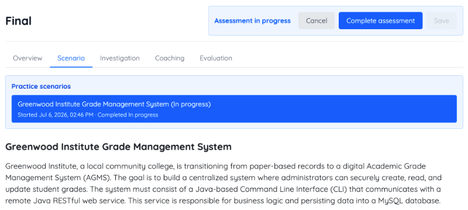
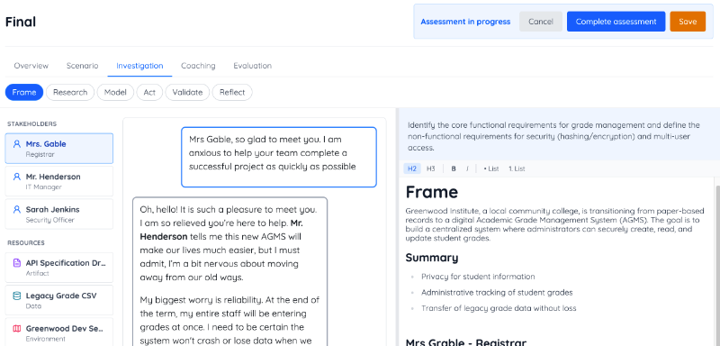
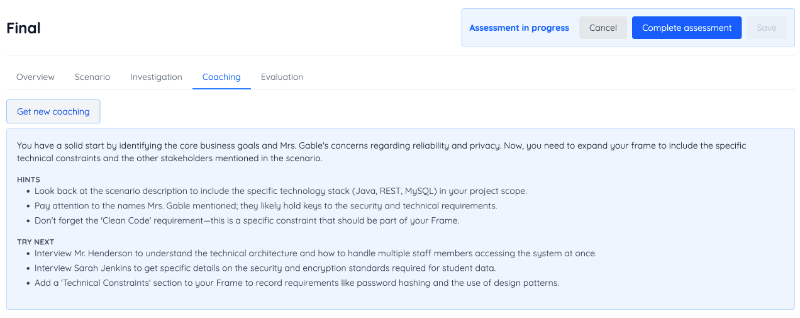
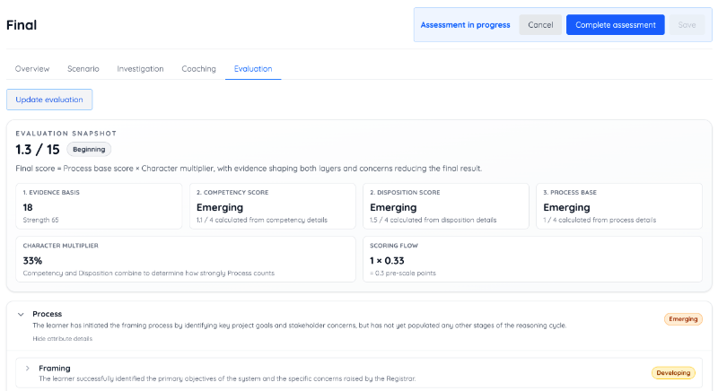

# Final Exam Review

The final exam places you in a generated scenario where you must design an application that demonstrates your mastery of the course outcomes. This simulation uses AI to generate the scenario, represent stakeholders in conversations, provide feedback, and evaluate your performance.

The simulation covers all topics addressed throughout the course. This includes the concepts used to build the Chess application and enrichment topics such as:

- [Computer Security](../computer-security/computer-security.md)
- [Concurrency](../concurrency/concurrency.md)
- [Distributed Application Architectures](/course/12f2522b-d70d-4982-89e4-171435b02a63/topic/55fcd10b-d313-4f56-b69b-7608d05242cf)

Because the system generates a new scenario each time you begin the simulation, you can practice the final as many times as you like before taking the actual assessment.

1. Navigate to the [Final](/course/12f2522b-d70d-4982-89e4-171435b02a63/topic/8be8beff-d55f-40e8-9941-9bb56ad303f9) topic.
    
1. To **practice**:
    1. Select **Generate scenario**.
    1. Read the scenario overview.
    
    1. Complete the investigation stages by interviewing stakeholders and reviewing resources.
    1. Create entries for each stage in the reasoning record.
    
    1. Use the **Coaching** tab to get suggestions on how to move forward.
    
    1. Use the **Evaluation** tab to get feedback on your work.
    
    1. Complete the practice assessment and repeat the process as often as you would like.
1. For the **final exam**:
    1. Select the **Start final assessment** option. 
    1. Complete the generated scenario by working through the investigation stages and creating your reasoning record.
    1. Note that the **Coaching** and **Evaluation** tabs are not available during the final assessment.
    1. **Submit the final** to receive your final evaluation.