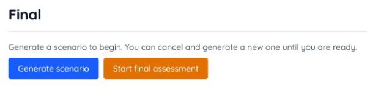

# Final Exam Review

The final exam puts you in a generated scenario where you must design an application that satisfies the 

This exam covers topics represented by everything covered in the course. This includes the topics you used for building the Chess application and other enrichment topics such as:

- [Computer Security](../computer-security/computer-security.md)
- [Concurrency](../concurrency/concurrency.md)
- [Distributed Application Architectures](/course/12f2522b-d70d-4982-89e4-171435b02a63/topic/55fcd10b-d313-4f56-b69b-7608d05242cf)

Since a new scenario is generated each time you begin the simulation, you can practice the final as many times as you would like before actually taking the final assessment.

1. Navigate to the [Final](/course/12f2522b-d70d-4982-89e4-171435b02a63/topic/8be8beff-d55f-40e8-9941-9bb56ad303f9) topic.
    
1. To practice:
    1. Select **Generate scenario**
    1. Read the scenario overview
    1. Go through all of the different investigation stages by interviewing stakeholders and resources.
    1. Create entries for each stage in the reasoning record.
    1. Use the **Coaching** tab to get suggestions about how to move forward.
    1. Use the **Evaluation** tab to get feedback on your work.
    1. Complete the practice assessment and repeat again if you would like.
1. To take the final chose **Start final assessment** option. Complete the generated scenario by going through the investigation stages and creating your reasoning record. Note that the **Coaching** and **Evaluation** tabs are not available when taking the final. **Submit the final** to see your final evaluation.