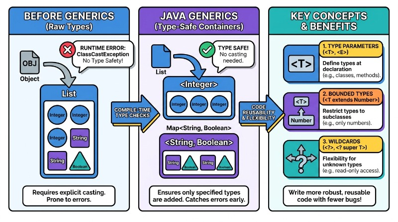

# Java Generics

🖥️ [Slides](https://docs.google.com/presentation/d/1a3aELn5tIIfY-g4-wOQ1vackTD4RacDn/edit?usp=sharing&ouid=114081115660452804792&rtpof=true&sd=true)

📖 **Required Reading**: Core Java for the Impatient

- Chapter 6: Generic Programming. _Only_ Sections 6.1-6.4

🖥️ [Lecture Videos](#videos)

**Generic programming** is a technique used in strongly typed languages, such as Java, C++, and C#, to reuse logic for classes or methods that differ only by the types of variables they operate on.

For example, consider the standard JDK class `ArrayList<T>`. The `<T>` syntax denotes a **type parameter**. When you instantiate an object from this class, you specify the specific type the generic should use. This allows you to create an `ArrayList` that contains only `String` objects or one that contains only `Integer` objects.

```java
var intList = new ArrayList<Integer>();
var stringList = new ArrayList<String>();

intList.add(3);
stringList.add("cow");

Integer integerItem = intList.get(0);
String stringItem = stringList.get(0);
```

If you attempt to add an integer to `stringList`, the compiler will generate a **compile-time error**. Furthermore, because the compiler knows the type parameter bound to the generic class, you do not need to perform manual type casting when retrieving items.

### Why Use Generics?

Before generics were introduced in Java 5, developers had to either create a separate class implementation for every supported type or use the `Object` class to represent data. Using `Object` required manual type casting, which is both tedious and error-prone.  Generics move these risks to compile-time, following the "fail-fast" design philosophy.



Consider the following use of a "raw" (non-generic) `ArrayList`:

```java
var list = new ArrayList(); // A raw list of Objects
list.add(3);
list.add("cow");

Integer integerItem = (Integer) list.get(0);
// The following line throws a ClassCastException at runtime
String stringItem = (String) list.get(0); 
```

Not only does this approach require the overhead of type casting, but it is also dangerous. Because the list can contain any type of object, the compiler cannot verify that your casts are correct. If you cast an object to the wrong type, your program will crash with a runtime exception. Generics move these errors from **runtime** to **compile-time**, making your code significantly safer.

## Writing Your Own Generic Classes

You can define your own generic classes by using placeholders for types. The following example creates a generic `Storage` object that can be initialized to hold any specific type.

While this example simply wraps an `ArrayList`, the same pattern can be used for more complex logic, such as a data access object that reads and writes different types of entities to a database.

```java
class Storage<T> {
    private List<T> items = new ArrayList<>();

    void add(T item) {
        items.add(item);
    }

    T get(int i) {
        return items.get(i);
    }
}

// Usage:
var intStorage = new Storage<Integer>();
var stringStorage = new Storage<String>();
```

In the example above, `T` is a placeholder. When you declare `Storage<Integer>`, the compiler treats `T` as an `Integer` for that specific instance.


## Design Principles in Java Generics

Java Generics are more than just a syntax for collections; they represent a fundamental shift toward safer and more maintainable software architecture. By leveraging generics, developers adhere to several core software design principles, most notably **Type Safety**, **DRY (Don't Repeat Yourself)**, and the **Liskov Substitution Principle**.

One of the primary principles demonstrated by generics is **Abstraction**. Generics allow a programmer to implement an algorithm or a data structure once, independent of the specific data types it will eventually handle. This decouples the logic of the container from the data it stores. For example, a `List<T>` defines the behavior of an ordered collection without needing to know whether it holds `String`, `Integer`, or a custom `User` object.

### The DRY Principle and Reusability

Without generics, creating a "Box" for different types would require either duplicating code or losing type specificity. Generics allow us to define a single template that works across various types while maintaining strict type checking.

```java
// Without Generics: High risk, low type safety
public class ObjectBox {
    private Object content;
    public void set(Object content) { this.content = content; }
    public Object get() { return content; }
}

// With Generics: Adheres to DRY and Type Safety
public class Box<T> {
    private T content;
    public void set(T content) { this.content = content; }
    public T get() { return content; }
}
```

### Key Design Benefits

The integration of generics into software design provides several architectural advantages:

1.  **Elimination of Explicit Casts:** The compiler inserts implicit casts, reducing boilerplate and making the code more readable.
2.  **Stronger Type Checks at Compile Time:** Errors are caught during development rather than in production.
3.  **Enabling Generic Algorithms:** Developers can write methods that work on different types of collections while still being type-safe (e.g., `Collections.sort()`).
4.  **Self-Documenting Code:** By looking at a signature like `Map<String, User>`, a developer immediately understands the expected input and output without digging into the implementation.

## ☑ Exercise


```masteryls
{"id":"456c8942-f1aa-46a0-b24e-3337ad969702", "title":"Generics", "type":"teaching" }
Generics seem complicated with strange syntax. I don't understand why I really need them.
```


````masteryls
{"id":"f470d4bb-9996-49d1-8e91-6bb2a7337fa6","title":"Java Generics Bounded Wildcards","type":"multiple-choice"}
Consider the following Java method which uses a bounded wildcard. Which of the following operations inside the method will cause a **compile-time error**?

```java
public void processElements(List<? extends Number> elements) {
    Number num = elements.get(0);
    Object obj = elements.get(0);
    elements.add(null);
    elements.add(10.5);
}
```

- [ ] `Number num = elements.get(0);`
- [ ] `Object obj = elements.get(0);`
- [x] `elements.add(10.5);`
- [ ] `elements.add(null);`
````

```masteryls
{"id":"28bf0130-6f80-4b48-b224-2d137bdf1339","title":"Intellectual Enlargement","type":"essay"}
How has learning to write flexible, reusable code with generics stretched the way you think about solving problems, and how does embracing such abstraction support the BYU aim of being intellectually enlarged?
```


## Videos

- 🎥 [Generic Types Overview (4:00)](https://byu.hosted.panopto.com/Panopto/Pages/Viewer.aspx?id=15993248-1fa0-47fa-ba6f-b0530109e081) - [transcript](https://github.com/user-attachments/files/18543997/CS_240_Generic_Types_Overview_Transcript.pdf)
- 🎥 [Using Generic Classes (6:49)](https://byu.hosted.panopto.com/Panopto/Pages/Viewer.aspx?id=ced1be5e-61a3-4dfd-b03f-b053010b6950) - [transcript](https://github.com/user-attachments/files/18544002/CS_240_Using_Generic_Classes_Transcript.pdf)
- 🎥 [Generic Type Wildcards (1:59)](https://byu.hosted.panopto.com/Panopto/Pages/Viewer.aspx?id=32ad9f28-5028-44d0-8bb2-b053010d7bc9) - [transcript](https://github.com/user-attachments/files/18544003/CS_240_Generic_Types_Wildcards_Transcript.pdf)

## Demonstration Code

📁 [KeyValuePair.java](example-code/KeyValuePair.java)

📁 [Pair.java](example-code/Pair.java)

📁 [PairUser.java](example-code/PairUser.java)

📁 [StringPair.java](example-code/StringPair.java)

📁 [interfaceExample](example-code/interfaceExample)