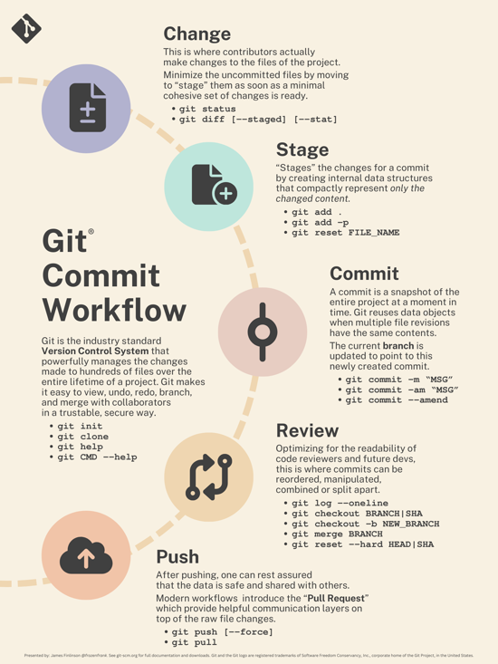
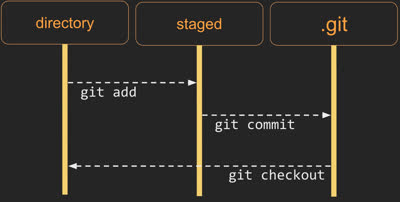
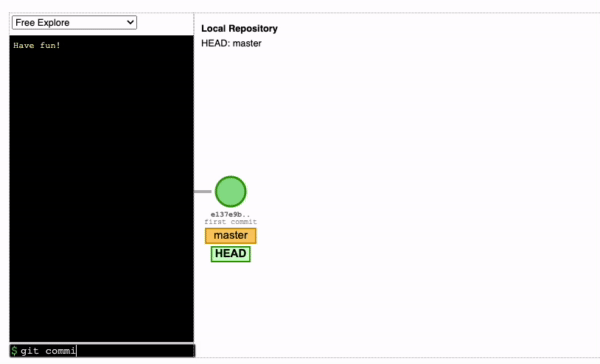
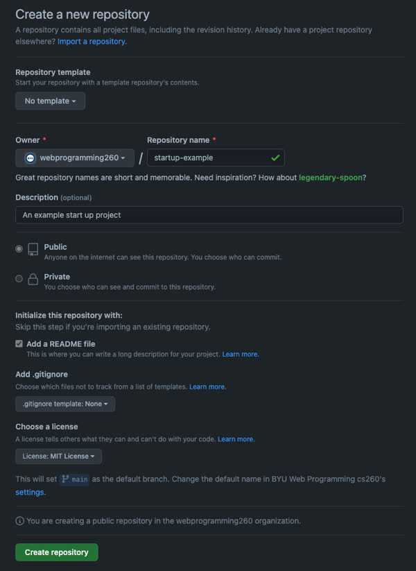
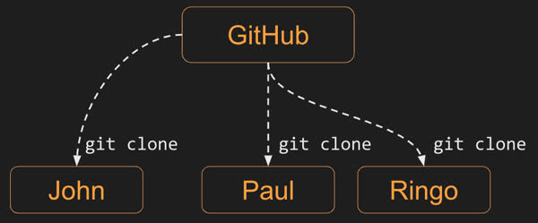
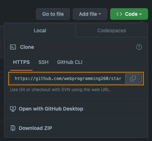
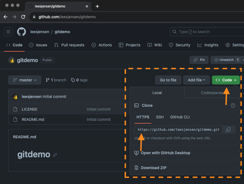
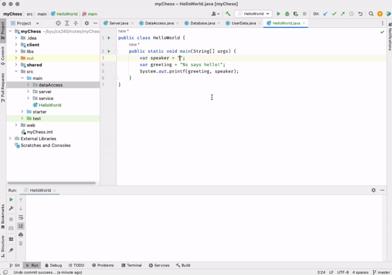

# Git


🖥️ [Slides](https://docs.google.com/presentation/d/1y4u5y9uNiekYcubilyhYLjUGVoYBqs4q/edit?usp=sharing&ouid=114081115660452804792&rtpof=true&sd=true)

🖥️ [Lecture Videos](#videos)

📖 **Required reading**:

- [GitHub: Create a repo](https://docs.github.com/en/get-started/quickstart/create-a-repo)
- [GitHub: Cloning a repo](https://docs.github.com/en/repositories/creating-and-managing-repositories/cloning-a-repository)
- [GitHub: Personal access tokens](https://docs.github.com/en/authentication/keeping-your-account-and-data-secure/creating-a-personal-access-token)

[Linus Torvalds](https://en.wikipedia.org/wiki/Linus_Torvalds), the creator of Linux, was dissatisfied with the proprietary version control software used to track the Linux kernel code. Over a single weekend, he built Git, which has since become the world's most popular version control system.


> _Source: Wikipedia_

> “Talk is cheap. Show me the code.”
>
> — Linus Torvalds

## Overview

Git is the industry-standard **Version Control System (VCS)**. It manages changes made to hundreds of files over the entire lifetime of a project, making it easy to view, undo, redo, branch, and merge code with collaborators in a secure and reliable way.

Git provides two primary functions. First, it allows you to track versions of files in a local directory. Second, it allows you to clone those versions to a different location—usually a remote server or another developer's computer. This instruction focuses on local version tracking; we will cover cloning repositories in detail when we discuss GitHub.

The general Git development workflow is illustrated in the following diagram:



To provide a reference for how often these stages occur, developers typically:

- **Change** files throughout the day.
- **Stage** and **commit** changes multiple times per hour.
- **Review** commits and **push** to a remote server about every hour.

## Installing Git

Before diving into Git, ensure it is installed in your development environment. Open a terminal and type `git --version`.

```sh
git --version
git version 2.32.0 (Apple Git-132)
```

If you do not see a version number, follow these [instructions](https://git-scm.com/book/en/v2/Getting-Started-Installing-Git) to install Git.

## Getting Started with Git

You can track file versions in any directory by initializing Git. To try this, create a new directory in your terminal and initialize it as a Git repository:

```sh
mkdir playingWithGit
cd playingWithGit
git init
```

If you list all files in the directory, you will see a hidden directory named `.git`.

```sh
ls -la
total 0
drwxr-xr-x   3 lee  staff    96 Dec  1 22:59 .
drwxr-xr-x+ 54 lee  staff  1728 Dec  1 23:00 ..
drwxr-xr-x   9 lee  staff   288 Dec  1 22:59 .git
```

The `.git` directory stores all version history. Now, use the `echo` command to create a file, then use `git status` to see how Git responds.

```sh
➜ echo hello world > hello.txt
➜ git status

On branch master
No commits yet
Untracked files:
  (use "git add <file>..." to include in what will be committed)
	hello.txt

nothing added to commit but untracked files present (use "git add" to track)
```

Git detects the new file `hello.txt` but isn't tracking it yet. To begin tracking versions, you must "add" the file. Usually, you want to track all files in a project, so you can tell Git to track everything new or modified with `git add .`.

```sh
git add .
git status

On branch master
No commits yet
Changes to be committed:
  (use "git rm --cached <file>..." to unstage)
	new file:   hello.txt
```

Git reports that it has **staged** the file `hello.txt`, meaning it is ready to be committed. A **commit** records a snapshot of the staged changes. Every commit should include a meaningful comment using the `-m` parameter.

```sh
git commit -m "initial draft"
[master (root-commit) d43b07b] initial draft
 1 file changed, 1 insertion(+)
 create mode 100644 hello.txt

git status
On branch master
nothing to commit, working tree clean
```

You have successfully committed your first file. While this example uses one file, a single commit can represent changes across many files. The staging (add) step allows you to choose exactly which files to include in a commit while leaving other modified files out.

Let's edit the file and commit it again. This time, we will use the `-a` parameter to automatically stage all tracked files that have been modified.

```sh
echo goodbye world > hello.txt
git commit -am "changed greeting to reflect the present mood"

[master e65f983] changed greeting to reflect the present mood
 1 file changed, 1 insertion(+), 1 deletion(-)
```

To view the history of your repository, use `git log`.

```sh
git log

commit e65f9833ca8ee366d0d9c1676a91b1a977dab441 (HEAD -> master)
Author: Lee
Date:   Thu Dec 1 23:32:22 2022 -0700

    changed greeting to reflect the present mood

commit d43b07b8890f52defb31507211ba78785bf6dccf
Author: Lee
Date:   Thu Dec 1 23:29:11 2022 -0700

    initial draft
```

## Commit SHA

Every commit has a unique identifier (a SHA-1 hash) generated based on the file changes, metadata, and the previous commit. You can refer to a specific commit using this SHA. For example, to switch back to a previous version and see its content, use the `checkout` command with the first few characters of the SHA.

```sh
git checkout d43b07b8890f

Note: switching to 'd43b07b8890f'.
HEAD is now at d43b07b initial draft

cat hello.txt
hello world
```

To return to the latest version, use `checkout` with the branch name (the default is often `master` or `main`).

```sh
git checkout master
Previous HEAD position was d43b07b initial draft
Switched to branch 'master'

cat hello.txt
goodbye world
```

The following diagram shows how changes move from your working directory to the staging area, and finally into the repository as a commit.



A commit is a full snapshot of the staged files. When you check out a commit, Git reverts the entire directory to that specific point in time.

## Diff

Instead of switching versions, you often just want to see what changed. Use the `diff` command to compare commits. You can compare two SHAs or use the `HEAD` variable, which points to the most recent commit. Use `~` followed by a number to reference previous commits (e.g., `HEAD~1` is the commit before the current one).

```sh
git diff HEAD HEAD~1
```

```diff
diff --git a/hello.txt b/hello.txt
index 3b18e51..eeee2af 100644
--- a/hello.txt
+++ b/hello.txt
@@ -1 +1 @@
-hello world
+goodbye world
```

## Branches

Git allows you to "branch" your code to work on new features without affecting the main codebase. For example, to work on "Feature A," you would create a branch with `git branch A` and switch to it with `git checkout A`. When the feature is complete, you switch back to the main branch and run `git merge A`. If you decide to abandon the feature, you simply delete the branch without merging it.

Here is a visualization of branching and merging:



## Commit Often

You are expected to commit frequently and consistently as you work on projects. A typical workflow involves:
1. An initial commit for project setup.
2. Commits for each individual piece of logic (e.g., a test case, an endpoint, or a query).
3. A final commit for the completed phase.

Committing often protects you from losing work, allows you to experiment safely, and makes collaboration easier. It also provides a clear history of your development efforts.

Remember to write meaningful commit messages that describe **what** changed and **why**. For tips on writing great messages, see [this guide](https://www.freecodecamp.org/news/how-to-write-better-git-commit-messages/).

## Binary Files

While Git can store any file type, be cautious with large binary files (images, videos, etc.). Git stores a full copy of a binary file every time it changes. If you commit a 10 GB video 10 times, your repository size will grow to 100 GB.

## GitHub

GitHub is a cloud-based service used to host Git repositories. It makes collaboration easier by providing a central location for teams to sync their code. GitHub also includes tools for hosting websites, project management, issue tracking, and AI-driven code generation.

### Creating and Cloning a Repository

While you can initialize a repository locally and then connect it to GitHub, it is **always** easier to create the repository on GitHub first and then clone it to your machine.

To create a repository:
1. Log in to GitHub and go to the **Repositories** tab.
2. Click **New**.
3. Name the repository `testbyu240`, add a description, and choose to make it public.
4. Initialize with a README.md and a license.



Every GitHub repository has a unique URL. Anyone with access can "clone" it—creating an exact copy of the repository (including all history) on their local computer.



To clone, copy the HTTPS URL from the green **Code** button on the GitHub repository page.



Run the clone command from your terminal in the directory where you store your projects:

```sh
git clone https://github.com/YOURACCOUNT/testbyu240.git

Cloning into 'testbyu240'...
remote: Total 4 (delta 0), reused 0 (delta 0), pack-reused 0
Receiving objects: 100% (4/4), done.

cd testbyu240
```

Modify the README.md file to contain the text: `my first commit`, and then commit the file and push your changes back up to GitHub.


```sh
echo "my first commit" >> README.md
git commit -am "My first commit"
git push
```


## IntelliJ and Git

While the command line is powerful, IDEs like IntelliJ IDEA provide a visual interface that simplifies Git operations.

### One-Time Setup
1. Install Git.
2. Create a GitHub account.
3. Configure IntelliJ to access GitHub (via OAuth or a Personal Access Token).

### Per-Project Steps
1. Create a GitHub repository first.
2. Copy the GitHub repository URL.
   
3. Clone the repository to your local machine via the terminal or IntelliJ's "Get from VCS" option.
4. Open or create your project in that cloned directory.
5. Make a change, commit, and push to verify the connection.

In IntelliJ, use the **Commit** tab (on the left) to view changes, compare versions, and perform "Commit and Push" operations.



You can also use the **Git** tab (at the bottom) to view the commit history, which allows you to see when changes were introduced or revert to earlier versions.

### Connecting an Existing IntelliJ Project to GitHub

If you have a local Git repository that isn't connected to GitHub yet:

1. Create a new repository on GitHub (do not initialize it with a README or license).
2. Set the remote origin in your local terminal:
   ```sh
   git remote add origin https://github.com/YOURACCOUNT/YOURREPO.git
   ```
3. Push your code for the first time, setting the upstream branch:
   ```sh
   git push -u origin main
   ```


## ☑ Exercise


```masteryls
{"id":"955c39cf-a2b9-45ba-9cb4-62fde6b482a1", "title":"Git practice", "type":"url-submission", "syncGrade":false, "autoGrade":false, "validateUrl":true, "gradingCriteria":"- The response contains the text `My first commit", "urlPrompt":"Convert the user provided URL to create a URL that is the path to the raw GitHub content for the README.md file." }
Create the `testbyu240` GitHub repository, clone the repo, make the changes, and push the changes back up to GitHub as explained above.

Submit the URL of your test GitHub repository.

_Example: https://github.com/youraccount/testbyu240_

After you have successfully submitted your URL, you may delete the GitHub repository.
```


## Videos

- 🎥 [Git Overview (4:50)](https://byu.hosted.panopto.com/Panopto/Pages/Viewer.aspx?id=57cf5ee3-521c-470e-987b-b169014cdec4) - [[transcript]](https://github.com/user-attachments/files/17738322/CS_240_Git_Overview_Transcript.pdf)
- 🎥 [Install and Configure Git (5:11)](https://byu.hosted.panopto.com/Panopto/Pages/Viewer.aspx?id=87ddb22d-729b-44ec-a476-b169014e892b) - [[transcript]](https://github.com/user-attachments/files/17738329/CS_240_Install_and_Configure_Git_Transcript.pdf)
- 🎥 [Creating a Local Git Repository (6:56)](https://byu.hosted.panopto.com/Panopto/Pages/Viewer.aspx?id=dfad1615-37dd-4416-b22c-b16901505d17) - [[transcript]](https://github.com/user-attachments/files/17738340/CS_240_Creating_a_Local_Git_Repository_Transcript.pdf)
- 🎥 [Commits (5:44)](https://byu.hosted.panopto.com/Panopto/Pages/Viewer.aspx?id=99d9a734-fcc7-4b21-b312-b1690152b5a0) - [[transcript]](https://github.com/user-attachments/files/17738354/CS_240_Commits_Transcript.pdf)
- 🎥 [Basic Git Commands (9:34)](https://byu.hosted.panopto.com/Panopto/Pages/Viewer.aspx?id=fce3f593-caa1-4c76-9327-b1690154d107) - [[transcript]](https://github.com/user-attachments/files/17738363/CS_240_Basic_Git_Commands_Transcript.pdf)
- 🎥 [.gitignore (5:14)](https://byu.hosted.panopto.com/Panopto/Pages/Viewer.aspx?id=0963f0ab-08ef-48e8-88c6-b1690157c264) - [[transcript]](https://github.com/user-attachments/files/17738368/CS_240_.gitignore_Transcript.pdf)
- 🎥 [Renaming, Moving, and Deleting Files (4:44)](https://byu.hosted.panopto.com/Panopto/Pages/Viewer.aspx?id=164be31f-0638-4517-afd7-b16901599a70) - [[transcript]](https://github.com/user-attachments/files/17738375/CS_240_Renaming_Moving_and_Deleting_Files_Transcript.pdf)
- 🎥 [IntelliJ Git Integration (5:05)](https://byu.hosted.panopto.com/Panopto/Pages/Viewer.aspx?id=99d7bc8f-4605-4948-87ee-b169015b41d1) - [[transcript]](https://github.com/user-attachments/files/17738392/CS_240_IntelliJ_Git_Integration_Transcript.pdf)
- 🎥 [Git Tips (3:41)](https://byu.hosted.panopto.com/Panopto/Pages/Viewer.aspx?id=cd651660-5fcd-4249-950d-b169015ddf09) - [[transcript]](https://github.com/user-attachments/files/17738394/CS_240_Git_Tips_Transcript.pdf)
- 🎥 [GitHub Overview (11:22)](https://byu.hosted.panopto.com/Panopto/Pages/Viewer.aspx?id=1750077c-a834-437e-86ef-b169015f60d8) - [[transcript]](https://github.com/user-attachments/files/17738402/CS_240_GitHub_Overview_Transcript.pdf)
- 🎥 [GitHub Set Up (9:59)](https://byu.hosted.panopto.com/Panopto/Pages/Viewer.aspx?id=27cf1095-6538-4ff2-a12f-b16901630775) - [[transcript]](https://github.com/user-attachments/files/17738408/CS_240_GitHub_Set_Up_Transcript.pdf)
- 🎥 [GitHub Demo (4:29)](https://byu.hosted.panopto.com/Panopto/Pages/Viewer.aspx?id=1bd5974c-a15b-45ef-b3df-b16901665e90) - [[transcript]](https://github.com/user-attachments/files/17738411/CS_240_GitHub_Demo_Transcript.pdf)