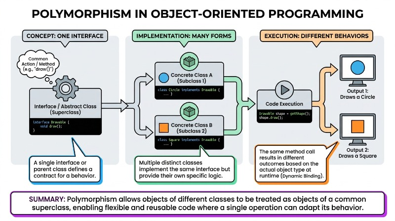
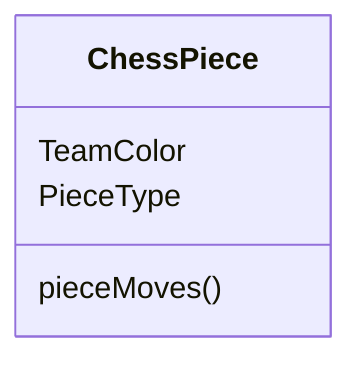
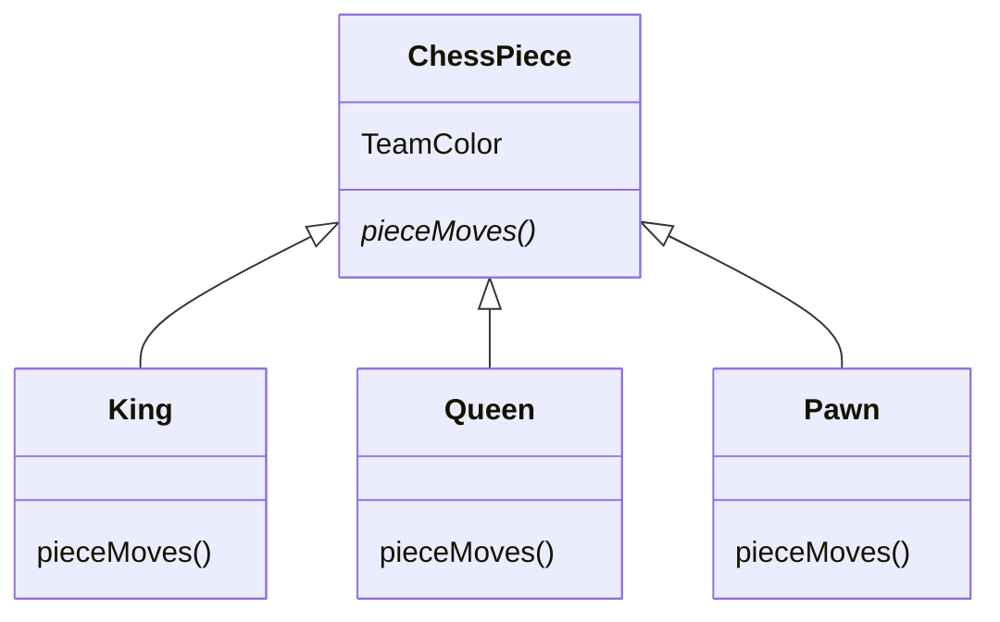
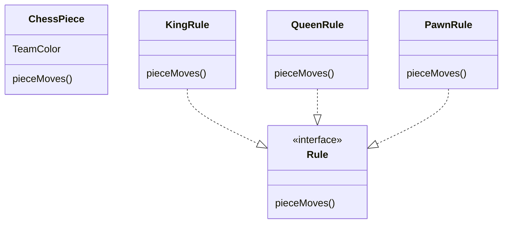
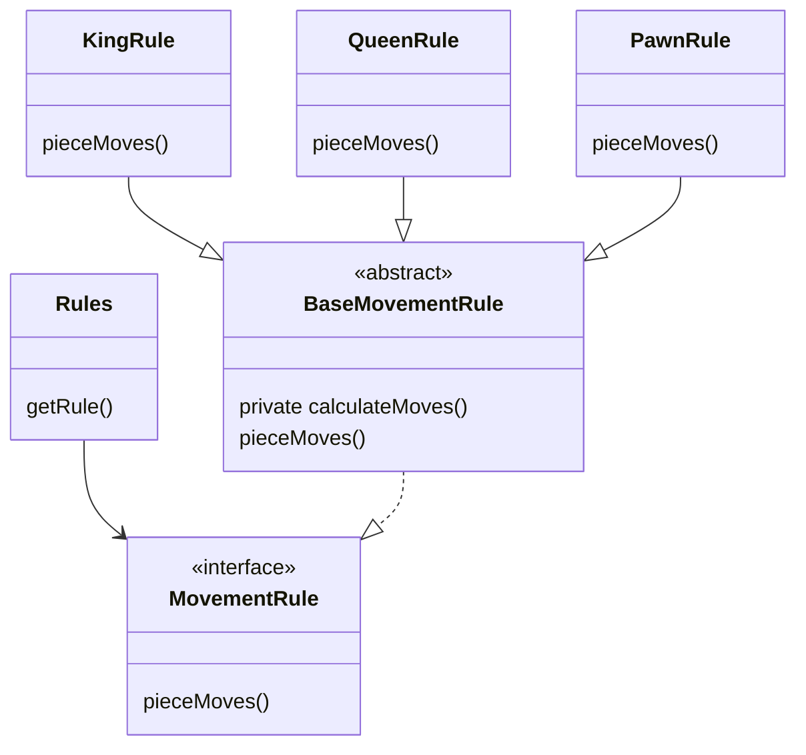

# Interfaces and Abstract Classes

🖥️ [Slides](https://docs.google.com/presentation/d/1eaSGnq2FCGd7jNWve1W-LSNrERGUj7nT)

📖 **Required Reading**: Core Java for the Impatient

- Chapter 3:
  - Section 1 - Interfaces
  - Section 2 - Static, Default, and Private Methods
  - Section 3 - Examples of Interfaces
- Chapter 4:
  - Section 1 - Extending a Class
  - Section 2 - Object: The Cosmic Superclass
  - Section 3 - Enumerations

🖥️ [Lecture Videos](#videos)

## Polymorphism

### 🔑 Key points

- What polymorphism is
- What abstract classes are and when to use them
- What interfaces are and when to use them
- How interfaces and abstract classes are similar and how they differ
- How to implement an interface in a class
- How to create an interface
- How to implement inheritance in Java

---

Polymorphism is a term used in computer science to describe the ability of an object to take on many (poly) forms (morph) to fit into different contexts. In Java, inheritance and interfaces are the primary ways to achieve polymorphism. You use the `extends` keyword to inherit functionality from another class and the `implements` keyword to adhere to an interface definition. Polymorphism allows you to decouple, or abstract, a class's internal implementation from its external usage. This decoupling ensures you can significantly alter a class's internals without changing how the class is used by other parts of the program.



## Interfaces

Interfaces allow you to define *what* a class does without specifying *how* it does it. This allows you to create and supply alternative implementations for the same interface. For example, you can have an interface that defines what a `List` can do, and then create classes that provide different implementations of that `List`. One implementation might use less memory, while another is optimized for speed. You can then write code that uses the `List` interface without needing to know whether it is using the fast version or the memory-efficient version.

```java
public interface List<E> extends SequencedCollection<E> {
    void add(int index, E element);
    E remove(int index);
    int size();
    void clear();
    ListIterator<E> listIterator();
}
```

The following example shows two implementations of a `List`: one that uses an array (`ArrayList`) and one that uses a linked list (`LinkedList`). Both lists can be passed to the `addAndPrint` method. This method does not need to know the specific implementation of the list; it only needs to know that it can call the `add` method defined by the interface.

```java
import java.util.List;
import java.util.ArrayList;
import java.util.LinkedList;

public class ListExample {
  public void listExample() {
    // Represent two different implementations of the List interface.
    List<String> list1 = new ArrayList<>();
    List<String> list2 = new LinkedList<>();

    addAndPrint(list1, "vanilla");
    addAndPrint(list2, "taco");
  }

  // This function takes any implementation of the List interface.
  private void addAndPrint(List<String> list, String value) {
    // The add method is defined on the List interface.
    list.add(value);
    System.out.println(value);
  }
}
```

Note that because `addAndPrint()` only knows that `list` implements the `List` interface, it can only call methods declared in that interface. If `LinkedList` had an additional method not declared in the `List` interface, `addAndPrint()` could not call that method on the `list` parameter, even if a `LinkedList` object was passed in.

## Writing Your Own Interface

In addition to using standard JDK interfaces, you can define your own interfaces and write classes that implement them. Creating an interface is similar to creating a class, but you use the `interface` keyword and typically only define the signatures of the methods.

For example, if you wanted to create a specialized iterator that returns each character in a string, you could write the following:

```java
public interface CharIterator {
    /** Returns true if there is another character to iterate. */
    boolean hasNext();

    /** Returns the next character. */
    char next();
}
```

You can then implement the `CharIterator` interface by using the `implements` keyword in your class declaration and providing the logic for each method. The `@Override` annotation is not strictly required by the compiler, but it is a best practice to clarify that the method is implementing an interface requirement.

```java
public class AlphabetIterator implements CharIterator {
    int current = 0;
    String charString = "abcdefg";

    @Override
    public boolean hasNext() {
        return current < charString.length();
    }

    @Override
    public char next() {
        return charString.charAt(current++);
    }
}
```

## Extending Classes

Inheritance allows a class to derive fields and methods from another class. In Java, every class implicitly extends the `Object` class unless specified otherwise, meaning they inherit `Object`'s methods (like `toString()` and `equals()`). You can explicitly inherit from a specific class using the `extends` keyword. 

In the following example, `SubClass` extends `SuperClass`. `SubClass` can access the `SuperClass` implementation of `toString()` using the `super` keyword.

```java
public static class SuperClass {
    String name = "super";

    @Override
    public String toString() {
        return name;
    }
}

public static class SubClass extends SuperClass {
    @Override
    public String toString() {
        return "Sub-class of " + super.toString();
    }
}
```

## Abstract Classes

Abstract classes provide a different form of polymorphism. Unlike interfaces—where the implementing class must provide all functionality—an abstract base class can provide some implementation while leaving other methods to be defined by subclasses.

The JDK's `Iterator` interface allows you to traverse a collection of objects:

```java
public interface Iterator<E> {
    boolean hasNext();
    E next();
}
```

We can create an abstract class that implements the `Iterator` interface to return characters from a string, while also defining a new abstract method that subclasses must implement. This is done by using the `abstract` keyword on the method without providing a body.

Think of abstract classes as a hybrid between a standard class and an interface.

```java
/**
 * The abstract keyword signifies that this class contains methods
 * that must be implemented by a subclass.
 */
public static abstract class AlphabetIterator implements Iterator<String> {
    int current = 0;
    String charString = "abcdefg";

    public boolean hasNext() {
        return current < charString.length();
    }

    public String next() {
        return charString.substring(current, ++current);
    }

    /**
     * This method is not implemented here, so it must be 
     * implemented by any non-abstract subclass.
     */
    public abstract String nextWithPrefix(String prefix);
}
```

A subclass `extends` the abstract class and provides the implementation for `nextWithPrefix`. In this example, we also override the `next` method to include a default prefix.

Note the use of the `super` keyword in the `nextWithPrefix` function. This allows the subclass to call the original `next` implementation from the abstract base class. Without `super.next()`, calling `next()` would result in a recursive infinite loop.

```java
public static class PrefixAlphabetIterator extends AlphabetIterator {
    @Override
    public String next() {
        return nextWithPrefix(String.format("%d.", current + 1));
    }

    @Override
    public String nextWithPrefix(String prefix) {
        return String.format("%s %s", prefix, super.next());
    }
}
```

Like interfaces, the name of the abstract class can be used as a type to represent any of its subclasses.

```java
public static void main(String[] args) {
    AlphabetIterator iter = new PrefixAlphabetIterator();
    print(iter);
}

public static void print(AlphabetIterator iter) {
    while (iter.hasNext()) {
        System.out.println(iter.nextWithPrefix("+ "));
    }
}
```

## instanceof

Polymorphism is powerful because it allows code to interact with objects through a shared interface. For instance, a list of `Object` types can hold `String`, `Integer`, or `Person` objects interchangeably. However, you sometimes need to determine an object's specific type at runtime. This is where the `instanceof` operator is used. It returns `true` if an object is an instance of a specific class or implements a specific interface.

```java
if ("I am a string" instanceof String) {
  // This will be true
}
```

In the following example, we iterate over a list of different types and use `instanceof` to execute specific logic based on the type of each item.

```java
public static void main(String[] args) {
    List<Object> list = List.of('a', "b", 3);

    for (var item : list) {
        if (item instanceof String) {
            System.out.println("String");
        } else if (item instanceof Integer) {
            System.out.println("Integer");
        } else if (item instanceof Character) {
            System.out.println("Character");
        }
    }
}
```

Starting in Java 17, **pattern matching for `instanceof`** allows you to test the type and cast it to a variable in a single statement, making the code cleaner and safer.

```java
public class PatternMatchInstanceOfExample {
    public static void main(String[] args) {
        List<Object> list = List.of('a', "b", 3);
        for (var item : list) {
            if (item instanceof String stringItem) {
                System.out.println(stringItem.toUpperCase());
            } else if (item instanceof Integer intItem) {
                System.out.println(intItem + 100);
            } else if (item instanceof Character charItem) {
                System.out.println(charItem.compareTo('a'));
            }
        }
    }
}
```

## final

If you want to prevent a subclass from overriding a method, you can mark that method as `final`. You can also use the `final` keyword on fields to make them immutable (meaning the reference cannot be changed once assigned). Note that `final` on an object field prevents reassignment of the variable, but it does not prevent the object itself from being modified through its own methods (unlike `const` in C++).

```java
public class FinalExample {
    /** This variable cannot be reassigned */
    final double PI = 3.14;

    /** This method cannot be overridden by subclasses */
    final public double getPI() {
        return PI;
    }
}
```

## Thinking about Chess

Applying these concepts to a Chess program requires careful design. How should chess pieces be abstracted? Should the piece type be a simple data field?



Or would it be more appropriate to use inheritance with an abstract class?



Alternatively, should the movement rules be decoupled from the piece itself? In this scenario, the `ChessPiece` represents properties (like color), while a `Rule` interface handles the logic.



You could even combine these concepts to create a more robust architecture for game rules.



Deciding which approach to take is a core part of software design.

## Videos

- 🎥 [Polymorphism (5:53)](https://byu.hosted.panopto.com/Panopto/Pages/Viewer.aspx?id=23d2e58e-9628-43a4-9aaa-ad640141e7dc&start=0) - [[transcript]](https://github.com/user-attachments/files/17804824/CS_240_Polymorphism.pdf)
- 🎥 [Polymorphism Example Part 1 (3:33)](https://byu.hosted.panopto.com/Panopto/Pages/Viewer.aspx?id=88adc709-e900-47d6-9e9a-ad64014400ad&start=0) - [[transcript]](https://github.com/user-attachments/files/17804825/CS_240_Polymorphism_Example_Part1.pdf)
- 🎥 [Polymorphism Example Part 2 (5:55)](https://byu.hosted.panopto.com/Panopto/Pages/Viewer.aspx?id=ebfcd403-53e4-4b68-8a3d-ad6401453df4&start=0) - [[transcript]](https://github.com/user-attachments/files/17738597/CS_240_Polymorphism_Example_Part_2_Transcript.pdf)
- 🎥 [Polymorphism Example Part 3 (9:33)](https://byu.hosted.panopto.com/Panopto/Pages/Viewer.aspx?id=f451dd38-e32d-445f-be0d-ad6401470c45&start=0) - [[transcript]](https://github.com/user-attachments/files/17804827/CS_240_Polymorphism_Example_Part3.pdf)
- 🎥 [Creating an Interface (3:03)](https://byu.hosted.panopto.com/Panopto/Pages/Viewer.aspx?id=2da0fb3a-7aca-4344-a42b-ad640149f9e2&start=0) - [[transcript]](https://github.com/user-attachments/files/17804828/CS_240_Creating_an_Interface.pdf)
- 🎥 [Implementing an Interface (2:27)](https://byu.hosted.panopto.com/Panopto/Pages/Viewer.aspx?id=f7ec17c1-c815-429b-8ffd-ad64014b0921&start=0) - [[transcript]](https://github.com/user-attachments/files/17804829/CS_240_Implementing_an_Interface.pdf)