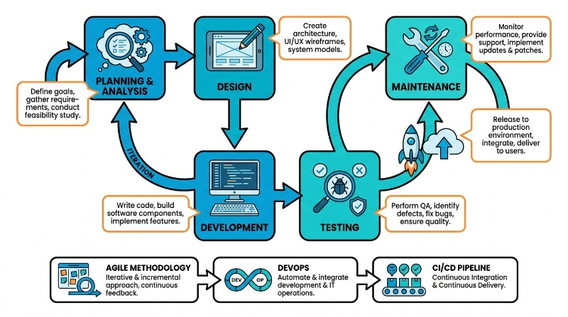
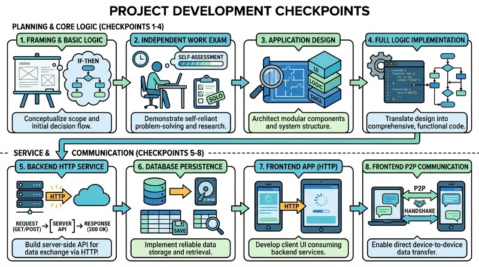
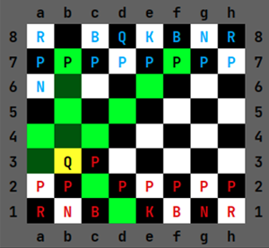
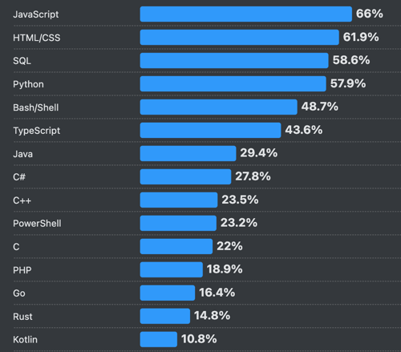
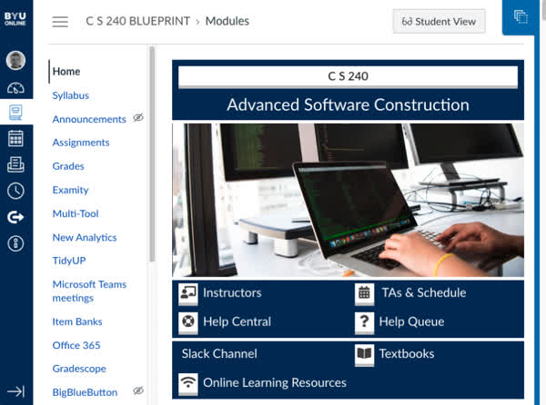
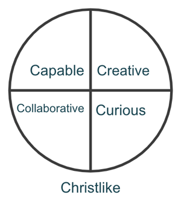

# Introduction

🖥️ [Lecture Videos](#videos)

Welcome to Computer Science 240: `Advanced Software Construction`. This course focuses on how professional software developers build complex applications. Throughout this course, you will gain experience with the skills and technologies used in the real world of software construction, including software design, data modeling, object-oriented programming, distributed communication, relational databases, and testing.

In previous courses, you likely focused on building small programs designed to teach specific concepts. While these programs are helpful for learning fundamentals, they often do not require the rigorous design, engineering, and tooling necessary to create professional-grade applications.

## Software Engineering

The term "software engineering" was first used in conjunction with the software created for the Apollo moon landings. Margaret Hamilton, the director of the software division, described their work as being comparable to hardware engineering in complexity and design, arguing that it should be called `software engineering`. Her careful design of the landing system's redundancy capabilities is credited with saving the Apollo 11 mission from aborting during the final minutes of the historic first moon landing.


> _Source: Wikipedia_

> “Looking back, we were the luckiest people in the world. There was no choice but to be pioneers; no time to be beginners.”
>
> — Margaret Hamilton

## Defining Software Engineering

Software engineering is more than just writing code; it is a systematic, disciplined, and quantifiable approach to the development, operation, and maintenance of software. While a programmer might focus on solving a specific logic problem or building a single feature, a software engineer looks at the entire lifecycle of a system. This involves ensuring that the software is scalable, maintainable, reliable, and built within budget and time constraints.

At its core, software engineering applies engineering principles—the same rigor used to build bridges or airplanes—to digital systems. This is necessary because software has become incredibly complex. Modern applications often involve millions of lines of code, distributed teams, and the need to run on diverse hardware. Without a structured engineering approach, projects often suffer from "software crisis" symptoms: exceeding budgets, missing deadlines, and suffering from numerous bugs.

To manage this complexity, software engineers follow a structured process known as the Software Development Life Cycle (SDLC). This ensures that every phase of the project is documented and verified.



It is helpful to distinguish between "programming" and "software engineering." While they overlap, the scope of software engineering is significantly broader.

*   **Programming:** Primarily concerned with the act of writing code and implementing algorithms. It is often a solitary activity focused on making a specific module work.
*   **Software Engineering:** Concerned with the entire system. It includes requirements gathering, architectural design, team collaboration, testing strategies, and long-term maintenance.

For example, consider the difference in how a simple task is handled. A programmer might write a script to process data once. A software engineer writes a robust service that handles errors, logs activity, and can be easily updated by other team members.


### Example: Modular Design

One key principle of software engineering is **modularity**. Instead of writing one giant file of code (a "monolith"), engineers break systems into smaller, reusable components.

**Poor Approach (Hard to maintain):**
```java
public class Main {
    public static void main(String[] args) throws java.io.IOException {
        // Monolithic: Logic is tightly coupled to a specific file and the console
        // Brittle: No error handling; the entire program crashes if the file is missing
        byte[] encoded = java.nio.file.Files.readAllBytes(java.nio.file.Paths.get("file.txt"));
        System.out.println("Result: " + new String(encoded).trim().toUpperCase());
    }
}
```

**Software Engineering Approach (Modular and Testable):**
```java
public class DataProcessor {
    
    /** Loads raw data from a source. */
    public String loadData(String filepath) {
        try {
            return Files.readString(Paths.get(filepath));
        } catch (IOException e) {
            return "Error loading file: " + e.getMessage();
        }
    }

    /** Applies business logic to data. */
    public String processData(String rawContent) {
        if (rawContent == null) {
            return "";
        }
        return rawContent.trim().toUpperCase();
    }

    /** Extracts the file from the command-line or uses default */
    private static String getFilePath(String[] args) {
        if (args != null && args.length > 0) {
            return args[0];
        }
        return "file.txt";
    }

    public static void main(String[] args) {
        DataProcessor processor = new DataProcessor();
        
        String filepath = getFilePath(args);
        String content = processor.loadData(filepath);
        String result = processor.processData(content);
  
        System.out.println("Result: " + result);
    }
}
```

By separating concerns, the software engineer makes it possible to test the `processData` function independently of the file system, making the code more reliable and easier for a team to manage.

## Chess Project

To teach the principles of software engineering, we need an application with enough complexity to warrant a structured architectural approach, yet simple enough that you do not get lost in the details.

We have chosen a multiplayer, full-stack implementation of the game of [chess](../../chess/chess.md) as your mastery project. Your development work is divided into different phases, each demonstrating a different architectural concept or technology. The first phase implements the rules of chess.

After implementing the first phase, you will rewrite the code from the base project template—from memory and without external help—during a timed exam. This demonstrates your ability to work independently under pressure. Writing code efficiently under a deadline is an essential skill that prepares you for the realities of professional programming.



The remaining phases involve implementing a chess server that allows multiple client programs to connect, register users, and play games.



## Java

You will use the Java programming language for all your work in this course. Java has been a leading industry language for decades. According to the [2025 Stack Overflow survey](https://survey.stackoverflow.co/2025/technology#most-popular-technologies), Java is used by approximately 30% of professional developers. Java is object-oriented, compiled, garbage-collected, and strongly typed. Mastering Java will significantly strengthen both your technical skill set and your resume.



To learn Java effectively, you will need to reference selected chapters of the book *Core Java for the Impatient*. This book is available for free through the Safari Books collection via the Harold B. Lee Library. You should also utilize the many online resources available for mastering Java concepts.


> [!NOTE]
> It is critical that you reserve significant time to learn Java outside of class. In-class instruction focuses on project architecture, complex concepts, and common pitfalls. It is assumed that you will learn the basics of Java syntax and standard libraries through independent study.

## Enrichment Lectures

Towards the end of the course, while you are finalizing your chess program, the course topics will focus on enrichment material essential for professional developers. While these topics are not directly reflected in your project work, they represent the bulk of the material covered by the final exam. These include topics such as security, concurrency, and Java command-line tools.

## Canvas

While all course instruction is hosted on GitHub, we use Canvas for notifications, project submissions, exams, and grades.



> [!IMPORTANT]
> Ensure you have enabled Canvas to send notifications to an email account that you monitor regularly. Missing important notifications could negatively impact your progress and grade.

## Well-Rounded Software Engineers

Becoming an exceptional software engineer requires continual improvement in four key areas.



1.  **`Capable`** - You must know the technology. The better you understand your tools, the better you can leverage their capabilities. Discerning between meaningful technology and marketing-driven fads allows you to find valuable tools and avoid distractions. Technical expertise enables you to choose the right tool for the job, maximize performance, and automate execution.
2.  **`Creative`** - Creativity is not limited to the arts. There is immense art in making software usable, efficient, and maintainable. Organizing and sculpting code is a creative process. Well-designed systems are often described as "beautiful" or "elegant," reflecting the creativity of their authors.
3.  **`Collaborative`** - Software is rarely built or used in isolation. Applications are typically created by teams of contributors with diverse backgrounds for large groups of customers. The ability to work within a team and interact with customers is essential. This requires strong social skills: speaking, writing, reading, presenting, and—most importantly—listening.
4.  **`Curious`** - A questioning mind makes a significant difference. Simply completing a task is not enough. Progress is made by wanting to know why a task is useful, searching for alternative solutions, digging into the inner workings of "black boxes," and questioning accepted facts. Cultivating a love for lifelong learning will take you from adequate to exceptional.

> “When hiring we look for the ability to collaborate, creativity, curiosity, and expertise”
>
> — Tim Cook, ([source](https://appleinsider.com/articles/22/10/03/if-you-want-to-work-for-apple-you-need-these-four-traits))

## Thinking Celestial

By developing software engineering skills, you can have a significant impact for good. You can elevate this impact further by applying additional principles:

1.  **Divine Inspiration** - Seeking divine help and direction in your efforts can help you avoid unproductive paths and achieve results beyond your natural abilities.
2.  **Eternal Perspective** - Looking beyond project deadlines, diplomas, or careers allows you to focus on a purpose guided by the eternal rather than the momentary.

As you tap into these principles, you will find greater motivation and enjoyment in your work. Emphasize being Christlike as you navigate your professional and personal journey.

> “The temple is a place of revelation. There you are shown how to progress toward a celestial life. There you are drawn closer to the Savior and given greater access to His power. There you are guided in solving the problems in your life, even your most perplexing problems.”
>
> — President Russell M. Nelson, ([source](https://www.churchofjesuschrist.org/study/general-conference/2023/10/51nelson))

## Making Mistakes

Making mistakes is a vital component of learning. Embracing the power of mistakes will help you learn faster and more deeply. Many of history's most important discoveries resulted from understanding errors. No one learns to walk without falling. However, you should establish a framework to make mistakes safely—using version control repositories, notebooks, simulations, peer reviews, and automation to minimize their impact on your progress.

Approach new challenges with the attitude that you will learn through trial and error. This mindset prevents mistakes from becoming a barrier to your growth.

> “To make no mistakes is not in the power of man; but from their errors and mistakes the wise and good learn wisdom for the future.”
>
> — Plutarch

## Mastery Demonstration

Your mastery of advanced software construction is evaluated based on the following areas:

| Area           | Percentage |
| -------------- | ---------- |
| Chess Project  | 90%        |
| Phase 0 Exam   | 5%         |
| Final Exam     | 5%         |

More important than your grade is the degree to which you stretch yourself. Software construction takes decades to master. If you approach this subject intentionally, with effort and curiosity, your value as a software engineer will increase greatly.

Take time during the course to dive deep into topics you find interesting. Learn from external sources to gain a wide perspective. Question what is being taught and seek better ways to construct software. With this attitude, **you** might lead the next revolution in software construction.

## ☑ Exercise


```masteryls
{"id":"ce3d8811-e669-4b43-a13c-b037d81e0d0f","title":"Defining Software Engineering","type":"multiple-choice"}
What is the primary factor that distinguishes software engineering from simple programming?

- [ ] Software engineering is only concerned with writing code in complex languages like Java
- [ ] Programming is done by teams, while software engineering is always done individually
- [ ] Software engineering is the process of fixing bugs after a programmer has finished the code
- [x] Software engineering applies a systematic, disciplined approach to the entire software lifecycle
```

```masteryls
{"id":"e90d5eb9-6d56-454d-a036-0bb576b1322c", "title":"Disciplinary Excellence", "type":"essay", "gradingCriteria":"- Addresses the prompt directly\n- Uses at least one concrete example\n- Demonstrates accurate understanding of key concepts" }
How does taking ownership of the long-term impact of your software prepare you to become a leader who blesses others through your profession?
```

```masteryls
{"id":"2fdc2fdb-e3de-49c9-ba25-f66b0da68d1a", "title":"Canvas notifications", "type":"multiple-choice" }
We often send out critical notifications for the course using Canvas announcements. Log into Canvas and verify that you have the correct email address and notification settings associated with your account.

- [x] My email address is associated with Canvas, and I frequently check for notifications.
- [ ] I want to stay in the dark and miss important notifications.
```

## Videos

- 🎥 [Course Overview (10:34)](https://byu.hosted.panopto.com/Panopto/Pages/Viewer.aspx?id=080df794-9d59-426b-b7c8-b19c0109e6f1) - [[transcript]](https://github.com/user-attachments/files/17738690/CS_240_Course_Overview_Transcript.pdf)
- 🎥 [Course Policies (14:19)](https://byu.hosted.panopto.com/Panopto/Pages/Viewer.aspx?id=ac43c852-5712-4dca-9003-b19c010d56e7) - [[transcript]](https://github.com/user-attachments/files/17738697/CS_240_Course_Policies_Transcript.pdf)
- 🎥 [Keys to Success (5:53)](https://byu.hosted.panopto.com/Panopto/Pages/Viewer.aspx?id=4eba6882-83ff-4e95-b498-b19c0111a009) - [[transcript]](https://github.com/user-attachments/files/17738704/CS_240_Keys_to_Success_in_CS_240_Transcript.pdf)
- 🎥 [GitHub Site Review (14:29)](https://byu.hosted.panopto.com/Panopto/Pages/Viewer.aspx?id=07624a65-7b70-4198-904b-b19c0113f64a) - [[transcript]](https://github.com/user-attachments/files/17738706/CS_240_Github_Site_Review_Transcript.pdf)