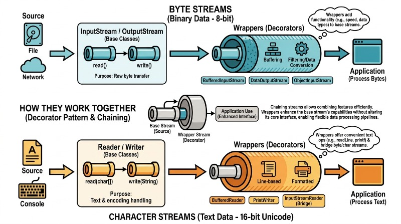
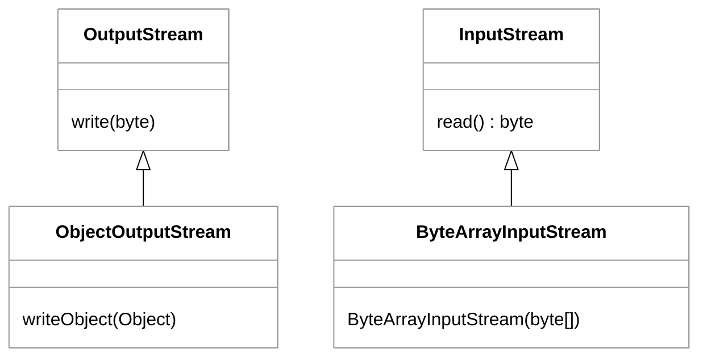
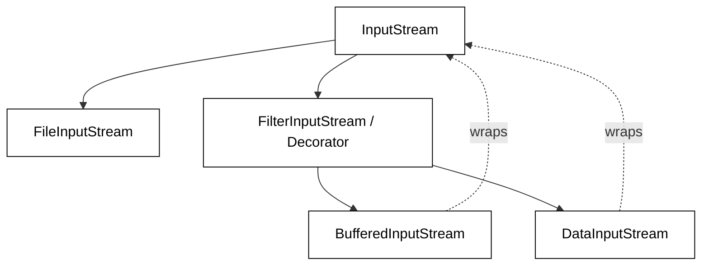

# Java Input and Output (IO)

🖥️ [Slides](https://docs.google.com/presentation/d/1V_tMHZGJMwlB2it1C-KY-AtSMeXGSOUD/edit?usp=sharing&ouid=114081115660452804792&rtpof=true&sd=true)

📖 **Required Reading**: Core Java for the Impatient

- Chapter 9: Processing Input and Output. _Only read:_
  - Section 1: Input, Output Streams, Readers, and Writers
  - Section 2: Paths, Files and Directories

🖥️ [Lecture Videos](#videos)

### 🔑 Key points

- How input and output streams work
- The difference between streams, readers, and writers
- How to chain streams, readers, or writers together to achieve complex behavior
- How to convert from an `InputStream` to a `Reader` using the `InputStreamReader` class
- How to convert from a `Writer` to an `OutputStream` using the `OutputStreamWriter` class
- How to use the `Scanner` class
- Design patterns demonstrated by java.io.
---

Input is the process of reading data from a source. Output is the process of writing data to a destination. Sources and destinations commonly represent devices such as persistent storage (disks), the network, a keyboard, or a printer. They can also represent bytes being pulled from or written to an array or other memory-based structures.



The [java.io](https://docs.oracle.com/javase/20/docs/api/java/io/package-summary.html) package contains many classes and interfaces for working with I/O. The following table lists some of the most commonly used `java.io` classes.

| Class | Purpose |
| :--- | :--- |
| [InputStream](https://docs.oracle.com/javase/20/docs/api/java/io/InputStream.html) | Represents data as an incoming sequence of bytes. |
| [OutputStream](https://docs.oracle.com/javase/20/docs/api/java/io/OutputStream.html) | Represents data as an outgoing sequence of bytes. |
| [Reader](https://docs.oracle.com/javase/20/docs/api/java/io/Reader.html) | Abstract class for reading character streams. |
| [Writer](https://docs.oracle.com/javase/20/docs/api/java/io/Writer.html) | Abstract class for writing character streams. |
| [FileInputStream](https://docs.oracle.com/javase/20/docs/api/java/io/FileInputStream.html) | A stream that uses a file as its source of byte data. |
| [ByteArrayInputStream](https://docs.oracle.com/javase/20/docs/api/java/io/ByteArrayInputStream.html) | A stream that uses a byte array as its source of data. |
| [BufferedReader](https://docs.oracle.com/javase/20/docs/api/java/io/BufferedReader.html) | A reader that wraps another reader and buffers the input to optimize performance. |
| [StringReader](https://docs.oracle.com/javase/20/docs/api/java/io/StringReader.html) | A reader that uses a `String` as its source. |
| [PrintStream](https://docs.oracle.com/en/java/javase/20/docs/api/java.base/java/io/PrintStream.html) | An output stream that provides formatting functions such as `println` and `printf`. |
| [File](https://docs.oracle.com/javase/20/docs/api/java/io/File.html) | Provides basic file and directory operations such as creating, checking existence, and deleting. |
| [Scanner](https://docs.oracle.com/javase/8/docs/api/java/util/Scanner.html) | A utility class in `java.util` used to parse text into primitive types and strings. |

## InputStream and OutputStream

At the lowest level, Java represents I/O with a data abstraction known as a **stream**. The term "stream" is an analogy for a flow of data: you either consume data from the outlet of the stream or channel data into the stream for later consumption. A stream can flow indefinitely, like a stream of live weather data, or it can be finite, like the contents of a file.

The two base classes for dealing with byte-oriented streams in Java are [InputStream](https://docs.oracle.com/javase/20/docs/api/java/io/InputStream.html) and [OutputStream](https://docs.oracle.com/javase/20/docs/api/java/io/OutputStream.html). You read data from an `InputStream` and you write data to an `OutputStream`. Both are abstract classes and require a specific subclass to provide functionality. For example, you use a `FileInputStream` to read bytes from a file and a `FileOutputStream` to write bytes to a file. Other subclasses include `ByteArrayOutputStream`, `ObjectOutputStream`, and `SequenceInputStream`.




## System.in and System.out

A common example of working with I/O is the `java.lang.System` class. This class has public fields named `in` and `out`. 

The `in` field is an `InputStream` that reads bytes from the standard input (usually the keyboard). If you call `System.in.read()`, the program will attempt to read a byte from the console. If no bytes are available, the program will **block** (pause execution) until a user types something. Once a byte is read from the stream, it is removed.

The `out` field is a `PrintStream` that, by default, writes to the standard output (the command line console). When you call `System.out.println()`, it displays the provided text in the console window.

The following program reads characters from the console and echoes them back:

```java
import java.io.IOException;

public class ConsoleEcho {
    public static void main(String[] args) throws IOException {
        // System.in.read() returns the next byte of data, or -1 if the end of the stream is reached.
        int data = System.in.read();
        while (data != -1) {
            System.out.println((char) data);
            data = System.in.read();
        }
    }
}
```

## Reader and Writer

Working with streams is appropriate for binary data (bytes), but when dealing with text, it is better to use [java.io.Reader](https://docs.oracle.com/javase/8/docs/api/java/io/Reader.html) and [java.io.Writer](https://docs.oracle.com/javase/8/docs/api/java/io/Writer.html). While streams handle 8-bit bytes, Readers and Writers handle 16-bit Unicode characters, managing character encoding automatically.

Like the stream classes, `Reader` and `Writer` are abstract. You must use a specific subclass such as `FileReader`, `PrintWriter`, `StringWriter`, or `BufferedReader`.

It is common to "chain" these classes together. In the example below, we create a `StringReader` to read a raw string. We wrap it in a `LineNumberReader` to gain the ability to track line numbers. As we read, we write the formatted results into a `StringWriter`.

```java
import java.io.IOException;
import java.io.LineNumberReader;
import java.io.StringReader;
import java.io.StringWriter;

public class ReaderWriter {
    public static void main(String[] args) throws IOException {
        var writer = new StringWriter();
        var stringReader = new StringReader("this\nor\nthat");
        var reader = new LineNumberReader(stringReader);

        while (true) {
            var line = reader.readLine();
            if (line == null) break;
            writer.write(String.format("%d. %s%n", reader.getLineNumber(), line));
        }

        System.out.println(writer.toString());
    }
}
```

**Output**

```txt
1. this
2. or
3. that
```

## Scanner

In addition to the core IO classes, Java provides utility classes to simplify common tasks. The `Scanner` class is one of the most popular; it can read a source (like a file or stream) and break the input into tokens based on a delimiter (whitespace by default).

The following example uses the `Scanner` class to read a file and print each individual word to the console.

```java
import java.io.File;
import java.io.FileNotFoundException;
import java.util.Scanner;

public class ReadFile {
    public static void main(String[] args) throws FileNotFoundException {
        if (args.length == 0) return;
        
        File file = new File(args[0]);
        // try-with-resources ensures the scanner is closed automatically
        try (Scanner scanner = new Scanner(file)) {
            while (scanner.hasNext()) {
                System.out.println(scanner.next());
            }
        }
    }
}
```

## Design Patterns in Java IO: Decorators and Adapters

The Java I/O (`java.io`) library is a classic example of how structural design patterns can be used to create a flexible and extensible framework. Rather than creating a massive class hierarchy that covers every possible combination of data source and processing capability, Java uses the **Decorator** and **Adapter** patterns to allow developers to compose functionality at runtime.

### The Decorator Pattern

The most prominent pattern in Java IO is the **Decorator Pattern**. This pattern allows behavior to be added to an individual object, dynamically, without affecting the behavior of other objects from the same class. In Java IO, "Filter" classes (like `BufferedInputStream`, `DataInputStream`, and `GZIPInputStream`) act as decorators.

Instead of having a class called `BufferedFileInputStream`, Java provides a `FileInputStream` (the component) and a `BufferedInputStream` (the decorator). You "wrap" the stream to add functionality:

```java
// Composing behavior using the Decorator pattern
try (InputStream fis = new FileInputStream("data.bin");
     BufferedInputStream bis = new BufferedInputStream(fis);
     DataInputStream dis = new DataInputStream(bis)) {
    
    int value = dis.readInt(); // Adds data parsing capabilities
    System.out.println("Read value: " + value);
} catch (IOException e) {
    e.printStackTrace();
}
```

The diagram below illustrates how decorators wrap the base component to extend its functionality:



### The Adapter Pattern

The **Adapter Pattern** is used to bridge the gap between two incompatible interfaces. In Java IO, the primary distinction is between **Byte Streams** (8-bit) and **Character Streams** (16-bit Unicode). 

Classes like `InputStreamReader` and `OutputStreamWriter` serve as adapters. They take a byte stream and "adapt" it to a character-based `Reader` or `Writer` interface, handling encoding conversions in the process.

```java
// Adapting a Byte Stream to a Character Reader
FileInputStream fis = new FileInputStream("text.txt");
InputStreamReader reader = new InputStreamReader(fis, "UTF-8");

// Now we can use Reader methods instead of Stream methods
int data = reader.read(); 
```

### Best Practices and Anti-Patterns

When working with Java IO design patterns, adhering to established practices ensures your code remains performant and leak-free.

**Good Practices:**
*   **Use Try-with-Resources:** Always use the `try-with-resources` statement to ensure that streams are closed automatically, preventing memory and file handle leaks.
*   **Always Buffer:** Reading or writing directly to a disk or network is expensive. Always wrap your base streams in a `BufferedInputStream` or `BufferedReader` unless you have a specific reason not to.
*   **Specify Charsets:** When using adapters like `InputStreamReader`, explicitly specify the `Charset` (e.g., `StandardCharsets.UTF_8`) to avoid platform-dependent behavior.

**Bad Practices (Anti-patterns):**
*   **Manual Closing in Finally:** Before Java 7, closing in a `finally` block was standard, but it is error-prone (e.g., if `close()` itself throws an exception). Avoid this in modern Java and use `try-with-resources` instead.
*   **Ignoring the Decorator Chain:** Don't forget that closing the outermost decorator (the "top" of the wrapper) will automatically close all underlying streams in the chain. You do not need to close each one individually.
*   **Byte-by-Byte Processing:** Processing large files using `InputStream.read()` without a buffer leads to excessive system calls and poor performance.


## ☑ Exercise


```masteryls
{"id":"7f4a04df-a0bf-41a2-9992-a29a38532709","title":"Input vs. Output Streams","type":"multiple-choice"}
In the Java IO framework, what is the fundamental functional difference between an `InputStream` and an `OutputStream`?

- [x] An input stream is used to read data from a source into a program, whereas an output stream is used to write data from a program to a destination.
- [ ] Input streams transfer data from the program to an external destination, while output streams fetch data from an external source into the program.
- [ ] Input streams are designed exclusively for handling character-based data, while output streams are used for handling raw byte-based data.
- [ ] An input stream represents data that has already been processed by the CPU, while an output stream represents data waiting in the system's RAM.
```


```masteryls
{"id":"8b2838fa-5094-416a-a0c7-4dfab43557e3","title":"Streams vs. Readers","type":"multiple-choice"}
In Java's `java.io` package, what is the fundamental difference between an `InputStream` and a `Reader`?

- [ ] `InputStream` classes are used for reading data from a source, while `Reader` classes are used for writing data to a destination.
- [ ] `InputStream` is a concrete class used for unbuffered IO, while `Reader` is an interface used to implement buffered IO.
- [ ] `InputStream` classes are designed specifically for memory-based buffers, while `Reader` classes are designed specifically for disk-based files.
- [x] `InputStream` handles data as a sequence of raw 8-bit bytes, whereas `Reader` handles data as a sequence of 16-bit Unicode characters.
```


```masteryls
{"id":"8d58b3aa-ce96-4f18-8f5f-59a22f5cf918","title":"Identifying IO Design Patterns","type":"multiple-choice"}
Which design pattern is primarily responsible for the ability to wrap a 'FileInputStream' inside a 'BufferedInputStream' to add performance enhancements without changing the underlying interface?

- [ ] The Singleton Pattern
- [ ] The Adapter Pattern
- [x] The Decorator Pattern
- [ ] The Factory Pattern
```

```masteryls
{"id":"8e89fd3f-4cff-4fa8-909f-4b84c02036de","title":"Reliability as Service","type":"essay"}
As you learn to read and write data reliably, how does building software that people can trust reflect Christlike service toward those who depend on it?
```


## Videos

- 🎥 [Overview (2:50)](https://byu.hosted.panopto.com/Panopto/Pages/Viewer.aspx?id=9c064639-8e05-4d4c-b458-ad64014cbb24&start=0) - [[transcript]](https://github.com/user-attachments/files/17804847/CS_240_I_O_Overview.pdf)
- 🎥 [Streams (14:51)](https://byu.hosted.panopto.com/Panopto/Pages/Viewer.aspx?id=8db201b9-9a04-4cbf-8a99-ad64014ddd56&start=0) - [[transcript]](https://github.com/user-attachments/files/17804850/CS_240_Streams.pdf)
- 🎥 [Readers and Writers (5:15)](https://byu.hosted.panopto.com/Panopto/Pages/Viewer.aspx?id=66d67329-cc52-4533-a2b4-ad64015237cf&start=0) - [[transcript]](https://github.com/user-attachments/files/17804852/CS_240_Readers_and_Writers.pdf)
- 🎥 [The Scanner Class (5:54)](https://byu.hosted.panopto.com/Panopto/Pages/Viewer.aspx?id=d2b32cd5-aa33-47fc-b261-b1a001104cde&start=0) - [[transcript]](https://github.com/user-attachments/files/17750511/CS_240_The_Scanner_Class_Tokenizing_Input_Transcript.pdf)
- 🎥 [Other Ways to Read and Write Files (3:57)](https://byu.hosted.panopto.com/Panopto/Pages/Viewer.aspx?id=442ead32-4f14-461c-aec5-b1a001122096&start=0) - [[transcript]](https://github.com/user-attachments/files/17750517/CS_240_Other_Ways_to_Read_and_Write_Files_Transcript.pdf)
