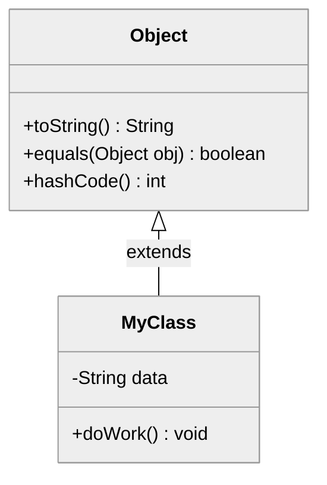

# Java Object Class

🖥️ [Slides](https://docs.google.com/presentation/d/17S-Y7Og08S9kRWHZfnH8k2wTBht39aCd/edit?usp=sharing&ouid=114081115660452804792&rtpof=true&sd=true)

🖥️ [Lecture Videos](#videos)

In Java, every class descends from a single root: the `java.lang.Object` class. When you create a class, you inherit all public and protected methods provided by `Object`. If you do not explicitly specify a superclass using the `extends` keyword, Java automatically makes your class extend `Object`.


### Java Object Hierarchy Diagram

In Java, every class implicitly or explicitly inherits from the `java.lang.Object` class. This makes `Object` the root of the entire class hierarchy, providing fundamental methods that all Java objects share.



When a class extends another, it can **override** the base class's methods to alter or extend their functionality. The `Object` class contains several key methods designed to be overridden:

| Method | Purpose |
| :--- | :--- |
| `toString()` | Provides a human-readable string representing the object's state. |
| `equals(Object o)` | Determines if another object is logically "equal" to the current one. |
| `hashCode()` | Returns an integer representation of the object, essential for use in hash-based collections. |

**Note**: Other methods in the `Object` class, such as `getClass()`, `wait()`, and `notify()`, are `final` and cannot be overridden.

The following example shows a `Person` class that overrides the `toString` method.

```java
// Note: 'extends Object' is implicit and usually omitted.
public class Person extends Object {
    private String name;

    public Person(String name) {
        this.name = name;
    }

    /**
     * Overrides the Object class implementation to provide a custom description.
     */
    @Override
    public String toString() {
        return String.format("My name is %s", name);
    }
}
```

The Java Development Kit (JDK) builds extensively on the `Object` class to provide standard implementations for lists, sets, networking, streams, and math. You can explore these capabilities by reviewing the [official Java documentation](https://docs.oracle.com/en/java/javase/17/docs/api/java.base/java/lang/Object.html).


### Key Concepts
*   **Implicit Inheritance:** If a class does not specify a parent class using the `extends` keyword, the Java compiler automatically makes it a child of the `Object` class.
*   **Method Overriding:** Child classes (like `Person`) often override `toString()`, `equals(Object obj)`, and `hashCode()` to provide behavior specific to that class.
*   **Root Class:** Because `Object` is the top-level class, a variable of type `Object` can hold a reference to an instance of any Java class.

## Important Object Default Methods

### toString

The `toString()` method is a member of the `java.lang.Object` class, which is the parent class of all objects in Java. Its primary purpose is to return a string representation of an object.

*   **Default Behavior:** If not overridden, the method returns a string consisting of the class name, the `@` symbol, and the unsigned hexadecimal representation of the object's hash code (e.g., `Student@15db9742`).
*   **Overriding:** Developers typically override this method to provide a meaningful, human-readable summary of the object's internal state (its field values).
*   **Automatic Invocation:** The `toString()` method is automatically called when an object is passed to `System.out.println()` or when an object is concatenated with a String.

The following example demonstrates how to override the `toString()` method to provide useful information about a `Car` object.

```java
class Car {
    private String model;
    private int year;

    public Car(String model, int year) {
        this.model = model;
        this.year = year;
    }

    // Overriding the toString() method from the Object class
    @Override
    public String toString() {
        return "Car {model='" + model + "', year=" + year + "}";
    }

    public static void main(String[] args) {
        Car myCar = new Car("Toyota Corolla", 2022);
        System.out.println(myCar.toString()); 
    }
}
```

**Output:**
```text
Car {model='Toyota Corolla', year=2022}
```


### equals

When comparing primitive types (like `int` or `char`), you use the `==` operator. However, when comparing objects, `==` only checks if two references point to the exact same memory address (reference equality).

To check if two different object instances are "equal" based on their data (logical equality), you must override the `equals` method. If you do not override it, your class will use the default `Object` implementation, which behaves exactly like `==`.

```java
public class EqualExample {
    private String value;

    public EqualExample(String value) {
        this.value = value;
    }

    @Override
    public boolean equals(Object o) {
        // 1. Check for reference equality
        if (this == o) return true;
        // 2. Check for null and ensure the classes match
        if (o == null || getClass() != o.getClass()) return false;
        // 3. Cast and compare field values
        EqualExample that = (EqualExample) o;
        return value.equals(that.value);
    }

    public static void main(String[] args) {
        var o1 = new EqualExample("taco");
        var o2 = new EqualExample("taco");
        var o3 = new EqualExample("fish");

        System.out.println(o1 == o2);      // returns false (different instances)
        System.out.println(o2 == o2);      // returns true (same instance)
        System.out.println(o1.equals(o1)); // returns true
        System.out.println(o1.equals(o2)); // returns true (same value)
        System.out.println(o1.equals(o3)); // returns false (different values)
    }
}
```

### hashCode

Many Java collections, such as `HashMap` and `HashSet`, use hash tables to store and retrieve data efficiently. These collections rely on the `hashCode` method, which returns an integer representing the object.

There is a strict **contract** between `equals` and `hashCode`: if two objects are equal according to the `equals(Object)` method, they **must** return the same integer from `hashCode()`.

When a collection looks for an object, it first checks the `hashCode`. If the hash codes match, it then calls `equals` to confirm the identity. If you override `equals` but forget to override `hashCode`, your objects will not work correctly in Java collections.

```java
import java.util.Objects;

public class HashcodeExample {
    private String value;

    public HashcodeExample(String value) {
        this.value = value;
    }

    @Override
    public boolean equals(Object o) {
        if (this == o) return true;
        if (o == null || getClass() != o.getClass()) return false;
        HashcodeExample that = (HashcodeExample) o;
        return Objects.equals(value, that.value);
    }

    @Override
    public int hashCode() {
        // Using a prime number helps distribute hash codes more uniformly
        return 31 * Objects.hashCode(value);
    }
}
```

If you do not override these functions, a `HashMap` will treat every instance as unique based on its memory address, even if the fields within the objects are identical.

## Things to Understand

- **Method Overriding:** How to redefine a superclass method in a subclass.
- **Method Overloading:** How to define multiple methods with the same name but different parameters.
- **The `equals` vs `==` distinction:** Reference equality versus logical equality.
- **The `hashCode` Contract:** Why equal objects must have identical hash codes.
- **The `toString` Method:** How to provide useful string representations for debugging and logging.
- **The `final` Keyword:** Its effect when applied to variables (constants), methods (cannot be overridden), and classes (cannot be extended).
- **Hash Tables:** The basic mechanism of how `hashCode` and `equals` allow for fast data retrieval.


## ☑ Exercise


```masteryls
{"id":"2ec94cfd-ac42-4ced-a34f-8cd81c95c0ef","title":"The Root of Java Hierarchy","type":"multiple-choice"}
In the Java programming language, the `java.lang.Object` class occupies a unique position. Which of the following statements correctly describes the fundamental structural difference between the `Object` class and every other class in Java?

- [x] It is the only class in the Java hierarchy that does not have a superclass.
- [ ] It is the only class that is automatically imported into every Java source file by the compiler.
- [ ] It is the only class that cannot be extended by a user-defined subclass.
- [ ] It is the only class that provides a default implementation for the `toString()` and `equals()` methods.
```


## Videos

- 🎥 [Classes and Objects Overview](https://byu.hosted.panopto.com/Panopto/Pages/Viewer.aspx?id=8d7440ec-313d-45d1-891f-ad5f01307ab8&start=0) - [[transcript]](https://github.com/user-attachments/files/17750879/CS_240_Classes_and_Objects_Overview_Transcript.1.pdf)
- 🎥 [The `Object` Super Class](https://byu.hosted.panopto.com/Panopto/Pages/Viewer.aspx?id=1de40809-379f-44fd-8ffe-ad5f01307a86&start=0) - [[transcript]](https://github.com/user-attachments/files/17750887/CS_240_Classes_and_Objects_The_Object_Super_Class_Transcript.pdf)
- 🎥 [Method Overriding](https://byu.hosted.panopto.com/Panopto/Pages/Viewer.aspx?id=d47ce0c1-85e5-45a7-b56d-ad5d01512d78&start=0) - [[transcript]](https://github.com/user-attachments/files/17805005/CS_240_Method_Overriding.pdf)
- 🎥 [Overriding toString()](https://byu.hosted.panopto.com/Panopto/Pages/Viewer.aspx?id=cc129f1b-ae0f-44b0-a424-ad5f01307ae4&start=0) - [[transcript]](https://github.com/user-attachments/files/17805007/CS_240_Classes_and_Objects_Overriding_toString.pdf)
- 🎥 [Overriding equals()](https://byu.hosted.panopto.com/Panopto/Pages/Viewer.aspx?id=7ecb0a44-16bc-4fa7-b924-ad5f01307b29&start=0) - [[transcript]](https://github.com/user-attachments/files/17805009/CS_240_Classes_and_Objects_Overriding_equals.pdf)
- 🎥 [Implementing a Hashcode Method](https://byu.hosted.panopto.com/Panopto/Pages/Viewer.aspx?id=a486e175-a53f-4aed-b436-ad5d015744ac&start=0) - [[transcript]](https://github.com/user-attachments/files/17750911/CS_240_Implementing_a_Hashcode_Method_Transcript.1.pdf)
- 🎥 [Method Overloading](https://byu.hosted.panopto.com/Panopto/Pages/Viewer.aspx?id=7bec5f67-10c3-4b19-a0fc-ad640139627a&start=0) - [[transcript]](https://github.com/user-attachments/files/17805015/CS_240_Method_Overloading.pdf)
- 🎥 [Hash Tables](https://byu.hosted.panopto.com/Panopto/Pages/Viewer.aspx?id=42265b8a-aced-457d-a494-ad5f0130d9a9&start=0) - [[transcript]](https://github.com/user-attachments/files/17805022/CS_240_Classes_and_Objects_Hash_Tables.pdf)