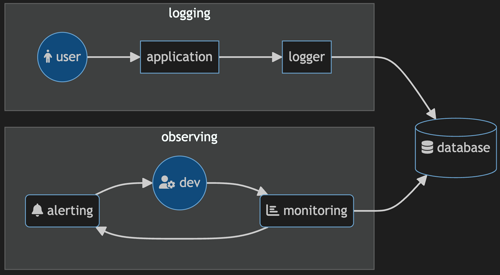
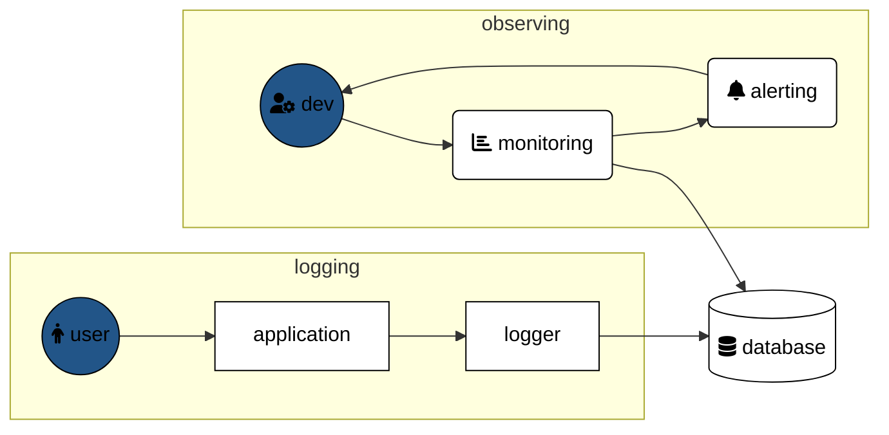
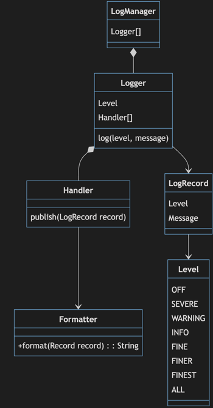

# Logging

🖥️ [Slides](https://docs.google.com/presentation/d/1KuCyhYfKQEuvJZRddhfjwxZvSfOZjWxa/edit?usp=sharing&ouid=114081115660452804792&rtpof=true&sd=true)

📖 **Required Reading**: Core Java for the Impatient

- Chapter 5: Exceptions, Assertions, and Logging. _Only Section 5.3 Logging - Section 5.3.7 Filters and Formatters_

🖥️ [Lecture Videos](#videos)

### 🔑 Key points

- What is logging, and why do we need it?
- How do you log messages at different levels?
- Why do we need different levels?
- How do you configure logging from a configuration file?
- Why do we use Log4J if Java has a built-in logging API?

---

Logging is a critical piece of advanced software construction. Without logging, your application is a "black box" where only your users know if it is working or not. By recording, or logging, what is happening within your application, you create a persistent record of what users are doing and how the application is responding to their requests. Logging works by recording entries in a log file or database that describes what is happening at key points in your application. Typically, this includes the requests and responses of HTTP endpoints, authentication and authorization requests, and exceptional errors. You can then query your logs to view events, graphs, and reports that give you insight into what the system is doing. You can also set up your logging system to automatically alert you when things seem exceptional.





Logging provides the following benefits:

1. **Debugging** - You cannot easily put breakpoints into a production system to debug a user's requests. You can, however, log an entry that describes what a user requested and what the response was. You can then look at all the requests of a specific user to get a clear picture of where failures are happening.
2. **Security** - By logging records that represent authentication, authorization, purchase, and payment attempts, you can get a clear picture of when someone is trying to abuse critical pieces of your application.
3. **Auditing** - By aggregating log records, you can determine what parts of your application are being used, who is using them, and how often. This allows you to adjust resource allocations, prioritize new features, and reassess existing features.
4. **Performance Monitoring** - By aggregating timing measurements associated with requests, you can create graphs that visualize the performance characteristics of your application. You can see where the "hot spots" are and where optimization needs to take place. You can also determine when your system is failing to satisfy user requests and automatically trigger alerts to take corrective action.

Typically, application logs are persistently recorded in a system that is independent of your production system. Otherwise, when your production system fails, you might also lose your logging data, making it much more difficult to diagnose what went wrong.

## java.util.logging

The Java Development Kit (JDK) provides support for logging with the `java.util.logging` package. To create or retrieve a `Logger`, you call the static method `Logger.getLogger` and supply a logger name. It is common practice to use the class name as the logger name.

```java
Logger logger = Logger.getLogger(LoggingExample.class.getName());
```

With a `Logger`, you can register a `Handler` that knows where to publish, or store, log records. The JDK provides several useful implementations of the `Handler` abstract class. These include the `ConsoleHandler` (publishes to the console window), the `FileHandler` (publishes to a given file), and the `SocketHandler` (publishes log records over a network connection).

```java
FileHandler fileHandler = new FileHandler("example.log", true);
logger.addHandler(fileHandler);
```

### Log Levels

Each log record specifies a `Level` that defines how important the record is. This can range from `SEVERE`, `WARNING`, or `INFO` down to the `FINEST` detail. You can use these log levels to filter out details when you are searching for problems or generating alerts. For example, you might want to automatically send an alert for any log entry marked `SEVERE`.

The level you assign to your log records depends on what each level means in the context of your application. In a simple chess program, you might never publish a `SEVERE` log record because the application can usually fall back to a reasonable state. However, in an application protecting human safety, you might publish `SEVERE` log records for anything that could conceivably endanger life.

You can also control how much logging your application publishes by specifying a level on your logger. For example, while debugging, you may want to log `FINEST` details, but in production, you might only want to log `SEVERE`, `WARNING`, or `INFO`. When you restrict a logger to a certain level, it will ignore any log requests that are below that level. This allows you to control logging volume via configuration parameters. To set the level on a logger, use the `setLevel` method:

```java
logger.setLevel(Level.INFO);
```

### Logging Records

A `Logger` has several methods for logging records. This includes the general `log(Level level, String msg)` method or convenience methods for specific levels, such as `severe(String msg)` or `info(String msg)`. The following example shows two equivalent ways of logging an informational HTTP endpoint request:

```java
var msg = String.format("[%s] %s", method, path);
logger.log(Level.INFO, msg);
logger.info(msg);
```

Remember that the logger might be restricted by its current level. Your code can request to log a message, but if that message's level is lower than the logger's threshold, the record will be discarded.

### Logging Classes



## Full Example

The following demonstrates major logging functionality by creating a logger, registering a handler and level, and logging messages.

```java
import java.io.IOException;
import java.util.logging.*;

public class LoggingExample {

    static Logger logger = Logger.getLogger("myLogger");

    public static void main(String[] args) throws IOException {

        FileHandler fileHandler = new FileHandler("example.log", true);
        logger.addHandler(fileHandler);

        logger.setLevel(Level.INFO);

        // This will be ignored because FINEST is lower than INFO
        logger.finest("Ignored because it is lower than the logger level");
        
        // This will be logged
        logger.log(Level.INFO, "This will be logged");
    }
}
```

Typically, loggers are created as `static` fields in your classes. This allows you to reference the logger whenever you need to record an event without passing it around as a parameter.

## Writing Your Own Handler

You can write your own handlers by extending the `Handler` class. Here is an example of a custom handler that simply outputs a formatted string to the console.

```java
class MyHandler extends Handler {

    @Override
    public void publish(LogRecord record) {
        System.out.printf("MyHandler - [%s] %s%n", record.getLevel(), record.getMessage());
    }

    @Override
    public void flush() {}

    @Override
    public void close() throws SecurityException {}
}
```

### Database Handler

In order for logging to be truly useful, it needs to store records in a location that is accessible and queryable. One solution is to use a relational database. The following code demonstrates a simple handler that writes logs to a database.

```java
record DatabaseConfig(String url, String dbName, String user, String password) {}

class DatabaseHandler extends Handler {
    private final DatabaseConfig config;

    DatabaseHandler(DatabaseConfig config) throws SQLException {
        this.config = config;
        configureDatabase();
    }

    @Override
    public void publish(LogRecord record) {
        try {
            try (var conn = getConnection()) {
                var stm = String.format("INSERT INTO `%s`.log (level, message, date) VALUES(?, ?, now())", config.dbName);
                try (var preparedStatement = conn.prepareStatement(stm)) {
                    preparedStatement.setString(1, record.getLevel().toString());
                    preparedStatement.setString(2, record.getMessage());

                    preparedStatement.executeUpdate();
                }
            }
        } catch (Exception ex) {
            System.out.printf("Failed to log: %s%n", ex.getMessage());
        }
    }

    @Override
    public void flush() {}

    @Override
    public void close() throws SecurityException {}

    Connection getConnection() throws SQLException {
        return DriverManager.getConnection(config.url, config.user, config.password);
    }

    void configureDatabase() throws SQLException {
        try (var conn = getConnection()) {
            var stm = String.format("CREATE DATABASE IF NOT EXISTS `%s`", config.dbName);
            try (var createDbStatement = conn.prepareStatement(stm)) {
                createDbStatement.executeUpdate();
            }

            var createLogTable = String.format("""
                    CREATE TABLE IF NOT EXISTS `%s`.log (
                        id INT NOT NULL AUTO_INCREMENT,
                        message VARCHAR(4096) NOT NULL,
                        level VARCHAR(16) NOT NULL,
                        date DATETIME NOT NULL,
                        PRIMARY KEY(id),
                        INDEX(date)
                    )""", config.dbName);
            try (var createTableStatement = conn.prepareStatement(createLogTable)) {
                createTableStatement.executeUpdate();
            }
        }
    }
}
```

With a database logging handler, you could record all HTTP requests to a database with just a few lines of code in your server:

```java
public class ServerLoggingExample {
    public static void main(String[] args) throws Exception {
        new ServerLoggingExample().run();
    }

    static Logger logger = Logger.getLogger("myLogger");

    private void run() throws Exception {
        var config = new DatabaseConfig("jdbc:mysql://localhost:3306", "pet_store", "root", "password");
        logger.addHandler(new DatabaseHandler(config));

        var javalin = Javalin.create()
            .get("/*", (ctx) -> ctx.result("<p>OK</p>"))
            .after(this::log)
            .start(8080);
    }

    private void log(Context ctx) {
        logger.info(String.format("[%s]%s - %d", ctx.method(), ctx.path(), ctx.status()));
    }
}
```

You can then query your database for requests that match a specific time range or level:

```sql
SELECT * FROM log WHERE date > '2023-10-20' AND level='INFO';

+----+-------------------------------+-------+---------------------+
| id | message                       | level | date                |
+----+-------------------------------+-------+---------------------+
|  1 | [GET]/data - 200              | INFO  | 2023-10-25 11:21:46 |
|  3 | [GET]/cow/joe/name/fish - 200 | INFO  | 2023-10-25 11:21:58 |
|  4 | [GET]/home/provo - 200        | INFO  | 2023-10-25 11:23:40 |
|  5 | [GET]/home/provo - 200        | INFO  | 2023-10-25 11:27:52 |
|  6 | [POST]/home/provo - 200       | INFO  | 2023-10-25 11:42:33 |
|  7 | [DELETE]/home/provo - 200     | INFO  | 2023-10-25 11:42:48 |
+----+-------------------------------+-------+---------------------+
```

## Log4J

Java's direct support for logging via the `java.util.logging` package was not introduced until 2002 (JDK 1.4). Before that, developers had to implement their own logging solutions. The most common solution was the 3rd-party package `Log4J`. In fact, `java.util.logging` was largely modeled after the functionality of `Log4J`. For this reason, it is still very common to see production Java code using `Log4J` or its successor, `Log4j 2`.

## Videos

- 🎥 [Logging (6:47)](https://byu.hosted.panopto.com/Panopto/Pages/Viewer.aspx?id=014ade75-f4ad-4119-95c1-ad6d0147c217&start=0) - [[transcript]](https://github.com/user-attachments/files/17805093/CS_240_Java_Logging.pdf)
- 🎥 [Logging: Configuration (13:44)](https://byu.hosted.panopto.com/Panopto/Pages/Viewer.aspx?id=5c08583a-579d-452e-88d6-ad6d0149e2cc&start=0) - [[transcript]](https://github.com/user-attachments/files/17805094/CS_240_Logging_Configuration.pdf)
- 🎥 [Logging: Messages (9:04)](https://byu.hosted.panopto.com/Panopto/Pages/Viewer.aspx?id=e1afdb4c-bb5f-42cc-ad6c-ad6d014dd97d&start=0) - [[transcript]](https://github.com/user-attachments/files/17805096/CS_240_Logging_Messages.pdf)

## Demonstration code

📁 [FileConfigurationExample](example-code/FileConfigurationExample.java)

📁 [logging](example-code/logging.properties)

📁 [ProgrammaticConfigurationExample](example-code/ProgrammaticConfigurationExample.java)