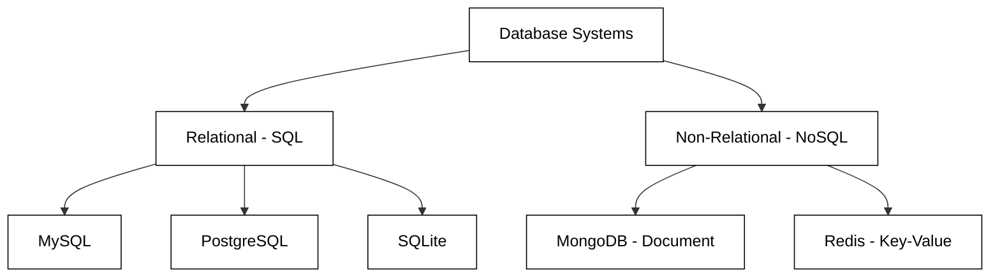
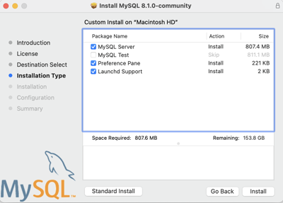
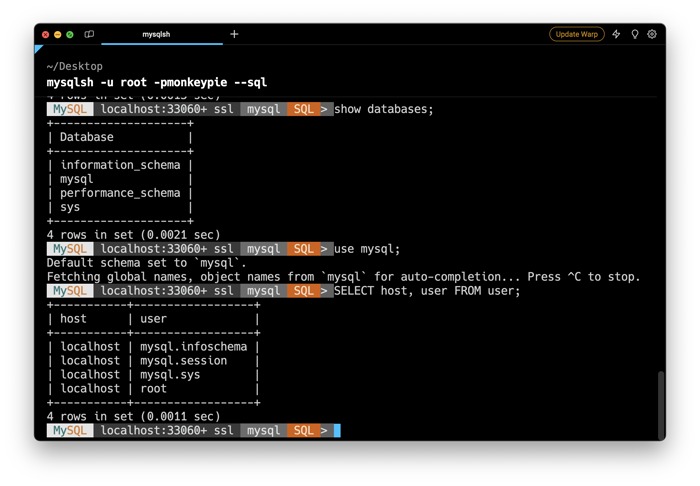
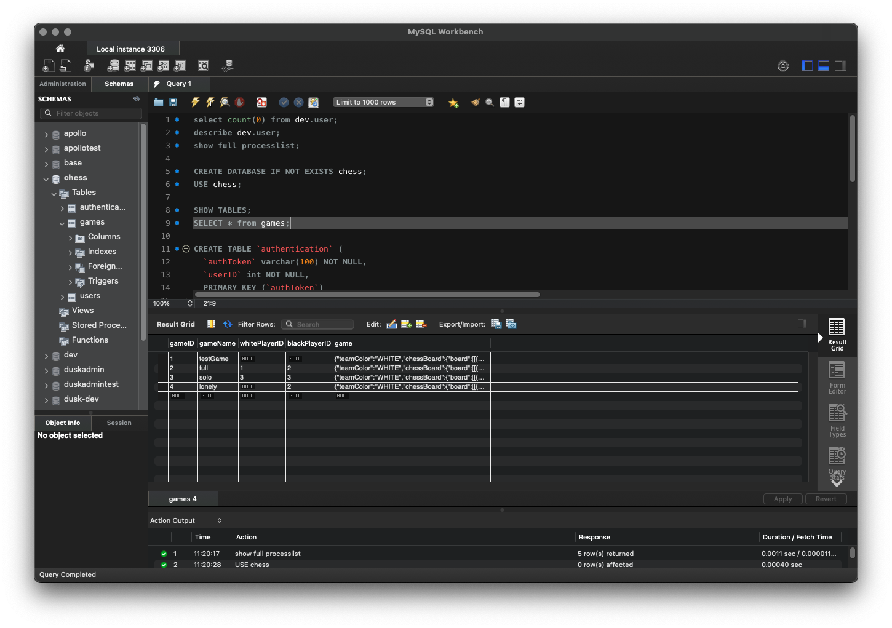

# MySQL

🖥️ [Slides](https://docs.google.com/presentation/d/1w5bcntrExgMnB92uLJL52uuutLLQABSt/edit?usp=sharing&ouid=114081115660452804792&rtpof=true&sd=true)

🖥️ [Lecture Videos](#videos)

### 🔑 Key points

- MySQL is a widely used open-source relational database management system (RDBMS).
- It follows the relational data model, using tables, rows, and columns to organize data.
- To interact with a MySQL server, you use a SQL client (either command-line or GUI).

___

`MySQL` is an open-source relational database that powers many popular applications and websites. Learning how MySQL works will help you understand the relational data model, give you experience with an industry-standard tool, and teach you how to use it to power your own applications.

## Choosing MySQL: Benefits and Alternatives

MySQL has long been the cornerstone of the web, powering everything from small personal blogs to massive platforms like Facebook, YouTube, and Twitter. As an open-source Relational Database Management System (RDBMS), its primary appeal lies in its balance of performance, reliability, and ease of use. It uses Structured Query Language (SQL) to manage data, making it highly accessible for developers who are already familiar with standard database operations.

Choosing MySQL is often a strategic decision based on the following factors:

*   **Open-Source and Cost-Effective:** The Community Edition is free, reducing the total cost of ownership for startups and individual developers.
*   **High Performance:** MySQL is optimized for fast read operations, making it ideal for content-heavy websites and e-commerce platforms.
*   **Scalability:** It supports "sharding" and "replication," allowing databases to grow alongside the application's user base.
*   **Strong Community Support:** Because it is so widely used, finding documentation, third-party tools, and expert help is incredibly easy.

The following diagram illustrates how MySQL fits into the broader database ecosystem, categorized by data structure:



While MySQL is a powerhouse, it is not the only tool available. Depending on your project's specific needs—such as complex data analysis, mobile app local storage, or unstructured data—other options might be more suitable. PostgreSQL is often favored for its advanced features and compliance with standards, while MongoDB is the go-to for flexible, schema-less data.

### Comparison of Popular Database Options

| Feature | MySQL | PostgreSQL | SQLite | MongoDB |
| :--- | :--- | :--- | :--- | :--- |
| **Type** | Relational (RDBMS) | Relational (RDBMS) | Relational (RDBMS) | Document (NoSQL) |
| **Best For** | Web apps, E-commerce | Complex queries, Data integrity | Mobile apps, Testing | Big data, Unstructured data |
| **Scalability** | High (Read-heavy) | High (Complex writes) | Low (Single file) | Very High (Horizontal) |
| **Acid Compliance** | Yes (with InnoDB) | Yes (Full) | Yes | Partial / Tunable |
| **Ease of Setup** | Easy | Moderate | Very Easy | Easy |

## MySQL Server Installation

To get started, you will need to install MySQL in your development environment. You can install the latest LTS (Long Term Support) free MySQL Community Server version from [MySQL.com](https://dev.mysql.com/downloads/mysql/).



## SQL Clients

Once you have installed MySQL, it is time to start executing SQL statements. To do this, you need a SQL client application that can communicate with the SQL server running in your development environment.

There are several free and paid options available when choosing a client application. One popular tool is the MySQL command-line client called the MySQL Shell (`mysqlsh`). You can download the shell from [MySQL.com](https://dev.mysql.com/downloads/shell/).

Once you have downloaded the shell, you can start it by opening a terminal or command prompt window and typing the following (substituting the username and password you provided when you installed MySQL):

```sh
mysqlsh -u yourusername -pyourpassword --sql
```

For example, if you created your root user with the password `edgarcobb`, you would execute:

```sh
mysqlsh -u root -pedgarcobb --sql
```

Once the shell starts up, you can get help by typing `\help` or exit the shell using `\exit`. If you start the shell without passing in command-line arguments, you can use `\connect root@localhost:3306`, and it will prompt you for the admin password. If you created a different account, replace `root` with your specific username.

You can now start typing SQL queries! For example, try the following:

```sql
SHOW DATABASES;
USE mysql;
SHOW TABLES;
SELECT host, user FROM user;
\exit
```



Alternatively, if you prefer a visual MySQL client, you might try [MySQL Workbench](https://www.mysql.com/products/workbench/).



## Common Commands

Here is a list of common SQL commands used to administer a database.

| Command | Purpose | Example |
| :--- | :--- | :--- |
| `SHOW DATABASES` | Lists all available databases | `SHOW DATABASES;` |
| `USE name` | Opens a specific database | `USE student;` |
| `SHOW TABLES` | Lists all tables in the currently selected database | `SHOW TABLES;` |
| `DESCRIBE name` | Lists the fields (columns) for a specific table | `DESCRIBE student;` |
| `SHOW INDEX FROM name` | Lists the indexes for a specific table | `SHOW INDEX FROM student;` |
| `SHOW FULL PROCESSLIST` | Lists currently executing queries | `SHOW FULL PROCESSLIST;` |
| `CREATE DATABASE name` | Creates a new database | `CREATE DATABASE student;` |
| `DROP DATABASE name` | Deletes a database | `DROP DATABASE student;` |
| `CREATE TABLE name` | Creates a new table | `CREATE TABLE pet (name VARCHAR(128), age INT);` |
| `INSERT INTO name` | Inserts data into a table | `INSERT INTO pet VALUES ("zoe", 3);` |
| `SELECT * FROM name` | Queries data from a table | `SELECT * FROM pet;` |
| `DROP TABLE name` | Deletes a table | `DROP TABLE pet;` |

## Experimenting

Spend some time working with your SQL client program to execute queries. You can use the commands described above, or if you are concerned about modifying server data, you can try simple queries that perform calculations or retrieve system information.

```sql
> SELECT 1+1;
+-----+
| 1+1 |
+-----+
|   2 |
+-----+
1 row in set (0.0008 sec)

> SELECT NOW();
+---------------------+
| NOW()               |
+---------------------+
| 2023-10-07 12:34:56 |
+---------------------+
1 row in set (0.0008 sec)

> SELECT NOW(), NOW() + 1;
+---------------------+----------------+
| NOW()               | NOW() + 1      |
+---------------------+----------------+
| 2023-10-07 12:34:56 | 20231007123457 |
+---------------------+----------------+
1 row in set (0.0008 sec)
```

In future topics, you will learn how to create tables, insert data, and perform complex queries. After that, you will learn how to connect to your database and execute queries directly from Java code.

At this point, ensure your MySQL server is running and that you can access it using a client program.

## ☑ Exercise

```masteryls
{"id":"19d8fb82-cb67-4849-b5d1-2fce2786f6b7","title":"Choosing the Right Database","type":"multiple-choice"}
In which of the following scenarios would MySQL be a better choice than SQLite?

- [ ] When building a small, local mobile application that requires no network connection.
- [ ] When you need to store unstructured JSON data with no predefined schema.
- [x] When building a multi-user web application that requires high-concurrency read operations.
- [ ] When you need a database that exists as a single, portable file on a disk.
```

```masteryls
{"id":"5097a507-34c8-491d-8c15-f0d339002d8f","title":"Stewardship of What You Store","type":"essay"}
As you persist information in a database, how does the responsibility of caring for users' data reflect Christlike service and the BYU aim of developing character?
```


## Videos

- 🎥 [MySQL Overview (9:03)](https://byu.hosted.panopto.com/Panopto/Pages/Viewer.aspx?id=04f231f1-6f05-497a-a1d9-b193014cc8ad) - [[transcript]](https://github.com/user-attachments/files/17751649/CS_240_MySQL_Overview_Transcript.pdf)
- 🎥 [MySQL Console Client (6:27)](https://byu.hosted.panopto.com/Panopto/Pages/Viewer.aspx?id=10cb6b55-b954-4c1b-b483-b193014f9b90) - [[transcript]](https://github.com/user-attachments/files/17751661/CS_240_MySQL_Console_Client_Transcript.pdf)
- 🎥 [MySQL GUI Client (7:39)](https://byu.hosted.panopto.com/Panopto/Pages/Viewer.aspx?id=f5b49e24-99cd-4fe3-854f-b1930151b044) - [[transcript]](https://github.com/user-attachments/files/17751704/CS_240_GUI_Client_.Workbench._Transcript.pdf)
- 🎥 [SQL Commands (5:54)](https://byu.hosted.panopto.com/Panopto/Pages/Viewer.aspx?id=e70a8f18-dd11-4684-ad08-b1930154623d) - [[transcript]](https://github.com/user-attachments/files/17751710/CS_240_SQL_Commands_Transcript.pdf)