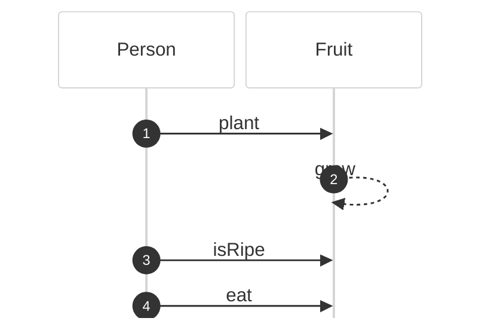
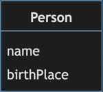
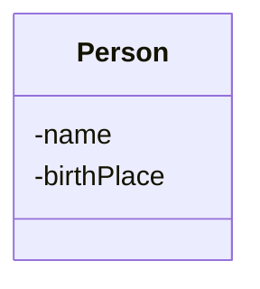
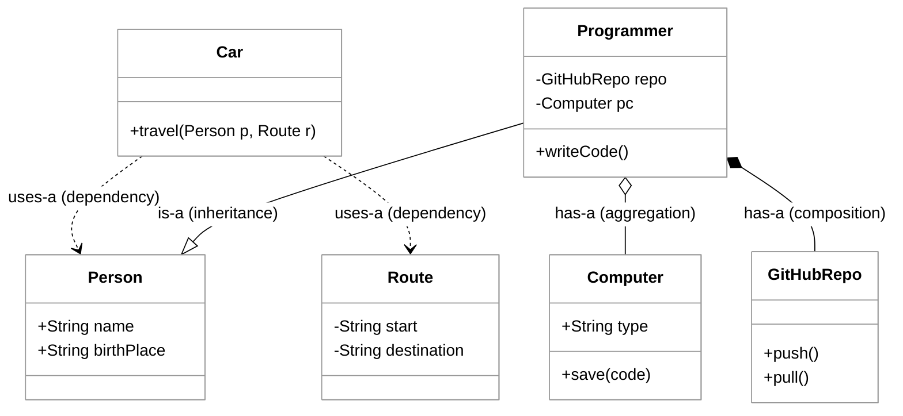
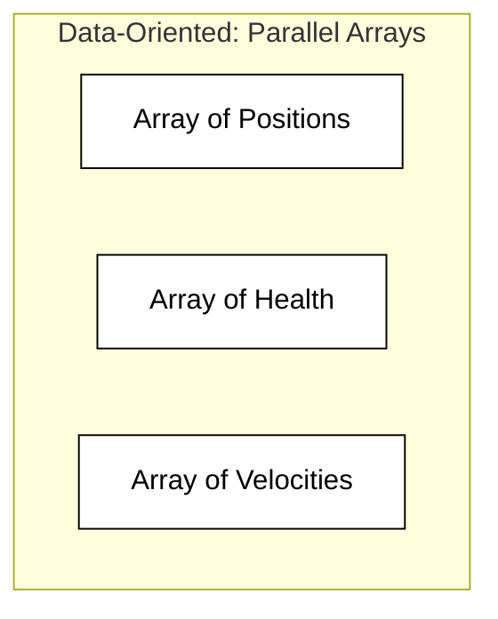
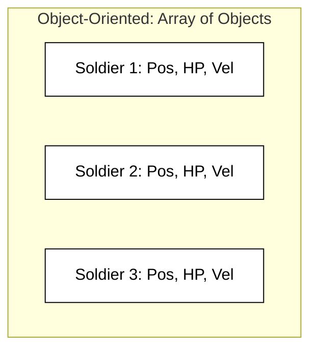

# Object-Oriented Design

🖥️ [Slides](https://docs.google.com/presentation/d/17S-Y7Og08S9kRWHZfnH8k2wTBht39aCd/edit?usp=sharing&ouid=114081115660452804792&rtpof=true&sd=true)

🖥️ [Lecture Videos](#videos)

### 🔑 Key points

- First, understand the application domain.
- Represent the domain using classes.
- Classes are nouns representing real-world objects.
- Classes have methods (verbs) and properties (nouns), mirroring real-world objects.
- Classes have relationships: Is-a, Has-a, and Uses-a.
- Encapsulate data to hide implementation details.
- Use Class and Sequence diagrams to model the system.
- Alternative design patterns

---

`Object-oriented` design focuses on describing objects in the application domain as literal programming constructs. For example, if your application involves people eating fruit, you model the application by creating `Person` and `Fruit` objects. These objects have properties such as name, ripeness, and color, as well as operations (methods) such as `eat`, `plant`, `grow`, or `purchase`. You then write your code to reflect real-world interactions between these core objects. In this example, a `Person` might `purchase` a `Fruit` object and then `eat` it.




Object-oriented design owes much of its popularity to its natural representation of the real world. By carefully modeling the actual application domain, the resulting code avoids the complications that often arise in other [programming paradigms](https://en.wikipedia.org/wiki/Programming_paradigm) that focus more strictly on functional logic or declarative constructs.

In object-oriented programming (OOP), everything revolves around the `Class` construct, which serves as a template for actual objects. Classes represent nouns, or "things," such as a cat, car, word, database row, or even abstract concepts like a thought or behavior. A class's operations, or methods, are verbs, such as `build`, `run`, `speak`, `compute`, or `destroy`. When you instantiate a class, you convert the template into an actual object. For example, we can create an object named `James` from a class named `Person`. While the `Person` class has a `birthPlace` field, the specific object `James` has a birth place value of "Calgary, Alberta."

| Real World                       | Class Representation               | Object Representation |
| -------------------------------- | ---------------------------------- | --------------------- |
|  |  | {name: James, birthPlace: Calgary }       |

> _Source: Wikipedia_



## Object Relationships

To fully model the real world, you must describe the relationships between objects. In Object-Oriented Design (_OOD_), these are categorized into three primary types: `is-a`, `has-a`, and `uses-a`.

| Relationship | Formal Name | Description | Example |
| ------------ | ----------- | ----------- | ------- |
| **Is-a** | Generalization | Inheritance. A specialized class (subclass) extends a more general class (superclass). | A `Programmer` **is a** `Person`. |
| **Has-a** | Association | Ownership or containment. One object contains another as a member field. | A `Programmer` **has a** `Computer`. |
| **Uses-a** | Dependency | Transient interaction. An object depends on another temporarily, often as a method parameter. | A `Person` **uses a** `Taxi`. |

### Refining "Has-a" Relationships
In technical OOD, the `has-a` relationship is often further distinguished by the lifecycle of the objects:
- **Composition (`*--`)**: Strong ownership. The "part" cannot exist without the "whole" (e.g., a `Room` in a `House`).
- **Aggregation (`o--`)**: Weak ownership. The "part" can exist independently of the "whole" (e.g., a `Professor` in a `Department`).

### Example

The following diagram illustrates these relationships using standard UML notation.



The key is to understand your domain and distill the important fields, operations, and interactions down to the minimal representation that meets the application's needs. Your model does not need to be a perfect 1:1 replica of reality; you can often make a model easier to understand by omitting unnecessary details. However, if the literal domain representation conflicts with how users interact with the system, prioritize the users' mental model.

For example, in the diagram above, a `Programmer` is modeled as having a single `Computer`. In reality, a programmer might use multiple computers or only use a computer transiently (`uses-a`). If our application doesn't require that complexity, we can simplify the model by assuming every programmer has one computer. This allows us to encapsulate (hide) the `Computer` and `GitHubRepo` details when the `writeCode` method is called.

### Composition over Inheritance
While `is-a` (inheritance) is powerful, a common design principle is to **favor composition over inheritance**. Inheritance creates a rigid, tight coupling between classes. Composition (`has-a`) allows for greater flexibility because you can change the internal components of an object at runtime or swap implementations without breaking the class hierarchy.

The goal is to avoid missing key objects, merging distinct objects into one, or introducing unnecessary complexity that obscures the user's mental model. Someone who understands the domain should be able to review your model and find the choice of objects and their relationships intuitive.
## Encapsulation

Good object-oriented design is easy to enhance over time. Encapsulation, hiding details that do not need to be shared, makes it easier to evolve the model as requirements change. For example, by encapsulating the `Computer` object within the `Programmer` object, the rest of the system only needs to know how to call `writeCode`, without needing to know how the computer functions.

We can expose the `Computer` later if necessary, but keeping it hidden allows us to change the internal relationship between the `Programmer` and the `Computer` without breaking other parts of the code.

Encapsulation is often preferable to inheritance because it is more extensible. Inheritance (using `extends`) explicitly and publicly exposes both the methods and the implementation of the parent class. Encapsulation keeps these details private and decoupled.

## Beyond Objects: Alternative Design Paradigms

While Object-Oriented Programming (OOP) is a dominant force in software engineering, it is not the only way to model complex systems. Depending on the constraints of your project—such as performance requirements, mathematical correctness, concurrency, or asynchronous responsiveness—other design models might offer more elegant solutions. Understanding these alternatives allows a designer to choose the right tool for the job rather than forcing every problem into an object-shaped hole.

### Procedural Programming
Procedural programming is the most direct alternative to OOP. Instead of bundling data and behavior into objects, it treats a program as a sequence of instructions or function calls. Data is typically stored in simple structures (like structs in C) and passed into functions that perform operations upon them.

*   **Focus:** Logic and linear flow.
*   **State Management:** State is often global or passed explicitly through function arguments.
*   **Best for:** System-level programming, simple scripts, and high-performance drivers where the overhead of objects and dynamic dispatch is unwanted.

### Functional Programming (FP)
Functional programming treats computation as the evaluation of mathematical functions and avoids changing-state and mutable data. In OOD, we often worry about how an object's state changes over time; in FP, we focus on transforming data from one shape to another using pure functions.

*   **Immutability:** Once a data structure is created, it cannot be changed.
*   **First-Class Functions:** Functions can be passed as arguments, returned from other functions, and assigned to variables.
*   **Declarative Nature:** You describe *what* you want to achieve rather than *how* to update the state of the machine.

```python
# Procedural/Imperative Style
numbers = [1, 2, 3, 4, 5]
squared_procedural = []
for n in numbers:
    squared_procedural.append(n * n)

# Functional Style (using map and lambda)
squared_functional = list(map(lambda x: x**2, numbers))
```

### Event-Driven Programming
Event-driven programming centers the program's flow around events—such as user actions (clicks, key presses), sensor outputs, or messages from other programs. Instead of a single linear path of execution, the program sits in a loop and "listens" for events to occur, triggering specific callback functions or handlers when they do.

*   **Focus:** Events and asynchronous reactions.
*   **State Management:** State is often managed within handlers or through a central event bus.
*   **Best for:** Graphical User Interfaces (GUIs), web servers, and distributed systems where components need to remain decoupled.

### Data-Oriented Design (DOD)
Data-Oriented Design is a model frequently used in high-performance fields like game development. While OOP focuses on the "identity" of objects (e.g., a "Soldier" object), DOD focuses on how data is laid out in memory to maximize CPU cache efficiency. Instead of an array of Soldier objects, you might have an array of "Positions," an array of "Health Values," and an array of "Velocities."






### Comparing Paradigms
The following table highlights the core differences in how these models approach design:

| Paradigm | Focus | Best For | Advantages | Disadvantages |
| :--- | :--- | :--- | :--- | :--- |
| **OOP** | "Things" (Nouns) | Complex business logic, UI components | Intuitive domain modeling and high reusability through modularity. | Risk of over-engineering and performance overhead from abstraction. |
| **Functional** | "Transformations" (Verbs) | Concurrent systems, data processing | Predictable results via immutability; easier to test and parallelize. | Steeper learning curve and potentially higher memory usage. |
| **Procedural** | "Tasks" (Steps) | Low-level hardware, simple scripts | Direct, easy-to-follow logic with very low execution overhead. | Hard to maintain at scale; often leads to "spaghetti code" via global state. |
| **Event-Driven** | "Events" (Signals) | GUIs, web servers, distributed systems | Highly responsive and decouples producers from consumers. | Can lead to complex "callback hell" or difficult-to-trace execution flows. |
| **Data-Oriented** | "Memory Layout" (Efficiency) | Simulations, graphics engines | Maximum performance by optimizing for CPU cache hits. | Less intuitive for humans to read; rigid data structures are hard to evolve. |

## ☑ Exercise


```masteryls
{"id":"6e9c6bce-f03e-448b-8bf4-c98ee16abc04","title":"Benefits of Composition over Inheritance","type":"multiple-choice"}
When applying the principle of **Composition over Inheritance** in object-oriented design, which of the following statements best describes the primary advantage of utilizing composition?

- [ ] It reduces the total number of classes in the system by consolidating multiple behaviors into a single, deep class hierarchy.
- [ ] It enforces a strict **is-a** relationship between objects, ensuring that a subclass can always be used in place of its parent class.
- [x] It provides greater runtime flexibility by allowing an object to change its behavior by swapping out its internal component parts.
- [ ] It allows subclasses to gain direct access to the private member variables and protected methods of a base class, simplifying internal logic.
```

```masteryls
{"id":"81466afd-b92c-4888-94e4-6f4b7fc5fc67","title":"Identifying Class Relationships","type":"multiple-choice"}
A developer is designing a mobile device management system. They define a `Smartphone` class that contains a `Battery` object as a member variable. The `Smartphone` class also includes a method `void call(Contact person)` where the `Contact` object is passed as a parameter. Finally, they create a `iPhone` class that inherits from the `Smartphone` class. 

Which of the following correctly identifies the relationships between these classes?

- [ ] `Smartphone` is-a `Battery`, `iPhone` has-a `Smartphone`, and `Smartphone` uses-a `Contact`
- [ ] `iPhone` uses-a `Smartphone`, `Smartphone` is-a `Battery`, and `Contact` has-a `Smartphone`
- [x] `iPhone` is-a `Smartphone`, `Smartphone` has-a `Battery`, and `Smartphone` uses-a `Contact`
- [ ] `Smartphone` has-a `iPhone`, `iPhone` uses-a `Battery`, and `Contact` is-a `Smartphone`
```


```masteryls
{"id":"763b6916-a651-47db-a39c-ebdb3212b541","title":"Identifying Functional Programming","type":"multiple-choice"}
Which of the following characteristics is a core pillar of the Functional Programming paradigm, distinguishing it from standard Object-Oriented Design?

- [ ] Encapsulation of state within class instances
- [x] Emphasis on immutability and pure functions
- [ ] Extensive use of class inheritance hierarchies
- [ ] Optimizing memory layout for CPU cache hits
```

```masteryls
{"id":"db625d9d-4e00-45ee-b230-122908109b1e", "title":"Essay", "type":"essay" }
Describe what differentiates Object Oriented Design from Procedural, Functional, or Event Driven programming.
```


## Videos

- 🎥 [Object-Oriented Design Overview](https://byu.hosted.panopto.com/Panopto/Pages/Viewer.aspx?id=77c184e5-8afd-4c56-84c8-ad64013f7a4b&start=0) - [[transcript]](https://github.com/user-attachments/files/17805111/CS_240_Object_Oriented_Design_Overview.pdf)