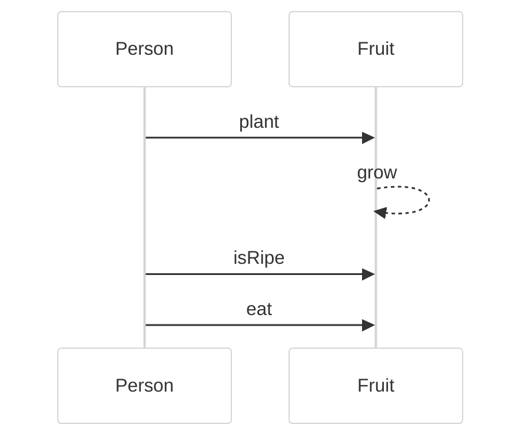
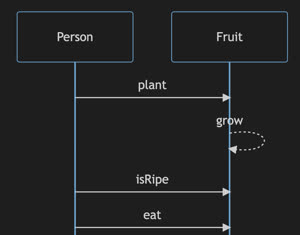
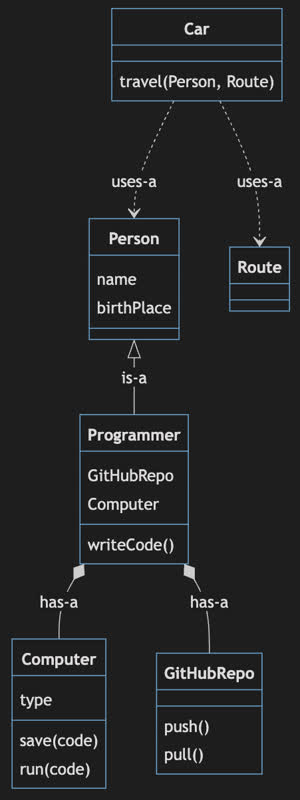
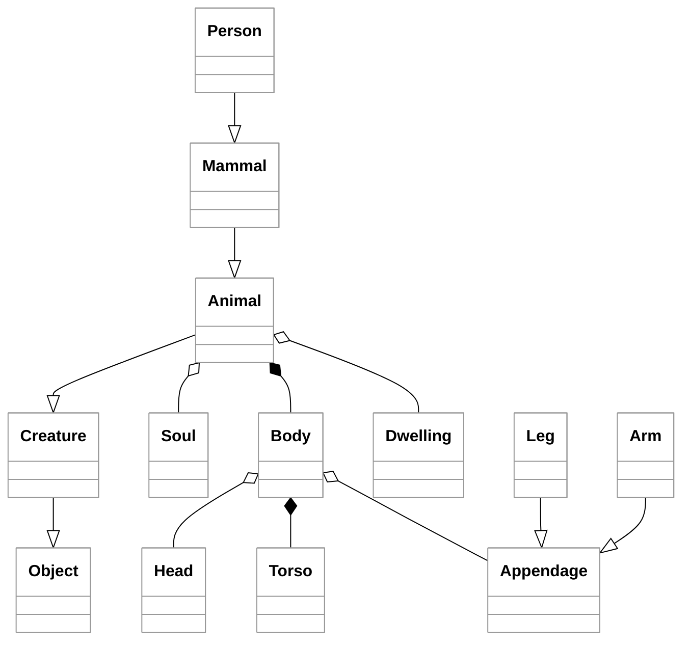
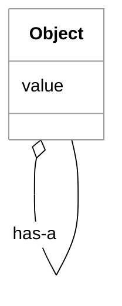

# Object-Oriented Design

🖥️ [Slides](https://docs.google.com/presentation/d/17S-Y7Og08S9kRWHZfnH8k2wTBht39aCd/edit?usp=sharing&ouid=114081115660452804792&rtpof=true&sd=true)

🖥️ [Lecture Videos](#videos)

### 🔑 Key points

- First, understand the application domain.
- Represent the domain using classes.
- Classes are nouns representing real-world objects.
- Classes have methods (verbs) and properties (nouns), mirroring real-world objects.
- Classes have relationships: Is-a, Has-a, and Uses-a.
- Encapsulate data to hide implementation details.
- Adhere to the Single Responsibility Principle.
- Use Class and Sequence diagrams to model the system.

---

`Object-oriented` design focuses on describing objects in the application domain as literal programming constructs. For example, if your application involves people eating fruit, you model the application by creating `Person` and `Fruit` objects. These objects have properties such as name, ripeness, and color, as well as operations (methods) such as `eat`, `plant`, `grow`, or `purchase`. You then write your code to reflect real-world interactions between these core objects. In this example, a `Person` might `purchase` a `Fruit` object and then `eat` it.

> Eating fruit sequence diagram

Object-oriented design owes much of its popularity to its natural representation of the real world. By carefully modeling the actual application domain, the resulting code avoids the complications that often arise in other [programming paradigms](https://en.wikipedia.org/wiki/Programming_paradigm) that focus more strictly on functional logic or declarative constructs.

In object-oriented programming (OOP), everything revolves around the `Class` construct, which serves as a template for actual objects. Classes represent nouns, or "things," such as a cat, car, word, database row, or even abstract concepts like a thought or behavior. A class's operations, or methods, are verbs, such as `build`, `run`, `speak`, `compute`, or `destroy`. When you instantiate a class, you convert the template into an actual object. For example, we can create an object named `James` from a class named `Person`. While the `Person` class has a `birthPlace` field, the specific object `James` has a birth place value of "Calgary, Alberta."

| Real World                       | Class Representation               | Object Representation |
| -------------------------------- | ---------------------------------- | --------------------- |
|  |  | James, Calgary        |

> _Source: Wikipedia_

## Object Relationships

To fully model the real world, you must describe the relationships between objects. Three of the most common relationships are `is-a`, `has-a`, and `uses-a`.

| Relationship | Description                                                    | Example                             |
| ------------ | -------------------------------------------------------------- | ----------------------------------- |
| Is-a         | Polymorphic inheritance. Often defined by extending a class.   | A `Programmer` **is a** `Person`.   |
| Has-a        | Ownership. Often defined by a class field (composition).      | A `Programmer` **has a** `Computer`.|
| Uses-a       | Transient association. Often defined by a method parameter.    | A `Person` **uses a** `Taxi`.       |

The following diagram illustrates relationships between several objects. Note that there are many ways to represent the real world using object-oriented design.

The key is to understand your domain and distill the important fields, operations, and interactions down to the minimal representation that meets the application's needs. Your model does not need to be a perfect 1:1 replica of reality; you can often make a model easier to understand by omitting unnecessary details. However, if the literal domain representation conflicts with how users interact with the system, prioritize the users' mental model.

For example, in the diagram above, a `Programmer` is modeled as having a single `Computer`. In reality, a programmer might use multiple computers or only use a computer transiently (`uses-a`). If our application doesn't require that complexity, we can simplify the model by assuming every programmer has one computer. This allows us to encapsulate (hide) the `Computer` and `GitHubRepo` details when the `writeCode` method is called.

The goal is to avoid missing key objects, merging distinct objects into one, or introducing unnecessary complexity that obscures the user's mental model.

In short, someone who understands the domain should be able to review your model and find the choice of objects and their relationships intuitive.

## Encapsulation

Good object-oriented design is easy to enhance over time. Encapsulation—hiding details that do not need to be shared—makes it easier to evolve the model as requirements change. For example, by encapsulating the `Computer` object within the `Programmer` object, the rest of the system only needs to know how to call `writeCode`, without needing to know how the computer functions.

We can expose the `Computer` later if necessary, but keeping it hidden allows us to change the internal relationship between the `Programmer` and the `Computer` without breaking other parts of the code.

Encapsulation is often preferable to inheritance because it is more extensible. Inheritance (using `extends`) explicitly and publicly exposes both the methods and the implementation of the parent class. Encapsulation keeps these details private and decoupled.

## Simplicity

Simplicity is a vital characteristic of effective OOP. One form of simplicity is restricting the system to the smallest necessary number of objects. This applies to the number of interfaces, the depth of inheritance, and the operations an object exposes.

However, you can simplify too far. Avoid creating thousands of classes that each contain only one line of code, or a single "God Object" that tries to represent everything. Aim for a straightforward model that stays as close to the real-world domain as possible.

### Problem: Too many classes (Over-engineered)

### Problem: Not enough classes (Anemic/Generic)

The "Not enough classes" design is problematic because it lacks semantic meaning and specific behavior. By reducing every concept to a generic `Object` with a recursive relationship, you lose the benefits of type safety and domain modeling. Instead of a `Person` who `eats` a `Fruit`, you have an anonymous `Object` interacting with another anonymous `Object`. This forces logic that should be encapsulated within classes out into the rest of the application, making the code significantly harder to maintain and debug.

## Videos

- 🎥 [Object-Oriented Design Overview](https://byu.hosted.panopto.com/Panopto/Pages/Viewer.aspx?id=77c184e5-8afd-4c56-84c8-ad64013f7a4b&start=0) - [[transcript]](https://github.com/user-attachments/files/17805111/CS_240_Object_Oriented_Design_Overview.pdf)