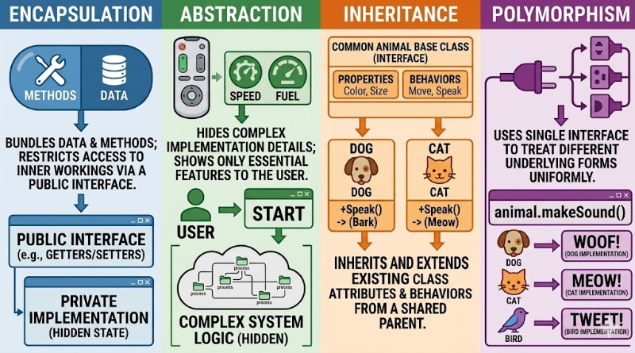
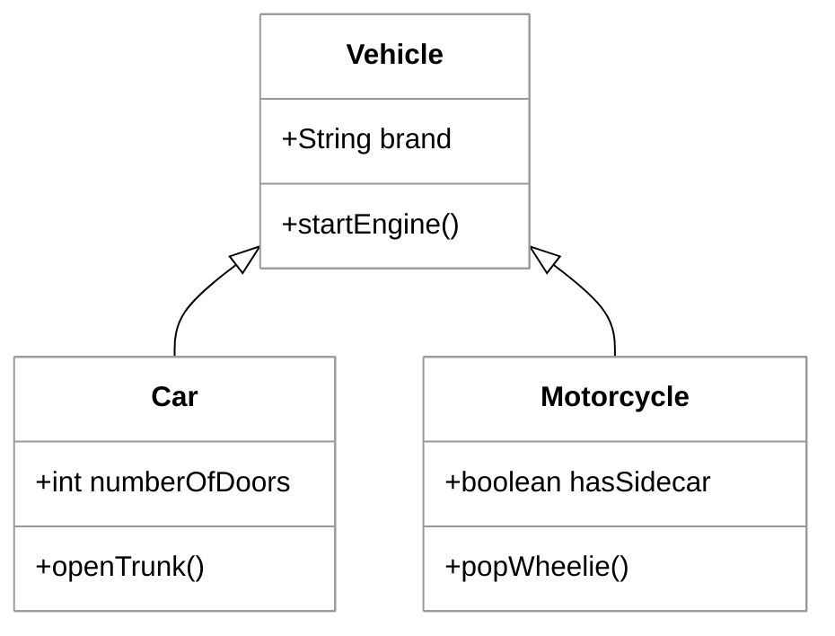

# Object-Oriented Programming

#### 🔑 Key points

- Represent real-world objects as code.
- Use encapsulation to restrict access to private data and protect state.
- Use abstraction to expose only the functionality required by the user.
- Use inheritance to share common attributes and behaviors.
- Use polymorphism to reduce an object to the context that is required.

---

Object-Oriented Programming (OOP) is a fundamental paradigm in modern software engineering that organizes code around "objects" rather than "actions." While procedural programming focuses on writing functions or blocks of code that perform computations on data, OOP shifts the focus to the data itself. By grouping related data and behaviors into distinct units, developers can build complex systems that are modular, flexible, and easier to maintain.

In the context of software architecture, OOP serves as the blueprint for creating scalable applications. It allows developers to map real-world entities—such as a user, a bank transaction, or a chess piece—into digital structures. This approach not only makes the code more intuitive to read but also facilitates collaboration across large teams, as different developers can work on separate objects without inadvertently breaking the entire system.

## The Four Pillars of OOP

To master Object-Oriented Programming, one must understand the four core principles that govern how objects interact and how code is structured: **Encapsulation**, **Abstraction**, **Inheritance**, and **Polymorphism**.



### Encapsulation

Encapsulation is often referred to as the "black box" principle. It involves bundling the data (fields) and the methods (functions) that operate on that data into a single unit called a class. More importantly, encapsulation allows us to restrict direct access to some of an object's components, which is crucial for maintaining data integrity.

By using access modifiers like `private`, we prevent external code from reaching into an object and changing its internal state in unexpected ways. Instead, we provide controlled access through public methods known as "getters" and "setters."

**Practical Example:**
Imagine a `BankAccount` class. You wouldn't want any part of the program to be able to set the `balance` to an arbitrary number. By encapsulating the balance, you ensure that it can only be modified through a `deposit()` or `withdraw()` method, which can include logic to prevent negative balances or invalid transactions.

```java
public class BankAccount {
    private double balance; // Encapsulated data

    public void deposit(double amount) {
        if (amount > 0) {
            balance += amount;
        }
    }

    public double getBalance() {
        return balance;
    }
}
```

### Abstraction

Abstraction is the process of hiding the complex internal details of an application and showing only the necessary features to the user (or other parts of the program). It reduces complexity by allowing the programmer to focus on *what* an object does rather than *how* it does it.

Think of a microwave. To use it, you only need to know how to press the buttons on the interface. You do not need to understand how the magnetron generates microwaves or how the internal cooling system functions. In programming, abstraction is achieved through the use of abstract classes and interfaces.

> **Thoughtful Engagement:** Consider the software you use daily. How many "interfaces" do you interact with where you have no idea how the underlying code is written? This is the power of abstraction: it allows us to build upon complex tools without being overwhelmed by their internal mechanics.

### Inheritance

Inheritance allows a new class to adopt the properties and behaviors of an existing class. This creates a hierarchical relationship between a "superclass" (parent) and a "subclass" (child). Inheritance is a primary mechanism for code reuse in OOP.

When a subclass inherits from a superclass, it gains all its non-private fields and methods. The subclass can then add its own unique features or "override" existing ones to change their behavior.

**The Hierarchy of Objects:**



In this diagram, both `Car` and `Motorcycle` inherit from `Vehicle`. They share the `brand` attribute and the `startEngine()` method but maintain their own specific attributes and behaviors.

### Polymorphism

Polymorphism, meaning "many shapes," allows objects of different types to be treated as objects of a common superclass. It is most commonly seen when a single method call behaves differently depending on the type of object it is called upon.

There are two main types:
1.  **Static Polymorphism (Overloading):** Multiple methods in the same class have the same name but different parameters (different signatures).
2.  **Dynamic Polymorphism (Overriding):** A subclass provides a specific implementation of a method that is already defined in its superclass.

**Practical Example:**
If we have a method `makeSound()` in a superclass `Animal`, and subclasses `Dog` and `Cat` override that method, calling `animal.makeSound()` on a list of animals will result in "Woof" for the dog and "Meow" for the cat. The code calling the method doesn't need to know the specific subclass at compile time to execute the correct behavior.

### Common Challenges and Solutions

Transitioning to an object-oriented mindset can present several hurdles:

*   **The "God Object" Problem:** Beginners often create a single class that tries to handle too many responsibilities. 
    
    *Solution:* Follow the **Single Responsibility Principle**. Each class should have one, and only one, reason to change.
*   **Fragile Base Classes:** If an inheritance hierarchy is too deep, changing the parent class can inadvertently break dozens of child classes.
    
    *Solution:* Favor **composition over inheritance** when possible. Instead of saying a class *is* something (inheritance), ask if it *has* something (composition).
*   **Over-Engineering:** It is easy to get carried away with abstraction, creating interfaces for logic that will only ever have one implementation.
    
    *Solution:* Keep it simple. Don't add abstraction until you actually need to support multiple variations of a behavior or need to decouple components for testing.


## ☑ Exercise


```masteryls
{"id":"6d998d67-76af-4c7e-af57-305de7dc1494","title":"Understanding Polymorphism","type":"multiple-choice"}
In Object-Oriented Programming, which of the following best describes the concept of polymorphism?

- [ ] The process of hiding the internal state of an object and requiring all interaction to be performed through a strictly defined interface.
- [ ] The ability to create a new class based on an existing class to reuse its fields and methods while adding new features.
- [ ] The practice of reducing complexity by modeling classes that only include the essential characteristics relevant to the current problem.
- [x] The ability of different classes to be treated as instances of the same parent class through a uniform interface, with each class implementing its own specific behavior.
```

```masteryls
{"id":"c1e93ca5-9be0-47dc-a826-3c73adb5be39","title":"The Principle of Encapsulation","type":"multiple-choice"}
In object-oriented programming, which of the following best describes how **encapsulation** is implemented within a class?

- [ ] By defining a base class that provides a common interface for multiple derived subclasses to implement.
- [x] By making data members private and providing controlled access through public getter and setter methods.
- [ ] By allowing a single method name to perform different tasks based on the number or type of arguments passed to it.
- [ ] By breaking a complex system down into smaller, independent functions that do not share any state.
```


```masteryls
{"id":"d67c59c4-3df9-4a4a-9d77-a4adaf3e104c","title":"Encapsulation vs. Abstraction","type":"multiple-choice"}
In Object-Oriented Programming, both encapsulation and abstraction are used to hide information, but they serve different purposes. Which of the following best describes the difference between the two?

- [ ] Abstraction is the process of restricting access to specific data members using access modifiers, while encapsulation is the process of hiding the background details of a function.
- [x] Encapsulation focuses on bundling data and methods while hiding the internal state of an object, whereas abstraction focuses on hiding implementation complexity to show only the essential interface.
- [ ] Encapsulation is used to share behaviors between a parent and child class, while abstraction is used to ensure that a method can perform different tasks based on the input.
- [ ] Abstraction is an implementation-level technique used to protect data from outside interference, while encapsulation is a design-level technique used to simplify the system for the user.
```

