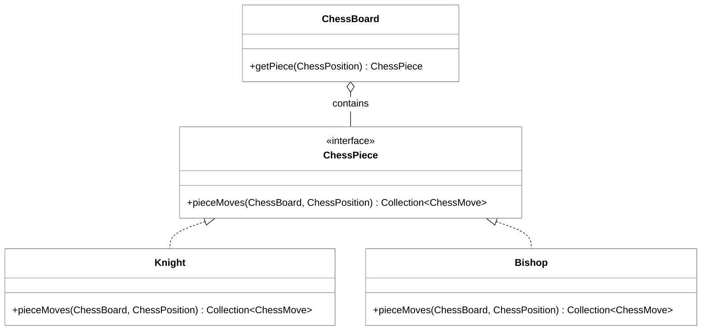

## Phase 0: Architectural Patterns

Building a chess engine—even just the movement logic—is a classic exercise in applying fundamental software engineering principles. By moving away from a monolithic "God Object" that controls every piece, we can implement a system that is modular, extensible, and easy to test. In this phase, we primarily focus on **Encapsulation**, **Polymorphism**, and the **Single Responsibility Principle (SRP)**.

### The Power of Polymorphism

Instead of using a massive `switch` statement or a long chain of `if-else` blocks to determine how a piece moves, we use polymorphism. By defining a common `ChessPiece` interface, the `ChessBoard` can treat every piece the same way. When the board needs to know the valid moves for a piece at a specific location, it simply calls `piece.pieceMoves(board, position)`. It doesn't need to know if the piece is a Pawn, a Queen, or a Knight; it only cares that the piece knows its own rules.



### Applying the Single Responsibility Principle (SRP)

In a well-designed chess application, each class has one clear reason to change:
*   **ChessPosition:** Responsible only for representing a coordinate on the board (row/col).
*   **ChessMove:** Responsible only for representing the transition from a start position to an end position (and potential promotion).
*   **ChessPiece:** Responsible for the movement logic specific to that piece type.
*   **ChessBoard:** Responsible for maintaining the state of the 8x8 grid and providing access to pieces.

### Code Example: Decoupled Movement Logic

By delegating movement logic to the piece itself, we adhere to the **Open/Closed Principle**. If we wanted to add a new piece type (like a "Camel" or "Archbishop" from Chess variants), we could do so by creating a new class without modifying the existing board or piece code.

```java
public class Camel implements ChessPiece {
    @Override
    public Collection<ChessMove> pieceMoves(ChessBoard board, ChessPosition myPosition) {
        List<ChessMove> moves = new ArrayList<>();
        int[][] offsets = { {3, 1}, {3, -1}, {-3, 1}, {-3, -1}, {1, 3}, {1, -3}, {-1, 3}, {-1, -3} };

        for (int[] offset : offsets) {
            ChessPosition target = myPosition.addOffset(offset[0], offset[1]);
            if (board.isValidMove(target, this.getTeamColor())) {
                moves.add(new ChessMove(myPosition, target, null));
            }
        }
        return moves;
    }
}
```

### Data Transfer Objects (DTOs)

The `ChessMove` and `ChessPosition` classes act as **Data Transfer Objects**. They are often immutable, meaning once created, their state cannot change. This is a critical pattern in software engineering that prevents "side effects"—where changing a value in one part of the program accidentally breaks another part. When a piece calculates its moves, it returns a collection of these DTOs to the caller, ensuring a clean boundary between the "rules engine" and the "game state."

```masteryls
{"id":"2aba68a0-07ea-4f09-8b23-a4c5ac90ef86","title":"Polymorphism in Chess","type":"multiple-choice"}
Why is it better to use a `ChessPiece` interface with a `pieceMoves()` method rather than a single `calculateMoves(Piece p)` method inside the `ChessBoard` class?

- [ ] It makes the code run faster by reducing memory overhead
- [x] It follows the Open/Closed Principle, allowing new piece types to be added without modifying the board class
- [ ] It ensures that the board has direct control over the internal state of every piece
- [ ] It prevents the use of Data Transfer Objects (DTOs), which simplifies the architecture
```


