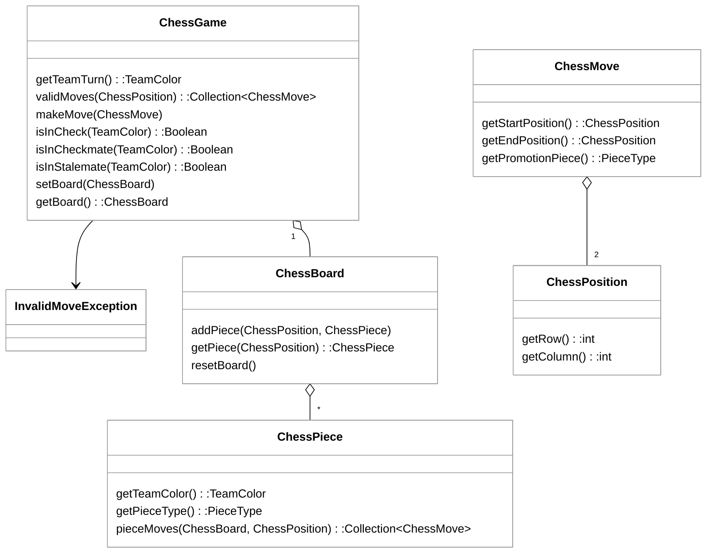

# Phase 1: Architectural Patterns

## Architectural Design Principles in Chess Engine Design

Designing a chess engine requires a careful balance between state management and complex rule validation. When analyzing the architecture of a chess system, we evaluate how well it adheres to core software design principles like the **Single Responsibility Principle (SRP)**, **Information Expert**, and **Low Coupling**. A well-structured engine separates the physical layout of the board from the logical rules of the game.

### The Domain Model

The following class diagram represents a standard architectural approach to a chess engine. It identifies the core entities: the game controller, the board representation, and the behavioral logic of individual pieces.



### Analysis of Design Principles

#### 1. Information Expert and SRP
The design demonstrates a strong application of the **Information Expert** principle. Instead of the `ChessGame` class containing a massive `switch` statement to calculate moves for every piece type, the responsibility is delegated to the `ChessPiece` class via the `pieceMoves` method.

*   **Good Application:** `ChessPiece` knows its own type and color, so it is the "Expert" on how it can move. This keeps the `ChessGame` class focused on high-level game state (like whose turn it is) rather than the minutiae of how a Knight jumps.
*   **Bad Application (The "God Object"):** A common mistake is putting all logic inside `ChessGame`. If `ChessGame` had methods like `calculateKnightMoves()` and `calculatePawnMoves()`, it would violate SRP and become difficult to maintain or extend.

#### 2. Coupling and Dependency
The relationship between `ChessBoard` and `ChessPiece` is a classic example of **Aggregation**.

*   **Good Application:** The `ChessBoard` does not need to know how a piece moves; it only needs to know where pieces are located. This **Low Coupling** allows you to change the internal implementation of a `ChessPiece` (e.g., adding a new fairy chess piece) without modifying the `ChessBoard` code.
*   **Bad Application:** If the `ChessPiece` required a direct reference to the `ChessGame` object to calculate moves, it would create a circular dependency. This would make the classes harder to unit test in isolation.

### Code Example: Implementing Piece Logic
By using the **Strategy Pattern** (implicit in the `ChessPiece` design), we can extend the game easily. Note how the piece only interacts with the board interface, not the entire game state.

```java
// GOOD: Piece calculates its own potential moves based on board state
public class Knight extends ChessPiece {
    @Override
    public Collection<ChessMove> pieceMoves(ChessBoard board, ChessPosition myPosition) {
        // Knight logic: check "L" shapes relative to myPosition
        // Only requires 'board' to see if spots are occupied
        return potentialKnightMoves;
    }
}

// BAD: Violating SRP by putting rule logic in the data container
public class ChessBoard {
    // This makes the board too heavy and violates its purpose as a data structure
    public boolean isMoveLegalForBishop(ChessPosition start, ChessPosition end) {
        // ... logic that should be in Bishop class ...
    }
}
```

### Summary of Strengths and Weaknesses
*   **Strength:** The use of `ChessPosition` and `ChessMove` as immutable data transfer objects (DTOs) ensures that the state of the board cannot be accidentally corrupted during move calculation.
*   **Weakness:** The `ChessGame` class still carries significant weight. It is responsible for `isInCheck`, `isInCheckmate`, and `isInStalemate`. In a very large system, these "Rule" checks might be moved into a separate `RulesEngine` class to further satisfy SRP.

```masteryls
{"id":"fcb32d79-ec7c-4f58-bfc5-a7e1bd109c69","title":"Identifying Design Principles","type":"multiple-choice"}
In the provided UML diagram, the `ChessPiece` class has a method `pieceMoves(ChessBoard, ChessPosition)`. Which design principle is most directly supported by placing this method in `ChessPiece` rather than in `ChessGame`?

- [x] Information Expert — because the piece possesses the knowledge of its own movement rules.
- [ ] High Coupling — because the piece now depends on the board.
- [ ] Liskov Substitution Principle — because it allows different pieces to be swapped.
- [ ] Encapsulation — because it hides the row and column data of the position.
```
