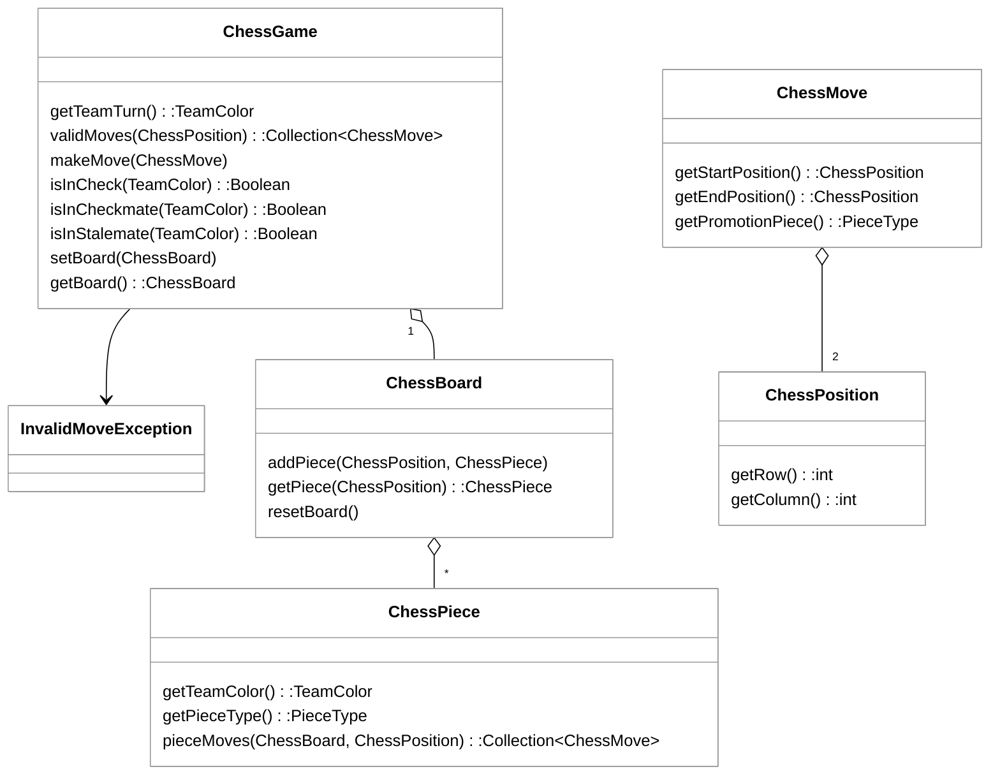

# Phase 1: Architectural Patterns


# ♕ Phase 1: Chess Game

- [Chess Application Overview](../chess.md)
- 🖥️ [Videos](#videos)
- [TA Tips](../../instruction/chess-tips/chess-tips.md#phase-1---chess-game): A collection of common problems for this phase

In the previous phase you implemented the board and pieces along with the rules for setting up the board and moving pieces. In this phase you will implement the `ChessGame` so that you can play a game by making moves and determining check, stalemate, and checkmate.

## Getting Started
Complete the [Getting Started](getting-started.md) instructions before working on this phase.

## Code Class Structure



> [!NOTE]
>
> You are not limited to this representation. However, you must not change the existing class names or method signatures since they are used by the pass off tests. You will likely need to add new classes and methods to complete the work required by this phase.

## Class Summaries

### ChessGame

This class serves as the top-level management of the Chess Game. It is responsible for executing moves as well as reporting the game status.

By default, a new `ChessGame` represents an immediately playable board with the pieces in their default locations and the starting player set to WHITE.

`ChessGame` functionality will now implement the rules of Chess not handled by the `ChessPiece` class. This will involve removing moves returned from `ChessPiece.validMoves()` that violate game rules.

**Key Methods**:

- **validMoves**: Takes as input a position on the chessboard and returns all moves the piece there can legally make. If there is no piece at that location, this method returns `null`. A move is valid if it is a "piece move" for the piece at the input location _and_ making that move would not leave the team’s king in danger of check.
- **makeMove**: Receives a given move and executes it, provided it is a legal move. If the move is illegal, it throws an `InvalidMoveException`. A move is illegal if it is not a "valid" move for the piece at the starting location, _or_ if it’s not the corresponding team's turn.
- **isInCheck**: Returns true if the specified team’s King could be captured by an opposing piece.
- **isInCheckmate**: Returns true if the given team has no way to protect their king from being captured.
- **isInStalemate**: Returns true if the given team has no legal moves but their king is not in immediate danger.

## Extra Credit Moves

If you would like to fully implement the rules of chess you need to provide support for **Castling** and **En Passant**.

You do not have to implement these moves, but if you go the extra mile and successfully implement them, you’ll earn 5 extra credit points for each move (10 total) on this assignment.

### Castling

This is a special move where the King and a Rook move simultaneously. The castling move can only be taken when 3 conditions are met:

1. Neither the King nor Rook have moved since the game started
2. There are no pieces between the King and the Rook
3. **The King is never in Check.** The King does not start in Check, does not cross a square on which it would be in Check, and is not in Check after castling.

To Castle, the King moves 2 spaces towards the Rook, and the Rook "jumps" the king moving to the position next to and on the other side of the King. This is represented in a `ChessMove` as the king moving 2 spaces to the side.

### En Passant

This is a special move taken by a Pawn in response to your opponent double moving a Pawn. If your opponent double moves a pawn so it ends next to yours (skipping the position where your pawn could have captured their pawn), then on your immediately following turn your pawn may capture their pawn as if their pawn had only moved 1 square. This is as if your pawn is capturing their pawn mid motion, or "In Passing."

## Object Overrides

Since `ChessGame` is responsible for storing game data, it requires proper equality evaluation methods. Just as in Phase 0, you must override the `equals()` and `hashCode()` methods for the `ChessGame` class. Refer to [Phase 0: Object Overrides](../0-chess-moves/chess-moves.md#object-overrides) for additional details on implementing these methods correctly.

## Code Quality

You want to write quality code that promotes consistency and readability for all team members. Code quality is discussed in a future [instruction topic](../../instruction/quality-code/quality-code.md), and you will be graded on quality starting with phase 3. However, you can use the auto grader at any time to check your chess repositories quality. The rubric used to evaluate code quality is found here: [Rubric](../code-quality-rubric.md).


## Architectural Design Principles in Chess Engine Design

Designing a chess engine requires a careful balance between state management and complex rule validation. When analyzing the architecture of a chess system, we evaluate how well it adheres to core software design principles like the **Single Responsibility Principle (SRP)**, **Information Expert**, and **Low Coupling**. A well-structured engine separates the physical layout of the board from the logical rules of the game.

### The Domain Model

The following class diagram represents a standard architectural approach to a chess engine. It identifies the core entities: the game controller, the board representation, and the behavioral logic of individual pieces.


### Analysis of Design Principles

#### 1. Information Expert and SRP
The design demonstrates a strong application of the **Information Expert** principle. Instead of the `ChessGame` class containing a massive `switch` statement to calculate moves for every piece type, the responsibility is delegated to the `ChessPiece` class via the `pieceMoves` method.

*   **Good Application:** `ChessPiece` knows its own type and color, so it is the "Expert" on how it can move. This keeps the `ChessGame` class focused on high-level game state (like whose turn it is) rather than the minutiae of how a Knight jumps.
*   **Bad Application (The "God Object"):** A common mistake is putting all logic inside `ChessGame`. If `ChessGame` had methods like `calculateKnightMoves()` and `calculatePawnMoves()`, it would violate SRP and become difficult to maintain or extend.

#### 2. Coupling and Dependency
The relationship between `ChessBoard` and `ChessPiece` is a classic example of **Aggregation**.

*   **Good Application:** The `ChessBoard` does not need to know how a piece moves; it only needs to know where pieces are located. This **Low Coupling** allows you to change the internal implementation of a `ChessPiece` (e.g., adding a new fairy chess piece) without modifying the `ChessBoard` code.
*   **Bad Application:** If the `ChessPiece` required a direct reference to the `ChessGame` object to calculate moves, it would create a circular dependency. This would make the classes harder to unit test in isolation.

### Code Example: Implementing Piece Logic
By using the **Strategy Pattern** (implicit in the `ChessPiece` design), we can extend the game easily. Note how the piece only interacts with the board interface, not the entire game state.

```java
// GOOD: Piece calculates its own potential moves based on board state
public class Knight extends ChessPiece {
    @Override
    public Collection<ChessMove> pieceMoves(ChessBoard board, ChessPosition myPosition) {
        // Knight logic: check "L" shapes relative to myPosition
        // Only requires 'board' to see if spots are occupied
        return potentialKnightMoves;
    }
}

// BAD: Violating SRP by putting rule logic in the data container
public class ChessBoard {
    // This makes the board too heavy and violates its purpose as a data structure
    public boolean isMoveLegalForBishop(ChessPosition start, ChessPosition end) {
        // ... logic that should be in Bishop class ...
    }
}
```

### Summary of Strengths and Weaknesses
*   **Strength:** The use of `ChessPosition` and `ChessMove` as immutable data transfer objects (DTOs) ensures that the state of the board cannot be accidentally corrupted during move calculation.
*   **Weakness:** The `ChessGame` class still carries significant weight. It is responsible for `isInCheck`, `isInCheckmate`, and `isInStalemate`. In a very large system, these "Rule" checks might be moved into a separate `RulesEngine` class to further satisfy SRP.

```masteryls
{"id":"fcb32d79-ec7c-4f58-bfc5-a7e1bd109c69","title":"Identifying Design Principles","type":"multiple-choice"}
In the provided UML diagram, the `ChessPiece` class has a method `pieceMoves(ChessBoard, ChessPosition)`. Which design principle is most directly supported by placing this method in `ChessPiece` rather than in `ChessGame`?

- [x] Information Expert — because the piece possesses the knowledge of its own movement rules.
- [ ] High Coupling — because the piece now depends on the board.
- [ ] Liskov Substitution Principle — because it allows different pieces to be swapped.
- [ ] Encapsulation — because it hides the row and column data of the position.
```
