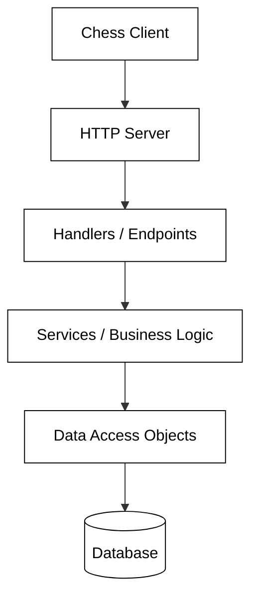

# Phase 2: Architectural Patterns

Designing a robust software system requires more than just writing functional code; it requires a blueprint that ensures the system is maintainable, scalable, and easy to understand. In this phase of the Chess Project, you transition from the core logic of chess moves to the structural design of a distributed system. You will define how a server receives requests, processes business logic, and persists data.

The goal of this phase is to create a comprehensive architectural design using sequence diagrams. These diagrams will map out the journey of a request—from the moment a client clicks "Login" to the moment the database confirms the user's credentials. By visualizing these interactions before writing code, you can identify potential bottlenecks, logic gaps, and interface mismatches early in the development cycle.

## The Layered Architecture

To build a clean chess server, we utilize a layered architectural pattern. This approach follows the principle of **Separation of Concerns**, where each component has a specific, isolated responsibility. This makes the system easier to test and modify.

### The Server and Handlers
The **Server** is the entry point of your application. Its primary job is to listen for incoming network traffic and route it to the correct destination. The **Handlers** act as translators. They receive an HTTP request (often containing JSON data), deserialize that data into Java objects, and pass them to the service layer. When the service layer returns a result, the handler serializes that result back into JSON to be sent to the client.

### The Service Layer
The **Services** represent the "brains" of your application. This is where your business logic lives. For example, when a user tries to join a game, the service layer is responsible for checking if the game exists, verifying if the requested color is available, and updating the game state. Services do not know about HTTP or JSON; they only care about application-level logic.

### Data Access Objects (DAO)
The **Data Access Objects** act as the interface between your Java code and your storage mechanism. Whether you are using an in-memory Map or a SQL database, the rest of your application shouldn't care. The DAO provides methods like `insertUser()` or `getGame()` that hide the complexity of data persistence.

## Core Data Models

Your architecture will revolve around three primary data objects. These are simple containers (often called POJOs or Records) that carry information between the layers.

*   **UserData**: Contains information about the user, typically a username, password, and email.
*   **AuthData**: Represents a "session." It links a unique `authToken` to a specific `username`. This token is what allows a user to stay logged in across multiple requests.
*   **GameData**: The most complex object, containing the game’s ID, the players' usernames (White and Black), the game's name, and the current state of the chess board.

## Mapping the API Flow

To design your server effectively, you must understand the "contract" between the client and the server. This contract is defined by your API endpoints. Each endpoint represents a specific action a user can take.

| Action | Logic Flow |
| :--- | :--- |
| **Register** | Check if username exists -> Create User -> Create AuthToken -> Return Token. |
| **Login** | Verify credentials -> Create AuthToken -> Return Token. |
| **Create Game** | Verify AuthToken -> Initialize new ChessGame -> Save to Database. |
| **Join Game** | Verify AuthToken -> Check game availability -> Update GameData with player name. |

### Practical Example: The Registration Sequence

Consider the "Register" endpoint. When you diagram this, you aren't just showing a single arrow. You are showing a conversation:

1.  **Client** sends a POST request to `/user` with registration details.
2.  **Server** identifies the route and calls the `RegisterHandler`.
3.  **Handler** parses the JSON into a `RegisterRequest` object and calls `UserService.register()`.
4.  **Service** calls `UserDAO.getUser()` to ensure the name isn't taken.
5.  If available, **Service** calls `UserDAO.createUser()`.
6.  **Service** then calls `AuthDAO.createAuth()` to generate a session.
7.  **Service** returns a `RegisterResult` containing the new token.
8.  **Handler** sends a `200 OK` response with the JSON result.

## Common Design Challenges

### 1. Handling State
One of the biggest challenges in server design is managing state. Your server should be **stateless** regarding the HTTP protocol, meaning each request must contain all the information needed to fulfill it (like the `authToken`). The actual state (the games and users) lives in your DAOs.

### 2. Error Propagation
How do you tell the user that their password was wrong? In a layered architecture, the DAO might return `null`, the Service might throw a `UnauthorizedException`, and the Handler must catch that exception to send a `401 Unauthorized` response. Mapping this flow in your diagram prevents "leaking" database errors to the end user.

### 3. Granularity of Services
Should you have one giant `ChessService` or multiple smaller ones like `UserService` and `GameService`? Generally, smaller, focused services are better. They are easier to maintain and follow the **Single Responsibility Principle**.

## Summary

Phase 2 is the bridge between conceptual requirements and concrete implementation. By defining your **Application Components**, **Data Models**, and **API Flow** through sequence diagrams, you create a roadmap for your development. A well-designed architecture ensures that when you begin coding in Phase 3, you aren't guessing where a method belongs or how data should flow; you are simply following the blueprint you've already built.
