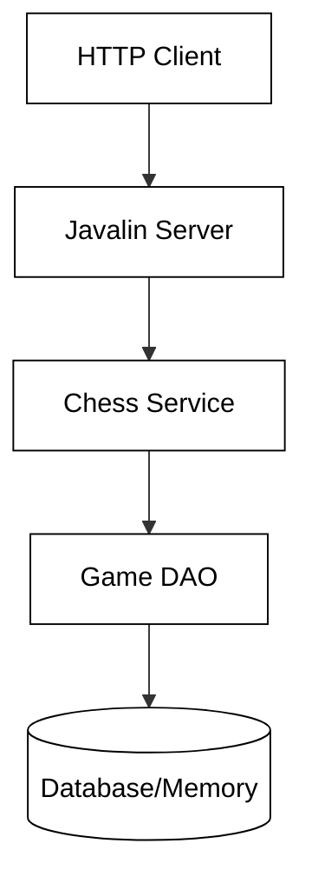

# Phase 3: Architectural Patterns


## Layered Architecture in Javalin Chess Backends

When building a Java-based chess backend with Javalin, the most effective way to ensure maintainability and scalability is through a **Layered Architecture** (often called N-Tier). This pattern organizes the application into distinct layers, each with a specific responsibility. In a chess application, where complex move validation meets persistent game states, failing to separate these concerns leads to "Spaghetti Code" that is difficult to test and debug.

### The Three-Tier Structure

In this architecture, the flow of data typically moves linearly through three primary components:

1.  **The Server (Web Layer):** Handled by Javalin. Its job is to parse HTTP requests (JSON, path parameters), validate basic input format, and return the appropriate HTTP status codes.
2.  **The Service (Business Logic Layer):** This is the "brain" of the application. It contains the rules of chess, move validation logic, and coordinates game state changes.
3.  **The Data Access Object (DAO/Persistence Layer):** This layer communicates with the database or memory store. It abstracts the details of SQL or file I/O away from the business logic.



### Core Design Principles

To keep this architecture clean, we rely on several key software design principles:

*   **Separation of Concerns (SoC):** The Server shouldn't know how to check for "Checkmate," and the DAO shouldn't know anything about HTTP status codes.
*   **Single Responsibility Principle (SRP):** Each class should have one, and only one, reason to change. If you change your database from MySQL to MongoDB, only the DAO layer should be affected.
*   **Dependency Injection (DI):** Instead of a Server creating its own Service instance (e.g., `new ChessService()`), the Service should be "injected" via a constructor. This makes unit testing significantly easier by allowing the use of "Mocks."

### Good vs. Bad Practices

#### The "Fat Server" Mistake (Bad Practice)
A common mistake is putting business logic directly inside the Javalin route handlers. This makes the code untestable outside of an HTTP environment.

```java
// BAD: Business logic leaked into the Server
app.post("/move", ctx -> {
    Move move = ctx.bodyAsClass(Move.class);
    Game game = database.getGame(move.getGameId());
    
    // Logic inside the Server - Hard to test!
    if (game.getBoard()[move.from()] != Piece.WHITE_PAWN) {
        ctx.status(400).result("Invalid Move");
        return;
    }
    // ... more logic ...
    database.save(game);
});
```

#### The Clean Approach (Good Practice)
The Server should delegate the heavy lifting to the Service layer.

```java
// GOOD: Server only handles the "Web" side of things
public class ChessServer {
    private final ChessService service;

    public ChessServer(ChessService service) {
        this.service = service;
    }

    public void handleMove(Context ctx) {
        Move move = ctx.bodyAsClass(Move.class);
        try {
            // Server asks the service to perform the action
            Game updatedGame = service.makeMove(move);
            ctx.json(updatedGame);
        } catch (InvalidMoveException e) {
            ctx.status(400).result(e.getMessage());
        }
    }
}
```

### Common Pitfalls to Avoid

| Pitfall | Description | Solution |
| :--- | :--- | :--- |
| **Leaky Abstractions** | Passing a `java.sql.ResultSet` or a Javalin `Context` into the Service layer. | Use Plain Old Java Objects (POJOs) or DTOs to pass data between layers. |
| **Circular Dependencies** | The Service layer calling the Server, or two Services calling each other directly. | Ensure a strict top-down flow: Server -> Service -> DAO. |
| **Hardcoding Dependencies** | Using `new` to instantiate dependencies inside a constructor. | Use Constructor Injection to pass dependencies from the main application entry point. |

## ☑ Exercise

```masteryls
{"id":"b6c16aa7-1d68-4f2d-b159-d3da5e8e838a","title":"Identifying Layer Responsibilities","type":"multiple-choice"}
In a properly architected Javalin chess application, which layer is responsible for determining if a move results in a "Checkmate" state?

- [ ] The Server (Web Layer), because it needs to send the result back to the user.
- [ ] The Data Access Object (DAO), because the state must be saved to the database.
- [x] The Service Layer, because this is business logic specific to the rules of chess.
- [ ] The Javalin Routing Layer, because it manages the flow of the application.
```
