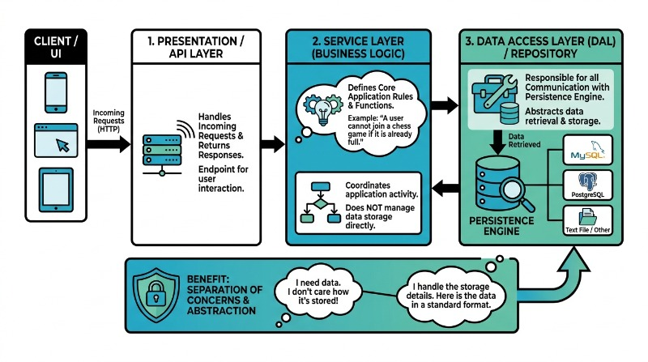
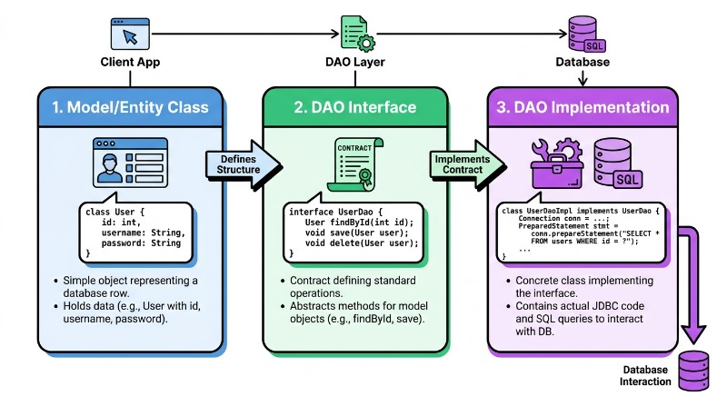

# Phase 4: Architectural Patterns

As you move from writing basic SQL queries to building full-scale applications, the way you organize your code becomes just as important as the logic itself. In previous sections, you learned how to interact with a database using JDBC and how to secure user information. However, placing database logic directly inside your business logic creates a "spaghetti code" effect that is difficult to test, maintain, and scale. 

Architectural patterns provide a blueprint for separating concerns within your application. By isolating the code that talks to the database from the code that handles business rules, you create a modular system where changes in one area, such as switching from a relational database to a cloud-based storage system, do not require a complete rewrite of your entire application.

## The Importance of Layered Architecture

In software engineering, a layered architecture organizes code into horizontal groups, where each layer has a specific responsibility and only communicates with the layers directly above or below it. When building a service that interacts with a database, we typically focus on three primary tiers:

1.  **The Presentation/API Layer:** Handles incoming requests (like HTTP) and returns responses to the user.
2.  **The Service Layer:** Contains the "business logic", the rules that define how your application functions (e.g., "A user cannot join a chess game if it is already full").
3.  **The Data Access Layer (DAL):** Responsible for all communication with the persistence engine (the database).

By strictly separating these, you ensure that your Service Layer doesn't need to know whether you are using MySQL, PostgreSQL, or a simple text file. It simply asks the Data Access Layer for data and receives it in a format it understands.



## The Data Access Object (DAO) Pattern

The Data Access Object (DAO) pattern is the industry standard for isolating the application/business layer from the persistence layer. A DAO provides an abstract interface to some type of database or other persistence mechanism. 

By using this pattern, you provide specific data operations without exposing details of the database. For example, instead of writing a SQL `SELECT` statement inside your "Join Game" logic, you call a method like `gameDAO.getGame(id)`.

### Components of a DAO

A well-implemented DAO pattern usually consists of three parts:

*   **The Model/Entity Class:** A simple object that represents a row in your database table (e.g., a `User` class with `id`, `username`, and `password` fields).
*   **The DAO Interface:** A contract that defines the standard operations to be performed on the model object(s).
*   **The DAO Implementation:** The concrete class that implements the interface and contains the actual JDBC code and SQL queries.



### Practical Example: User Management

Consider the Chess application. You need to retrieve user data. Instead of scattering JDBC code everywhere, you define an interface:

```java
public interface UserDAO {
    void insertUser(User user) throws DataAccessException;
    User getUser(String username) throws DataAccessException;
    void updatePassword(String username, String newPassword) throws DataAccessException;
}
```

The Service Layer will interact only with this interface. If you later decide to change your SQL queries or even move to a NoSQL database, you only need to create a new implementation of the `UserDAO` without touching your business logic.

## Data Transfer Objects (DTO)

While the DAO handles the "how" of data retrieval, the **Data Transfer Object (DTO)** handles the "what" of data movement. A DTO is an object that carries data between processes. 

In a database context, you might have a `User` entity that includes a hashed password and internal metadata. You wouldn't want to send that entire object back to a web client for security reasons. Instead, you create a `UserDTO` that only contains the `username` and `email`. 

DTOs are "dumb" objects; they should contain no business logic, only fields, getters, and setters. They act as a protective envelope, ensuring that the internal structure of your database remains hidden from the outside world.

## Design Principles for Data Access

To implement these patterns effectively, you should adhere to several core software engineering principles:

### Separation of Concerns
Each class should have one job. The DAO should only handle database communication. It should not validate if a password is "strong enough" or if a move in chess is legal. Those responsibilities belong in the Service Layer.

### Dependency Inversion
High-level modules (Services) should not depend on low-level modules (JDBC Implementations). Both should depend on abstractions (Interfaces). This is why we define a `UserDAO` interface. The Service depends on the interface, and the Implementation fulfills the interface.

### The Singleton Pattern for Connections
Database connections are "expensive" in terms of memory and time. You should avoid opening and closing a new connection for every single query. Often, a Database Connection Manager is implemented as a **Singleton**, a pattern that ensures a class has only one instance and provides a global point of access to it. This allows your DAOs to share a common connection pool.

## Common Challenges and Solutions

### The "Leaky Abstraction"
A common mistake is allowing SQL-specific exceptions (like `SQLException`) to bubble up into the Service Layer. This "leaks" the implementation details. 
*   **Solution:** Catch `SQLException` within your DAO implementation and throw a custom, generic `DataAccessException`. This keeps the Service Layer agnostic of the underlying database technology.

### Connection Leaks
Forgetting to close `ResultSet`, `Statement`, or `Connection` objects can lead to your database locking up or your application crashing.
*   **Solution:** Use "try-with-resources" blocks in Java to ensure that every database resource is automatically closed, even if an error occurs during execution.

### Mapping Complex Objects
Database tables are flat, but software objects are often nested (e.g., a `Game` object containing a list of `Move` objects).
*   **Solution:** Use the DAO to perform "Result Set Mapping," where you manually iterate through rows and construct the complex object hierarchy before passing it back to the Service.

## Summary

Architectural patterns like DAO and DTO are not just "extra work", they are essential for building professional-grade software. By separating your data access from your business logic, you create a system that is:
*   **Testable:** You can test business logic by providing "mock" data without actually connecting to a database.
*   **Maintainable:** If the database schema changes, you only update the DAO implementation.
*   **Secure:** DTOs ensure that sensitive internal data is never accidentally exposed to the user.

As you move forward into implementing the Chess database, focus on keeping your layers distinct. Ask yourself: "If I replaced MySQL with a different database tomorrow, how many files would I have to change?" If the answer is "only the DAO implementations," you have successfully applied these architectural patterns.

## ☑ Exercise


```masteryls
{"id":"b746e8d8-7f29-43b8-ad95-f52ae0ed6f19", "title":"Essay", "type":"essay", "gradingCriteria":"- Addresses the prompt directly\n- Uses at least one concrete example\n- Demonstrates accurate understanding of key concepts" }
How do you keep your database layer from leaking into your service layer?
```


***

### Further Reading
*   [Martin Fowler on Data Access Objects](https://martinfowler.com/eaaCatalog/dataAccessObject.html)
*   [Microsoft: Data Transfer Object Pattern](https://learn.microsoft.com/en-us/previous-versions/msp-n-p/ff649585(v=pandp.10))
*   [SOLID Principles of Object-Oriented Design](https://en.wikipedia.org/wiki/SOLID)