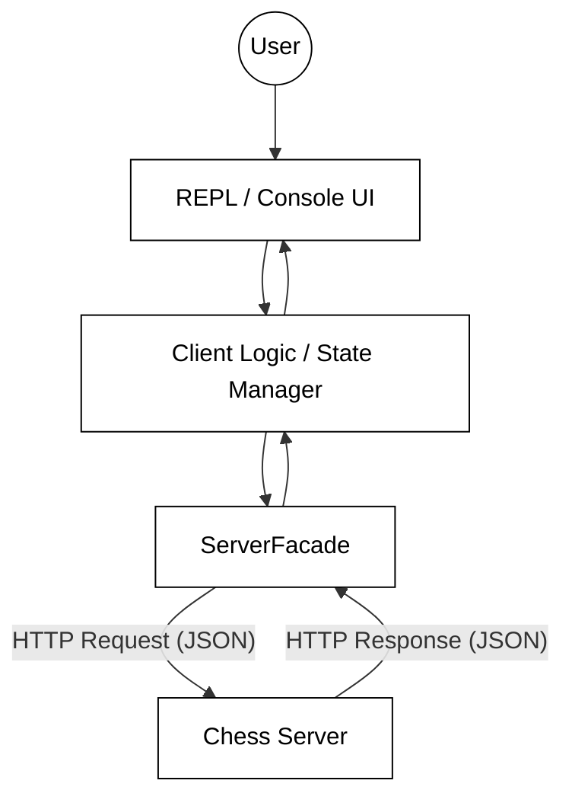

# Phase 5: Architectural Patterns

Transitioning from building a standalone server to creating a client-server ecosystem requires a shift in how we think about software structure. In this phase, you are tasked with building a Command Line Interface (CLI) that acts as the gateway for users to interact with your Chess Server. This isn't just about making HTTP calls; it is about designing a robust, maintainable system that separates the "how" of network communication from the "what" of user interaction.

The architecture of a CLI client must handle three distinct challenges: managing the user's state (e.g., are they logged in?), translating user commands into network requests, and rendering complex data (like a chessboard) in a text-based environment. By applying proven architectural patterns, you can ensure your code remains clean even as the complexity of the project grows.

## The Client-Server Architecture

At its core, your application follows a classic Client-Server model. The server is the "source of truth," holding the state of all games and users. The client is a "thin" interface that facilitates interaction. Communication happens over HTTP, which is a stateless protocol. This means the client must manage its own session information (like an auth token) and include it in every request that requires authentication.



## The Facade Pattern

The most critical architectural component in this phase is the **Facade Pattern**, implemented as the `ServerFacade` class. In software engineering, a Facade provides a simplified interface to a larger, more complex body of code—in this case, the entire HTTP communication layer and the Server's API.

The `ServerFacade` acts as a translator. The rest of your client code should not know that it is talking to a server via HTTP, nor should it deal with JSON serialization, headers, or status codes. Instead, the UI calls a method like `facade.login(username, password)`, and the Facade handles the "dirty work" of:
*   Opening a connection to the server.
*   Serializing the request body to JSON.
*   Setting the correct HTTP method (POST, GET, etc.).
*   Parsing the response.
*   Mapping HTTP error codes (like 401 or 403) into meaningful client-side exceptions.

By using a Facade, you decouple your UI logic from your communication logic. If you later decided to switch from HTTP to WebSockets or a different data format, you would only need to change the code inside the `ServerFacade`, leaving the rest of your client untouched.

## Managing State with the State Pattern

A CLI typically operates in a loop, often called a REPL (Read-Eval-Print Loop). However, the commands available to a user change depending on their status. For example, a user cannot "Create Game" until they have logged in, and they shouldn't see the "Login" prompt once they are already authenticated.

You can manage this using a simplified **State Pattern**. You can define different states for your UI (e.g., `SIGNEDOUT` and `SIGNEDIN`). Your main loop checks the current state to determine which menu to display and which commands to accept.

### Practical Example: The REPL Loop

```java
public void run() {
    System.out.println("Welcome to Chess. Type Help to get started.");
    while (!state.equals(State.QUIT)) {
        String input = scanner.nextLine();
        if (state == State.SIGNEDOUT) {
            handlePreLogin(input);
        } else {
            handlePostLogin(input);
        }
    }
}
```

This separation ensures that your code doesn't become a massive, unreadable "if-else" chain. Each state-handling method only concerns itself with the commands relevant to that specific context.

## Separation of Concerns: UI vs. Data

One of the most common mistakes in CLI development is mixing the logic for data processing with the logic for printing to the console. To keep your project maintainable, follow the principle of **Separation of Concerns**.

*   **The Model:** Represents the data (e.g., `GameData`, `AuthData`). These should be simple POJOs (Plain Old Java Objects).
*   **The View:** Responsible for formatting. This is where you handle ANSI escape codes to color the chessboard or format the list of games into a readable table.
*   **The Controller:** The logic that connects the UI to the `ServerFacade`.

When drawing the chessboard, for example, your logic should retrieve the `ChessBoard` object from the server response, and then pass that object to a dedicated "BoardRenderer" class. The renderer's only job is to iterate through the squares and print the appropriate characters and colors.

## Common Mistakes and Pitfalls

### Leaking Abstractions
A common mistake is allowing HTTP-specific details to "leak" out of the `ServerFacade`. If your UI code has to catch a `java.io.IOException` or check if a response string contains the word "Error," your abstraction has failed. The UI should deal with domain-specific exceptions (e.g., `InvalidLoginException`).

### Tight Coupling to the Console
While this phase focuses on a CLI, a well-architected program shouldn't be "hard-wired" to `System.out`. If you wrap your output logic in a helper method or class, it becomes much easier to test and much easier to adapt if you were to move to a GUI later.

### Ignoring the "Happy Path" Fallacy
Developers often assume the network will always work. In a client-server architecture, the network is a point of failure. Your architecture must gracefully handle scenarios where the server is down or the internet connection is lost without crashing the entire client.

## Summary

Phase 5 is less about complex algorithms and more about clean organizational structures. By implementing a `ServerFacade`, you isolate the complexities of HTTP. By using a state-based REPL, you manage user flow effectively. Finally, by separating your rendering logic from your data logic, you make the difficult task of drawing a terminal-based chessboard manageable.

As you build, ask yourself: "If I replaced the server with a local database tomorrow, how many files would I have to change?" If the answer is "only the ServerFacade," you have achieved a successful, decoupled architecture.

## ☑ Exercise


```masteryls
{"id":"65911966-69cc-4552-9be7-a1b1ffe2ef7b", "title":"Facade", "type":"teaching" }
I don't understand the difference between the Facade and Adapter pattern.
```


***

### External Resources for Further Study
*   [Refactoring Guru: Facade Pattern](https://refactoring.guru/design-patterns/facade) - A deep dive into the Facade pattern with visual examples.
*   [ANSI Escape Codes](https://en.wikipedia.org/wiki/ANSI_escape_code) - Essential for adding color and formatting to your terminal output.
*   [MDN Web Docs: HTTP Overview](https://developer.mozilla.org/en-US/docs/Web/HTTP/Overview) - Understanding the underlying protocol your client will use.