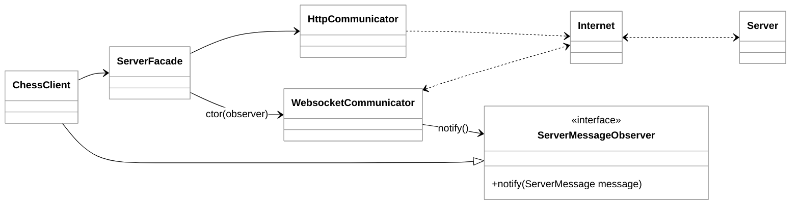

# Phase 6: Architectural Patterns

As you reach the final stage of the Chess Project, the focus shifts from simple request-response interactions to the complex, real-time nature of active gameplay. Implementing gameplay requires a transition from the synchronous world of HTTP to the asynchronous world of WebSockets. This shift is not merely a change in protocol; it necessitates a robust architectural approach to manage state, handle unpredictable server messages, and maintain a clean separation between your user interface and networking logic.

In this phase, we examine how specific architectural patterns—primarily the Facade and Observer patterns—allow your client to remain responsive and maintainable even as the complexity of the application increases.

### The Structural Design: Decoupling and Delegation

The recommended design for the chess client relies on a clear hierarchy of responsibility. At the top level, the `ChessClient` serves as the orchestrator, managing the user's input and updating the display. However, the `ChessClient` does not handle the "how" of network communication. Instead, it delegates those concerns to a `ServerFacade`.

This structure utilizes the **Facade Pattern**. The `ServerFacade` provides a simplified interface to the rest of the application. Whether a command requires a standard HTTP POST request (like logging in) or a WebSocket message (like making a move), the `ChessClient` simply calls a method on the Facade. This hides the underlying complexity of JSON serialization, header management, and protocol selection.

### The Observer Pattern and Asynchrony

The most significant architectural addition in Phase 6 is the `ServerMessageObserver`. In previous phases, the client initiated every action and waited for a response. With WebSockets, the server can send messages to the client at any time—such as when an opponent makes a move or a game is finished.

The **Observer Pattern** is the standard solution for this "push" model. By having the `ChessClient` implement the `ServerMessageObserver` interface, it registers itself as an interested party in any incoming network events.

1.  **The Subject:** The `WebsocketCommunicator` acts as the source of information. It listens to the network socket.
2.  **The Notification:** When a message arrives from the server, the communicator parses it into a `ServerMessage` object and calls the `notify()` method on the observer.
3.  **The Reaction:** The `ChessClient` receives the notification and decides how to update the UI (e.g., re-drawing the board or printing a notification).

This decoupling ensures that the networking code doesn't need to know anything about the UI implementation. It simply knows that it has an object capable of receiving messages.

### Advantages of This Architecture

Implementing these patterns provides several key benefits for software longevity:

*   **Separation of Concerns:** The UI logic is isolated from the networking logic. If you decided to swap your Terminal UI for a Graphical UI (GUI), you would not need to change a single line of code in your `WebsocketCommunicator`.
*   **Testability:** Because the communication is abstracted behind interfaces and facades, you can easily "mock" the server for testing purposes. You can simulate incoming server messages by manually calling the `notify()` method on your client.
*   **Scalability of Features:** Adding new types of server messages becomes straightforward. You update the `ServerMessage` hierarchy and add a case in the client's `notify` method, without disturbing the core connection logic.

### Challenges and Trade-offs

While this architecture is robust, it introduces new complexities:

*   **Concurrency Issues:** Since the WebSocket listener often runs on a separate thread, you must ensure that updates to the client's state are thread-safe. If the user is typing a command while the server pushes a board update, your code must handle that intersection gracefully.
*   **State Synchronization:** The client and server must stay in sync. If a WebSocket connection drops and reconnects, the client needs a strategy to recover the current game state.
*   **Complexity Overhead:** For a very small project, creating multiple classes and interfaces might feel like "over-engineering." However, in a professional environment, this overhead is a necessary investment to prevent "spaghetti code."

### Practical Example: Handling a Move

Consider the flow of making a move in the game. 

1.  **User Input:** The user types `move e2e4` in the `ChessClient`.
2.  **Facade Call:** The client calls `serverFacade.makeMove(gameID, move)`.
3.  **WebSocket Transmission:** The Facade tells the `WebsocketCommunicator` to send a `MakeMoveCommand` to the server.
4.  **Asynchronous Response:** The server processes the move and broadcasts a `LoadGame` message to both players.
5.  **Observation:** The `WebsocketCommunicator` receives the message and calls `observer.notify(loadGameMessage)`.
6.  **UI Update:** The `ChessClient` receives the message and redraws the board, showing the pawn at e4.

This loop demonstrates how the architecture handles a round-trip interaction without blocking the client's ability to process other inputs.

### Suggestions for Improvement

If you were to extend this architecture further, consider the following enhancements:

*   **Command Pattern for UI:** Instead of a large `switch` statement in the `ChessClient` to handle user input, you could use the Command Pattern to map strings to specific executable objects.
*   **Dependency Injection:** Instead of the `ServerFacade` creating the communicators internally, you could "inject" them via the constructor. This makes the code even more flexible and easier to test.
*   **Error Handling Middleware:** Implementing a centralized way to handle network timeouts and malformed JSON would make the `WebsocketCommunicator` cleaner and more resilient.

### Summary

The architecture of the Chess Project gameplay deliverable is a practical application of fundamental software engineering principles. By utilizing the Facade pattern to simplify the interface and the Observer pattern to handle asynchronous server updates, you create a system that is modular, maintainable, and prepared for the complexities of real-time communication. Understanding these patterns is essential not just for finishing this project, but for building any modern, networked application.

For further reading on these patterns, the [Refactoring Guru](https://refactoring.guru/design-patterns) guide provides excellent visual and code-based examples of the Facade and Observer patterns in various programming languages.