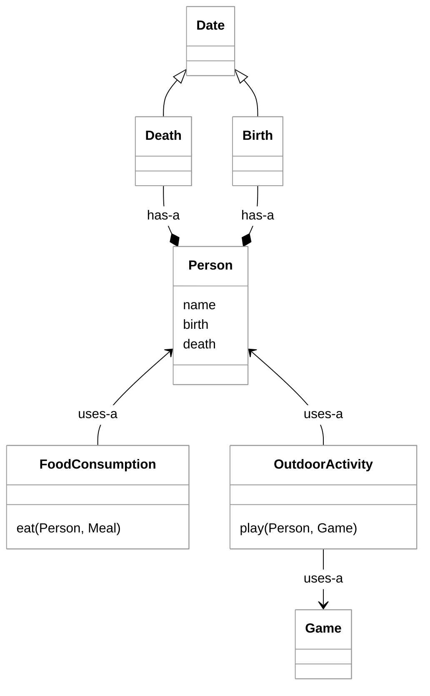

# SOLID

The SOLID principles of clean code were promoted by Robert C. Martin (also known as "Uncle Bob"), a prominent software design consultant.


> _source: [SmarterMSP.com](https://smartermsp.com/pioneers-in-tech-barbara-liskov-and-the-clu-programming-language/)_

> “Truth can only be found in one place: the code.”
>
> — Robert Martin

SOLID is an acronym representing five key design principles:

1.  **Single Responsibility**: A class should have one, and only one, reason to change.
2.  **Open-Closed**: Software entities should be open for extension but closed for modification.
3.  **Liskov Substitution**: Subtypes must be substitutable for their base types.
4.  **Interface Segregation**: Clients should not be forced to depend on methods they do not use.
5.  **Dependency Inversion**: Depend on abstractions, not on concretions.

Let's look at each of these in detail.

## Single Responsibility Principle

The [Single Responsibility Principle](https://en.wikipedia.org/wiki/Single-responsibility_principle) (SRP) promotes high cohesion. The core idea is that a class should be responsible for a single part of the software's functionality. Robert Martin defines a "responsibility" as a "reason to change," often tied to a specific "actor" (a user or stakeholder group).

For example, instead of a single `Person` class that handles every possible behavior associated with a human, you define a `Person` class for core attributes like `name` and `birthDate`, while delegating other behaviors to specialized classes.



Following the SRP ensures that there is only one reason to modify a class. You modify the `Person` class to change how a person is represented and the `Death` class to change how death is recorded. If you find yourself creating a "FrankenObject" that handles multiple responsibilities, you should refactor it into smaller, more focused classes.

The Java `String` class is frequently cited as a violation of SRP because it functions as both a data container and a data mutator/utility, providing operations for manipulation, conversion, and formatting.

SRP applies to more than just classes; methods and variables can also fall prey to conflicting responsibilities. For example, a method that interprets parameters and return values in contradictory ways based on an input flag is likely violating this principle.

If you are changing a class for different reasons—such as changing business logic vs. data representation vs. persistence logic—you are likely violating the Single Responsibility Principle.

### Violation Examples

```java
// Violation: This interface combines personal life, professional life, and logistics.
public interface FrankenPerson {
    public void drive();
    public void sleep();
    public void eat();
    public void work();
    public void die();
    public void play();

    public void setAlarm();
    public void planRoute();
    public void shopForFood();
    public void buyGymPass();
}
```

```java
public interface SRPViolation {
    /**
     * Violation: This method does three different things based on the integer 'i'.
     * i < 0: delete the key and return empty string if successful
     * i == 0: return the old value if different
     * i > 0: replace the value and return the old value
     */
    public String dbAction(String key, String value, int i);
}
```

## Open-Closed Principle

The Open-Closed Principle (OCP) states that classes should be open for extension but closed for modification. This means you should be able to add new functionality to a class without altering its existing source code.

A common way to achieve this is by using interfaces or abstract classes to control behavior. Instead of modifying a class's methods to handle new scenarios, you pass in an implementation of an interface that provides the new behavior.

### Violation Example

The following code requires you to create a new method every time you want to support a new format. Additionally, the class is tightly coupled to a specific data type (`String[]`). To support a different data type, you would have to modify the class internals.

```java
public static class OpenForModificationList {
    final private String[] items;

    public OpenForModificationList(String[] items) {
        this.items = items;
    }

    public String formatCommaSeparated() {
        return String.join(",", items);
    }

    public String formatQuotedCommaSeparated() {
        var formattedItems = new ArrayList<String>();
        for (var item : items) {
            formattedItems.add(String.format("'%s'", item));
        }

        return String.join(",", formattedItems);
    }
}
```

### Correct Example

We can improve this code by using interface parameters and Java generics. This allows us to extend the class's functionality without ever modifying its source code.

```java
public interface Formatter<T> {
    String format(T s);
}

public static class OpenForExtensionList<T> {
    final private List<T> items;

    public OpenForExtensionList(List<T> items) {
        this.items = items;
    }

    public String format(Formatter<T> formatter, String separator) {
        var formattedItems = new ArrayList<String>();
        for (var item : items) {
            formattedItems.add(formatter.format(item));
        }

        return String.join(separator, formattedItems);
    }
}
```

In this example, the `Formatter` interface allows us to extend how the class formats data, and the generic type `<T>` allows us to extend the types of data supported. Dependency inversion and inheritance are both primary tools for implementing the Open-Closed Principle.

## Liskov Substitution Principle


> _source: [SmarterMSP.com](https://smartermsp.com/pioneers-in-tech-barbara-liskov-and-the-clu-programming-language/)_

> “[be] aware not just of what you understand, but also what you don’t understand”
>
> — Barbara Liskov

The Liskov Substitution Principle (LSP) states that if a program is using a base class or an interface, it should be able to use any of its subclasses without knowing it and without the program failing. In other words, a derived class must enhance functionality, not break it.

Violations often occur when a subclass throws an `UnsupportedOperationException` for a method required by the interface, or when a method performs a type cast (downcasting) on an interface parameter to access specific subclass features.

### Violation Examples

```java
// Violation: Throwing an exception for a standard method breaks the contract.
public class LSPExample extends Object {
    @Override
    public int hashCode() {
        throw new UnsupportedOperationException();
    }
}
```

```java
// Violation: This method only works if the List is specifically an ArrayList.
void lspViolation2(List list) {
  var arrayList = (ArrayList)list; 
}
```

Violations of this principle cause unexpected behavior and force developers to understand the internal implementation of every subclass before they can safely use them.

## Interface Segregation Principle

The Interface Segregation Principle (ISP) states that no consumer of an interface should be forced to depend on methods it does not use. When defining an interface, you should only include methods that form a cohesive whole.

Exposing unnecessary methods to all consumers creates a maintenance burden. If you need to alter a "fat" interface, you must examine every consumer, even those that don't use the methods you are changing. The preferred approach is to create multiple, specific interfaces.

### Violation Example

```java
public interface ReaderWriter {
    byte readByte();
    String readString();
    int readInt();

    // Violation: These write methods are not necessary for a "Reader" consumer.
    void writeByte(byte b);
    void writeString(String s);
    void writeInt(int i);
}
```

### Correct Example

```java
public interface Reader {
    byte readByte();
    String readString();
    int readInt();
}

public interface Writer {
    void writeByte(byte b);
    void writeString(String s);
    void writeInt(int i);
}
```

## Dependency Inversion Principle

The Dependency Inversion Principle (DIP) states that high-level modules (business logic) should not depend on low-level modules (implementation details like databases or specific hardware). Both should depend on abstractions (interfaces).

By depending on abstractions, you decouple your code. In the violation example below, the high-level `Route` class is tightly coupled to the low-level `Honda` class.

### Violation Example

```java
class Violation {
    public static void main(String[] args) {
        new Route().drive();
    }

    static class Route {
        void drive() {
            // Violation: Route depends directly on the concrete Honda class.
            Honda honda = new Honda();
            honda.go();
        }
    }

    static class Honda {
        void go() {
            System.out.println("bruum");
        }
    }
}
```

### Correct Example

To apply DIP, we "invert" the dependency by passing an interface as a parameter. In this example, we use a factory-style approach with reflection to load the desired object. The `Route` class no longer knows which specific vehicle it is using; it only knows that the object implements the `Vehicle` interface.

```java
class Correct {
    interface Vehicle {
        void go();
    }

    public static void main(String[] args) throws Exception {
        var vehicleMakerClass = args.length == 1 ? args[0] : "Honda";
        Vehicle vehicle = createVehicle(vehicleMakerClass);
        new Route().drive(vehicle);
    }

    static class Route {
        // Correct: Route depends on the Vehicle abstraction.
        void drive(Vehicle vehicle) {
            vehicle.go();
        }
    }

    static Vehicle createVehicle(String vehicleMakerClass) throws Exception {
        var vehicleClass = Class.forName("Correct$" + vehicleMakerClass);
        var vehicleConstructor = (Constructor<Vehicle>) vehicleClass.getDeclaredConstructor();
        return vehicleConstructor.newInstance();
    }

    static class Honda implements Vehicle {
        public void go() {
            System.out.println("bruuum");
        }
    }

    static class BMW implements Vehicle {
        public void go() {
            System.out.println("vroom");
        }
    }
}
```

By inverting dependencies, you decouple your code and delay the commitment to a specific implementation. This allows you to modify how the application works simply by changing parameters or configuration, without rewriting the core logic.