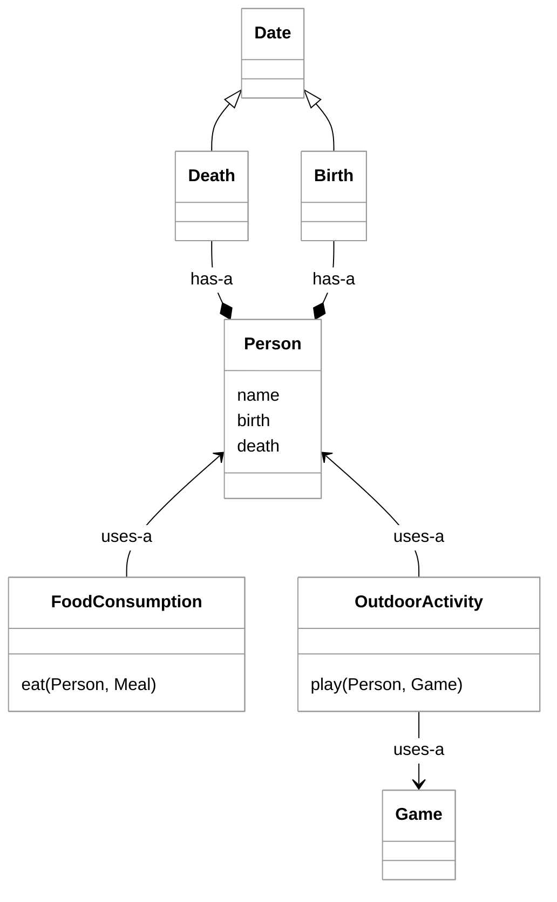

# SOLID

The SOLID principles of clean code were promoted by a popular software design consultant named Robert Martin (AKA Uncle Bob).


> _source: [SmarterMSP.com](https://smartermsp.com/pioneers-in-tech-barbara-liskov-and-the-clu-programming-language/)_

> “Truth can only be found in one place: the code.”
>
> — Robert Martin

SOLID represent five key principles.

1. Single Responsibility - An actor has only one reason to use you
1. Open Closed - Open for extension, closed for modification
1. Liskov Substitution - Actually implement the interface
1. Interface Segregation - Keep interfaces cohesive
1. Dependency Inversion - Make dependencies parameters

Let's look at each of these in detail.

## Single Responsibility Principle

The [Single Responsibility Principle](https://en.wikipedia.org/wiki/Single-responsibility_principle) represents the desirability of high cohesion. The idea here is that an actor only has one reason to use an object. You don't have a `Person` class that represents everything associated with a person. You have a `Person` class that represents the distinct attributes of a person such as `name` and `birthDate`, and then you have other classes that represent things associated with a Person.



Following the single responsibility principle makes it so there is only one reason to manipulate the class. You manipulate the `Person` class to represent the person and the `Death` class to represent a death. If you find yourself making a `FrankenObject` that represents multiple objects, or responsibilities, then you should consider refactoring your code into multiple classes.

The Java `String` class is a frequently cited example of violating the single responsibility principle as it not only represents an immutable string but provides operations for manipulating and converting the string. This makes the `String` class both a data container and a data mutator.

Classes are not the only places where you need to consider the single responsibility principle. Methods and variables can also fall prey to confusing and conflicting responsibilities. For example, the following method has been overloaded with multiple responsibilities and interpret the parameters and return value in contradictory ways.

If you find yourself changing a class for different reasons, functionality vs representation vs mutation vs display vs persistence, then you are probably in violation of the single responsibility principle.

### Violation Example

```java
public interface FrankenPerson {
    public void drive();
    public void sleep();
    public void eat();
    public void work();
    public void die();
    public void play();

    public void setAlarm();
    public void planRoute();
    public void shopForFood();
    public void buyGymPass();
}
```

```java
public interface SRPViolation {
    /**
     * i < 0 delete the key and the empty string if successful
     * i == 0 return the old value if different
     * i > 0 replace the value and return the old value
     */
    public String dbAction(String key, String value, int i);
}
```

## Open Closed Principle

Classes should be open to extension and closed for modification. The core concept is that you should generalize the functionality of a class so that you don't have to internally modify it in order to provide a desired extension of its functionality.

A common example for the open closed principle involves passing in interfaces that control how the class works. This is in contrast to modifying the classes methods to provide new functionality.

### Violation Example

As an example, the following code forces you to create a new method for every different type of format that you want the class to support. Additionally, the class has a constructor that represents a specific type of data. If you want to provide a different type of data, you must modify the class to include an additional constructor and internal data type.

```java
public static class OpenForModificationList {
    final private String[] items;

    public OpenForModificationList(String[] items) {
        this.items = items;
    }

    public String formatCommaSeparated() {
        return String.join(",", items);
    }

    public String formatQuotedCommaSeparated() {
        var formattedItems = new ArrayList<String>();
        for (var item : items) {
            formattedItems.add(String.format("'%s'", item));
        }

        return String.join(",", formattedItems);
    }
}
```

### Correct Example

We can improve the previous code by using interface parameters and Java generics to open the class to extension without ever modifying the code.

```java
public interface Formatter<T> {
    String format(T s);
}

public static class OpenForExtensionList<T> {
    final private List<T> items;

    public OpenForExtensionList(List<T> items) {
        this.items = items;
    }

    public String format(Formatter formatter, String separator) {
        var formattedItems = new ArrayList<String>();
        for (var item : items) {
            formattedItems.add(formatter.format(item));
        }

        return String.join(separator, formattedItems);
    }
}
```

In this example the `Formatter` interface extends how the class formats and the generic type extends the supported types.

Dependency inversion and inheritance are both examples of the open closed principle.

## Liskov Substitution Principle


> _source: [SmarterMSP.com](https://smartermsp.com/pioneers-in-tech-barbara-liskov-and-the-clu-programming-language/)_

> “[be] aware not just of what you understand, but also what you don’t understand”
>
> — Barbara Liskov

If an operation is dependent on an interface, or base class, you must be able to substitute any derived class without altering the operation. This can happen if a base class throws an `UnsupportedException` for an interface or overridden method, or if the operation does a type cast on the interface.

### Violation Example

```java
public class LSPExample extends Object {
    public int hashCode() {
        throw new UnsupportedOperationException();
    }
}
```

```java
void lspViolation2(List list) {
  var arrayList = (ArrayList)list;
}
```

Violations of this principle cause unexpected behaviors within the application and require the developer to understand all of the code before they can safely make substitutions.

## Interface Segregation Principle

When you define an interface you only include methods that work together as a cohesive whole. You don't add methods that are related, but not necessary for the consumption of the primary usage of the interface. Put another way, the interface segregation principle states that that no consumer of an interface should be forced to depend on methods it does not use.

Exposing methods to all consumers of the interface, without regard for the use of the methods by all the consumers, creates a significant maintenance problem. If you want to alter the interface then you must examine all uses of the interface. Instead, the preferred approach is to create multiple interfaces that an object uses and only use the interface that is appropriate to the consumer.

### Violation Example

```java
public interface ReaderWriter {
    byte readByte();
    String readString();
    int readInt();

    // Outside cohesive whole.
    void writeByte(byte b);
    void writeString(String s);
    void writeInt(int i);
}
```

### Correct Example

```java
public interface Reader {
    byte readByte();
    String readString();
    int readInt();
}

public interface Writer {
    void writeByte(byte b);
    void writeString(String s);
    void writeInt(int i);
}
```

## Dependency Inversion Principle

The dependency inversion principle suggests that low level objects should not explicitly depend on high level objects. Instead of a low level object creating and using a high level object, you should provide the high level object to the low level object. Interfaces enable the core abstraction necessary to enable dependency inversion.At the very least you are exposing a specific implementation, constructor, and potentially extraneous methods that are unnecessary to the use of higher level object.

Put another way, the principle says that dependencies are made on aspects of functionality, not on implementations of the functionality. In the following example, the low level `Route` object is highly coupled with the instantiation and use of the high level `Honda` object.

### Violation Example

```java
class Violation {
    public static void main(String[] args) {
        new Route().drive();
    }

    static class Route {
        void drive() {
            Honda honda = new Honda();

            honda.go();
        }

    }

    static class Honda {
        void go() {
            System.out.println("bruum");
        }
    }
}
```

### Correct Example

In order to properly apply the dependency inversion principle you invert the use of high level object through an interface parameter. In the following example we use a factory method that uses reflection to load the desired high level object. Now the `Route` doesn't know anything about the vehicle that is being used. It just calls `go`. This breaks the coupling between the objects and moves the decision about what vehicle is actually used to be completely out of the code.

```java
class Correct {
    interface Vehicle {
        void go();
    }

    public static void main(String[] args) throws Exception {
        var vehicleMakerClass = args.length == 1 ? args[0] : "Honda";
        Vehicle vehicle = createVehicle(vehicleMakerClass);
        new Route().drive(vehicle);
    }

    static class Route {
        void drive(Vehicle vehicle) {
            vehicle.go();
        }
    }

    static Vehicle createVehicle(String vehicleMakerClass) throws Exception {
        var vehicleClass = Class.forName("Correct$" + vehicleMakerClass);
        var vehicleConstructor = (Constructor<Vehicle>) vehicleClass.getDeclaredConstructor();
        return vehicleConstructor.newInstance();
    }

    static class Honda implements Vehicle {
        public void go() {
            System.out.println("bruuum");
        }
    }

    static class BMW implements Vehicle {
        public void go() {
            System.out.println("vroom");
        }
    }
}
```

By inverting the dependencies, you can decouple the code and move the commitment to an algorithm at a higher level. Now you can execute the code with different parameters and completely modify how it works.
