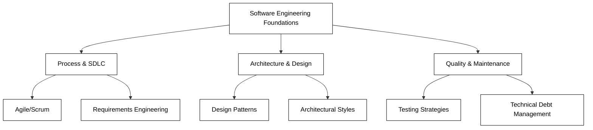

# Wrap Up

As we reach the conclusion of our journey through the principles of software engineering and architecture, it is important to take a moment to reflect on the distance we have traveled. We began this course by moving beyond the simple act of writing code to explore the broader, more complex world of engineering robust, scalable, and maintainable systems. Software engineering is not merely about solving a logic puzzle; it is about managing complexity, ensuring reliability, and creating value for users over a long period.

Throughout this course, you have transitioned from being a programmer to becoming an architect of digital solutions. You have learned that the decisions made during the design phase have a profound impact on the cost, performance, and longevity of a product. This final section serves as a synthesis of those lessons, a roadmap for your continued growth, and a celebration of the skills you have acquired.

## Reflecting on the Core Pillars

Our exploration was built upon several foundational pillars that define modern software engineering. By revisiting these, we can see how they interconnect to form a cohesive discipline.

*   **The Software Development Life Cycle (SDLC):** We examined the various methodologies—from traditional Waterfall to modern Agile and DevOps—that govern how software is conceived, built, and maintained. You now understand that the "coding" phase is just one part of a much larger ecosystem.
*   **Architectural Patterns:** We moved from monolithic structures to more complex arrangements like Microservices, Layered Architecture, and Event-Driven systems. You learned that there is no "best" architecture, only the right trade-offs for a specific problem.
*   **Design Principles and Patterns:** Through the lens of SOLID and common design patterns (like Singleton, Factory, and Observer), you discovered how to write code that is flexible and resilient to change.
*   **Quality and Testing:** We emphasized that software is only as good as its verification. By implementing unit, integration, and system testing, you learned how to build confidence in your deployments.

## Reviewing the Learning Outcomes

At the start of this course, we established specific goals. Let’s review how these outcomes manifest in your new professional toolkit:

**Designing Scalable Systems**
You can now evaluate a problem statement and determine whether a system needs to scale horizontally or vertically. You understand the role of load balancers, caching, and database sharding in maintaining performance under pressure.

**Applying Architectural Trade-offs**
You have moved past the "it depends" answer to understand *what* it depends on. You can articulate the pros and cons of choosing a strictly typed architecture versus a more flexible one, or a synchronous communication model versus an asynchronous one.

**Implementing Clean Code Practices**
By applying the principles of encapsulation and separation of concerns, your code is no longer just functional—it is readable and maintainable. You understand that code is read far more often than it is written.

## Future Areas of Study

Software engineering is a field that evolves rapidly. While this course provided a strong foundation, the learning never truly ends. To stay ahead, consider exploring these advanced topics:

*   **Cloud-Native Development:** Deepen your knowledge of providers like AWS, Azure, or Google Cloud. Learn how to leverage serverless functions, container orchestration (Kubernetes), and managed services.
*   **Distributed Systems Theory:** Study the CAP theorem in depth, consensus algorithms (like Raft or Paxos), and the challenges of data consistency in distributed environments.
*   **Security Engineering:** Move beyond basic authentication to understand OAuth2, OpenID Connect, and the "Security by Design" philosophy.
*   **Soft Skills and Leadership:** As you grow, your ability to communicate architectural decisions to stakeholders and mentor junior developers will become as important as your technical prowess.

## Navigating Common Challenges

As you transition these skills into the workplace, you will likely encounter several common hurdles. Recognizing them is the first step toward solving them.

**Challenge: Managing Technical Debt**
In the real world, deadlines often force compromises. You may have to ship code that isn't "perfect."
*   *Solution:* Document these compromises as technical debt. Schedule "refactoring sprints" to address high-interest debt before it cripples the system's velocity.

**Challenge: Over-Engineering**
New engineers often try to apply every design pattern they’ve learned to a single project, leading to unnecessary complexity.
*   *Solution:* Follow the YAGNI (You Ain't Gonna Need It) principle. Build for the requirements you have today while keeping the architecture flexible enough for tomorrow.

**Challenge: Communication Gaps**
Architects often struggle to explain why a certain structural change is necessary to non-technical managers.
*   *Solution:* Frame architectural decisions in terms of business value—such as reduced downtime, faster feature delivery, or lower operational costs.

## Practical Application: Your Next Steps

To solidify what you have learned, I encourage you to take one of the following actions within the next week:

1.  **Audit an Existing Project:** Take a piece of software you wrote previously and perform an architectural audit. Where does it violate SOLID principles? How would you refactor it into a more scalable pattern?
2.  **Contribute to Open Source:** Find a project on GitHub that interests you. Observe how they manage their architecture and try to contribute a small improvement or a test case.
3.  **Build a Portfolio Piece:** Create a small system that utilizes at least two different architectural styles (e.g., a React frontend communicating with a Microservices backend via an API Gateway).

## Summary

You have successfully navigated the complexities of software engineering principles and architecture. We began by defining the discipline, explored the intricacies of system design, and concluded with the practicalities of maintaining high-quality software. 

You now possess the vocabulary to discuss high-level design, the analytical skills to choose between competing patterns, and the technical grounding to build systems that last. Remember that great software is a craft—it requires patience, continuous learning, and a commitment to excellence. Congratulations on completing this journey; the systems of tomorrow are now yours to build.

### External Resources for Continued Learning
*   *Clean Architecture* by Robert C. Martin
*   *Designing Data-Intensive Applications* by Martin Kleppmann
*   The Twelve-Factor App (12factor.net)
*   Refactoring.Guru (for Design Patterns)