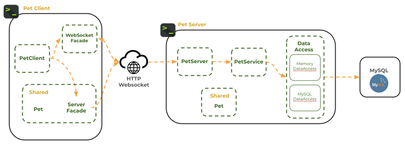
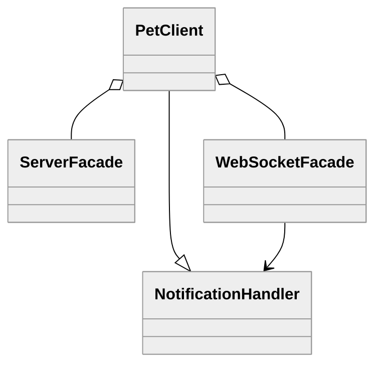
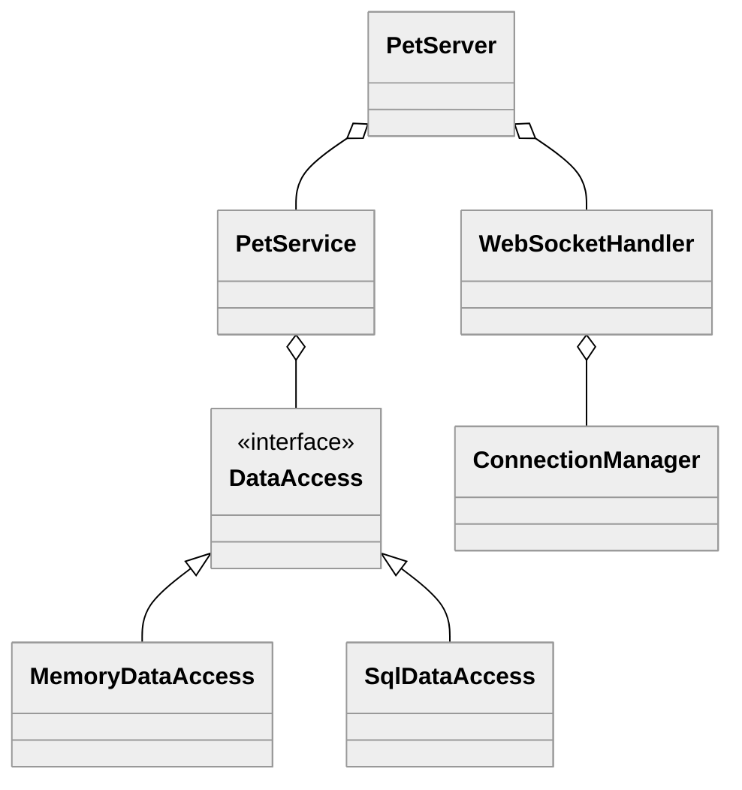
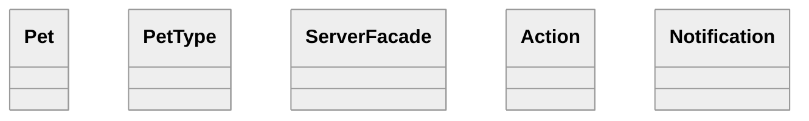
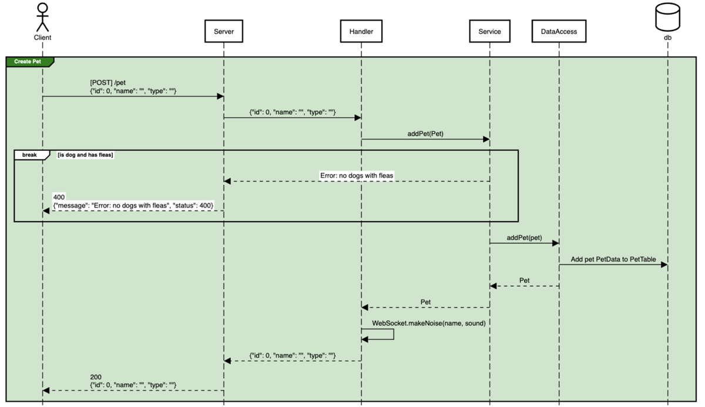
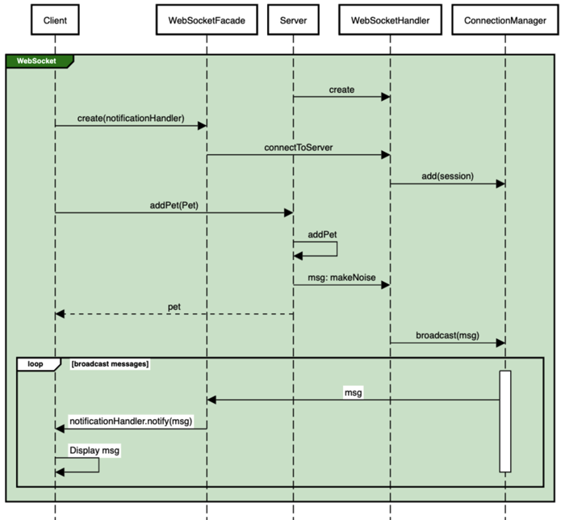

# 🐶 Pet Shop

The Pet Shop application demonstrates the topics presented in this course and serves as a comprehensive example of how these concepts work together in a complete application.

**Concepts Demonstrated**

- Console client
- Client HTTP and WebSocket facades
- HTTP and WebSocket Server using Javalin
- Service with application logic
- JSON serialization using GSON
- Model objects
- Data persistence with memory and MySQL implementations
- Shared code
- Tests at the client, server, service, and data layers

> [!IMPORTANT]
>
> You can use Pet Shop as inspiration for your chess application, but ensure you **fully understand the code** before reusing any part of it. Many representations are simplified and will not directly translate to the requirements of the chess application.

## Source Code

The [Pet Shop source code](https://github.com/softwareconstruction240/softwareconstruction/tree/main/petshop) is found in the course instruction repository you are currently viewing. If you haven't already cloned the repository to your development environment, you should do so now. You can then open the IntelliJ Pet Shop project to study, run, and debug the code.

## Architecture

The following diagram illustrates the different components that make up the Pet Shop application. This includes all layers, starting from the client interface down to the data persisted in the database.



It is important to note that each layer only communicates with its adjacent layers. For example, the Client layer does not directly communicate with the Service or DataAccess layers. This level of abstraction decouples the components and makes the application easier to understand and maintain.

| Layer          | Implemented By            | Description                                                      |
| -------------- | ------------------------- | ---------------------------------------------------------------- |
| **Client**     | PetClient                 | Interacts with users and sends requests to the server.           |
| **Network**    | PetServer                 | Converts HTTP requests into Java objects.                        |
| **Service**    | PetService                | Performs validation and implements application business logic.   |
| **DataAccess** | DataAccess (Memory/MySQL) | Converts Java objects into database operations.                  |
| **Database**   | MySQL                     | Persists application objects.                                    |

## Class Diagrams

### Client

The client is invoked by the **ClientMain** class when handling user requests, or by the **PetClientTest** when executing unit tests.

The **PetClient** controls the REPL (Read, Execute, Print, Loop) interaction with the user. It also sends requests to the server using both HTTP and WebSocket network protocols.

**PetClient** implements the **NotificationHandler** interface, which allows the **WebSocketFacade** to pass received messages to the **PetClient** for display to the user.



### Server

The server is invoked by the **ServerMain** class when handling client requests, or by the **PetServerTests** when executing unit tests.

**PetServer** handles HTTP communication, while **WebSocketHandler** handles WebSocket communication. Together, they form the `Network` layer for the server.

The **PetServer** passes application objects from network requests to the `Service` layer, represented by the **PetService**. The service layer performs necessary validation and business logic.

To persist data between service calls, the **PetService** reads and writes data via the `DataAccess` layer. The **DataAccess** interface is implemented by two different solutions: **MemoryDataAccess** stores data in memory, and **SqlDataAccess** stores data in a relational database (MySQL).



#### Using Different DataAccess Implementations

The **DataAccessTests** call both the Memory and SQL implementations of **DataAccess** using JUnit's parameterized testing functionality.

```java
@ParameterizedTest
@ValueSource(classes = {MySqlDataAccess.class, MemoryDataAccess.class})
void addPet(Class<? extends DataAccess> dbClass) throws ResponseException {
    DataAccess dataAccess = getDataAccess(dbClass);

    var pet = new Pet(0, "joe", PetType.FISH);
    assertDoesNotThrow(() -> dataAccess.addPet(pet));
}
```

Command line arguments control which implementation of **DataAccess** is used when **ServerMain** is invoked.

```java
DataAccess dataAccess = new MemoryDataAccess();
if (args.length >= 2 && args[1].equals("sql")) {
    dataAccess = new MySqlDataAccess();
}
```

For example, the following command would use the memory persistence implementation:

```sh
java ServerMain memory
```

### Shared

The **ServerFacade** is located in the shared module so it can be used by both the server tests and the client application.

**Pet** and **PetType** are the core data models for the application.

**Action** and **Notification** are used for WebSocket communication.



## Endpoint Sequence Diagrams

The [Pet Shop Sequence Diagram](https://sequencediagram.org/index.html#initialData=IYYwLg9gTgBAwgGwJYFMB2YBQAHYUxIhK4YwDKKUAbpTngUSWDABLBoAmCtu+hx7ZhWqEUdPo0EwAIsDDAAgiBAoAzqswc5wAEbBVKGBx2ZM6MFACeq3ETQBzGAAYAdAE5M9qBACu2AMQALADMABwATG4gMP7I9gAWYDoIPoZwUChyhgAKKFiIqKQAtAB85JQ0UABcMADa2QDyZAAqALowAPTYeQA6aADeAERIHIM1TgA0MINowAC2KGPTPYNTg2CW3UuDKwC+mMKVMKWs7FyUNUMjS5PTswvbK2sbWzU7g-tsnNywJ4eiNWAHA4uTAAApQQBKUw6DLAADWMCQqiMEEcZxg8X0MAAZtx9AcKqJjn8KhcYABRKDeaowNAQVH2FEAdyQYHiuPxGkOlBJZQK5hqgScTj6QwW6mA9kWbypNJq9MZLLZHLxmVUq2mqnkYB8GqFIv26A4pn+KmOZVk8iUKnUgOBoLB3TA0KtimUahRJ2MNQUwJgzpgoLdMEgQbyzV03Ewbptnr55REKhqoMJScMRROX3OtNT2Z+FtO33JAHUUDoyBAQPC8i45giUAA5CDIlBg+4oKaqXycaH53mZso82lXUbjNYdx6a9abGXLD5po6D+DIQUwcIisXDMfOCfzOfvZ6zqdGzimLy+ALQdjSmIAMTgFOkcAUMAAMsjmKCNALikOybStQAOIUm0nTOouA5lP2tKDIMmAwYWZooDUyDat+YLQshhaxh6dowGhYAYa62hxuohY+jAQF5DAwAIAgAZ5CiOLeHM4ZYLhtpeqS6YpnkH7aouxLLjBfFgAJWCIcuw41LU-TTNc453PuU5Hq884wLsrSQb8Jy-mANQbqKaByduNx7g8bxPNMLwHns2nGue3h+P4XgoOgMRxIkbkedIKDcGAOR5Jg+lIQBsnSBSb6gRS7RdHkHRVM6ACSJrDoWonTPBUn-rxMDSkReRgiMWFEuaJycZ6NQFY6JUxqReFemUlHUV+eQhqy7IwMl0i4qx7H1dajUJshYlCeVWZnD8Y2YHRbXMCgAAen4aDliZUACRj+XkKC1RwpXpjhDVcTUHDbYFe0kUNXEUToNR+QFhg9X1EBsam2EiVN5JUC2JprZlZYVlWNZgHWDbNq27b7l2Pb7QhX26bllRWfB6XLvphlOIEfTzqY-kGOxqJqGgADkC3LYJUk8cjuNo3pq4YAa2NoO8ZhnmzJpOZe-gZBwMTYEgaCIg9O0wAo9HsT+DPMNT5K1JF0XNLF4HBWj0EI282UI2FeVnY94sIMR40Zpax1VVt+v0UblXkd6d0yOdhgG5LL1varZUZpNxa0j9Izw97I3hbTAEJhj65Y30rOOZgQA) shows each of the Pet Shop service endpoints and the flow of each request through the server layers. Each element in the diagram corresponds directly to the source code, making it a valuable reference for understanding the underlying server logic.

For example, the following diagram illustrates the flow from the client to the database layers when a **Create Pet** request is made.



## WebSocket Sequence Diagrams

The endpoint sequence diagrams demonstrate the generation of a WebSocket message via the call to `WebSocket.makeNoise(name, sound)` when a pet is created or deleted.

Pet Shop uses the WebSocket protocol to broadcast events from one client to all others. When the client starts up, it establishes a WebSocket session with the server through the **WebSocketFacade**. The client also registers itself as an observer to handle incoming WebSocket messages.

The server tracks all connected clients in the **ConnectionManager**. When a message needs to be broadcast, the server calls the `broadcast` method on the **ConnectionManager**, which sends the message to the appropriate connected clients.

The Pet Shop [WebSocket Communication Diagram](https://sequencediagram.org/index.html#initialData=A4QwTgLglgxloDsIAIDCAbKBTJAoUks8ISyA6lgEYDKA9jANZYQBiIMIAJlvuNHIhTUsYAG4jcuHBDABPAM6g4CAObIADADoAnLhVhaAV2ABiWVnTpaAd2QnMKgBYRzlm+Sp1GzScLEjkAFoAPg8aeiYIAAkSTnQRAC5kGDAsEAgeSQxsUhCwr0i2Dm4klLSMgAoEWmgAM1h0qFoEGIQ4kQBKXApw71Z2Liwg0J6C5lb2sFLmhCwYCAAVWj9xMElRiPHY+LBhtBm56GaAWRIQFUTkLk4K+Sx5eSaELqzMaT2Vy+uABWYK34gXU+uzywKSPx8wL2Gz6Ex2SQAtvIVIiQEwAHK0KB3XBQwJ5bLSJLAHzrTybaLbAIEg7zJ6nBDnS6UAxcDjyCAVJEqLpWWjAZAs2hskAc5AI+7yJnyXDsaCidJDVC0o4IBlMtbKhCzOknM4XEEjcl9IqDRHIsm9QoDbh7QlIJLVOoNVVwkSaJ1QWqyLnIl72lAEt4O5AAEWxwHQIFk4otkm4cqgCoy+21h3p+okkhwnEkUjaQA) visualizes this process.



```masteryls
{"id":"409b54f0-93e2-4aea-9877-77f9367c82bf","title":"Purpose of the Pet Shop Application","type":"multiple-choice"}
What is the primary purpose of the Pet Shop application in the context of this course?

- [ ] To provide me with code I can blindly copy into my chess application
- [ ] To demonstrate the one and only solution for building distributed applications
- [x] To serve as a reference architecture that demonstrates design patterns and one possible solution for building a distributed application
- [ ] To serve as a blueprint that I should following for my chess application
```
